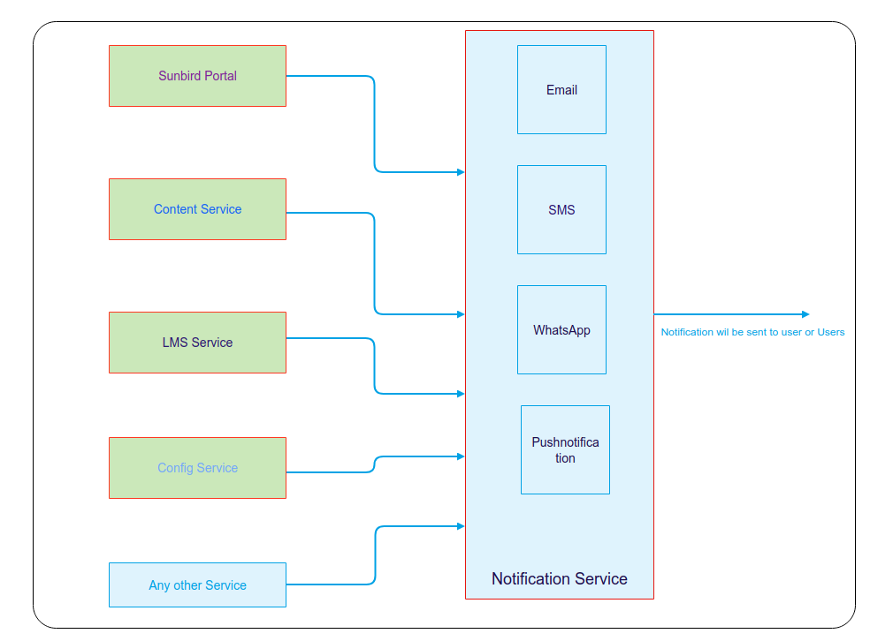
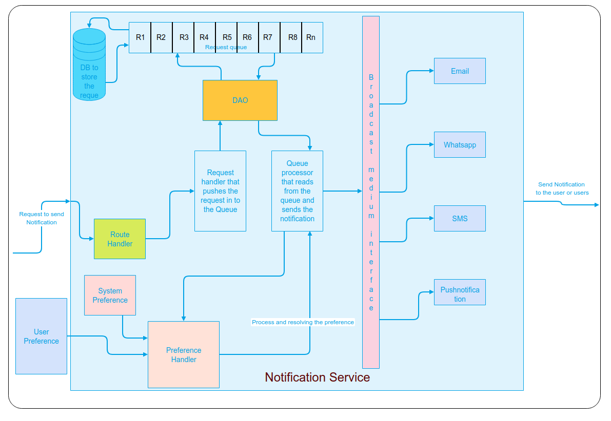
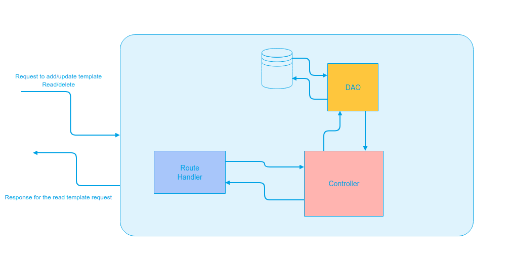

| 1.12.0 | 
| [SB-8096 System JIRA](https:///browse/SB-8096) | 
| Greydraft | 
| 

 | 
| Lead designer | 
|   

 | 
| @QA | 
|  --- | 
|  --- | 
|  --- | 
|  --- | 
|  --- | 
|  --- | 
|  --- | 
| 1.12.0 | 
| [SB-8096 System JIRA](https:///browse/SB-8096) | 
| Greydraft | 
| 

 | 
| Lead designer | 
|   

 | 
| @QA | 


## Goals

* To build a Notification Service which will be independent service and any other service can call this to send out the notification. this service will push the request in a queue which will be persisted in the DB and will be handled to send the notification (Email, SMS, PushNotification etc) once the notification is sent the DB will be updated with the flag that for a particular request either the notification is sent or not. 


## Background
Why a need for Notification serviceIn any application, user action should be notified using single or multiple means of Notification Broadcast. Like if a user gets registered to a system the user has to be notified with the success message and also a password generation message. At the same time, the system admin should be notified that a new user has registered to the system.

In the current sunbird instance, the notification mechanism is tightly coupled with the LMS service and Email notification does not have all the features like a digest, Delivery Schedule, Notification Recovery etc.,

The proposed system will be a Notification service which will be independent of any service and will listen and broadcast events that can be consumed by any service.

Overview Objectives of Notification serviceNotification Service should be able to send the notification to the user or users by the selected broadcast medium

Overview of the solutionservice should be Independent and should have a mechanism to queue the request and should have the ability to prioritise some type of notification

Service should have API to handle single or multiple requests and the request can be for a different broadcast medium like (Email, Sms, Whatsapp etc)

Service should have the ability to configure the attributes on system level or the User level and these attribute value should be overridable.

Service should have the intelligence to decide the broadcast medium depending on the request type

Flow diagram focusing on external components

Flow diagram focusing on internal components 


## Notification Broadcast medium
Overview


Broadcast Medium is the medium by which the notification is sent to the user. The medium will be opted by the type of notification, there will be a user config to opt for a medium this can be overridden by the system config.

A decision on broadcast medium

The decision to opt a Broadcast medium by which the notification has to be sent can be done either by system config or from a type of notification or by user preference

Available Broadcast medium are


* Email
* SMS
* WhatsApp
* Push notifications

Preferences
* System preference
* User preference
* Overriding of preferences


## Expiry of the notification
Some of the notification should have expiry time like OTP if the expiry time is passed the notification should not be sent.


## Multiple notifications in a single API call
The API should support a single Notification request and also in a single request should support multiple Notifications


## Rate Limit 
Notification service should support the rate limit configuration that it will not send more than some configured number of notification to a particular user within some configured time frame.

But this constraint should not be honoured for the following Notification type


* OTP
* Password change
* forgot password.

for the current implementation, we have included these three type of notifications which will not honour the rate limit constrain but in the feature, if we need to add more notification type to bypass this constraint then we need to do code level changes to implement the same.


## How is the service deployed
The Notification service should be deployed as an independent service 

What happens when service is down


* New requests

    will not be entertained and a response of 503 will be sent to the requester
* Pending requests

    for the pending requests once the service is started a job will try to send all the notification which are not expired and whose status is not sent

    

    


## Notification Template
For notification to be sent to users each notification will have its own design. this can be achieved using the template.

for  **Email**  notification, the template will be an HTML template and uses velocity template 

Velocity is an Apache template engine

for  **SMS, push, and WhatsApp**  notification the template will be a plain text template where the variable will substitute using the velocity template engine

Notification Template will have the following design and API's will be exposed to create and update the Template



API

Request structure


```js
request:{
	"notificationType":"string",
	"to":["userId's"], // can be a single userId or an array of users
	"from":"fromUser",
	"broadcastMedium":"the medium by which the notification has to be distributed",
	"title":"title string",
	"body":{
	"templateUrl": "templateUrl",
	"data":{Data object with values that need to be substituted in the template}
	}
}
```
 **Note:**  if the data object is missing any key which has to be substituted in the template then a validation error is thrown and the notification will not be sent.

 **Assumption:**  we are assuming all the variables in the template is mandatory.

Response structure 


```js
response : {
	"responseCode": "OK",
	"result": {
	}
}
```


*****

[[category.storage-team]] 
[[category.confluence]] 
