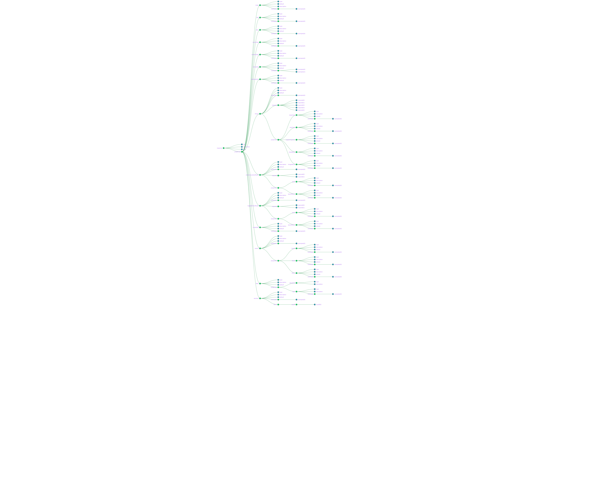

  * [Schema](#schema)
* [Schema Example](#schema-example)
  * [Example - Home page configuration](#example---home-page-configuration)
  * [Schema JSON graph](#schema-json-graph)


 **Schema definition** 
## Schema

```json
{
    "title": "Portal Form configuration schema - Example - Home page",
    "description": "The schema comprises the entire JSON document for Home page and associated sections",
    "type": "object",
    "properties": {
        "index": {
          "type": "integer",
          "default": 0,
          "description": "Index for tab sequence",
          "examples": [
              0
          ]
        },
        "title": {
            "type": "string",
            "description": "Tab label",
            "default": "",
            "examples": [
                "frmelmnts.lbl.home"
            ]
        },
        "desc": {
            "type": "string",
            "description": "Tab brief description",
            "default": "",
            "examples": [
                "frmelmnts.lbl.home"
            ]
        },
        "menuType": {
            "type": "string",
            "description": "Tab Menu Type",
            "default": "",
            "examples": [
                "Content"
            ]
        },
        "contentType": {
            "type": "string",
            "description": "Content type used in tab and sections",
            "default": "",
            "examples": [
                "home"
            ]
        },
        "isEnabled": {
            "type": "boolean",
            "description": "Indicates whether tab is enabled for displaying in portal page",
            "default": true,
            "examples": [
                true,
                false
            ]
        },
        "isOnlineOnly": {
            "type": "boolean",
            "description": "Describes whether to be shown only for offline desktop",
            "default": false,
            "examples": [
                true
            ]
        },
        "theme": {
            "type": "object",
            "description": "Theme configuration for tab",
            "default": {},
            "examples": [
                {
                    "baseColor": "",
                    "textColor": "",
                    "supportingColor": "",
                    "className": "home",
                    "imageName": "courses-banner-img.svg"
                }
            ],
            "required": [
                "baseColor",
                "textColor",
                "supportingColor",
                "className",
                "imageName"
            ],
            "properties": {
                "baseColor": {
                    "type": "string",
                    "description": "Theme - Base color for tab",
                    "default": "",
                    "examples": [
                        ""
                    ]
                },
                "textColor": {
                    "type": "string",
                    "description": "Theme - Text color for tab text",
                    "default": "",
                    "examples": [
                        ""
                    ]
                },
                "supportingColor": {
                    "type": "string",
                    "description": "An explanation about the purpose of this instance.",
                    "default": "",
                    "examples": [
                        ""
                    ]
                },
                "className": {
                    "type": "string",
                    "description": "Theme - CSS Class name which for tab icon",
                    "default": "",
                    "examples": [
                        "home"
                    ]
                },
                "imageName": {
                    "type": "string",
                    "description": "Theme - Image name to be used as icon",
                    "default": "",
                    "examples": [
                        "courses-banner-img.svg"
                    ]
                }
            }
        },
        "anonumousUserRoute": {
            "type": "object",
            "description": "Route configuration for anonymous users",
            "default": {},
            "examples": [
                {
                    "route": "/explore",
                    "queryParam": "home"
                }
            ],
            "required": [
                "route",
                "queryParam"
            ],
            "properties": {
                "route": {
                    "type": "string",
                    "description": "Path for navigation",
                    "default": "",
                    "examples": [
                        "/explore"
                    ]
                },
                "queryParam": {
                    "type": "string",
                    "description": "Query params if any",
                    "default": "",
                    "examples": [
                        "home"
                    ]
                }
            }
        },
        "loggedInUserRoute": {
            "type": "object",
            "description": "Route configuration for logged in users",
            "default": {},
            "examples": [
                {
                    "route": "/explore",
                    "queryParam": "home"
                }
            ],
            "required": [
                "route",
                "queryParam"
            ],
            "properties": {
                "route": {
                    "type": "string",
                    "description": "Path for navigation",
                    "default": "",
                    "examples": [
                        "/explore"
                    ]
                },
                "queryParam": {
                    "type": "string",
                    "description": "Query params if any",
                    "default": "",
                    "examples": [
                        "home"
                    ]
                }
            }
        },
        "metaData": {
            "type": "object",
            "description": "Default meta data for tab page",
            "default": {},
            "examples": [
                {
                    "filters": [
                        "board",
                        "gradeLevel",
                        "subject",
                        "medium",
                        "publisher",
                        "audience",
                        "channel"
                    ],
                    "groupByKey": "subject",
                    "defaultFilters": {
                        "board": [
                            "CBSE"
                        ],
                        "gradeLevel": [
                            "Class 10"
                        ],
                        "medium": []
                    }
                }
            ]
        },
        "search": {
            "type": "object",
            "description": "Content search configuration (request body for API) for tab page",
            "default": {},
            "examples": [
                {
                    "facets": [
                        "se_subjects",
                        "primaryCategory",
                        "medium"
                    ],
                    "fields": [
                        "name",
                        "appIcon",
                        "medium",
                        "subject",
                        "resourceType",
                        "contentType",
                        "organisation",
                        "topic",
                        "mimeType",
                        "trackable",
                        "gradeLevel",
                        "se_boards",
                        "se_subjects",
                        "se_mediums",
                        "se_gradeLevels"
                    ],
                    "filters": {
                        "channel": [],
                        "subject": [],
                        "audience": [],
                        "primaryCategory": [
                            "Digital Textbook",
                            "eTextbook",
                            "Course"
                        ],
                        "se_boards": [
                            "State (Tamil Nadu)"
                        ],
                        "se_mediums": [
                            "English"
                        ],
                        "se_gradeLevels": [
                            "Class 1",
                            "Class 10",
                            "Class 11",
                            "Class 2",
                            "Class 3",
                            "Class 4",
                            "Class 5",
                            "Class 6",
                            "Class 7",
                            "Class 8",
                            "Class 9"
                        ]
                    }
                }
            ],
            "properties": {
                "facets": {
                    "type": "array",
                    "description": "Search - Facets to be returned along with content search",
                    "default": [],
                    "examples": [
                        [
                            "se_subjects",
                            "primaryCategory"
                        ]
                    ]
                },
                "fields": {
                    "type": "array",
                    "description": "Search - Selected fields to be returned in content search",
                    "default": [],
                    "examples": [
                        [
                            "name",
                            "appIcon"
                        ]
                    ]
                },
                "filters": {
                    "type": "object",
                    "description": "Search - Filters for content search API call",
                    "default": {},
                    "examples": [
                        {
                            "channel": [],
                            "subject": [],
                            "audience": [],
                            "primaryCategory": [
                                "Digital Textbook",
                                "eTextbook",
                                "Course"
                            ],
                            "se_boards": [
                                "State (Tamil Nadu)"
                            ],
                            "se_mediums": [
                                "English"
                            ],
                            "se_gradeLevels": [
                                "Class 1",
                                "Class 10",
                                "Class 11",
                                "Class 2",
                                "Class 3",
                                "Class 4",
                                "Class 5",
                                "Class 6",
                                "Class 7",
                                "Class 8",
                                "Class 9"
                            ]
                        }
                    ]
                }
            }
        },
        "filter": {
            "type": "object",
            "description": "Filter - Extension of metadata configuration",
            "default": {},
            "properties": {
                "isEnabled": {
                    "type": "boolean",
                    "description": "Indicates whether to show / hide filter panel in tab page"
                },
                "type": {
                    "type": "string",
                    "description": "Type of filter to be rendered in tab page",
                    "examples": [
                        "facet"
                    ]
                }
            }
        },
        "sections": {
            "type": "array",
            "description": "Sections for above defined tab",
            "default": [],
            "examples": [
                [
                    {
                        "index": 0,
                        "title": "frmelmnts.lbl.subjects",
                        "desc": "Section for subjects",
                        "facetKey": "se_subjects",
                        "isEnabled": true,
                        "apiConfig": {
                            "url": "",
                            "method": "",
                            "req": {},
                            "params": "",
                            "contextKey": "res.facet.subject"
                        },
                        "theme": {
                            "component": "sb-pills-grid",
                            "limit": 10,
                            "infiniteCard": false,
                            "colorMapping": [
                                {
                                    "primary": "rgba(255,139,46,1)",
                                    "secondary": "rgba(255,139,46,0.3)"
                                },
                                {
                                    "primary": "rgba(163,99,255,1)",
                                    "secondary": "rgba(163,99,255,0.3)"
                                },
                                {
                                    "primary": "rgba(34,139,255,1)",
                                    "secondary": "rgba(34,139,255,0.3)"
                                },
                                {
                                    "primary": "rgba(95,192,32,1)",
                                    "secondary": "rgba(95,192,32,0.3)"
                                },
                                {
                                    "primary": "rgba(255,128,47,1)",
                                    "secondary": "rgba(255,128,47,0.3)"
                                },
                                {
                                    "primary": "rgba(251,70,70,1)",
                                    "secondary": "rgba(251,70,70,0.3)"
                                },
                                {
                                    "primary": "rgba(83,109,252,1)",
                                    "secondary": "rgba(83,109,252,0.3)"
                                },
                                {
                                    "primary": "rgba(15,186,208,1)",
                                    "secondary": "rgba(15,186,208,0.3)"
                                }
                            ],
                            "icons": {
                                "english": "assets/images/book_english.svg",
                                "mathematics": "assets/images/calculator.svg",
                                "science": "assets/images/globe.svg",
                                "default": "assets/images/book_default.svg"
                            }
                        },
                        "anonumousUserRoute": {
                            "route": "/explore-course",
                            "queryParam": "course"
                        },
                        "loggedInUserRoute": {
                            "route": "/learn",
                            "queryParam": "course"
                        }
                    },
                    {
                        "index": 1,
                        "title": "frmelmnts.lbl.dscfrmctgries",
                        "desc": "Section for category",
                        "facetKey": "primaryCategory",
                        "isEnabled": true,
                        "apiConfig": {
                            "url": "",
                            "method": "",
                            "req": {},
                            "params": "",
                            "contextKey": "res.facet.primaryCategory"
                        },
                        "theme": {
                            "component": "sb-pills-grid",
                            "limit": 10,
                            "infiniteCard": false,
                            "colorMapping": [
                                {
                                    "primary": "rgba(255,255,255,1)",
                                    "secondary": "rgba(255,255,255,1)"
                                }
                            ],
                            "icons": {
                                "digital textbooks": "assets/images/textbook.svg",
                                "courses": "assets/images/course.svg",
                                "tv programs": "assets/images/tv.svg",
                                "documents": "assets/images/documents.svg",
                                "videos": "assets/images/videos.svg",
                                "default": "assets/images/all_content.svg"
                            }
                        },
                        "anonumousUserRoute": {
                            "route": "/explore-course",
                            "queryParam": "course"
                        },
                        "loggedInUserRoute": {
                            "route": "/learn",
                            "queryParam": "course"
                        }
                    }
                ]
            ],
            "items": {
                "anyOf": [
                    {
                        "type": "object",
                        "description": "An explanation about the purpose of this instance.",
                        "default": {},
                        "examples": [
                            {
                                "index": 0,
                                "title": "frmelmnts.lbl.subjects",
                                "desc": "Section for subjects",
                                "facetKey": "se_subjects",
                                "isEnabled": true,
                                "apiConfig": {
                                    "url": "",
                                    "method": "",
                                    "req": {},
                                    "params": "",
                                    "contextKey": "res.facet.subject"
                                },
                                "theme": {
                                    "component": "sb-pills-grid",
                                    "limit": 10,
                                    "infiniteCard": false,
                                    "colorMapping": [
                                        {
                                            "primary": "rgba(255,139,46,1)",
                                            "secondary": "rgba(255,139,46,0.3)"
                                        },
                                        {
                                            "primary": "rgba(163,99,255,1)",
                                            "secondary": "rgba(163,99,255,0.3)"
                                        },
                                        {
                                            "primary": "rgba(34,139,255,1)",
                                            "secondary": "rgba(34,139,255,0.3)"
                                        },
                                        {
                                            "primary": "rgba(95,192,32,1)",
                                            "secondary": "rgba(95,192,32,0.3)"
                                        },
                                        {
                                            "primary": "rgba(255,128,47,1)",
                                            "secondary": "rgba(255,128,47,0.3)"
                                        },
                                        {
                                            "primary": "rgba(251,70,70,1)",
                                            "secondary": "rgba(251,70,70,0.3)"
                                        },
                                        {
                                            "primary": "rgba(83,109,252,1)",
                                            "secondary": "rgba(83,109,252,0.3)"
                                        },
                                        {
                                            "primary": "rgba(15,186,208,1)",
                                            "secondary": "rgba(15,186,208,0.3)"
                                        }
                                    ],
                                    "icons": {
                                        "english": "assets/images/book_english.svg",
                                        "mathematics": "assets/images/calculator.svg",
                                        "science": "assets/images/globe.svg",
                                        "default": "assets/images/book_default.svg"
                                    }
                                },
                                "anonumousUserRoute": {
                                    "route": "/explore-course",
                                    "queryParam": "course"
                                },
                                "loggedInUserRoute": {
                                    "route": "/learn",
                                    "queryParam": "course"
                                }
                            }
                        ],
                        "properties": {
                            "index": {
                              "type": "integer",
                              "default": 0,
                              "description": "Index for section sequence",
                              "examples": [
                                  0
                              ]
                            },
                            "title": {
                                "type": "string",
                                "description": "Section label",
                                "default": "",
                                "examples": [
                                    "frmelmnts.lbl.subjects"
                                ]
                            },
                            "desc": {
                                "type": "string",
                                "description": "Tab brief description",
                                "default": "",
                                "examples": [
                                  "Section for Subjects"
                                ]
                            },
                            "facetKey": {
                                "type": "string",
                                "description": "Object key to lookup in content search API response",
                                "examples": [
                                    "se_subjects",
                                    "primaryCategory"
                                ]
                            },
                            "isEnabled": {
                                "type": "boolean",
                                "description": "Indicates whether section is enabled / disabled",
                                "default": true,
                                "examples": [
                                    true
                                ]
                            },
                            "apiConfig": {
                                "type": "object",
                                "description": "API and metadata configuration for API request call pertaining to section data",
                                "examples": [
                                    {
                                        "url": "",
                                        "method": "",
                                        "req": {},
                                        "params": "",
                                        "contextKey": "res.facet.subject"
                                    }
                                ],
                                "required": [
                                    "url",
                                    "method",
                                    "req",
                                    "params",
                                    "contextKey"
                                ],
                                "properties": {
                                    "url": {
                                        "type": "string",
                                        "description": "API Config - URL endpoint for API request"
                                    },
                                    "method": {
                                        "type": "string",
                                        "description": "API Config - Request method"
                                    },
                                    "req": {
                                        "type": "object",
                                        "description": "API Config - API request body"
                                    },
                                    "params": {
                                        "type": "string",
                                        "description": "API Config - API request params"
                                    },
                                    "contextKey": {
                                        "type": "string",
                                        "description": "API Config - Context key for API response depth lookup",
                                        "examples": [
                                            "res.facet.subject"
                                        ]
                                    }
                                }
                            },
                            "theme": {
                                "type": "object",
                                "description": "Theme configuration for section",
                                "default": {},
                                "examples": [
                                    {
                                        "component": "sb-pills-grid",
                                        "limit": 10,
                                        "infiniteCard": false,
                                        "colorMapping": [
                                            {
                                                "primary": "rgba(255,139,46,1)",
                                                "secondary": "rgba(255,139,46,0.3)"
                                            },
                                            {
                                                "primary": "rgba(163,99,255,1)",
                                                "secondary": "rgba(163,99,255,0.3)"
                                            },
                                            {
                                                "primary": "rgba(34,139,255,1)",
                                                "secondary": "rgba(34,139,255,0.3)"
                                            },
                                            {
                                                "primary": "rgba(95,192,32,1)",
                                                "secondary": "rgba(95,192,32,0.3)"
                                            },
                                            {
                                                "primary": "rgba(255,128,47,1)",
                                                "secondary": "rgba(255,128,47,0.3)"
                                            },
                                            {
                                                "primary": "rgba(251,70,70,1)",
                                                "secondary": "rgba(251,70,70,0.3)"
                                            },
                                            {
                                                "primary": "rgba(83,109,252,1)",
                                                "secondary": "rgba(83,109,252,0.3)"
                                            },
                                            {
                                                "primary": "rgba(15,186,208,1)",
                                                "secondary": "rgba(15,186,208,0.3)"
                                            }
                                        ],
                                        "icons": {
                                            "english": "assets/images/book_english.svg",
                                            "mathematics": "assets/images/calculator.svg",
                                            "science": "assets/images/globe.svg",
                                            "default": "assets/images/book_default.svg"
                                        }
                                    }
                                ],
                                "required": [
                                    "component",
                                    "limit",
                                    "infiniteCard",
                                    "colorMapping",
                                    "icons"
                                ],
                                "properties": {
                                    "component": {
                                        "type": "string",
                                        "description": "Section Theme - Component to be used for rendering",
                                        "examples": [
                                            "sb-pills-grid"
                                        ]
                                    },
                                    "limit": {
                                        "type": "integer",
                                        "description": "Section Theme - Number of card / results to be displayed inside section",
                                        "examples": [
                                            10
                                        ]
                                    },
                                    "infiniteCard": {
                                        "type": "boolean",
                                        "description": "Section Theme - Infinite scroll",
                                        "examples": [
                                            false
                                        ]
                                    },
                                    "colorMapping": {
                                        "type": "array",
                                        "description": "Section Theme - Array of color code set for section card",
                                        "examples": [
                                            [
                                                {
                                                    "primary": "rgba(255,139,46,1)",
                                                    "secondary": "rgba(255,139,46,0.3)"
                                                },
                                                {
                                                    "primary": "rgba(163,99,255,1)",
                                                    "secondary": "rgba(163,99,255,0.3)"
                                                }
                                            ]
                                        ]
                                    },
                                    "icons": {
                                        "type": "object",
                                        "description": "Section Theme - Icon path for section results; default icon to be defined",
                                        "default": {},
                                        "examples": [
                                            {
                                                "english": "assets/images/book_english.svg",
                                                "mathematics": "assets/images/calculator.svg",
                                                "science": "assets/images/globe.svg",
                                                "default": "assets/images/book_default.svg"
                                            }
                                        ],
                                        "required": [
                                            "default"
                                        ]
                                    }
                                }
                            },
                            "anonumousUserRoute": {
                                "type": "object",
                                "description": "Route configuration for anonymous users",
                                "default": {},
                                "examples": [
                                    {
                                        "route": "/explore-course",
                                        "queryParam": "course"
                                    }
                                ],
                                "required": [
                                    "route",
                                    "queryParam"
                                ],
                                "properties": {
                                    "route": {
                                        "type": "string",
                                        "description": "Path for navigation",
                                        "default": "",
                                        "examples": [
                                            "/explore-course"
                                        ]
                                    },
                                    "queryParam": {
                                        "type": "string",
                                        "description": "Query params if any",
                                        "default": "",
                                        "examples": [
                                            "course"
                                        ]
                                    }
                                }
                            },
                            "loggedInUserRoute": {
                                "type": "object",
                                "description": "Route configuration for logged in users",
                                "default": {},
                                "examples": [
                                    {
                                        "route": "/learn",
                                        "queryParam": "course"
                                    }
                                ],
                                "required": [
                                    "route",
                                    "queryParam"
                                ],
                                "properties": {
                                    "route": {
                                        "type": "string",
                                        "description": "Path for navigation",
                                        "default": "",
                                        "examples": [
                                            "/learn"
                                        ]
                                    },
                                    "queryParam": {
                                        "type": "string",
                                        "description": "Query params if any",
                                        "default": "",
                                        "examples": [
                                            "course"
                                        ]
                                    }
                                }
                            }
                        }
                    }
                ]
            }
        }
    }
}
```

# Schema Example

## Example - Home page configuration

```json
{
            "index": 0,
            "title": "frmelmnts.lbl.home",
            "desc": "frmelmnts.lbl.home",
            "menuType": "Content",
            "contentType": "home",
            "isEnabled": true,
            "isOnlineOnly": true,
            "theme": {
                "baseColor": "",
                "textColor": "",
                "supportingColor": "",
                "className": "home",
                "imageName": "courses-banner-img.svg"
            },
            "anonumousUserRoute": {
                "route": "/explore",
                "queryParam": "home"
            },
            "loggedInUserRoute": {
                "route": "/explore",
                "queryParam": "home"
            },
            "metaData": {
                "filters": [
                    "board",
                    "gradeLevel",
                    "subject",
                    "medium",
                    "publisher",
                    "audience",
                    "channel"
                ],
                "groupByKey": "subject",
                "defaultFilters": {
                    "board": [
                        "CBSE"
                    ],
                    "gradeLevel": [
                        "Class 10"
                    ],
                    "medium": []
                }
            },
            "search": {
                "facets": [
                    "se_subjects",
                    "primaryCategory",
                    "medium"
                ],
                "fields": [
                    "name",
                    "appIcon",
                    "medium",
                    "subject",
                    "resourceType",
                    "contentType",
                    "organisation",
                    "topic",
                    "mimeType",
                    "trackable",
                    "gradeLevel",
                    "se_boards",
                    "se_subjects",
                    "se_mediums",
                    "se_gradeLevels"
                ],
                "filters": {
                    "channel": [],
                    "subject": [],
                    "audience": [],
                    "primaryCategory": [
                        "Digital Textbook",
                        "eTextbook",
                        "Course"
                    ],
                    "se_boards": [
                        "State (Tamil Nadu)"
                    ],
                    "se_mediums": [
                        "English"
                    ],
                    "se_gradeLevels": [
                        "Class 1",
                        "Class 10",
                        "Class 11",
                        "Class 2",
                        "Class 3",
                        "Class 4",
                        "Class 5",
                        "Class 6",
                        "Class 7",
                        "Class 8",
                        "Class 9"
                    ]
                }
            },
            "filter": {
                "isEnabled": false,
                "type": "facet"
            },
            "sections": [
                {
                    "index": 0,
                    "title": "frmelmnts.lbl.subjects",
                    "desc": "Section for subjects",
                    "facetKey": "se_subjects",
                    "isEnabled": true,
                    "apiConfig": {
                        "url": "",
                        "method": "",
                        "req": {},
                        "params": "",
                        "contextKey": "res.facet.subject"
                    },
                    "theme": {
                        "component": "sb-pills-grid",
                        "limit": 10,
                        "infiniteCard": false,
                        "colorMapping": [
                            {
                                "primary": "rgba(255,139,46,1)",
                                "secondary": "rgba(255,139,46,0.3)"
                            },
                            {
                                "primary": "rgba(163,99,255,1)",
                                "secondary": "rgba(163,99,255,0.3)"
                            },
                            {
                                "primary": "rgba(34,139,255,1)",
                                "secondary": "rgba(34,139,255,0.3)"
                            },
                            {
                                "primary": "rgba(95,192,32,1)",
                                "secondary": "rgba(95,192,32,0.3)"
                            },
                            {
                                "primary": "rgba(255,128,47,1)",
                                "secondary": "rgba(255,128,47,0.3)"
                            },
                            {
                                "primary": "rgba(251,70,70,1)",
                                "secondary": "rgba(251,70,70,0.3)"
                            },
                            {
                                "primary": "rgba(83,109,252,1)",
                                "secondary": "rgba(83,109,252,0.3)"
                            },
                            {
                                "primary": "rgba(15,186,208,1)",
                                "secondary": "rgba(15,186,208,0.3)"
                            }
                        ],
                        "icons": {
                            "english": "assets/images/book_english.svg",
                            "mathematics": "assets/images/calculator.svg",
                            "science": "assets/images/globe.svg",
                            "default": "assets/images/book_default.svg"
                        }
                    },
                    "anonumousUserRoute": {
                        "route": "/explore-course",
                        "queryParam": "course"
                    },
                    "loggedInUserRoute": {
                        "route": "/learn",
                        "queryParam": "course"
                    }
                },
                {
                    "index": 1,
                    "title": "frmelmnts.lbl.dscfrmctgries",
                    "desc": "Section for category",
                    "facetKey": "primaryCategory",
                    "isEnabled": true,
                    "apiConfig": {
                        "url": "",
                        "method": "",
                        "req": {},
                        "params": "",
                        "contextKey": "res.facet.primaryCategory"
                    },
                    "theme": {
                        "component": "sb-pills-grid",
                        "limit": 10,
                        "infiniteCard": false,
                        "colorMapping": [
                            {
                                "primary": "rgba(255,255,255,1)",
                                "secondary": "rgba(255,255,255,1)"
                            }
                        ],
                        "icons": {
                            "digital textbooks": "assets/images/textbook.svg",
                            "courses": "assets/images/course.svg",
                            "tv programs": "assets/images/tv.svg",
                            "documents": "assets/images/documents.svg",
                            "videos": "assets/images/videos.svg",
                            "default": "assets/images/all_content.svg"
                        }
                    },
                    "anonumousUserRoute": {
                        "route": "/explore-course",
                        "queryParam": "course"
                    },
                    "loggedInUserRoute": {
                        "route": "/learn",
                        "queryParam": "course"
                    }
                },
                {
                    "index": 2,
                    "title": "frmelmnts.lbl.medium",
                    "desc": "Section for medium",
                    "facetKey": "medium",
                    "isEnabled": false,
                    "apiConfig": {
                        "url": "",
                        "method": "",
                        "req": {},
                        "params": "",
                        "contextKey": "res.facet.medium"
                    },
                    "theme": {
                        "component": "sb-pills-grid",
                        "limit": 10,
                        "infiniteCard": false,
                        "colorMapping": [
                            {
                                "primary": "rgba(255,139,46,1)",
                                "secondary": "rgba(255,139,46,0.3)"
                            },
                            {
                                "primary": "rgba(163,99,255,1)",
                                "secondary": "rgba(163,99,255,0.3)"
                            },
                            {
                                "primary": "rgba(34,139,255,1)",
                                "secondary": "rgba(34,139,255,0.3)"
                            },
                            {
                                "primary": "rgba(95,192,32,1)",
                                "secondary": "rgba(95,192,32,0.3)"
                            },
                            {
                                "primary": "rgba(255,128,47,1)",
                                "secondary": "rgba(255,128,47,0.3)"
                            },
                            {
                                "primary": "rgba(251,70,70,1)",
                                "secondary": "rgba(251,70,70,0.3)"
                            },
                            {
                                "primary": "rgba(83,109,252,1)",
                                "secondary": "rgba(83,109,252,0.3)"
                            },
                            {
                                "primary": "rgba(15,186,208,1)",
                                "secondary": "rgba(15,186,208,0.3)"
                            }
                        ]
                    },
                    "anonumousUserRoute": {
                        "route": "/home",
                        "queryParam": "course"
                    },
                    "loggedInUserRoute": {
                        "route": "/learn",
                        "queryParam": "course"
                    }
                }
            ]
        }
```


## Schema JSON graph



*****

[[category.storage-team]] 
[[category.confluence]] 
