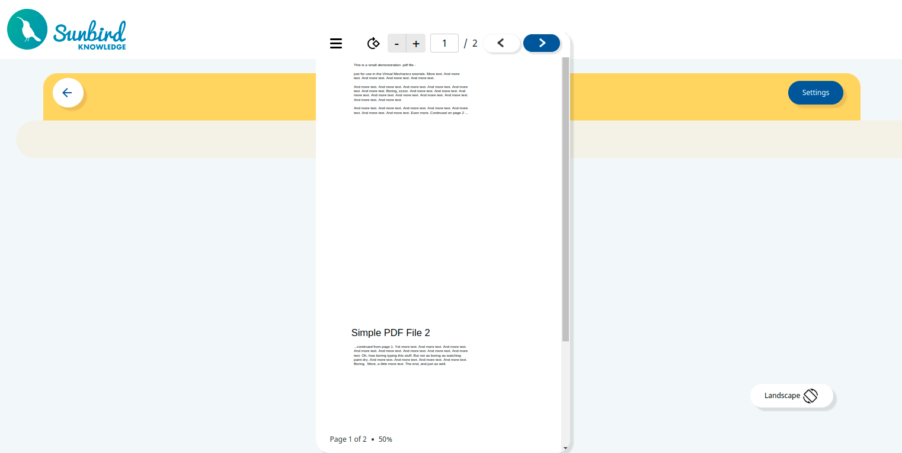
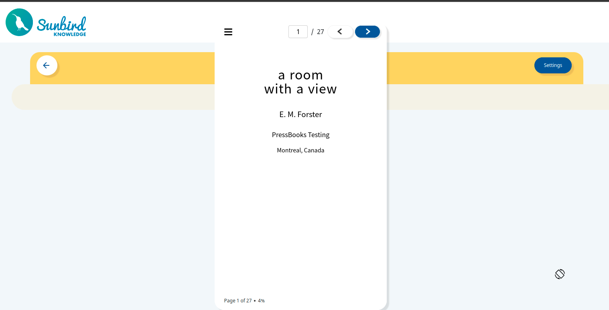
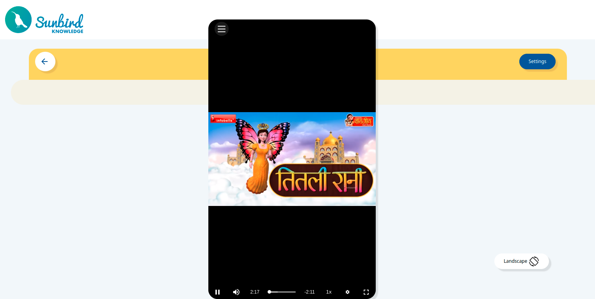

# Introduction
Players should render in portrait and landscape mode both and this functionality should be able to verify in web portal. 

[SB-30126 System JIRA](https:///browse/SB-30126)


## Background:
Currently we are verifying this portrait and landscape mode in mobile devices only. There is no such functionality available where - we can  verify the player in portrait and landscape mode in web.


### Problem Statement:
To show the v1 and v2 players in portrait mode, we will face some in rendering and aspect ratio issue for  contents 


### Key Design Problems:

* What should be the Player behaviour in portrait/Landscape mode change?


* Where to show the portrait and landscape mode buttons?


* How player v1 should also support the portrait mode in all stages?


* How to maintain the content state?


* Is the player can support this behaviour?


## Design:

### Solution 1 :
 **Portrait and landscape mode button should be part of the Portal** 

.png)To achieve this, player will rendered in full screen and will change the height and width of the player to show the player in portrait mode. 

There is no config changes in player side.

 **Sample code** 


```
<sunbird-epub-player [ngClass]="{'player-oriendation': landscape/portrait}">
```

```
&.player-oriendation-portraite {
    width: 28%;
    height: calc(100vh - 50px) !important;
    position:fixed;
    top:calculateRem(50px);
    left:35%;
    bottom:0;
    right:0
   }
   &.player-fullscreen iframe {
    width: 100%;
    height: calc(100vh - 50px) !important;
 }
```

```
showPortrait() {
  // Load player in fullscreen
  // Reduce height and width of the Iframe
}
showLandscape() {
// Disable full screen mode
}
```
 **Pros:** 
* No changes in player required as we are implementing this from portal side.


 **Cons:** 
* Aspect ratio can be vary.


* For PDF, Epub and video player alignment of the controls may needed.


* V1 player contents will looks in small size in portrait mode.


* No config to restrict the player to load in different orientation.


### Solution 2 :
 **Portrait and landscape button should be part of the player** 

The portrait and Landscape button will be appear as a part of the menu config. This config can be change from the sidebar configurations.  

Config:


```
sideMenu: {
          showDownload:  true,
          showExit: true,
          showPrint: true,
          showReplay: true,
          showShare: true,
          showLandscape:true,  // Default - true
        }
```

```
showPortrait() {
  // FIx the width and height of the Iframe
}
showLandscape() {
// show as it is.
}
```
.png)Changes required in V1 player:


* Need to reduce the canvas height and width


* reduce the frame height and width


* Overlay navigation height and width need to adjust


.png) **Pros:** 
* Config driven implementation to enable disable the portrait/landscape mode orientation


* Work for V1 player and assessments. 


 **Cons:** 
* Expect player content area, other area will show in a black as a background. Which will not look good.


##  **Conclusion** :

* In portrait mode PDF, Epub, Video and interactive content will not suite for portrait screen 


Sample screens of portrait mode of PDF, EPub, video and interactive contents

.png)


* In PDF and EPub player, font size will show in small. If we increase the font size - horizontal scroll will come, which looks uncomfortable to the reader to scroll horizontally. 


* V1 and V2 Players supports portrait mode with the above limitations. This can be achieve using the solution 1 which is not depend on player.  


cc- 


*****

[[category.storage-team]] 
[[category.confluence]] 
