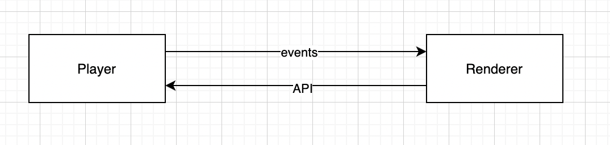

### Objective
Refactoring the player to extract the business logic from the Rendering of the Player so that it becomes reusable in other services.


### Background
The current QuML Player is an Angular App that outputs a web component. A lot of the functionalities as described below are part of the Angular Components.


* Fetching the QuestionSet, Sections and getting individual Questions Metadata


* Playing through the Questions (linear or non-linear)


* Events like when to send Hints, Timeouts, Errors are part of the application state


* Telemetry


All of the above is business logic and can be extracted out as common code and not be as tightly coupled with Angular. Making this loosely coupled with enable the common code to be reused in variety of other JS frameworks like React, React Native, Vue etc and will provide developers with basic tools on which to build their own QuML players. The said extraction can be ported to other languages by the community to further use the QuML spec in creative ways.

One of the use-case that can be enabled using this is for dissemination of questions in a chat based platform like UCI. Questions being sent one at a time.


### Solution
Dividing the current structure of code into two parts  **_question player_**  and  **_renderer._** The  _player_ and  _renderer_ will communicate with each other through


1. Events pushed by the  _player_  async using the [EventEmitter](https://github.com/angular/angular/blob/master/packages/core/src/event_emitter.ts). These are to 


    1. abstract out the side effects of state mutation from the renderer. 


    1. This also allows for external mutations outside of renderer to happen. 


    1. This also helps when in the use cases where the renderer mutates the state through some other means - like an webhook response which can be hooked up with the APIs exposed by player.


    
1. APIs exposed by the  _player_  to mutate the state by the  _renderer_ .

    

    This follows a unidirectional approach to update state rather than the bidirectional one to reduce complexity in debugging. So the renderer updates state using the Player API and the player then  _schedules_  any events if needed due to star. 

    



Core features to be extracted
* Fetching of a collection


* Iterator for QuestionSet, Sections or any other collection


* State Management for the following entities


    * Player


    * User


    
* Events Management -  _Store_  and  _emit_  appropriate events for the  _renderer_  when the state is mutated by the renderer.


    * Entry and Exit (Question Set, Section, Question)


    * Telemetry


    * Hints


    * Attempts


    * Errors


    * Time Limits


    * Replay


    
* Persistence Layer Interfaces


* Generic metadata storage object


### Interfaces and Classes
The pseduo/live code can be tracked here - [https://github.dev/ChakshuGautam/sunbird-quml-player/tree/player-refactor](https://github.dev/ChakshuGautam/sunbird-quml-player/tree/player-refactor). The code is in the folder player.

Event Types
```typescript
export enum EventType {
  TELEMETRY,
  ERROR,
  PERSISTANCE,
  MAX_ATTEMPT_EXCEEDED,
  MAX_TIME_EXCEEDED,
  SHOW_WARNING_TIME,
  SHOW_FEEDBACK,
  NAVIGATE_TO_NEXT_QUESTION,
  SECTION_COMPLETED,
  PLAYER_CRASHED,
  INTERNET_CONNECTION_ERROR,
  PLAYER_EXIT,
  CONTENT_ERROR,
}
```
Detailed Event Description
```typescript
  /**
   * Emit an event when the max attempts are exhausted
   * @param {RendererState} state - RendererState
   */
  emitMaxAttemptsExhausted(state: RendererState) {
    // this.rendererState.isMaxAttemptExhausted = true;
    const desc = 'Max attempts are exhausted';
    const event = new Event(EventType.MAX_ATTEMPT_EXCEEDED, {}, desc, 0);
    this.emit(event);
  }


  /**
   * Emit an event when the max time is exhausted
   * @param {RendererState} state - RendererState
   */
  emitMaxTimeExhausted(state: RendererState) {
    // this.rendererState.isDurationExpired = true;
    const desc = 'Max attempts are exhausted';
    const event = new Event(EventType.MAX_TIME_EXCEEDED, {}, desc, 0);
    this.emit(event);
  }

  /**
   * Emit an event when the warning time started
   * @param {RendererState} state - RendererState
   */
  emitShowWarningTime(state: RendererState) {
    // this.rendererState.showWarningTime = true;
    const desc = 'Warning time started';
    const event = new Event(EventType.SHOW_WARNING_TIME, {}, desc, 0);
    this.emit(event);
  }

/**
 * Emit an event when user answers the question and showFeedBack is ON for a question set
 * @param {RendererState} state - RendererState
 */
  emitShowFeedBack(state: RendererState) {
    // this.rendererState.showWarningTime = true;
    const desc = 'Show feedback popup';
    const data = {
      isCorrect: true
    }
    const event = new Event(EventType.SHOW_FEEDBACK, data, desc, 0);
    this.emit(event);
  }

/**
 * Emit an event when feedback popup closes, with the next question data
 * @param {RendererState} state - RendererState
 * @param {Question} question - Question
 */
  emitNavigateToNextQuestion(state: RendererState, question: Question) {
    const event = new Event(EventType.NAVIGATE_TO_NEXT_QUESTION, question, '', 0);
    this.emit(event);
  }

/**
 * Emit an event to the renderer to navigate to the next question
 * @param {RendererState} state - RendererState
 * @param {string} nextSection - The id of the next section.
 */
  emitSectionCompleted(state: RendererState, nextSection: string) {
    // this.rendererState.isSectionCompleted = true;
    const data = {
      activeSection: state.activeSection,
      nextSection: nextSection
    }
    const event = new Event(EventType.SECTION_COMPLETED, data, '', 0);
    this.emit(event);
    // this.rendererState.activeSection = this.rendererState.sections[this.rendererState.sectionIndex];
  }

/**
 * Emit an event to the renderer when the player crashed
 * @param {RendererState} state - RendererState
 */
  emitPlayerCrashed(state: RendererState) {
    const data = {
      crashType: '',
      error: '',
    }
    const event = new Event(EventType.PLAYER_CRASHED, data, '', 0);
    this.emit(event);
  }


/**
 * It emits an event to the renderer on internet connection lost
 * @param {RendererState} state - RendererState
 */
  emitInternetConnectionError(state: RendererState) {
    this.persist({});
    const data = {
      isConnected: false,
    }
    const event = new Event(EventType.INTERNET_CONNECTION_ERROR, data, '', 0);
    this.emit(event);
  }

/**
 * Emit an event when player is ready to exit
 * @param {RendererState} state - The state of the renderer.
 * @param {boolean} [isForcefulExit=false] - boolean to indicate forceful exit
 */
  emitExit(state: RendererState, isForcefulExit: boolean = false) {
    this.rendererState = state;
    const data = {
      isForcefulExit,
    }
    const event = new Event(EventType.PLAYER_EXIT, data, '', 0);
    this.emit(event);
  }


/**
 * Emit an event to the renderer
 * @param {RendererState} state - The current state of the renderer.
 * @param {string} error - The error message to be displayed.
 * @param {string} errorCode - The error code that will be used to identify the error.
 */
  emitContentError(state: RendererState, error: string, errorCode: string) {
    const data = {
      error,
      errorCode
    }
    const event = new Event(EventType.CONTENT_ERROR, {}, '', 0);
  }
```

### Integration Guide for Angular - WIP


### Open Questions

1. Should the player be allow for a callback based event processing? For example creating a telemetry event and sending it through event callback?


### Prerequisites
A couple of things that need to be closed before the refactoring starts


1. 100% code coverage on main-component


1. Testing script (npm) to watch all tests.


Next Steps


1. Get all the event schemas validated from Kartheek and Vivek.


1. Check if the APIs are enough or not on the Player.ts.


*****

[[category.storage-team]] 
[[category.confluence]] 
