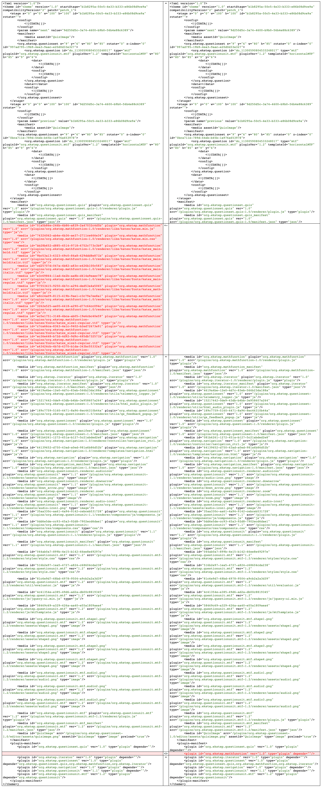

Presently, any content having a question set load [Katex](https://ckeditor.com/cke4/addon/katex) library on its consumption. in the platform, Katex is CKEditor add-ons which enables math rendering. Even if a question is not using math, the platform still bundles the Katex assets ( 650 KB ) which take more than 7 seconds to load in the browser.

Image -1

## Proposed Solution: 

1. Removing Katex Dependencies from question unit plugin \[ org.ekstep.questionunit ].

1. Create anewplugin that loads only Katex assets while rendering the content

1. Before generating ECML check for the math usages and dynamically add the new plugin in ECML.  

.png)Flow diagram 

Old ECML structure 

New ECML structure

## Goals and Non-Goals:
This approach will only optimize a Quiz \[Question set] loading time if and only if Quiz is not using Math anywhere in its context.

Quiz using Math function will not get optimized.

## Testability:
The test can be performed, in the following sequence. 

1. Create content with the question set without adding Math 

1. Consume the newly created content and check with the debugging tool of the browser, in Network Tab Katex assets should not load \[ Ref. image-1 ]

##  Monitoring: 
We can monitor the optimization in loading by checking the difference between Player START and the first IMPRESSION telemetry event.

## Backward Compatibility:
Some approaches to maintain backward Compatability:

*  Write the same logic in ECML renderer \[ player core plugin ] to remove Katex dependencies at runtime

    *  **PROS** 

    * A quick and feasible solution

    
    *  **CONS** 

    * It won’t remove dependencies from the content package physically

    

    

    
* Republish old content can restructure the ECML which also solves this problem

    *  **PROS** 

    * This will physically remove the assets (Katex) from the package 

    
    *  **CONS** 

    * We need to republish all the ECML content. because currently there is no way to differentiate between them 

    * It requires users intervention to publish

    

    
* Migration of existing content. 

    *  **PROS** 

    * This will physically remove the assets without intervening of user 

    
    *  **CONS** 

    * This is a time and resource-consuming  activity 

    

    

*****

[[category.storage-team]] 
[[category.confluence]] 
