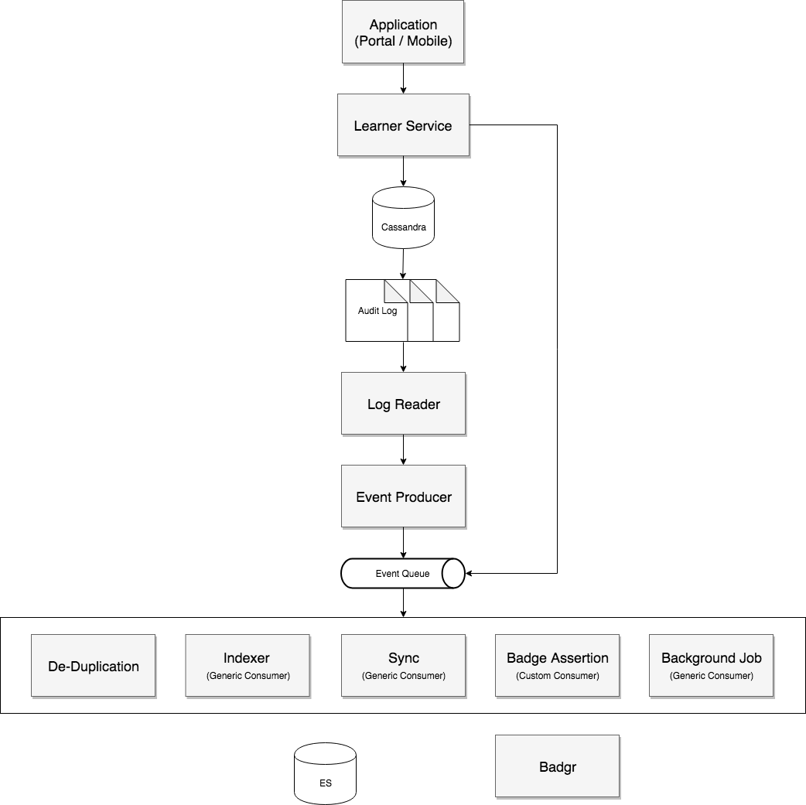

## Overview
Learner Service provides APIs related to resources such as Organisations, Users (i.e. learner), Course Batches, Locations, Badges, Pages etc.

For performance reasons Learner Services writes data to Cassandra which is synched in the background to Elasticsearch (for faster read and search).

Learner Service is currently architected to comprise of multiple actors. Broadly, these actors are categorised into  **foreground**  and  **background**  **actors** .

Foreground actors execute in the context of an API request to primarily either write information to Cassandra or read information from Elasticsearch. When information is updated in Cassandra a foreground actor sends a message to a background actor for performing sync of information from Cassandra to Elasticsearch. There are  **reliability concerns**  with current architecture which can result in information mismatch between Cassandra and Elasticsearch in case Learner Service container is restarted while one or more actors are working on some operations.

The purpose of this document is to propose a more reliable event driven learner service architecture.


## Proposed Architecture
There are two types of events that Learner Service generates:


*  **Transactional**  (generated due to DB update)
*  **Instructional**  (e.g. manual sync, badge assertion, manual background job run)




## Audit Logging
For reliable audit logging, events (on DB updates) should be generated immediately, in order and avoid duplication especially in a multi-node DB installation. Following is a summary of the available alternatives explored.


| Approach | Pros | Cons | 
|  --- |  --- |  --- | 
| Cassandra Trigger | <ul><li>Immediately triggered</li><li>Maintains order (not tested in multi-node scenario)</li></ul> | <ul><li>Deprecated (refer [Datastax](https://docs.datastax.com/en/cql/3.3/cql/cql_reference/cqlCreateTrigger.html) documentation)</li><li>Semi-private and subject to change</li><li>Performance overhead</li></ul> | 
| Use audit logging of Apache Cassandra 4.0 | <ul><li>Out of the box product feature which is expected to meet performance and reliability design goals</li></ul> | <ul><li>Not yet released</li></ul> | 
| Change Data Capture | <ul><li>No performance overhead during write</li></ul> | <ul><li>Data not immediately available (requires memtables flush or commit log limit)</li><li>Every node has a separate commit log (binary format)</li><li>Consumer needs to handle duplicate events in a multi-node setup</li></ul> | 
| ecAudit (Ericsson Cassandra Audit) | <ul><li>Immediately logged (on the node where the query is executed)</li><li>Read is straightforward as log is in text format</li></ul> | <ul><li>Correlation required in case of FAILED events</li><li>Every node has a separate audit log</li><li>Performance overhead</li></ul> | 

Samples: _Cassandra Trigger_ 


```
{{"columnnamename":"firstname", "value":"emp1"},{"columnnamename":"lastname","value":"last1"},"key":"1"}}
```


 _Cassandra 4.0 Audit Log_ 


```
LogMessage: user:anonymous|host:127.0.0.1:7000|source:/127.0.0.1|port:53418|timestamp:1539980764310|type:SELECT|category:QUERY|ks:system_virtual_schema|scope:columns|operation:SELECT * from system_virtual_schema.columns ;
```


 _CDC (using a binary file reader)_ 


```
{"rows":[{"cells":[{"name":"email","time":1552990511988147,"value":"some@gmail.com"},{"name":"firstname","time":1552990511988147,"value":"user101"},{"name":"lastname","time":1552990511988147,"value":"last101"},{"name":"phone","time":1552990511988147,"value":"9176009598"}],"clusteringKey":""}],"key":"101"}
```


 _ecAudit_ 


```
19:53:00.644 - client:'127.0.0.1'|user:'cassandra'|status:'ATTEMPT'|operation:'CREATE ROLE ecuser WITH PASSWORD = '*****' AND LOGIN = true'
19:53:00.653 - client:'127.0.0.1'|user:'cassandra'|status:'FAILED'|operation:'CREATE ROLE ecuser WITH PASSWORD = '*****' AND LOGIN = true'

15:42:41.644 - client:'127.0.0.1'|user:'cassandra'|status:'ATTEMPT'|operation:'INSERT INTO ecks.ectbl (partk, clustk, value) VALUES (?, ?, ?)[1, '1', 'valid']'
```

## Log Reader
A log reader such as logstash or fluentd can be configured for streaming audit logs to an event producer.


## Event Producer
Event producer is responsible for constructing a JSON message for each log line and posting to an Event Queue topic.

 **Sample Transactional Events** 

 _Create User (with address and education details)_ 


```
USER EVENT

{
    "identifier": "3d45fbd8-b911-4cc5-b503-61215902d780",
    "ets": 1548833319693,
    "event": {
        "properties": {
            "id": {
                "nv": "3d45fbd8-b911-4cc5-b503-61215902d780"
            },
            "userId": {
                "nv": "3d45fbd8-b911-4cc5-b503-61215902d780"
            },
            "firstName": {
                "nv": "manzarul haque"
            },
            "email": {
                "nv": "manzarul07@gmail.com"
            },
            "emailVerified": {
                "nv": true
            },
            "phone": {
                "nv": "9888888888"
            },
            "phoneVerified": {
                "nv": true
            },
            "channel": {
                "nv": "ap"
            },
            "rootOrgId": {
                "nv": "123456789"
            }
        }
    },
    "operationType": "UPSERT",
    "eventType": "transactional",
    "userId": "ANONYMOUS",
    "createdOn": "2019-01-30T12:58:39.693+0530",
    "objectType": "user"
}

ADDRESS EVENT

{
    "identifier": "12345",
    "ets": 1548833319693,
    "event": {
        "properties": {
            "id": {
                "nv": "12345"
            },
            "type": { // TODO
                "nv": "usr"
            },
            "userId": {
                "nv": "3d45fbd8-b911-4cc5-b503-61215902d780"
            },
            "city": {
                "nv": "Bangalore"
            },
            "zipCode": {
                "nv": "560000"
            }
        }
    },
    "operationType": "UPSERT",
    "eventType": "transactional"
    "userId": "ANONYMOUS",
    "createdOn": "2019-01-30T12:58:39.693+0530",
    "objectType": "address"
}

EDUCATION EVENT

{
    "identifier": "3d45fbd8-b911-4cc5-b503-61215902d780",
    "ets": 1548833319693,
    "event": {
        "properties": {
            "id": {
                "nv": "6789"
            },
            "userId": {
                "nv": "3d45fbd8-b911-4cc5-b503-61215902d780"
            },
            "degree": {
                "nv": "B.SC"
            },
            "yearOfPassing": {
                "nv": "2010"
            },
            "addressId": {
                "nv": "1111"
            }
        }
    },
    "operationType": "UPSERT",
    "eventType": "transactional"
    "userId": "ANONYMOUS",
    "createdOn": "2019-01-30T12:58:39.693+0530",
    "objectType": "user_education"
}

ADDRESS EVENT

{
    "identifier": "1111",
    "ets": 1548833319693,
    "event": {
        "properties": {
            "id": {
                "nv": "1111"
            },
            "type": { // TODO
                "nv": "edu"
            },
            "userId": {
                "nv": "3d45fbd8-b911-4cc5-b503-61215902d780"
            },
            "city": {
                "nv": "Bangalore"
            },
            "zipCode": {
                "nv": "560000"
            }
        }
    },
    "operationType": "UPSERT",
    "eventType": "transactional"
    "userId": "ANONYMOUS",
    "createdOn": "2019-01-30T12:58:39.693+0530",
    "objectType": "address"
}
```


 _Update User_ 


```js
{
    "identifier": "3d45fbd8-b911-4cc5-b503-61215902d780",
    "ets": 1548833319693,
    "event": {
        "properties": {
            "userId": {
                "nv": "3d45fbd8-b911-4cc5-b503-61215902d780"
            },
            "firstName": {
                "nv": "manzarul haque"
            },
            "profileSummary": {
                "nv": "Test to check for update"
            },
            "framework": {
                "id": {
                    "nv": "NCFCOPY"
                },
                "gradeLevel": {
                    "nv": [
                        "Kindergarten"
                    ]
                },
                "subject": {
                    "nv": [
                        "English"
                    ]
                },
                "medium": {
                    "nv": [
                        "Hindi"
                    ]
                },
                "board": {
                    "nv": [
                        "NCERT"
                    ]
                }
            }
        }
    },
    "operationType": "UPSERT",
    "eventType": "transactional",
    "userId": "ANONYMOUS",
    "createdOn": "2019-01-30T12:58:39.693+0530",
    "objectType": "user"
}
```


 _Add User to Org_ 


```js
{
    "identifier": "12345",
    "ets": 1548833319693,
    "event": {
        "properties": {
            "id": {
                "nv": "12345"
            },
            "userId": {
                "nv": "877c28e7-5b8b-4586-a999-ff768d66562c"
            },
            "organisationId": {
                "nv": "0125345903028387842"
            },
            "roles": {
                "nv": [
                    "ORG_ADMIN"
                ]
            }
        }
    },
    "operationType": "UPSERT",
    "eventType": "transactional",
    "userId": "ANONYMOUS",
    "createdOn": "2019-01-30T12:58:39.693+0530",
    "objectType": "user_org"
}

```


 _Create Course Batch_ 


```
{
    "identifier": "778899",
    "ets": 1548833319693,
    "event": {
        "properties": {
            "courseId": {
                "nv": "do_112233"
            },
            "identifier": {
                "nv": "445566"
            },
            "batchId": {
                "nv": "778899"
            },
            "batchStartDate": {
                "nv": "2019-03-08"
            },
            "status": {
                "nv": 0
            }
        }
    },
    "operationType": "UPSERT",
    "eventType": "transactional"
    "userId": "ANONYMOUS",
    "createdOn": "2019-01-30T12:58:39.693+0530",
    "objectType": "CourseBatch"
}
```
 _Add Participant to Course Batch_ 


```
{
    "identifier": "1234",
    "ets": 1548833319693,
    "event": {
        "properties": {
            "id": {
                "nv": "1234"
            },
            "batchId": {
                "nv": "0127015498299555847"
            },
            "userId": {
                "nv": "983c4665-fa2e-42a3-a236-e40a07833d55"
            },
            "courseId": {
                "nv": "do_1010"
            }

        }
    },
    "operationType": "UPSERT",
    "eventType": "transactional"
    "userId": "ANONYMOUS",
    "createdOn": "2019-01-30T12:58:39.693+0530",
    "objectType": "user_courses"
}
```


 **Sample Instructional Events** 

 _Sync_ 


```
{
    "identifier": "8a3c5eb4-7355-4e99-8802-8ba96a8c257c",
    "ets": 1548833319693,
    "event": {
        "properties": {
            "objectType": {
                "nv": "user"
            },
            "ids": {
                "nv": ["08cbc0b2-040d-4fc5-89b8-4a002778744b", "3a68c372-4d96-4133-99d1-de4491e86a38"]
            }
        }
    },
    "operationType": "sync",
    "eventType": "instructional"
    "userId": "ANONYMOUS",
    "createdOn": "2019-01-30T12:58:39.693+0530",
    "objectType": "user"
}
```

## Event Queue
Available options for event queue.


| Approach | Pros | Cons | 
|  --- |  --- |  --- | 
| Kafka | <ul><li>High throughput (100k msg / sec)</li><li>Low latency</li><li>Fault tolerant</li><li>Durability</li><li>Horizontal scale is easy</li></ul> | <ul><li>Message states not supported</li></ul> | 
| RabbitMQ | <ul><li>Vertical scale is easy</li><li>Message states supported (consumed, acknowledged, unacknowledged)</li></ul> | <ul><li>Low throughput (20k msg / sec)</li></ul> | 


## Event Consumers
Following consumers are envisaged currently for Learner Service. More consumers can be added (if needed) in future as per requirement.


| Consumer | Event Type | Description | 
|  --- |  --- |  --- | 
| De-Duplication | Transactional | Remove duplicate events arising from a multi-node DB installation with replication enabled | 
| Indexer | Transactional | Generic consumer which can sync data for following resources.<ul><li>User</li><li>Organisation</li><li>Course Batch</li><li>Location</li></ul> | 
| Sync | Instructional | Generic consumer to manually trigger sync of one or more resources of a particular type (e.g. User, Organisation, Location etc.) | 
| Badge Assertion | Instructional | Custom consumer to update assertion information in Badgr and LP (content) / DB (user). | 
| Background Job | Instructional | Generic consumer to manually trigger a particular background job. | 


 **Indexer Mapping** 


```
{
    "user": {
        "index": "user",
        "key": "id",
        "visibilityEnabled": true
    },
    "user_education": {
        "index": "user",
        "path": "education",
        "key": "userid",
        "visibilityEnabled": true
    },
    "user_job_profile": {
        "index": "user",
        "path": "jobProfile",
        "key": "userid",
        "visibilityEnabled": true
    },
    "user_org": {
        "index": "user",
        "path": "organisations",
        "key": "userid",
        "visibilityEnabled": true
    },
    "address": {
        "types": {
            "usr": {
                "index": "user",
                "path": "address",
                "key": "userid",
                "visibilityEnabled": true
            },
            "edu": {
                "index": "user",
                "path": "education.address",
                "key": "userid",
                "visibilityEnabled": true
            },
            "job": {
                "index": "user",
                "path": "jobProfile.address",
                "key": "userid",
                "visibilityEnabled": true
            },
            "org": {
                "index": "org",
                "path": "address",
                "key": "orgid" // TODO
            },
        }
    },
    "organisation": {
        "index": "org",
        "key": "id"

    },
    "course_batch": {
        "index": "cbatch",
        "key": "id"
    },
    "user_courses": {
        "index": "usercourses",
        "key": "id"
    },
    "location": {
        "index": "location",
        "key": "id"
    },
    "visibility": {
        "index": {
            "user": {
                "table": "user",
                "column": "profilevisibility",
                "indexType": "profilevisibility",
                "key": "id"
            }
        }
    }
}
```


## Action Points
1) Test Cassandra Triggers and ecAudit with different data types (e.g. list, map, blob etc.)

Please refer [Cassandra Audit Logging for Different Types](https://project-sunbird.atlassian.net/wiki/spaces/SBDES/pages/1020723259/Cassandra+Audit+Logging+for+Different+Types)

2) Can Cassandra Trigger be applied per column?

No (refer Apache Cassandra [Trigger](http://cassandra.apache.org/doc/latest/cql/triggers.html) documentation)

3) Performance comparison of Cassandra Triggers and ecAudit

Please refer [Performance Comparison of Cassandra Audit Log Options](https://docs.google.com/spreadsheets/d/1tOZafIBcfwI0PgX84UtIdjl9oUXElX3dYy6_RhsG1dk).

4) Drop data in user_education, user_job_profile and address tables based on discussion with Rahul and Rayulu

5) Rename indexType in mapping to ____ ?

index


## Appendix
[[Learner Service Data Models Comparison|Learner-Service-Data-Models-Comparison]]


*****

[[category.storage-team]] 
[[category.confluence]] 
