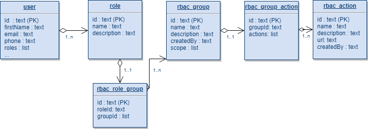
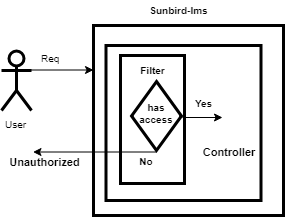

  **Problem statement:** 

 **                    ** As of now Sunbird api call is doing user authentication check but not authorization. Any authenticated user can preform any actions except private api call. Now we need to think to add RBAC into sunbird, so that 

all operation can be preform with right set of people.


 **Proposed solution 1: ** 

                               We can use Identity based policy: Identity-based IAM (Identity Access Management) policies are attached to an IAM user, group, or role. These policies let you specify what that user, group, or role can do. 

             It will work as follows:


*   **Define Action :**   Need to define set of actions that can be perform by single user or groups of users. In Sunbird context Action can be logical name of our api end point.
*   **Define Group : **  Need to define Sunbird user in some logical groups. It will be based on users action and permission.
*   **Add Action into Group : **    Need to add list of actions into a group , By doing that system will allow particular group to perform set of associated actions.
*   **Add Groups inside roles:  ** List of groups can be added for a particular role.
*  ** Add roles into user :  ** List of roles will be added inside user profile.

 **Example**  :  

                       

{                   

"Groups": \[{                            

"gid": "groupId",

"name": "name of the group",

"description": "group description",

 "scope": \["org","rootOrg"],

 "Actions": \[{

"id": "unique action id",

"name": "createUser",

"description": "logical description of action",

"url": "Api uri"

},

{

"id": "unique action id",

"name": "createUser",

"description": "logical description of action",

"url": "Api uri"

}                                

]                             

}]                  

}


 **Table Details**  :  


1.    rbac_ action table :

                     


| Attribute | Type | Description | 
|  --- |  --- |  --- | 
| id | string | PK | 
| name | string | logical name of action | 
| description | string | description of action | 
| url | string | uri for action | 


2.   rbac_group   


| Attribute | Type | Description | 
|  --- |  --- |  --- | 
| id | string | PK | 
| name | string | logical name of group | 
| description | string | description of group | 
| scope | list | within organisation or within rootOrg or \* | 


3.   rbac_group_action table

  


| Attribute | Type | Description | 
|  --- |  --- |  --- | 
| id | string | PK | 
| groupId | string | logical name of group | 
| actions | list | list of action ids | 


4.       role_group table 


| Attribute | Type | Description | 
|  --- |  --- |  --- | 
| id | stirng | PK | 
| groupId | list | ref of group_action | 
| roleId | string | ref of role  | 

 **ER diagram**  : 




 **How RBAC works in sunbird**  :  

                Request will be received by sunbird-lms service. Before calling to controller role base access will be check by filter , if caller having access to the resource then request will be transfer to controller else proper error message will be sent to caller. 

   




 **RBAC code structure ** : 

        We are planing to implement RBAC as separate micro service , which can run as separate service or can included as jar as well?

        This service will expose following api's


*  Crud operations on groups (Create group, update group, group action mapping)
*  Crud operations on action (Create action, update action)
*  Crud operation on role group 
* Verify Access 

  Method 


```actionscript3
Post
URL : /v1/verify/access
Request body : 
   {
    userId : string
    url : string
    userAuthToken : string 
   }

Response : 
     HTTP status code : 200, 401 
```


 **Resource categories ** :

  In sunbird we can divide resource in following three bucket.

  


| Public | All the resources that can access publicly, Using api access key | 
|  --- |  --- | 
|  **Protected**  |  **All protected resource access required api access key as well as x-authenticated-user-token of any valid user **  | 
|  **Private**  |  **All private resource access required api access key as well as x-authenticated-user-token of caller **  | 


*****

[[category.storage-team]] 
[[category.confluence]] 
