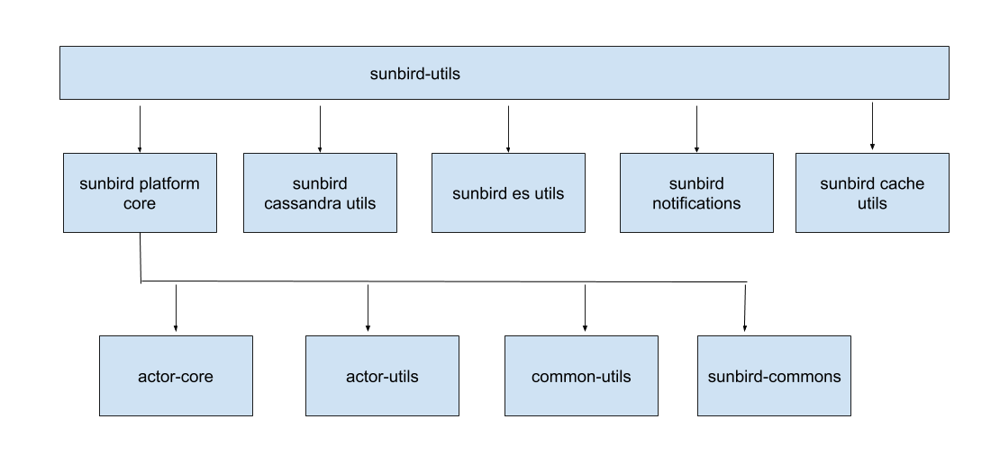

### Problem Statement
Till release 2.0.0, LMS service was used for all the flows i.e. user, org, course batch, toc etc. There is a need to separate the LMS service to be used for flows related to course, batch, pages, toc etc.

[SB-12310 System JIRA](https:///browse/SB-12310)

Solution Approach

To achieve the separation below are the major steps needs to be taken

* Restructuring of sunbird-utils
* sunbird-utils in maven central repo (or private repo)
* Cleaning of lms service to hold routes and flows related to lms only.
* Removal of gitmodules strategy as it is tightly coupled (service → mw → utils)
* Code refactoring and restructuring in sunbird-lms-mw

Restructuring of sunbird-utilssunbird-utils needs to hold specific core components which is leveraged by other services. For that purpose sunbird-utils is restructured as below. some of the components are renamed to specify it's purpose.

New structure is as below

Brief description of each module

| module | description | 
|  --- |  --- | 
| sunbird-platform-core | It's an aggregating module which segregate platform related component  | 
| sunbird-cassandra-utils | holds all cassandra related utilities | 
| sunbird-es-utils | contains all es related utilities | 
| sunbird-notifications | holds the util for sending notifications (sms) | 
| sunbird-cache-utils | utils related to caching either in memory or redis | 
| actor-core | all the classes related to actor and router | 
| actor-utils | all the utils related to actor | 
| common-utils | common utility which is being used by other modules. | 
| sunbird-commons | generates a fat jar combining actor-core, actor-utils and common-utils | 

*****

[[category.storage-team]] 
[[category.confluence]] 
