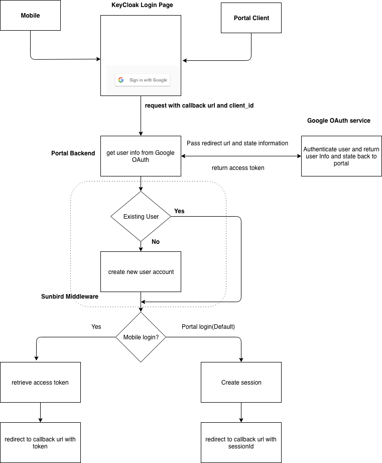

## Overview: 
Currently user can access Sunbird either by using account created by admin or user should register manual by entering basic information and then verifying their Mobile No/Email Id. This is tedious and time consuming process. Registering user, verifying mailed and subsequently allowing user to log in to system can be achieved in single step with google SignIn feature. 

## Problem statement: 
Google SignIn feature should solve below problems

* Should support both Mobile and portal.
* Should redirect to appropriate callback url after successful Sign In.

### Solution: 

In this approach google signIn buttons are integrated in Keycloak page. When user clicks signIn with google button state information are passed to portal, same are passed to google as well and they will be retrieved back from google after authentication. After successful google Authentication, If user mailed dosnt exist in sunbird system they are created. Based on the state information obtained from google callback user redirected to Portal/mobile. If the google authentication fails they will be redirected to error page. 

## Google Sign In url:
 **/google/auth** 

Mandatory Param expected
1. client_id(android/portal)
1. redirect_uri(/home, /learn etc)
1. error_callback
1. scope(openid/offline_access)
1. state(any value)
1. response_type(code)

### Scenarios:

1. Sign In from mobile, callback url and state are missing, after successful authentication redirect to /home. 
1. Sign In from portal, callback url and state are missing, after successful authentication redirect to /home.
1. Sign In from mobile, google Authentication fails, redirect back to error page. 
1. Sign In from portal, google Authentication fails, redirect back to error page. 
1. Sign In from mobile, after google Authentication, getting user information from google api fails. 
1. Sign In from portal, after google Authentication, getting user information from google api fails. 
1. Sign In from mobile, After successful google auth, checking user exist api fails, redirect to error page.
1. Sign In from portal, After successful google auth, checking user exist api fails, redirect to error page.
1. Sign In from mobile, After successful google auth, user doesnt exist, creating user fails. redirect to error page.
1. Sign In from portal, After successful google auth, user doesnt exist, creating user fails. redirect to error page.

*****

[[category.storage-team]] 
[[category.confluence]] 
