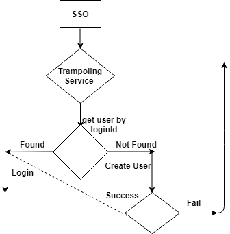

# Overview :
        Sunbird system is allowing user to login with following ways.

       1. General login :  In this approach user first need to register with sunbird then he/she can use their email/phone/username along with password to login.

       2. Google login : User can use their Google account to login in sunbird.

       3. State login : Some state can have their user portal and they want to use same account inside sunbird. In that case state need to integrate with sunbird. Once integration is completed their user can be directly logged in using SSO.[](http://SC-847)[ticket ref](https://project-sunbird.atlassian.net/browse/SC-847): 

As of now point 1 and 2 is completely done and point 3 is partially.  Some of the state is already using State SSO , to login their user.

Now based on new requirement there are some changes in new request body and state user identity.


## Changes in request :


| Existing request | New request | 
|  --- |  --- | 
| channel | State ID | 
| userName | External User ID | 
| firstName | External school (org) ID | 
| lastName | Name | 
| phone | Roles | 
| email | phone/email | 


## Proposed solution 1:
  New JWT token will have separate endpoint see the design and description 


| Existing JWT | New JWT | 
|  --- |  --- | 
| { "jti": "261263cd-3a0e-4aee-8faf-6d9d9eb14bb1", "iss": "c4923f5285ff447cbf13805423a1e98a", "sub": "manzarul07+110332", "aud": "[https://staging.ntp.net.in](https://staging.ntp.net.in)", "iat": 1499405029, "exp": 1599405029, "name": "Harish kumar Gangula", "email": "t4harishkumar16@[test.com](http://test.com)", "email_verified": true, "phone_number": "8884930864", "phone_number_verified": true, "redirect_url": "[https://staging.ntp.net.in/profile](https://staging.ntp.net.in/profile)"  } | { "jti": "261263cd-3a0e-4aee-8faf-6d9d9eb14bb1", "iss": "<replace with id provided by at registration time>", "sub": "user_external_id", "aud": "<base_url>", "iat": 1498556656, "exp": 1498560256, "name": "Some User", "state_id": "state", "school_id": "pre_created_school_external_id", "redirect_uri": "<base_url>/resources"} | 


| Request key | Mapped  | 
|  --- |  --- | 
| State ID |  channel | 
| External User ID | externalId (identify of user within state system) | 
| External school (org) ID | org external id | 
| Name | FirstName | 
|  | externalIdProvider (Under which system it's unique. here it's state, so provider will be channel) | 
|  | externalIdType (Type of externalId, example: PAN Card) | 


## Note: externalId , externalIdProvider ,externalIdType  either sent all three or none.

## Current SSO login work flow:


Here loginId is  **userName@channel**  value.


Since new structure won't have userName ,it has externalId column and now user need to be search using externalId.

Proposed Solution 1 For user search by externalId:  We already have get user by identity api. As of now this api is supported for  **email, phone and loginId . ** We can enhance this api to search user by

externalId as well.

In System we have externalId, channel, idType as combine unique key.

  **externalId+provider+idType  ** , So for user search we need to always pass all three combination.

URI: /user/v1/get/externalId/externalId+"#$""channel""#$"+"idType"

– Here we are using "#$" as delimiter.

– idType will be same as channel


| Pros | Cons | 
|  --- |  --- | 
| No new end point required | Existing api is do search based on single attribute, which is unique always, but in case of externalId , combination of three keys are unique, so caller need to pass all three identity with some delimiter.  | 


## Proposed Solution 2:
Instead of separating values using delimiter , we can use as follow:

URI: /user/v1/get/externalId/{externalIdValue}/externalIdProvider/{"channelValue"}/externalIdType/{"idTypeValue"}


| Pros | Cons | 
|  --- |  --- | 
| endpoint will clearly specify attribute and it's value | apart from externalId search , other search won't have those fields | 


## Proposed Solution 3:
As we have getuser by loginid post api , that api is working for loginId only, we can improve it to working for externalId search as well.


```js
{
 "request":
    {
     "loginId": "value of loginId"
   }
}
--- changes
{
 "request": {
       "loginId":"",
       "externalId":"",
       "provider":"",
       "idType":"" 
     }
}


```


| Pros | cons | 
|  --- |  --- | 
| Since we have to find user based on three attribute combination, so post api will provide clear view of requested data. | Caller need to maintain two end point for same purpose. | 
|  | it will have more maintenance cost.  | 


# Problem statement :
  Once user found using externalId or userName or phone , caller required it's KeyCloak userName to generate JWT token.


## Existing Solution:
 Once user found inside sunbird, system is making keycloak call to get userName stored inside keycloak and appending this userName, inside getUserByIdentifier response.

Caller is using same userName to generate JWT token. But problem with this approach is every time one extra call need to be made to keycloak and during heavy load time it might be single point of failure.

TO Over come with this we can do below apprach:


## Approach 1:
    Sunbird will write an ETL job , to collect all userName from keycloak , and then update this userName inside loginId field of user table.  Once this migration completed system will use this loginId and add this key as userName in getUserByIdentifier response. 


## Approach 2:
  Once user found in getUserByIdentifier api, system will check loginId attribute , if this value is not null or empty then decrypt it and provide inside userName. Otherwise make call to keycloak and update return userName inside cassandra as well, so that next time we don't need to make keycloak call.


## Create user :

```js
{
"request": 
   {
      "firstName": "firstName+ lastname",
      "email/phone": "emailOrPhone",
      "channel": "channelValue",
      "orgExternalId":"orgexternalId",
      "externalIds":[
         {
           "id":"externalId",
           "provider":"id Provider",
           "idType" : "id provider type"
          }
        ]  
   }
 }
```


 Once user is created using SSO , caller can make another api call to assign roles.

URI: /user/v1/role/assign


```js
{
  "request": {
    "userId": "",
    "organisationId": "",
    "roles": [
      "CONTENTCREATOR",
      "CONTENTREVIEWER",
      "CONTENTCURATION",
      "FLAGREVIEWER"
    ]
  }
}
```


Mobile/Portal design for SSO: [[Allow users to login with State Id(Portal/Mobile)|Allow-users-to-login-with-State-Id(Portal-Mobile)]]

As in SSO workflow , caller is checking if user phone is not associated with profile then ask user to complete phone number verification and then do profile update. It means during getUserByIdentity they need maskPhone as well.

After having design discussion following changes required:

 1. To identify user by externalId , caller will user below endpoint:

       user/v1/private/read/externalId?provider=providervalue?&idType=idTyeValue

    \*  This api will not be expose outside and it won't required any token.

    \*  This api will return mask phone and mask email as well.

 2.  Mark all Old SSO user phone as phone verified.

 3. IdType is mandatory as of now.

 4. later phone and email both need to be moved under user externalId table, so that any search via user externalId will be happen with this table only. (not in release-1.14 sprint 1)

5. Write an ETL job that will connect with postgresql , take all userId and update those userId inside cassandra under user→loginId filed as encrypted.


   


   


*****

[[category.storage-team]] 
[[category.confluence]] 
