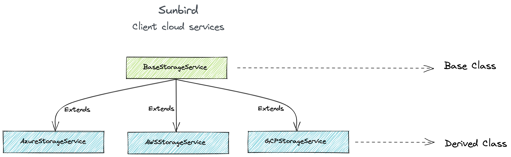

  * [Context](#context)
  * [Installation](#installation)
  * [Usage](#usage)
    * [Options](#options)
  * [Example](#example)
  * [License](#license)

## Context
Sunbird client cloud service is multi-cloud npm toolkit that provides access across cloud services while giving you full control to use cloud-specific features. Plugin allows users to provision their infrastructure in any cloud provider ( _Currently Supported for Azure, AWS and GCP_ ).

 **Repository**  : [https://github.com/Sunbird-Ed/client-cloud-services](https://github.com/Sunbird-Ed/client-cloud-services)

 **Branch**  : main

 **npm package**  : [https://www.npmjs.com/package/client-cloud-services](https://www.npmjs.com/package/client-cloud-services)

 **npm package version :** 2.0.4 -  _Latest as on 04-Jan-2023_ 


## Installation

```js
npm install --save client-cloud-services
```

## Usage

```
const cloudService  = require('client-cloud-services');

const config = {
  identity: CLOUD_IDENTITY,
  credential: CLOUD_IDENTITY_KEY,
  labelContainer: LABEL_CONTAINER_NAME
};

let client = cloudService.init(CLOUD_PROVIDER);
let storage = new client(config);

storage.SERVICE_NAME()...

```

### Options

1. Configuration for respective Cloud Providers


|  **Generalised keys**  |  **Azure**  |  **AWS**  |  **GCP**  | 
|  --- |  --- |  --- |  --- | 
|     provider      |            azure            |            aws            |            gcloud            | 
|     identity      |      Azure Account Name       |       AWS Access Key        |        GCP Client Email        | 
|    credential     |       Azure Account Key       |       AWS Secret Key        |        GCP Private Key         | 
|      region       |              --               |         AWS Region          |               --               | 
|     projectId     |              --               |             --              |         GCP Project ID         | 
|   containerName   |              --               |       AWS Bucket Name       |        GCP Bucket Name         | 
| reportsContainer  | Azure Reports Container Name  | AWS Reports Container Name  | GCloud Reports Container Name  | 
|  labelsContainer  |  Azure Labels Container Name  |  AWS Labels Container Name  |  GCloud Labels Container Name  | 


## Example

```js
// import SDK
const cloudService  = require('client-cloud-services');

// declare configuration object
const config = {
  identity: CLOUD_IDENTITY,
  credential: CLOUD_CREDENTIAL
};

// initialise required SDK
let client = cloudService.init('azure');
const storage = new client(config);

// requesting upload service

storage.upload(BLOB_NAME, BLOB_UPLOAD_PATH + '/' + FILENAME, FILEPATH, {}, (err, result, response) => {
  if (err) {
    console.error('❌ upload :: Error uploading file [ ' + FILEPATH + ' ]. Error => ' + err);
  } else if (result) {
    console.log({ msg: '📁 upload :: File [ ' + FILEPATH + ' ] uploaded successfully' });
  }
});

```


Adding support for New Service Provider
* Sunbird Client Cloud Service(s) are implemented based on interface BaseStorageService


* Onboarding new service provider must implement all the services (or) methods defined in BaseStorageService


## License
This project is licensed under the MIT License. See LICENSE for more information.


*****

[[category.storage-team]] 
[[category.confluence]] 
