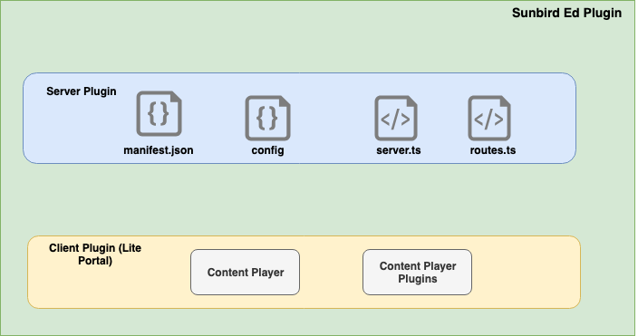

 **Component View** 



 **Folder Structure** <To be done>

 **Database Schema**  **Content** 
```js
{
	document: {
    	"_id": "string", // content id
    	"previewUrl": "string",
    	"keywords": "string[]",
    	"subject": "string",
	    "channel": "string",
    	"downloadUrl": "string",
        ... // Complete content metadata
	},
	index: ["contentType", "board", "gradeLevel", "subject", "class", "keywords"]
	}

```
View Example


```js
{ "name": "content", 
  "view": { "name_description": 
      { "map": function(doc) { emit([doc.name, doc.description], doc._id); } } 
    }
 }
```
 **Configuration** 
```text
API_BASE_URL=https://sunbird.org/api
CHANNEL=sunbird
TELEMETRY_SYNC_INTERVAL_IN_SECS=30
APP_ID=prod.sunbirded-plugin.desktop
```
 **Data Setup** 


```js
onInit(){

// First we will register with the container
Container.Global.register();
// Then we will register with the SDK's 
Container.Global.TelemetrySDK.register();
Container.Global.FileSDK.register();
Container.Global.HTTPSDK.register();
Container.Global.DBSDK.register();


databaseSetup =  function() {

// create new databases

	this.dbSDKInstance.create();

// create/update views 

	this.dbSDKInstance.insert();
	this.dbSDKInstance.update();

// create/update indexes

	this.dbSDKInstance.createIndex();
	this.dbSDKInstance.updateIndex();
	
};

insertStaticData = function(){
	// upsert organizations
	// upsert frameworks
	// upsert forms
	// upsert pages
	// upsert resource bundles
}


}
```


```
<plugin-dir>
	/data/
	|----/organizations.json // Organization data which contains channel information as well
	|----/frameworks.json // Framework configuration
	|----/resourceBundles.json // Resource bundles
	|----/forms.json // Pre-loaded forms. However forms can be configured as well
	|----/pages.json // Page configurations. This can be configured via API's.
```
Assumptions:


1. Versioning is not required
1. Updates to the static data for the first version is done via app updates. Over the air updates can be designed in phase 2.

 **Import/Export** 
```js
// The method gets the ecar as buffer and stores in /ecars folder
import = function(File file){};

export = function(Object config) : File {};

ExportConfig = {
	fileName: String, // Name of the file to be created
	contents: [{
		type: String, // Type of the content. One of Content/Telemetry/Log/Profile
		identifier?: [String] // id's of the type to be exported. For ex: list of content ids, profile, telemetry packet id etc. If left blank all data is exported
	}]
}
```
 **Package Specification** Packaging schema is only defined for content which is "ecar". There is no export packaging specification defined for any other type of data. Hence we are proposing to define a new package format that is interoperable with any type of application.


```
.ar package specification

exported_file.ar
	/manifest.json // The manifest of the exported archive
	/<files> // Any number of files that are exported. Should be a zip file or flat file


Manifest = {
	name: String, // file name
	dtCreated: Date, // Date when the file is created
	source: String, // Source did from where the file is exported
	size: Number, // size of the package
	files: Number, // Total number of exported files
	contents: [{
		file: String, // relative path to file name
		type: String, // Type of the file. Content/Telemetry/Log/Profile
		mimeType: String, // gzip, txt
		contentType: String, // ecar, json
	}]
}
```


*****

[[category.storage-team]] 
[[category.confluence]] 
