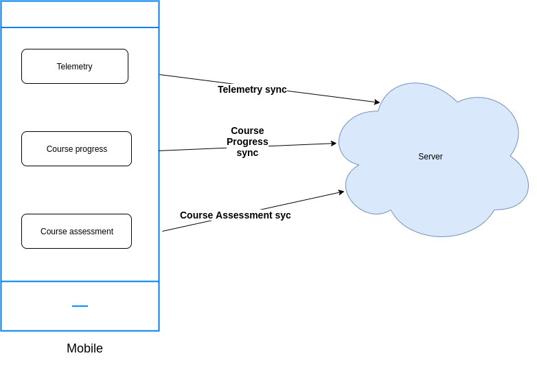
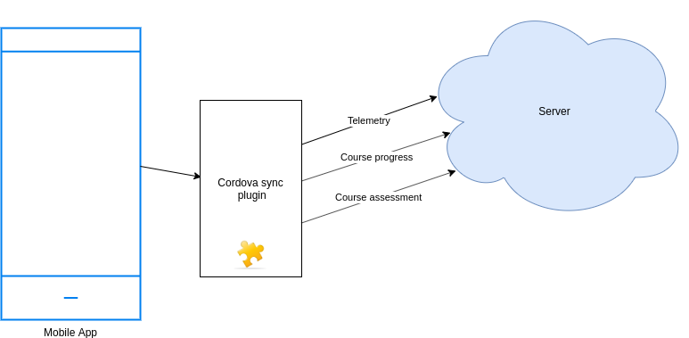
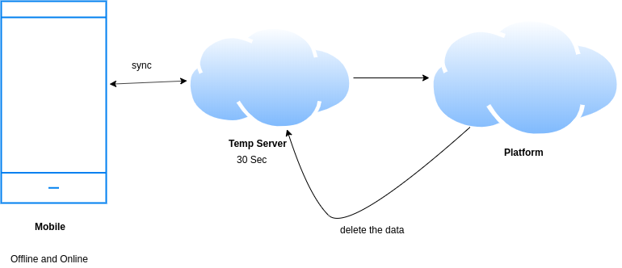
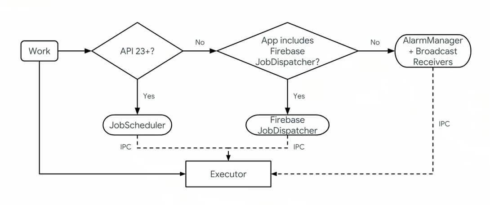

Problem StatementIn the existing app, there are several sync processes running independently, for instance.


1. All these sync events works on single thread which decreases the current app’s performance.


1. Telemetry , course progress and course assessment has seperate implementaion in different parts of the app.


 **Previous Implementaion of telemetry sync flow.**  **Proposed Solution for the problem** 

Create a custom Cordova plugin which will isolate all sync processes and use a separate DB instance for persistence. This will be natively handled, as a result, the app performance will increase and loosely coupled.


## Sync Db with CouchBase Mobile (Prefered)
A full-featured embedded NoSQL database that runs locally on mobile devices which will store the data and sync it to the temporary server, and from temporary server will sync to Platform after that it removes it and so .


# Pros: 

* Installation process is easy 


* fast data access 


# Solution 2:  Create a custom Cordova plugin to handle Background task.
 **WorkManager :** Work Manager library does everything for you. It creates the database of your Request and Runs them accordingly.

 **Architecture:**  there is no need to handle the OS Version checks  **i-e**  if OS version is greater then  **14**  and lower than  **21**  then use the Job Scheduler Or Service Or Alarm Manager or if OS version is greater than  **22**  then go for Firebase Job Dispatcher or may you have many other ways like  **Alarm Manager + Broadcast Receiver**  to handle your background work but all of them have pros and cons

Some of the other key features of WorkManager include:


* Persist scheduled work across app updates and device restarts


* Schedule one-off or periodic tasks


* Monitor and manage tasks


* Chain tasks together


Workmanager handles all the conditions of Android OS versions itself and it runs on every device .


* Uses JobScheduler for API 23+


* For API 14–22


* If using Firebase JobDispatcher in the app and the optional Firebase dependency, uses Firebase JobDispatcher


* Otherwise, uses a custom AlarmManager + BroadcastReceiver implementation


# Cons : 

* Consider using Foreground Service. Its also not a great idea to use them for parsing data and contents of view.


# Plugin Method Defination


 **Plugin method init()** 


```js
init: function(configurations: SyncConfiguration[], success, error) {
    exec(success, error, PLUGIN_NAME, "init", [configurations])
}
```


```typescript
export interface SyncConfiguration {
  type: SyncType;
  api: {
    method: "POST" | "PUT" | "PATCH";
    host: string;
    path: string;
    params: string;
  },
  autoSync: {
    frequency: number;
    threshold: number;
    bandwidth: number;
  } | undefined,
  shouldBatch: boolean
}

export enum SyncType {
    TELEMETRY = 'TELEMETRY',
    COURSE_PROGRESS = 'COURSE_PROGRESS',
    COURSE_ASSESSMENT = 'COURSE_ASSESSMENT'
}

```

## sync_config


|  **config**  | 
|  --- | 
|  **config**  | 
| TELEMETRY | 
```
{
  "api": {
    "method": "post",
    "host": "sample_host",
    "path": "sample_path",
    "params": "sample_params"
  },
  "autoSync": {
    "frequency": 2,
    "threshold": 200,
    "bandwidth": 200
  },
  "shouldBatch": true
}
```
 | 
| COURSE_PROGRESS | 
```json
{
  "api": {
    "method": "patch",
    "host": "sample_host",
    "path": "sample_path",
    "params": "sample_params"
  },
  "shouldBatch": false
}
```
 | 
| COURSE_ASSESSMENT | 
```json
{
  "api": {
    "method": "patch",
    "host": "sample_host",
    "path": "sample_path",
    "params": "sample_params"
  },
  "shouldBatch": false
}
```
 | 


 **Course Progress event, Course Assessment event, Telemetry Event** will be stored inside a common table


|  **_id**  |  **type**  |  **key**  |  **data**  |  **timestamp**  |  **priority**  | 
|  --- |  --- |  --- |  --- |  --- |  --- | 
|  |  |  |  |  |  | 


 **type** : sync type(telemetry/progress/assesment)

 **key** : unique identifier

 **data** :  event data

 **timestamp** : time when stored

 **priority** : event priority


 **Plugin method save()** 
```
save: function (type, data, success, error) {
        exec(success, error, PLUGIN_NAME, "save", [type, data]);
}
```
It will take type: SyncType and data as a parameter which will store it into the common table with current timestamp and priority

 **TELEMETRY:** 


```
{"ver":"3.0","eid":"INTERACT","ets":1573470364698,"actor":{"type":"User","id":"44c1b4a0-7d87-48a6-977c-6bbf52b5547a"},"context":{"cdata":[],"env":"home","channel":"0126632859575746566","pdata":{"id":"staging.diksha.app","pid":"sunbird.app","ver":"2.5.local.0-debug"},"sid":"b53cd1a5-2cf3-454f-a256-42e00afde9cf","did":"13e9e8e7b514112b9501c279b124561693aad8eb","rollup":{"l1":"0126632859575746566"}},"edata":{"type":"OTHER","subtype":"hotcode-push-key-not-defined","id":"home","pageid":"home","extra":{"pos":[]}},"object":{"id":"","type":"","version":"","rollup":{}},"mid":"ceea76c7-8426-4445-9392-a747d9af6fd3"}	
```
 **COURSE_PROGRESS** :


```
{"id":"api.content.state.read","ver":"v1","ts":"2019-11-11 11:12:54:640+0000","params":{"resmsgid":null,"msgid":null,"err":null,"status":"success","errmsg":null},"responseCode":"OK","result":{"contentList":[{"lastAccessTime":"2019-07-15 09:46:04:448+0000","contentId":"do_212686738040504320192","completedCount":1,"batchId":"0127517178263224325","result":null,"score":null,"grade":null,"progress":100,"viewCount":35,"contentVersion":null,"courseId":"do_2127517138056724481636","lastCompletedTime":"2019-07-15 09:47:33:379+0000","status":2},{"lastAccessTime":"2019-08-05 11:51:30:971+0000","contentId":"do_2127319848127283201364","completedCount":1,"batchId":"0127517178263224325","result":null,"score":null,"grade":null,"progress":100,"viewCount":33,"contentVersion":null,"courseId":"do_2127517138056724481636","lastCompletedTime":"2019-08-05 11:51:30:971+0000","status":2},{"lastAccessTime":"2019-08-05 11:51:30:971+0000","contentId":"do_2127516435133644801619","completedCount":1,"batchId":"0127517178263224325","result":null,"score":null,"grade":null,"progress":100,"viewCount":33,"contentVersion":null,"courseId":"do_2127517138056724481636","lastCompletedTime":"2019-08-05 11:51:30:971+0000","status":2}]}}	
```
 **COURSE_ASSESSMENT** :


```
{"do_21285785558886809611575":[{"eid":"ASSESS","ets":1573471977913,"ver":"3.1","mid":"ASSESS:a2821b1315cf55e472146eb8d6aca423","actor":{"id":"44c1b4a0-7d87-48a6-977c-6bbf52b5547a","type":"User"},"context":{"channel":"0126632859575746566","pdata":{"id":"staging.diksha.app","ver":"2.5.local.0-debug","pid":"sunbird.app.contentplayer"},"env":"contentplayer","sid":"6684854f-2327-4237-9051-09b973c215f4","did":"13e9e8e7b514112b9501c279b124561693aad8eb","cdata":[{"id":"b08b596eed995cee55f33b016fcdcb8a","type":"AttemptId"},{"id":"offline","type":"PlayerLaunch"},{"id":"5dd8d0941877f2e584336af7ea4dbeaa","type":"ContentSession"}],"rollup":{"l1":"0126632859575746566"}},"object":{"id":"do_21285785558886809611575","type":"Content","ver":"1","rollup":{"l1":"do_2128630563500359681261","l2":"do_2128630590915870721263"}},"tags":[],"edata":{"item":{"id":"do_21285785489686528011574","maxscore":1,"type":"mcq","exlength":0,"params":[{"1":"{\"text\":\"Two\\n\"}"},{"2":"{\"text\":\"Three (correct)\\n\"}"},{"3":"{\"text\":\"Four \\n\"}"},{"4":"{\"text\":\"One \\n\"}"},{"answer":"{\"correct\":[\"2\"]}"}],"uri":"","title":"DND please","mmc":[],"mc":[],"desc":"By kiruba"},"index":2,"pass":"Yes","score":1,"resvalues":[{"2":"{\"text\":\"Three (correct)\\n\"}"}],"duration":3}}]}
```


 **processed_sync_data table** 

|  **_id**  |  **msg_id**  |  **type**  |  **processed_data**  |  **event_count**  |  **priority**  | 
|  --- |  --- |  --- |  --- |  --- |  --- | 
|  |  |  |  |  |  | 


 **msg_id** : unique msg_id

 **type** : sync type(telemetry/progress/assesment)

 **processed_data** : gzipped data

 **event count** : number of events processed

 **priority** :  event priority


All the sync processes marked shouldBatch=true will be processed, then gzipped and stored in this table and entries get removed from the table after a successful sync.

 **Plugin method sync()** 
```
sync: function(type: SyncType, success, error) {
    exec(success, error, PLUGIN_NAME, "sync", [type]);
}
```
Invokes the sync API for the passed ‘type’. In the case of the type defined by autoSync configuration, this is automated within the plugin as defined by the configuration parameters. Additionally invoking sync() method will sync unconditionally regardless of autoSync parameters.


*****

[[category.storage-team]] 
[[category.confluence]] 
