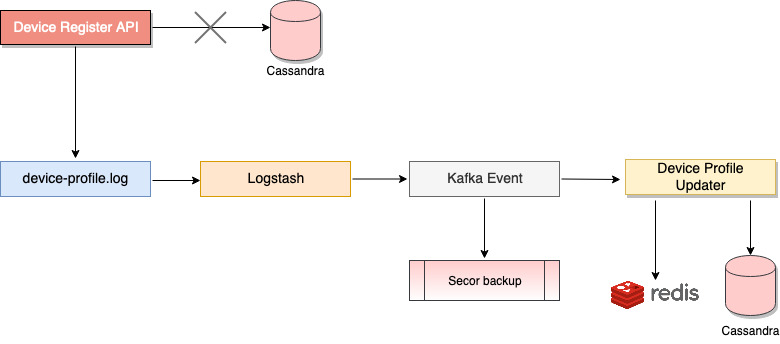

 **Overview:** 
* The current cache time for a device profile entry in Redis is 24 hours, which is updated by the Samza job by reading from the device profile Cassandra DB and adding the device details to telemetry.
* The same value is read from Redis instead of the updated value in Cassandra.
* If any changes in the device location take place, they do not reflect in the Redis cache until 24 hours, even though the Cassandra has the updated value.

 **Problem Statement:** Changes to the device profile need to be a push mechanism from the Device Register API call instead of a pull mechanism after 24 hours. A Kafka event needs to be generated and a new Samza job needs to be created to update the cache entry with relevant details.

 **Design Flow:** 




 **Solution:** The Device Register API writes the device profile changes to the Cassandra currently. Instead, the DeviceProfileUpdater Samza job will now write the data to Redis as well as Cassandra by reading it from the Kafka topic.

 **Steps:** 
* The DeviceRegister Service writes the device profile details into a device-profile.log file.


```text
{
	"device_id": "232455",
	"uaspec": {
		"agent": "Chrome",
		"system": "Linux",
		"ver": "68.0.3440.75",
		"raw": "Mozilla/5.0 (X11; Linux x86_64) AppleWebKit/537.36 (KHTML, like Gecko) Chrome/68.0.3440.75 Safari/537.36"
	},
	"city": "Bengaluru",
	"country_code": "IN",
  	"country": "India",
	"api_last_updated_on": 1566383863167,
	"device_spec": {
		"os": "Android 6.0",
		"make": "Motorola XT1706"
	},
	"district_custom": "",
	"fcm_token": "asda",
	"first_access": 1565328282703,
    "state_code_custom": "29",
	"state": "Karnataka",
	"state_code": "KA",
	"state_custom": "Karnataka",
	"producer_id": "dev.sunbird.portal"
}
```


* Logstash will be configured to read from the log file and push the data into Kafka as an event.
* A Secor process is run to take the device data from the Kafka topic and creates a backup.
* DeviceProfileUpdater Samza job reads the Kafka event and:

       a) If device_id exists in cache, updates the cache and the existing device profile Cassandra DB.

       b) If device_id doesn't exist in cache, creates new entry in cache as well as Cassandra.


*****

[[category.storage-team]] 
[[category.confluence]] 
