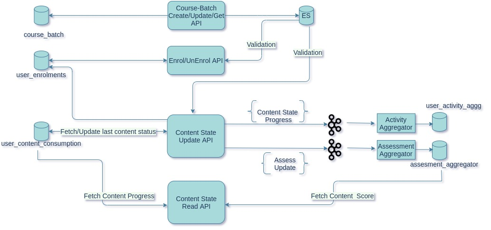

This Document explains:

* Issues with current course API implementations - duplicated metrics in multiple tables 

* Enhancements to all  course APIs-  creating new API from existing API, redesign the tables schema

 **Current Design:** Key Problems:

* Maintaining progress and assessment info for  content in multiple tables 

* Maintaining few metrics of content like completecount, viewcount in  both user_content_consumption and user_activity_agg table

* Removing the common metrics will increase performance of Content State API

* Content State Read API - Fetching progress and assessment score from different tables, user_activity_table for fetching both the progress/content state can decrease the cassandra reads

Proposed Design:

 **Solution 1:** Pros

* Few changes required 

Cons

* Multiple Cassandra Reads/Write in the same API , can lead to performance issue

Solution 2:

Pros

* Easy to maintain the progress and score info

Cons

* Required lot of changes

*****

[[category.storage-team]] 
[[category.confluence]] 
