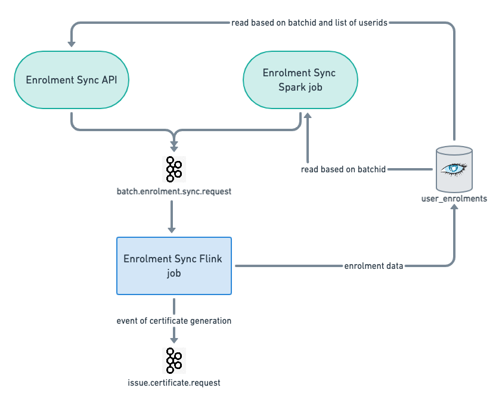

## Overview
This document provides API spec for sync API and event structure to be process by flink job to sync the progress of a given enrolment.


## Design
Below diagram depicts the design proposed for the enrolment sync process.



|  **Enrolment Sync API**  |  **Enrolment Sync - Spark job**  | 
|  --- |  --- | 
| Input: courseId, batchId, list of userIds | Input: courseId, batchId | 
| Behaviour:  Reads data from user_enrolments table based on courseId, batchId, list of userIds and generates enrolment sync events for given list of users | Behaviour:  Reads data from user_enrolments table based on courseId, batchId and generates enrolment sync events for all enrolled users | 
| Output: Enrolment sync event | Output: Enrolment sync event | 


## API spec
Below is the API spec for enrolment sync API, which reads data from content_consumption and pushes an event into kafka for further processing.

 **Request:** 

PATCH: /v1/content/state/update


```
{
    "request": {
        "userId": "userId" //mandatory
        "batchId": "batchId", //mandatory
        "courseId": "courseId", //mandatory
    }
}
```
 **Response:** 


```
OK 200 response:
{
    "id": "api.content.state.update",
    "ver": "v1",
    "ts": "2021-03-04 05:58:04:382+0000",
    "params": {
        "resmsgid": null,
        "msgid": "8e27cbf5-e299-43b0-bca7-8347f7e5abcf",
        "err": null,
        "status": "success",
        "errmsg": null
    },
    "responseCode": "OK",
    "result": {
        "response": "Success"
    }
}


400 Bad Request:
{
    "id": "api.content.state.update",
    "ver": "v1",
    "ts": "2021-03-04 05:58:04:382+0000",
    "params": {
        "resmsgid": null,
        "msgid": "8e27cbf5-e299-43b0-bca7-8347f7e5abcf",
        "err": CLIENT_ERROR,
        "status": "failed",
        "errmsg": No users enrolled
    },
    "responseCode": "CLIENT_ERROR",
    "result": {
        "response": "Could not find any enrollments for userId [''], batchId '' and courseId ''"
    }
}
```

## Sync Event
Below is the sync event pushed to kafka topic batch.enrolment.sync.request


```
{
    "eid": "BE_JOB_REQUEST",
    "ets": 1614838059898,
    "mid": "LP.1614838059898.c7ba0267-d1fe-4443-a819-b0e8c06a44c2",
    "actor":
    {
        "type": "System",
        "id": "Course Batch Updater"
    },
    "context":
    {
        "pdata":
        {
            "ver": "1.0",
            "id": "org.sunbird.platform"
        }
    },
    "object":
    {
        "type": "CourseBatchEnrolment",
        "id": "batchId_userId"
    },
    "edata":
    {
        "action": "user-enrolment-sync",
        "iteration": 1,
        "batchId": "batch_id",
        "userId": "user_id",
        "courseId": "course_id"
    }
}
```


*****

[[category.storage-team]] 
[[category.confluence]] 
