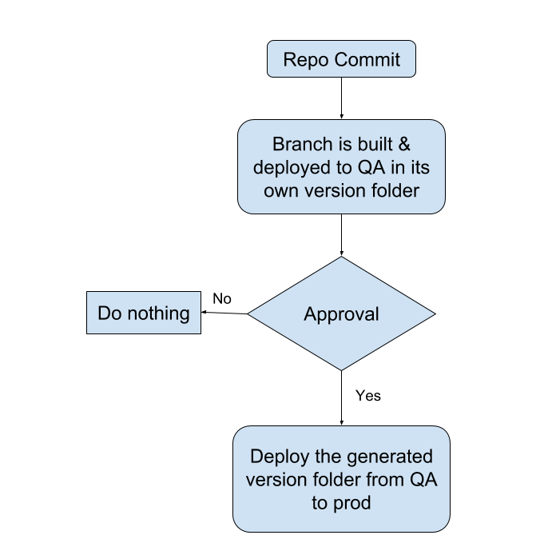

* Whenever there is any commit on any of the version branch, this build will be triggered.
* that particular branch will be built and it will be deployed to its own folder on qa
* After deploying to qa it will hold for approval, if approved it will deploy to prod.
* Site generation process
    * Pull modified version branch
    * pull theme code
    * merge code as per the Jekyll
    * generate html

    

###  Flowchart

Related Jira Issues - [SB-5498 System JIRA](https:///browse/SB-5498)

*****

[[category.storage-team]] 
[[category.confluence]] 
