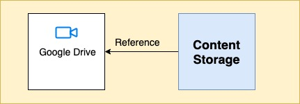
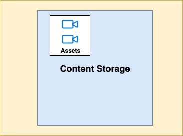

 **Introduction:** This wiki explains how to use public & external videos(Google Drive, Youtube & local etc.,) in ECML content.

 **Background:** 

Currently, the creator can add a video into an ECML content by adding a Youtube URL/Google Drive URL.

If the Youtube or Google Drive video is taken down/ removed, the video content becomes unavailable. There is no way to restrict that from happening, though it continues to work on the mobile app as it was packaged inside ECAR for offline use.

Both Youtube and Google Drive videos become a drawback to access the content offline on the web. 

 **Problem Statement:** 
1. If public & external video(Google Drive, Youtube & local etc.,) removed from the source it is getting removed from the content as well. (ECML content is still referring the external source so it is not playable).


1. Support to add local videos to ECML.


 **Key Design Problems:** 
* Create a video as an asset


* Create a streaming URL for videos


* Google drive videos asset creation


* Backward compatibility


* Migration


##  **Design** :

## Create a video as an asset: 
To add an image into ECML content we should create an asset of type image (image asset). All the image assets are part of the Sunbird Blob Storage so, they are always available and the Editor enables the creators to reuse existing images.

Similarly, if we should create any public video (local, youtube, google-drive etc,.) as an asset of type video (video asset) and enable the creator to browse and add it to ECML content. With this, all the videos will be available in the Sunbird Blob Storage

Below is the change in ECML to support video as an asset and streamingUrl.


1. Added  **asset**  attribute in the org.ekstep.video tag


1. Video renderer will play video based on the media tag’s attribute src/streamingUrl


 **ECML:** 


```
<stage>
  <manifest>
      <media assetId="do_31244094803238912023058"/>
  </manifest>
  <org.ekstep.video asset="do_31244094803238912023058" y="7.9" x="10.97" w="78.4" h="79.51" rotate="0" z-index="0" id="b2600e00-0395-4d63-a3a1-3957db2dec12">
      <config>
        <![CDATA[{"autoplay":true,"controls":true,"muted":false,"visible":true,"url":"/assets/public/content/do_31244094803238912023058/artifact/testvideo.mp4"}]] >
      </config>
  </org.ekstep.video>  
</stage>

<manifest>
    <media id="do_31244094803238912023058" src="/assets/public/content/do_31244094803238912023058/artifact/testvideo.mp4" streamingUrl="" type="video"/>
</manifest>
```


## Google drive videos asset creation: 
At the time of adding Google drive videos using URL, the platform will download and create an asset for the same in the background. Because the user will give metadata like name, language etc., while adding itself. 


## Create a streaming URL for videos: 
 **Option 1** : Allow the creator to add videos to the content only videos that are having streamingUrl.

 **Option 2** : ECML content streamingUrl generation as an async job.

The platform uses an async job to generate and set streamingUrl for Resource type content which has video as actual data (mimeType: video/\*). Likewise, have an async job to set the streamingUrl for ECML content.


## Backward compatibility: 
If the asset attribute is not present in the video tag, we will look for CDATA's URL attribute. 

If the asset attribute is present we will load it from media tag with the corresponding assetId.


## Migration: 
We need to identify all ECML content which is having Google drive / Youtube URL and Will create assets for those videos and update ECML.


*****

[[category.storage-team]] 
[[category.confluence]] 
