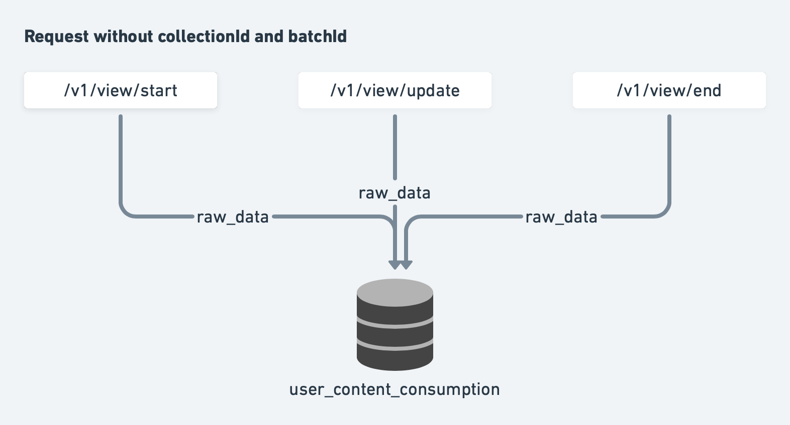

 **Introduction** This wiki explains the current design and implementation of progress and score monitoring of content and collections, the challenges we have at scale and the proposed design to handle them.

 **Background & Problem Statement** The sunbird platform supports monitoring of collection progress and score computation. It uses the below APIs to capture the content progress data, generates progress and score metrics and provide the summary.


1.  **Content State Update API**  - To capture content progress and submit assessment.


1.  **Content State Read API**  - To read the individual content consumption and assessment attempts status.


1.  **Enrolment List API**  - To access all the enrolment metrics of a given user.


The content state update API capture the content progress and assessment data. It generate events for score and overall progress computation by activity-aggregator and assessment-aggregator jobs.

We have a single API (Content State Update) to capture all the progress information. So, it has a complex logic to identify the given input is for content progress or assessment submission and etc,.

At the end all the clients and report jobs need is the following map for every collection:


```js
content_status = {
  "<content_id>": <status>
}

For ex: content_status = {
  "do_1234": 2, // Completed
  "do_1235": 2, // Completed
  "do_1236": 2, // Completed
  "do_1237": 1, // In Progress
  "do_1238": 0  // Not started
}
```

### Key Design Problems:

1. Single API to capture all the progress and score data.


1. Read after write of consumption data and basic summary.


1. Data is written and fetched from multiple tables leading to consistency issues between API and Reporting Jobs


1. The low level tables (user_content_consumption & user_assessments) grow at an exponential rate when we start to monitor everything


1. Archiving old data is not possible as the API’s read data from low level tables


 **Design** To be able to handle the above design problems, we have analyzed how similar products (like netflix) monitor everything what a user does (or views) and that too at scale. Based on the analysis we have broken down the APIs into more granular APIs with a single DB update so that each API can be scaled independently. In addition we have designed the APIs as a general purpose service (similar to asset service/graph engine) on which various use-cases can be mapped.

Following are few of the Cassandra scale issues for various approaches:


1.  **Use a Map datatype**  - We could have used a map datatype and updated the content status via API. But this would result in multiple SSTables (per addition) and tombstones (update & deletes). As the API is the most used api and the table would have billions in records, this would result in reads getting slowed down drastically and entire cluster slowed down. We would have been forced to do compaction at regular intervals


1.  **Use a frozen map datatype**  - With a frozen map datatype we would have a way around multiple SSTables lookup and tombstones but the API would not be able to append/add to the map. It needs to always replace the map. This would fail if there are two concurrency write requests for a user (can happen if the data is stored offline and synced to server) and only one write would have succeeded.


We have worked around Cassandra scaling issues (read from more than 2 SSTables and tombstones) and read after write scenario by having a high performance cache at the center. With this approach:


1. The update APIs can update the content status in the low level table and update the content status map in redis (using hmset). Concurrent requests would not be a problem


1. The read API can read the content status directly from redis. Meanwhile the content_status is updated in a frozen map datatype field via the activity aggregator job.


1. The job serializes by user requests and reads the status from low level table before computing the overall content_status. This would ensure consistency between API and reporting


### Content Consumption APIs
.png)
### Assessment Consumption APIs

### Viewer Service
Viewing Service  **collects**  the “content view updates” and generate events to  **process**  and  **provide**  summary to the users. 

When a user starts viewing a content, a view entry created. There are three stages when a user view the content. They are  **start** ,  **progress**  and  **end** . Considering these three stages we have 3 API endpoints to capture this information for each stage.

An event will be generated when a content view ends. The summary computation jobs will read these event to process and compute the overall summary of the collection.

The computed summary will be available from API interface to download and view.


### Summary Computation Jobs - Flink:
The Flink jobs are used to read and compute the summary of a collection consumption progress when the user view ends. It also computes the score for the current view and best score using all the previous views.


* The event is just a trigger to initiate the computation of the collection progress.  **The job fetches the raw data from DB to compute the overall progress** .


* When an assessment type content (Ex: QuestionSet) view ends, it expects the ASSESS events data to assessment submit API for score metrics computation.


Once the view ends, the progress and score will be updated  **asynchronously** by the flink jobs.


## Viewer Service - Database Design

```
user_content_consumption (
    userid text,
    collectionid text, // currently labelled as courseid
    contextid text, // currently labelled as batchid
    contentid text,
    last_access_time timestamp,
    last_completed_time timestamp,
    last_updated_time timestamp,
    progressdetails json,
    status int,
    PRIMARY KEY (userid, collectionid, contextid, contentid)
)

assessment_aggregator (
    user_id text,
    collection_id text, // currently labelled as courseid
    context_id text, // currently labelled as contextid
    content_id text,
    attempt_id text,
    created_on timestamp,
    grand_total text,
    last_attempted_on timestamp,
    questions list<frozen<question>>,
    total_max_score double,
    total_score double,
    updated_on timestamp,
    PRIMARY KEY ((user_id, collection_id), context_id, content_id, attempt_id)
)

user_activity_agg (
    activity_type text,
    activity_id text,
    user_id text,
    context_id text,
    agg map<text, int>,
    content_status frozen<map<text,int>>,
    agg_last_updated map<text, timestamp>,
    PRIMARY KEY ((activity_type, activity_id, user_id), context_id)
)
```
The user can consume a content by searching it in our platform (organically) or via a collection when the user enrolled to a course.

With Viewer-Service, we will support progress monitoring at individual content level as well (i.e.: all types of content can be monitored for progress). Below details explain how the data will be stored for a content consumption in different scenarios.


The below table has various scenarios considering the current and future use cases. Here we defined the database read/write logic to support these use case and fetch the save or fetch the required data from user_content_consumption table.


|  |  **Scenario**  |  **API & DB details**  | 
|  --- |  --- |  --- | 
| 1 | User consuming individual content. | Write API Request
```json
{
  userid: "<userid>",
  contentid: "<contentid>"
}
```
Write DB Query
```sql
INSERT into ucc(userid, collectionid, contextid, contentid, status) 
values('<userid>','<contentid>','<contentid>','<contentid>','<status>')
```
Read API Request
```json
{
  userid: "<userid>",
  contentid: "<contentid>"
}
```
Read DB Query
```
from ucc where userid='<userid>' and collectionid='<contentid>' 
and contextid='<contentid>' and contentid='<contentid>'
```
 | 
| 2 | User consuming a content with in a collection. | Write API Request
```json
{
  userid: "<userid>",
  collectionid: "<collectionid>",
  contentid: "<contentid>"
}
```
Write DB Query
```sql
INSERT into ucc(userid, collectionid, contextid, contentid, status) 
values('<userid>','<collectionid>','<collectionid>','<contentid>','<status>')
```
Read API Request
```json
{
  userid: "<userid>",
  collection: "<collectionid>"
}
```
Read DB Query
```
from ucc where userid='<userid>' and collectionid='<collectionid>' 
and contextid='<collectionid>'
```
 | 
| 3 | User consuming a content with in a collection with a context (A batch, A program or a program batch) | Write API Request
```json
{
  userid: "<userid>",
  collectionid: "<collectionid>",
  contextid: "<contextid>", // batchId, programId, programBatchId
  contentid: "<contentid>"
}
```
Write DB Query
```sql
INSERT into ucc(userid, collectionid, contextid, contentid, status) 
values('<userid>','<collectionid>','<contextid>','<contentid>','<status>')
```
Read API Request
```json
{
  userid: "<userid>",
  collectionid: "<collectionid>",
  contextid: "<contextid>" // batchId, programId, programBatchId
}
```
Read DB Query
```
from ucc where userid='<userid>' and collectionid='<collectionid>' 
and contextid='<contextid>'
```
 | 


# Config Modes
While the viewer-service as an infra component provides flexibility to configure any progress monitoring use-case, there is a need for preconfigured “modes” enabled at an instance level to be able to make better use of the service and also to make any solution or usecase simpler to implement and understand.

Following are the modes one can configure the viewer service at an instance level


## Strict Context Mode
Any content or collection consumption is strictly monitored at the context it was consumed. This is the default mode setup currently in SunbirdEd

“ **class-1-maths** ” contains “ **single-digit-addition** ” and “ **double-digit-addition** ” as contents

 **Rahul**  completes content “ **single-digit-addition** ” as part of batch “ **batch-1** “ within the course “ **class-1-maths** ”

 **Rahul**  completes content “ **double-digit-addition** ” organically

Entry in DB


|  **user_id**  |  **collection_id**  |  **context_id**  |  **content_id**  |  **status**  | 
|  --- |  --- |  --- |  --- |  --- | 
| Rahul | class-1-maths | batch-1 | single-digit-addition | 2 | 
| Rahul | double-digit-addition | double-digit-addition | double-digit-addition | 2 | 

API responses for various other actions done by the user:


|  **Action**  |  **Progress in Context**  | 
|  --- |  --- | 
| Rahul opens the “single-digit-addition” content after going into the course “class-1-maths” when batch-1 is active | Complete | 
| Rahul opens the “single-digit-addition” content after searching for it | Not Started | 
| batch-1 has expired and Rahul has rejoined batch-2 and opened the content “single-digit-addition” | Not Started | 
| Inverse: Rahul completes the “single-digit-addition” content after searching for it organically. Later, Rahul opens the same content via the ToC of the course “class-1-maths“ | Not Started | 
| Rahul opens the “double-digit-addition” content after going into the course “class-1-maths” when batch-1 is active | Not Started | 
| Rahul opens the “double-digit-addition” content after searching for it | Complete | 

 **Pros** 


1. Simpler logic to implement within clients as they do know the context in which the user is opening the content


1. No extra actions or need for complex business rules either or client or server


 **Cons** 


1. There might be cases where a program is launched with a course which the user is already part of or completed. The user needs to redo the entire course again (consumption outside of Context will not be considered towards the specific Context)


1. User experience will be complex if the user sees two courses (one within a program and another outside of the program). The user might complete the course assuming it is part of program and would probably realise that he hasn’t taken it in the context of the program


1. There would be multiple steps required by user to reach a content within the context of a program. Will make the discovery and browsing experience complex. (may not always be possible to ensure that users ‘discover’ relevant content in the context they are supposed to)


## No Context Mode
Any content or collection consumption is monitored at its level only and is carry forwarded into any context. This is the expected mode of SunbirdCB. In this mode there are two sub-modes as well:


### Content Mode
In this mode we monitor everything at a content level only. The collectionid and contextid would be irrelevant.

 **Rahul**  completes content “ **single-digit-addition** ” as part of batch “ **batch-1** “ within the course “ **class-1-maths** ”

Entry in DB


|  **user_id**  |  **collection_id**  |  **context_id**  |  **content_id**  |  **status**  | 
|  --- |  --- |  --- |  --- |  --- | 
| Rahul | single-digit-addition | single-digit-addition | single-digit-addition | 2 | 

API responses for various other actions done by the user:


|  **Action**  |  **Progress**  | 
|  --- |  --- | 
| Rahul opens the “single-digit-addition” content after going into the course “class-1-maths” when batch-1 is active | Complete | 
| Rahul opens the “single-digit-addition” content after searching for it | Complete | 
| batch-1 has expired and Rahul has rejoined batch-2 and opened the content “single-digit-addition” | Complete | 
| Rahul has joined a collection “class-2-maths” which contains the “single-digit-addition” content and opens the content | Complete | 

 **Pros** 


1. Simplicity. No extra actions or need for complex business rules either or client or server


1. Straight-forward simple user experience


 **Cons** 


1. Once a content has been complete it is complete irrespective of the time period or context


1. If a collection wants to force all users to retake the content, it would mean that one has to clone the content. This would duplicate the assets on the platform


1. If a content is modified it is still shown to user as complete. This may not have any meaning


1. If a user joins a collection, there might already be some progress indicated


### Collection Mode
In this mode we monitor everything at a collection level only. The contextid would be irrelevant.

 **Rahul**  completes content “ **single-digit-addition** ” as part of batch “ **batch-1** “ within the course “ **class-1-maths** ”

Entry in DB


|  **user_id**  |  **collection_id**  |  **context_id**  |  **content_id**  |  **status**  | 
|  --- |  --- |  --- |  --- |  --- | 
| Rahul | class-1-maths | class-1-maths | single-digit-addition | 2 | 

API responses for various other actions done by the user:


|  **Action**  |  **Progress**  | 
|  --- |  --- | 
| Rahul opens the “single-digit-addition” content after going into the course “class-1-maths” when batch-1 is active | Complete | 
| Rahul opens the “single-digit-addition” content after searching for it | Not Started | 
| batch-1 has expired and Rahul has rejoined batch-2 and opened the content “single-digit-addition” | Complete | 
| Rahul has joined a collection “class-2-maths” which contains the “single-digit-addition” content and opens the content | Not Started | 
| Rahul has joined a program “program-abc“ which contains “class-1-maths” as one of the collection. He opens the “single-digit-addition” content within this context | Complete | 

 **Pros** 


1. Simplicity. No extra actions or need for complex business rules either or client or server


1. Straight-forward simple user experience


 **Cons** 


1. Once a collection (course) has been complete it is complete irrespective of the time period or context


1. If a programs wants to force all users to retake the collection, it would mean that one has to clone the collection. This would duplicate the assets on the platform


1. If a collection is modified (a new assessment added) it is still shown to user as complete. This may not have any meaning


1. If a user joins a program or creates a playlist, there might already be some progress indicated


## Carry Forward Mode
While the instance can be configured in strict context mode, there will be multiple other modes that might be needed to overlay on top of the strict context mode to be able to solve business/program use-cases like:

Carry forward or account progress of a content or collection under certain conditions only. For ex: 


1. Within a program carry forward the progress of a collection if the user has completed the collection in last 3 months


1. Within a program carry forward the progress of a collection if the user is undergoing the course within the program start and end date


1. Within a collection always account for the progress irrespective of time period


Carry forward can be done via two possible modes - Copy & Move. 


### Copy  Mode
In this mode, any content or collection that is monitored, is copied over into context based on the business rules configured.

Let’s assume the following business rule:

An user content progress is copied into a course or a program if the user has completed the content in the last 3 months or within the program/course duration


### Copy Content Mode
 **Rahul**  completes content “ **single-digit-addition** ”.  

“ **single-digit-addition** ” is added as part of course “ **class-1-maths** ”. 

 **Rahul**  joins the batch-1 of course “ **class-1-maths** ”. 

 **Rahul**  also completes “ **double-digit-addition** ” as part of “ **class-1-maths** “. 

 **Rahul** hasn’t started “ **triple-digit-addition** “ as part of the course.

Entry in DB


|  **user_id**  |  **collection_id**  |  **context_id**  |  **content_id**  |  **status**  | 
|  --- |  --- |  --- |  --- |  --- | 
| Rahul | single-digit-addition | single-digit-addition | single-digit-addition | 2 | 
| Rahul | class-1-maths | batch-1 | single-digit-addition | 2 (copied) | 
| Rahul | class-1-maths | batch-1 | double-digit-addition | 2 | 
| Rahul | class-1-maths | batch-1 | triple-digit-addition | 0 | 

API responses for various other actions done by the user:


|  **Action**  |  **Progress**  | 
|  --- |  --- | 
| Rahul opens the “single-digit-addition” content after going into the course “class-1-maths” when batch-1 is active | Complete | 
| Rahul opens the “single-digit-addition” content after searching for it | Complete | 
| batch-1 has expired and Rahul has rejoined batch-2 after 1 month and opened the content “single-digit-addition” | Complete | 
| batch-1 has expired and Rahul has rejoined batch-2 after 3 months and opened the content “single-digit-addition” | Not Started | 
| Rahul opens the “double-digit-addition” content after searching for it | Not Started | 
| Rahul completes “triple-digit-addition” organically. And opens the content as part of course “class-1-maths” | Complete | 

 **Pros** 


1. Opens up many complex use-cases


1. UX can be made simpler. A content or collection can be shown only once


 **Cons** 


1. The complexity on the server side explodes exponentially. There needs to be multiple asynchronous jobs like: 


    1. Copy the progress after evaluating the business rules on actions like “enroll”


    1. Copy the progress continuously whenever a content/collection is taken outside the context but within the acceptable business rules


    
1. Explainability of the data becomes very complex. Debugging any issue would be a nightmare. Support would be bombarded with explainability requests


1. UX would become complex. 


    1. User would be confused why a progress is complete or not complete


    1. If a collection is part of multiple programs, usability will be very challenging if the collection doesn’t satisfy the business rules


    
1. UX should be designed specifically for it


1. There are other complicated behavior like if the collection is complete and added to learner passbook, would the program also add another entry or how would the learner passbook experience be?


### Copy Collection Mode
 **Rahul**  completes content “ **single-digit-addition** ”.  

“ **single-digit-addition** ” is added as part of course “ **class-1-maths** ”. 

 **Rahul**  joins the batch-1 of course “ **class-1-maths** ”. 

 **Rahul**  also completes “ **double-digit-addition** ” as part of “ **class-1-maths** “. 

 **Rahul** hasn’t started “ **triple-digit-addition** “ as part of the course.

 **Rahul**  joins the batch-1 of course “ **class-2-maths** ”. Both “ **single-digit-addition** ” and “ **double-digit-addition** ” are added as part of course “ **class-2-maths** ”. 

Entry in DB


|  **user_id**  |  **collection_id**  |  **context_id**  |  **content_id**  |  **status**  | 
|  --- |  --- |  --- |  --- |  --- | 
| Rahul | single-digit-addition | single-digit-addition | single-digit-addition | 2 | 
| Rahul | class-1-maths | batch-1 | single-digit-addition | 0 | 
| Rahul | class-1-maths | batch-1 | double-digit-addition | 2 | 
| Rahul | class-1-maths | batch-1 | triple-digit-addition | 0 | 
| Rahul | class-2-maths | batch-1 | single-digit-addition | 0 | 
| Rahul | class-2-maths | batch-1 | double-digit-addition | 2 (copied) | 

API responses for various other actions done by the user:


|  **Action**  |  **Progress**  | 
|  --- |  --- | 
| Rahul opens the “single-digit-addition” content after going into the course “class-1-maths” when batch-1 is active | Not Started | 
| Rahul opens the “single-digit-addition” content after searching for it | Complete | 
| batch-1 has expired and Rahul has rejoined batch-2 after 1 month and opened the content “double-digit-addition” | Complete | 
| batch-1 has expired and Rahul has rejoined batch-2 after 3 months and opened the content “double-digit-addition” | Not Started | 
| Rahul opens the “double-digit-addition” content after searching for it | Not Started | 
| Rahul completes “triple-digit-addition” organically. And opens the content as part of course “class-1-maths” | Complete | 
| Rahul opens the “double-digit-addition” content after going into the course “class-2-maths” when batch-1 is active | Complete | 

 **Pros** 


1. Opens up many complex use-cases


1. UX can be made simpler. A content or collection can be shown only once


 **Cons** 


1. The complexity on the server side explodes exponentially. There needs to be multiple asynchronous jobs like: 


    1. Copy the progress after evaluating the business rules on actions like “enroll”


    1. Copy the progress continuously whenever a content/collection is taken outside the context but within the acceptable business rules


    
1. Explainability of the data becomes very complex. Debugging any issue would be a nightmare. Support would be bombarded with explainability requests


1. UX would become complex. 


    1. User would be confused why a progress is complete or not complete


    1. If a collection is part of multiple programs, usability will be very challenging if the collection doesn’t satisfy the business rules


    
1. UX should be designed specifically for it


1. There are other complicated behavior like if the collection is complete and added to learner passbook, would the program also add another entry or how would the learner passbook experience be?


## Move Mode
In this mode, any collection that is monitored, is moved over into context based on the business rules configured. Move mode ensures that there is only one copy for the active collection (open batch or active batch). It doesn’t support moving of content as content would have taken in multiple contexts and moving the content will lose relevance in respective contexts

 **Rahul**  completes content “ **single-digit-addition** ” as part of batch “ **batch-1** “ within the course “ **class-1-maths** ”. 

“ **batch-1** “ is still active. He now enrols into a program “ **Program 1** “ which also has the course “ **class-1-maths** “.

Program has set the following business rule: An user collection progress is moved into a program if the user has an on-going batch for the same collection

Entry in DB


|  **user_id**  |  **collection_id**  |  **context_id**  |  **content_id**  |  **status**  | 
|  --- |  --- |  --- |  --- |  --- | 
| Rahul | class-1-maths | batch-1 | single-digit-addition | 2 (deleted) | 
| Rahul | class-1-maths | program-batch-1 | single-digit-addition | 2 | 

API responses for various other actions done by the user:


|  **Action**  |  **Progress**  | 
|  --- |  --- | 
| Rahul opens the “single-digit-addition” content after going into the course “class-1-maths” when batch-1 is active | Not Started | 
| Rahul opens the “single-digit-addition” content after going into the course “class-1-maths” via the program context | Complete | 

 **Pros** 


1. Opens up complex use-cases reducing the cons of the copy mode


1. UX can be made simpler. A in-progress content or collection can be shown only once


 **Cons** 


1. There needs to be a post enrol action that evaluates the business rule and does the movement of progress


1. Explainability of the data is still complex. Support would be bombarded with explainability requests


1. UX would become complex. 


    1. User would be confused why a progress is complete or not complete or where his earlier course is.


    1. If a collection is part of multiple programs, usability will be very challenging if the collection doesn’t satisfy the business rules


    1. Setting the right context is also complex. It is tough for UI to know if the course is part of the program, this would mean inverse lookup queries or APIs and providing the right choice to the user


    
1. UX should be designed specifically for it


1. There are other use-cases like if the collection is complete and added to learner passbook, would the program also add another entry or how would the learner passbook experience be?


### Extended Enrolment Consumption:

* Every new instance adapting the sunbird  platform will have to select one of the option from 3 context modes, this would allow the application to manage the user in avoiding the consumption of content more than once based of specific predefined rules


* Mode  for any instance will be one to one mapping


* With the extended design, progress and score monitoring of the user consumption can be done for any new context like program, event etc 


.png)

Following are the different modes provided to new instance:


|  |  **Scenario**  |  **Write Request**  |  **Read Request**  | 
|  --- |  --- |  --- |  --- | 
| 1 | Carry Forward Consumption<ul><li>The content consumed is marked as complete irrespective of context

</li></ul> | 
```js
{
    "userid": "<<userid>>"
    "collectionid" : "<<courseid>>",
    "contentid" :"<<contenid>>"
}
```
Note:  Progress will be captured directly under the context | 
```json
{
  "userid": "<<userid>>",
  "collectionid": "<<courseid>>",
  "contentid": "<<contentid>>"
}
```
 | 
| 2 | Copy Forward Consumption<ul><li>The content consumed is marked as complete along with new entry in the database for the context

</li></ul> | 
```js
{
    "userid": "<<userid>>",
    "collectionid": "<<courseid>>",
    "contextid": "<<programid>>",
    "contentid": "<<contentid>>"
}
```
 | 
```json
{
  "userid": "<<userid>>",
  "collectionid": "<<courseid>>",
  "contentid": "<<contentid>>"
}
```
 | 
| 3 | Strict Mode Consumption<ul><li>The content will be consumed as new one every time

</li></ul> | 
```js
{
    "userid": "<<userid>>",
    "collectionid": "<<courseid>>",
    "contextid": "<<programid>>",
    "contentid": "<<contenid>>"
}
```
 |  | 


### Content View Lifecycle:
When the user view the content in context of a collection and batch, for the first time its start, progress update and end triggers are processed. Revisit (2nd - nth view) of the content will be ignored to process and update the DB.

Shall we enable  **force ‘view end’** to handle the collection progress update sync issues?


* View Start API should insert the row  **only if the row not exists** .


* View Update and End API should update the row  **only if the row exists** .


Handling collection and batch dependencies:For view start, end and update, collectionId and contextId are non-mandatory. This would enable to monitor the progress for any content which is not part of a collection.

This is handled in two ways:


* If, collectionId and contextId are part of the request, then, individual content progress and overall collection progress is captured and computed.


* In case of only userId and contentId, the progress is captured only for that content



### Handling Collection Data types in DB: 

* With normal collection types, the map values gets distributed to multiple sstables with append, which might lead to read latency issues 


* To the handle the scenario, will consider the frozen collection types, which will helpful in avoiding tombstone and  multiple sstable reads


### Current vs New (Viewer-Service) APIs:
We need to continue supporting the current APIs before deprecate and delete. So, it requires to work with both the APIs with backward compatibility.

Enhance Current APIs to read summary from aggregate table.Enhance the below APIs to read the progress and score metrics from user_activity_agg table.


1. Enrolment List API.


1. Content State Read API.


### One time Data migration:
The content status and score metrics data should be updated to user_activity_agg table from user_enrolemnts and assessment_agg table for all the existing enrolment records.

 **API Spec** note **Content View Start** 

 **Content View Start** 

POST - /v1/view/start **Request:** 


```json
{
    "request": {
        "userId": "{{userId}}",
        "collectionId" : "{{collectionId}}",
        "contextId": "{{batchId}}",
        "contentId": "{{contentId}}"
    }
}
```
 **Response:** 


```json
{
    "id": "api.view.start",
    "ver": "v1",
    "ts": "2021-06-23 05:37:40:575+0000",
    "params": {
        "resmsgid": null,
        "msgid": "5e763bc2-b072-440d-916e-da787881b1b9",
        "err": null,
        "status": "success",
        "errmsg": null
    },
    "responseCode": "OK",
    "result": {
        "{{contentId}}": "Progress started"
    }
}

```
note **Content View Update** 

 **Content View Update** 

POST - /v1/view/update **Request:** 


```json
{
    "request": {
        "userId": "{{userId}}",
        "collectionId" : "{{collectionId}}",
        "contextId": "{{batchId}}",
        "contentId": "{{contentId}}",
        "progressDetails": {}, // Progress details specific for each mimetype
        "timespent": 10 // Timespent in seconds
    }
}
```
 **Response:** 


```json
200 OK:
{
    "id": "api.view.update",
    "ver": "v1",
    "ts": "2021-06-23 05:37:40:575+0000",
    "params": {
        "resmsgid": null,
        "msgid": "5e763bc2-b072-440d-916e-da787881b1b9",
        "err": null,
        "status": "success",
        "errmsg": null
    },
    "responseCode": "OK",
    "result": {
        "{{contentId}}": "SUCCESS"
    }
}

4XX or 5XX Error:
{
    "id": "api.view.update",
    "ver": "v1",
    "ts": "2021-06-23 05:37:40:575+0000",
    "params": {
        "resmsgid": null,
        "msgid": "5e763bc2-b072-440d-916e-da787881b1b9",
        "err": ERR_Error_Code,
        "status": "failed",
        "errmsg": ERR_error_msg
    },
    "responseCode": "BAD_REQUEST"/"SERVER_ERROR",
    "result": {
    }
}
```
note **Content Submit Assess** 

 **Content Submit Assess** 

POST - /v1/assessment/submit **Request:** 


```json
{
    "request": {
        "userId": "{{userId}}",
        "collectionId" : "{{collectionId}}",
        "contextId": "{{batchId}}",
        "contentId": "{{contentId}}",
        "assessments": [{
            {{assess_event}} //Mandatory for self-assess contents
        }]
    }
}
```
 **Response:** 


```
{
    "id": "api.view.assess",
    "ver": "v1",
    "ts": "2021-06-23 05:37:40:575+0000",
    "params": {
        "resmsgid": null,
        "msgid": "5e763bc2-b072-440d-916e-da787881b1b9",
        "err": null,
        "status": "success",
        "errmsg": null
    },
    "responseCode": "OK",
    "result": {
        "{{contentId}}": "SUCCESS"
    }
}

```
note **Content View End** 

 **Content View End** 

POST - /v1/view/end **Request:** 


```json
{
    "request": {
        "userId": "{{userId}}",
        "collectionId" : "{{collectionId}}",
        "contextId": "{{batchId}}",
        "contentId": "{{contentId}}"
    }
}
```
 **Response:** 


```json
{
    "id": "api.view.end",
    "ver": "v1",
    "ts": "2021-06-23 05:37:40:575+0000",
    "params": {
        "resmsgid": null,
        "msgid": "5e763bc2-b072-440d-916e-da787881b1b9",
        "err": null,
        "status": "success",
        "errmsg": null
    },
    "responseCode": "OK",
    "result": {
        "{{contentId}}": "Progress ended"
    }
}

```
note **Content View Read** 

 **Content View Read** 

POST - /v1/view/read **Request:** 


```json
{
    "request": {
        "userId": "{{userId}}",
        "contentId": ["do_123", "do_1234"],
        "collectionId" : "{{collectionId}}", //optional
        "contextId": "{{batchId}}"   // optional
  
    }
}
```
 **Response:** 


```json
{
    "id": "api.view.read",
    "ver": "v1",
    "ts": "2021-06-23 05:37:40:575+0000",
    "params": {
        "resmsgid": null,
        "msgid": "5e763bc2-b072-440d-916e-da787881b1b9",
        "err": null,
        "status": "success",
        "errmsg": null
    },
    "responseCode": "OK",
    "result": {
    	"userId": "{{userId}}",
    	"collectionId": "{{collectionId}}",
    	"contextId": "{{batchId}}",
        "contents": [{
          "identifier": "{contentId}",
          "progress": 45,
    	  "score": {{best_score}},
    	  "max_score": {{max_score}}
        }]
    }
}

```
note **Content Assesment Read** 

 **Content Assesment Read** 

POST - /v1/assessment/read **Request:** 


```json
{
    "request": {
        "userId": "{{userId}}",
        "contentId": ["do_123", "do_1234"],
        "collectionId" : "{{collectionId}}", //optional
        "contextId": "{{batchId}}"   // optional
   }
}
```
 **Response:** 


```json
{
    "id": "api.assessment.read",
    "ver": "v1",
    "ts": "2021-06-23 05:37:40:575+0000",
    "params": {
        "resmsgid": null,
        "msgid": "5e763bc2-b072-440d-916e-da787881b1b9",
        "err": null,
        "status": "success",
        "errmsg": null
    },
    "responseCode": "OK",
    "result": {
    	"userId": "{{userId}}",
    	"collectionId": "{{collectionId}}",
    	"contextId": "{{batchId}}",
        "contents": [{
    	  "score": {{best_score}},
    	  "max_score": {{max_score}}
        }]
    }
}

```
note **Viewer Summary - All enrolments** 

 **Viewer Summary - All enrolments** 

GET - /v1/summary/list/:userId **Response:** 


```json
{
  "id": "api.summary.list",
  "ver": "v1",
  "ts": "2021-06-23 05:59:54:984+0000",
  "params": {
    "resmsgid": null,
    "msgid": "95e4942d-cbe8-477d-aebd-ad8e6de4bfc8",
    "err": null,
    "status": "success",
    "errmsg": null
  },
  "responseCode": "OK",
  "result": {
    "summary": [
      {
        "userId": "{{userId}}",
        "collectionId": "{{collectionId}}",
        "contextId": "{{batchId}}",
        "enrolledDate": 1624275377301,
        "active": true,
        "contentStatus": {
          "{{contentId}}": {{status}}
        },
        "assessmentStatus": {
          "assessmentId": {
            "score": {{best_score}},
            "max_score": {{max_score}}
          }
        },
        "collection": {
          "identifier": "{{collectionId}}",
          "name": "{{collectionName}}",
          "logo": "{{logo Url}}",
          "leafNodesCount": {{leafNodeCount}},
          "description": "{{description}}"
        },
        "issuedCertificates": [{
          "name": "{{certName}}",
          "id": "certificateId",
          "token": "{{certToken}}",
          "lastIssuedOn": "{{lastIssuedOn}}"
        }],
        "completedOn": {{completion_date}},
        "progress": {{progress}},
        "status": {{status}}
      }
    ]
  }
}

```
note **Viewer Summary - Specific enrolment** 

 **Viewer Summary - Specific enrolment** 

POST - /v1/summary/read **Request:** 


```
{
    "request": {
        "userId": "{{userId}}",
        "collectionId" : "{{collectionId}}",
        "contextId": "{{batchId}}"
    }
}
```
 **Response:** 


```json
{
  "id": "api.summary.read",
  "ver": "v1",
  "ts": "2021-06-23 05:59:54:984+0000",
  "params": {
    "resmsgid": null,
    "msgid": "95e4942d-cbe8-477d-aebd-ad8e6de4bfc8",
    "err": null,
    "status": "success",
    "errmsg": null
  },
  "responseCode": "OK",
  "result": {
        "userId": "{{userId}}",
        "collectionId": "{{collectionId}}",
        "contextId": "{{batchId}}",
        "enrolledDate": 1624275377301,
        "active": true,
        "contentStatus": {
          "{{contentId}}": {{status}}
        },
        "assessmentStatus": {
          "assessmentId": {
            "score": {{best_score}},
            "max_score": {{max_score}}
          }
        },
        "collection": {
          "identifier": "{{collectionId}}",
          "name": "{{collectionName}}",
          "logo": "{{logo Url}}",
          "leafNodesCount": {{leafNodeCount}},
          "description": "{{description}}"
        },
        "issuedCertificates": [{
          "name": "{{certName}}",
          "id": "certificateId",
          "token": "{{certToken}}",
          "lastIssuedOn": "{{lastIssuedOn}}"
        }],
        "completedOn": {{completion_date}},
        "progress": {{progress}},
        "status": {{status}}
  }
}

```
note **Viewer Summary Delete** 

 **Viewer Summary Delete** 

DELETE - /v1/summary/delete/:userId?all - To Delete all enrolments **Response:** 


```json
Response: 
{
    "id": "api.summary.delete",
    "ver": "v1",
    "ts": "2021-06-23 05:37:40:575+0000",
    "params": {
        "resmsgid": null,
        "msgid": "5e763bc2-b072-440d-916e-da787881b1b9",
        "err": null,
        "status": "success",
        "errmsg": null
    },
    "responseCode": "OK",
    "result": {}
}

```
DELETE - /v1/summary/delete/:userId - To Delete specific enrolments **Request:** 


```
{
    "request": {
        "userId": "{{userId}}",
        "collectionId" : "{{collectionId}}",
        "contextId": "{{batchId}}"
    }
}
```
 **Response:** 


```json
Response: 
{
    "id": "api.summary.delete",
    "ver": "v1",
    "ts": "2021-06-23 05:37:40:575+0000",
    "params": {
        "resmsgid": null,
        "msgid": "5e763bc2-b072-440d-916e-da787881b1b9",
        "err": null,
        "status": "success",
        "errmsg": null
    },
    "responseCode": "OK",
    "result": {}
}

```
note **Viewer Summary Download** 

 **Viewer Summary Download** 

GET - /v1/summary/download/:userId?format=csv **Response:** 


```
{
    "id": "api.summary.download",
    "ver": "v1",
    "ts": "2021-06-23 05:37:40:575+0000",
    "params": {
        "resmsgid": null,
        "msgid": "5e763bc2-b072-440d-916e-da787881b1b9",
        "err": null,
        "status": "success",
        "errmsg": null
    },
    "responseCode": "OK",
    "result": {
      "url": "{{userId}}_viewer_summary.csv"
    }
}
```
GET - /v1/summary/download/:userId **Response:** 


```
{
    "id": "api.summary.download",
    "ver": "v1",
    "ts": "2021-06-23 05:37:40:575+0000",
    "params": {
        "resmsgid": null,
        "msgid": "5e763bc2-b072-440d-916e-da787881b1b9",
        "err": null,
        "status": "success",
        "errmsg": null
    },
    "responseCode": "OK",
    "result": {
      "url": "{{userId}}_viewer_summary.json"
    }
}
```
 **Conclusion:** <TODO>


*****

[[category.storage-team]] 
[[category.confluence]] 
