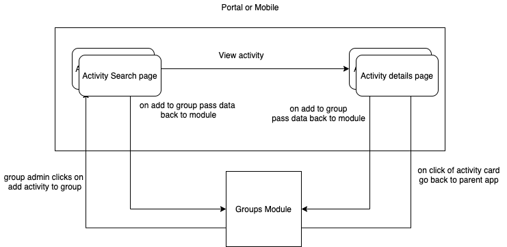

 **Introduction** 

This wiki contains the design of groups as npm module

 **Background** 

Groups feature is used in both sunbird mobile and portal. So for any feature we will be writing duplicate code in both mobile and portal. To avoid the duplicate efforts we will be writing it as a NPM module

 **Problem statement** 

 **Key Design Problems** 


* How to use existing global search for group activity search ?


* How to handle  **add to group**  button in parent application activity pages ?


* How to retain state or context of group on refreshing of parent application(search and activity page) ?


* How to launch another library(DF) from groups module ?


* How handle telemetry events ?


 **Design** 

High level diagram of  **groups npm module** 


 **How to pass context and events from module to parent application** 


* Emit a event from the groups module


* Pass all required data(group context) as part of the event


* Subscribe in parent application and do the proper redirection


```
// when we publish a event from the module to parent application
interface GroupActionEvent {
    groupId: string;
    action: 'view' || 'search' || 'add'
    activity?: Activity,
    ... 
}
```
 **Activity Interface** 


```
interface Activity {
  identifier: string,
  primaryCategory: string[],
  name: string
}
```

### How to use existing global search for group activity search ?

* handling activity search in parent application and showing specific UI of groups on search page(on mouse over on card show add to group and view activity button)


```
 GroupActionEvent  = {
    groupId: '8da854ce-8924-4afe-aae1-1f5bdf536db6';
    action: 'search'
    filter:  {
      primaryCategory: ['Course']
      ...
    }
}
```

```

```
 **Open activity Flow** 


### How to handle  **add to group**  button in parent application activity pages ?

* Use existing CSL group addable bloc to show the button

    


```
<add-activity-to-group [pageId]="pageId" [identifier]="identifier"></add-activity-to-group>
```


Note: 

Limitations


* Any new activity page requires code changes to implement above “ **add activity to group** ” button


### How handle telemetry events ?

* Publish the event from the module


```
// when we publish a event from the module to parent application
interface GroupTelemetry {
    env: 'groups;
    eData: {
      type: string,
      id: string
    }
    cData: [
      type: string,
      id: string
    ]
}
```


*****

[[category.storage-team]] 
[[category.confluence]] 
