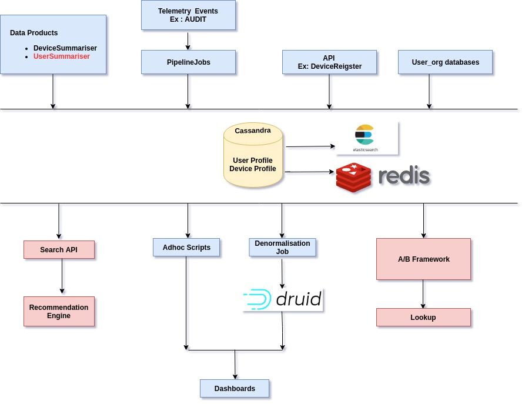

 **Introduction:** 
* This document describes the enhanced/derived Device and Extended User Profile schemas, design of how the profile data is captured and how it can be used across various systems.

 **Design Flow:** 

 **Schema Design for User and Device Profile**  **Computation Table:**  **Device Profile -** 

|  | Field | Type | Description | Source | Release | 
|  --- |  --- |  --- |  --- |  --- |  --- | 
| 1 | device_id | String | Unique id of device | From first source which inserts a record | 1.11 | 
| 2 | total_ts | Double | Total Time spent on device till date | Device profile updater data product | 1.11 | 
| 3 | total_launches | Long | Number app/portal launches from the device | Device profile updater data product | 1.11 | 
| 4 | avg_ts | Double | Average time spent on device | Device profile updater data product | 1.11 | 
| 5 | first_access | Timestamp | Timestamp on which device was first accessed | Device profile updater data product | 1.11 | 
| 6 | last_access | Timestamp | Timestamp on which device was last accessed | Device profile updater data product | 1.11 | 
| 7 | state | String | State from which device is accessed | Device Register API | 1.12 | 
| 8 | state_code | String | Device state code | Device Register API | 1.14 | 
| 9 | state_code_custom | String | Device custom state code | Device Register API | 1.14 | 
| 10 | state_custom | String | Device custom state name | Device Register API | 1.14 | 
| 11 | city | String | City from which device is accessed | Device Register API | 1.12 | 
| 12 | country | String | Country from which device is accessed | Device Register API | 1.14 | 
| 13 | country_code | String | Device country code | Device Register API | 1.14 | 
| 14 | district_custom | String | Device custom district name | Device Register API | 1.14 | 
| 15 | device_spec | Map<String,String> | Device Specification | Device Register API | 1.12 | 
| 16 | uaspec | Map<String,String> | Device user agent data | Device Register API | 1.12 | 
| 17 | fcm_token | String | FCM token for app devices | Device Register API | 2.1.0 | 
| 18 | producer_id | String | Producer id for which device belongs to(App/Portal) | Device Register API | 2.1.0 | 
| 19 | location_updated_date | Timestamp | last location details updated date | Device Register API | TBD | 
| 20 | producer_ver | String | Version of producer | Device profile updater data product | TBD | 
| 21 | user_ids | List<String> | List of unique users accessed from the device | Device profile updater data product | TBD | 
| 22 | user_count | Long | Unique users accessed from the device | Device profile updater data product | TBD | 
| 23 | last_updated_by | String | Source from which record was last updated | Source which is updating the record | TBD | 
| 24 | sources | List<String> | List of sources from which record gets updated | From all the sources | TBD | 
| 25 | updated_date | Timestamp | Last updated date by the source | From all sources | 1.12 | 

 **User Profile -** 

|  | Field | Type | Description | Source | Release | 
|  --- |  --- |  --- |  --- |  --- |  --- | 
| 1 | user_id | String | Unique id of the user | From first source which inserts a record | 2.2.0 | 
| 2 | user_type | String | Type of user(Anonymous/SelfSignedIn/ValidatedUser) | User_Org Cassandra via Samza job | 2.2.0 | 
| 3 | user_role | String | Role of user(Student/Teacher) | AUDIT events via Samza job | 2.2.0 | 
| 4 | sign_in_type | String | Type of sign-in(GoogleAuth/SingleSignon/Login) | AUDIT events via Samza job | 2.2.0 | 
| 5 | board | List<String> | Board the user has selected | INTERACT event via Samza job | 2.3.0 | 
| 6 | subject | List<String> | Subject the user has selected | INTERACT event via Samza job | 2.3.0 | 
| 7 | medium | List<String> | Medium the user has selected | INTERACT event via Samza job | 2.3.0 | 
| 8 | grade | List<String> | Grade the user has selected | INTERACT event via Samza job | 2.3.0 | 
| 9 | language | String | User preferred language | INTERACT event via Samza job | 2.3.0 | 
| 10 | profile_state | String | State name of the User | User_Org Cassandra via Samza job | TBD | 
| 11 | profile_district | String | District name of the User | User_Org Cassandra via Samza job | TBD | 
| 12 | profile_block | String | Block name of the User | User_Org Cassandra via Samza job | TBD | 
| 13 | first_access | Timestamp | Timestamp on which user was first seen | User Profile Updater data product | TBD | 
| 14 | last_access | Timestamp | Timestamp on which user was last seen | User Profile Updater data product | TBD | 
| 15 | last_device_accessed | String | Device id on which user was last seen | User Profile Updater data product | TBD | 
| 16 | device_ids | Map<String,String> | list of unique devices with device_id and producer_id | User Profile Updater data product | TBD | 
| 17 | last_updated_by | String | Source from which record was last updated | Source which is updating the record | TBD | 
| 18 | sources | List<String> | List of sources from which record gets updated | From all the sources | TBD | 
| 19 | last_content_played | String | Last content played by user | User Profile Updater data product | TBD | 
| 20 | total_ts | Double | overall time spent till date by user | User Profile Updater data product | TBD | 
| 21 | updated_date | Timestamp | Last updated date by the source | From all sources | 2.2.0 | 
| 22 | qr_scans | Integer | Total scans done by the user | via data product | ? | 
| 23 | ... |  |  |  |  | 

 **Questions:** 
* Possibility of switch in user_role for APP users, Is it ok to have multiple values for user_role in the telemetry for same user_id?
* Can we enhance the existing user table or create new one in analytics database.

*****

[[category.storage-team]] 
[[category.confluence]] 
