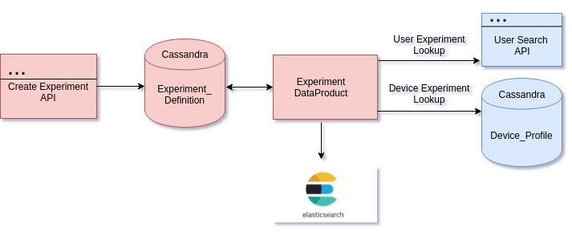

 **Purpose :** 
* Design for Experiment API's to populate,list,delete the experiment definition
* Design the experiment definition schema
* Design Data product  to map  the users/devices to experiments

 **Design Flow :**  **Experiment API :**  **CREATE API  :**  **URL**  :  POST  /experiment/create **Input :**  **Sample User Criteria Input Request:** 


```
  "request": {
    "expId": "U1234",                  // Unique Id for Experiment
    "name": "USER_ORG",                // Name for Experiment
    "createdBy": "User1",              // Name of the user who created this experiment
    "description": "Experiment to get users to explore page ",  // Short Description about the experiment
    "criteria": {                      // Criteria for the Experiment
      "type": "user",                  // Type of the Criteria
      "filters": {                     // PLEASE refer this link for user search filters- http://docs.sunbird.org/latest/apis/userapi/#operation/Search%20User
        "organisations.orgName": ["sunbird"] // List of Values
      }
    },
    "data" : {                         // Experiment Data 
      "startDate" : "2019-08-01",      // Start date of the Experiment
      "endDate" : "2019-08-02",        // End date of the Experiment
      "key" : "/org/profile",          // Experiment Key
      "client" : "portal"              // name of the client (app/portal/desktop)  
    }
  }
```


 **Device Criteria Input Request:** 


```
  "request": {
    "expId": "D1234",                  // Unique Id for Experiment
    "name": "Device_STATE_AP",         // Name for Experiment
    "createdBy": "User2",              // Name of the user who created this experiment
    "description": "Experiment to get devices with state = AndhraPradesh",  // Short Description about the experiment
    "criteria": {                      // Criteria for the Experiment
      "type": "device",                // Type of the Criteria 
      "filters": [
		{                     // Array of Filters
        "name": "state",               // state field critera
        "operator": "IN",              // Filter Operator  - Supported Filters : [IN,EQ] 
        "value": ["Karnataka"]         // List of Values
        },
		{                    
        "name": "city",               // city field critera
        "operator": "IN",              // Filter Operator  - Supported Filters : [IN,EQ] 
        "value": ["Bangalore"]         // List of Values
        },
		{                    
          "name": "first_access",     // device field criteria
          "operator": "RANGE",        // Filter Operator  -  Supported Filters : [RANGE,LT] 
          "value": {
            "start": "2019-02-10",
            "end": "2019-02-20"
        }
     ]
    },
    "data" : {    // Experiment Data 
      "startDate" : "2019-08-01",      // Start date of the Experiment
      "endDate" : "2019-08-02",        // End date of the Experiment
      "key" : "3fksjfksdlfj",          // Experiment Key
      "client" :  "app"                // name of the client (app/portal/desktop)
    }
  }
```
Device Filter Criteria  :

Output :


* Process the request and save the request parameters to Experiment-Definition Cassandra Table with status " **SUBMITTED** "
* Response : " **Experiment Submitted Sucessfully** "

 **Note :** 


*  **All fields are mandatory** 
*  **Same Experiment will not be allowed to submit again unless the status of the experiment is FAILED** 
*  **If the experiment is submitted more than once , will send a response "Experiment already submitted"** 

 **GET API **  **URL**  :  GET  /experiment/:idRequest Params :  ExperimentId

Repsonse :  Experiment Details for the respective experiment Id

Sample Response :


```
{
  "expId": "U1234",
  "expName": "USER_ORG",
  "expDescription": "Experiment to get users with orgname = sunbird",
  "expData": {
    "startDate": "2019-08-01",
    "endDate": "2019-08-04",
    "key": "/org/profile"
  },
  "createdBy": "User1",
  "updatedBy": "ExperimentDataProduct",
  "udpatedOn": "2019-08-02 19:00:00",
  "createdOn": "2019-08-01 10:00:00",
  "criteria": {
    "type": "user",
    "filter": {
      "organisations.orgName": [
        "sunbird"
      ]
    }
  },
  "status": "active",
  "status_msg": "Experiment is actively mapped",
  "stats": {
    "usersMatched": 234,
    "devicesMatched": 0
  }
}
```


 **GET LIST  API  :**  **URL**  :  GET  /experiment/listOutput :  List of all ExperimentsSample Response :


```
{
  "experiments": [
    {
      "expId": "D1234",
      "expName": "DEVICE_STATE_ANDHRAPRADESH",
      "expDescription": "Experiment to get deviceids with first_access Sep1st to Sep3rd",
      "expData": {
        "startDate": "2019-08-01",
        "endDate": "2019-08-04",
        "key": "/org/profile"
      },
      "createdBy": "User6",
      "updatedBy": "ExperimentDataProduct",
      "udpatedOn": "2019-08-02 19:00:00",
      "createdOn": "2019-07-04 10:00:00",
      "criteria": {
        "type": "device",
        "filter": {
          "name": "first_access",
          "operator": "RANGE",
          "value": {
            "start": "2019-02-10",
            "end": "2019-02-20"
          }
        }
      },
      "status": "FAILED",
      "status_msg": "Devices Not Found matching the Criteria",
      "stats": {
        "usersMatched": 0,
        "devicesMatched": 0
      }
    },
    {
      "expId": "U1234",
      "expName": "USER_ORG",
      "expDescription": "Experiment to get users with orgname = sunbird",
      "expData": {
        "startDate": "2019-08-01",
        "endDate": "2019-08-04",
        "key": "/org/profile"
        "client": "app"
      },
      "createdBy": "User1",
      "updatedBy": "ExperimentDataProduct",
      "udpatedOn": "2019-08-02 19:00:00",
      "createdOn": "2019-08-01 10:00:00",
      "criteria": {
        "type": "user",
        "filter": {
          "organisations.orgName": [
            "sunbird"
          ]
        }
      },
      "status": "active",
      "status_msg": "Experiment is actively mapped",
      "stats": {
        "usersMatched": 234,
        "devicesMatched": 0
      }
    }
  ]
}
```


 **Experiment Definition Schema:** 

|  | Field | type | Description | 
|  --- |  --- |  --- |  --- | 
| 1 | expId | String | unique id for experiment | 
| 2 | expName | String | name of the experiment | 
| 3 | expDescription | String | descirption of the experiment | 
|  | expData | Map<String,String> | Experiment Data<ul><li>startDate  - start date of the experiment</li><li>endDate - end date of the experiment</li><li>key/url  -  key or url of the experiment</li><li>modulus - mod number of the experiment</li><li>client - Name of the client for the experiment</li></ul> | 
| 5 | createdBy | String | name of the user who created the experiment | 
| 6 | updatedBy | String | name of product that last updated the experiment | 
| 7 | udpatedOn | Timestamp | last udpated date by the source | 
| 8 | createdOn | Timestamp | created date for the experiment | 
| 9 | criteria | Map<String,String> | criteria of the experiment<ul><li>type  - Type of Criteria (user/device)</li><li>filters - Array of Filters</li></ul> | 
| 10 | status | String | status of the experiment(SUBMITTED/PROCESSING/ACTIVE/FAILED/STOPPED/INACTIVE) | 
| 11 | status_message | String | status description of the experiment | 
| 12 | stats | Map<String,Long> | Statistic Data<ul><li>usersMatched</li><li>devicesMatched</li></ul> | 


 **Experiment Data Product :** 
### Purpose

* To compute the user/device experiment mapping based on the experiment criteria and save it to elastic search

 **Input:** 


* Experiment_Definition Cassandra Table


###  **Output**  
User experiment mapping  index to elastic search


```
User Experiment :
{
          "name" : "USER_ORG",
          "expType" : "user",
          "lastUpdatedOn" : "2019-07-30T00:00:00",
          "endDate" : "2019-07-28T00:00:00",
          "url" : null,
          "deviceIdMod" : 0,
          "key" : "2392438420",
          "id" : "A1234",
          "userIdMod" : 0,
          "userId" : "d5fd92df-2683-4357-8620-45bc0683f38c",
          "platform" : "portal",
          "deviceId" : null,
          "startDate" : "2019-07-25T00:00:00"
        }

Device Experiment :

{
          "name" : "DEVICE_LOCATION",
          "expType" : "device",
          "lastUpdatedOn" : "2019-07-30T00:00:00",
          "endDate" : "2019-08-30T00:00:00",
          "url" : null,
          "deviceIdMod" : 0,
          "key" : "4584583045489",
          "id" : "B1534",
          "userIdMod" : 0,
          "userId" : null,
          "platform" : "app",
          "deviceId" : "3f3da025f07f2d6e4ead9042710b8b78",
          "startDate" : "2019-07-29T00:00:00"
        }


```


*****

[[category.storage-team]] 
[[category.confluence]] 
