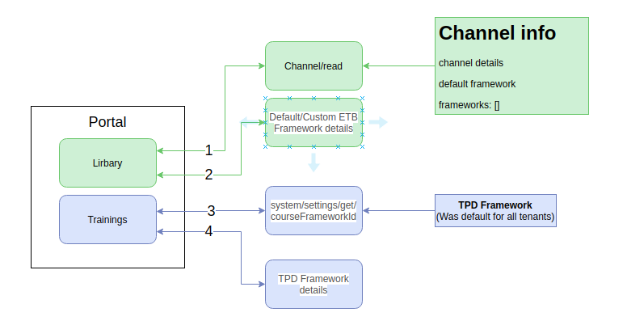
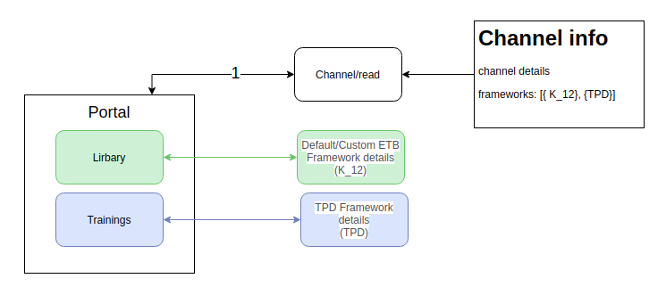
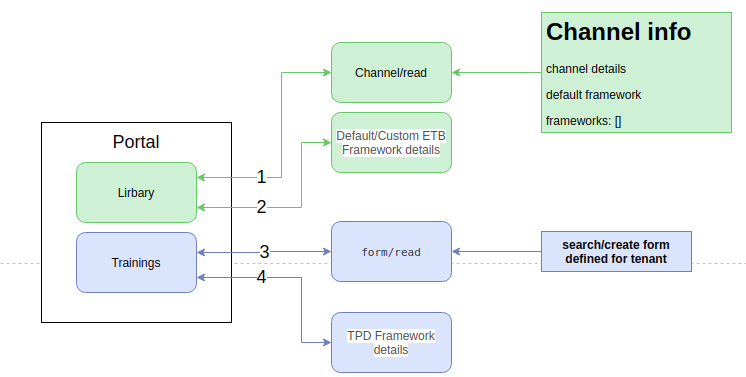

## Introduction:
This document describes the design approach of using the TPD framework in the portal. 


## Background:
Jira Issue: [https://project-sunbird.atlassian.net/browse/SH-3](https://project-sunbird.atlassian.net/browse/SH-3)

Epic: [https://project-sunbird.atlassian.net/browse/SH-33](https://project-sunbird.atlassian.net/browse/SH-33)

Presently any tenant is using the framework as customization list of tenant-specific data(BGMS, Topics, sub-topics etc..). This framework is very well defined for ETB workflow


## Problem Statement:

1. How custom tenant framework can be used for content/resources created for course?


## Key design problems:

1. How to get a tenant specific framework(custom/default) TPD framework? 


1. How to send Textbook/Course specific framework data(specified by tenant) in the editor config while create/edit of content/resources?


## Existing workflow:
 **Change request:** As part of [https://project-sunbird.atlassian.net/browse/SH-3](https://project-sunbird.atlassian.net/browse/SH-3) we have split creation workflow into 2 parts(in Workspace => Create)

1. Textbook  

2. Training

Any resource/content created in Textbook section should use ETB framework defined by the tenant

Any resource/content created in Trainings section should use TPD framework defined by the tenant


## Solution 1: 
Get all framework details in the channel read API call(all framework-types).

Channel read API should return the frameworks for this channel. Each framework will be having  **“frameworkType“**  that will define where to use this framework.

Presently there are 2 frameworks types supported/defined in the platform


1. k_12 => Used for Library/Textbook workflows


1. TPD => Used for Tanning/Course workflows


Below example is for the channel which has not defined custom frameworks(channel should use default frameworks)


```
{{host}}/api/channel/v1/read/013016492159606784174
```
 **Response:** 


```json
{
  "id": "api.channel.read",
  "ver": "1.0",
  "ts": "2020-05-12T07:32:55.520Z",
  "params": {
    "resmsgid": "cbae0600-9422-11ea-921e-b5cf18189e8e",
    "msgid": "59d4edd3-9ad3-f3e2-e9c0-1248c8add278",
    "status": "successful",
    "err": null,
    "errmsg": null
  },
  "responseCode": "OK",
  "result": {
    "channel": {
      "identifier": "013016492159606784174",
      "lastStatusChangedOn": "2020-05-08T08:37:06.840+0000",
      "code": "013016492159606784174",
      "frameworks": [
        {
          "identifier": "NCF",
          "default": true,
          "name": "NCF",
          "description": "ETB framework created for CBSE channel",
          "frameworkType": "K-12",
          "objectType": "Framework",
          "relation": "hasSequenceMember",
          "status": "Live"
        },
        {
          "identifier": "TPD",
          "name": "TPD",
          "default": true,
          "description": "TPD framework created for CBSE channel",
          "frameworkType": "TPD",
          "objectType": "Framework",
          "relation": "hasSequenceMember",
          "status": "Live"
        }
      ],
      "consumerId": "ed450daa-a5fd-4295-a346-35ae58c1a602",
      "channel": "in.ekstep",
      "languageCode": [],
      "createdOn": "2020-05-08T08:37:06.840+0000",
      "objectType": "Channel",
      "versionKey": "1588927026840",
      "appId": "local.sunbird.portal",
      "name": "cbse",
      "lastUpdatedOn": "2020-05-08T08:37:06.840+0000",
      "status": "Live",
      "defaultFramework": "NCF"
    }
  }
}
```
Note: In the above response “defaultFramework” : “NCF“ is not required. Because now every tenant has min 2 frameworks. One for Textbook & another one for the Course.


The below table defines the different possibilities of channel defining default & custom frameworks for Library & Training.

Assuming the default framework for  **Library/Textbook=NCF**  &  **Training/Course=TPD** 


|  **Defined custom**  ETB framework |  **Defined custom**  TPD framework |  **Result**  | 
|  --- |  --- |  --- | 
| No | No | Use the default frameworksLibrary/Textbook should use a custom framework =>  **NCF**  Training/Course should use the default framework =>  **TPD** ex: frameworks: \[{NCF}, {TPD}] | 
| Yes | No | Library/Textbook should use a custom framework =>  **rj_k12**  Training/Course should use the default framework =>  **TPD** ex: frameworks: \[{rj_k12}, {TPD}] | 
| No  | Yes | Library/Textbook should use the default framework =>  **NCF**  Training/Course should use a custom framework =>  **rj_tpd** ex: frameworks: \[{NCF}, {rj_tpd}] | 
| Yes | Yes | Library/Textbook should use a custom framework =>  **rj_k12**  Training/Course should use a custom framework =>  **rj_tpd** ex: frameworks: \[{rj_k12}, {rj_tpd}] | 

 **Pros** :  


* Based on the framework type, consumption will decide which framework to use.


* Will avoid form/read API call to get the TPD framework & also avoids defining forms for each tenant.


* 


 **Cons** : 


* The existing functionality of using the default framework has to change


## Solution 2:
Use form read API call to get which framework to use for create conent/resources.



 **Request:** 
```
{{host}}/api/data/v1/form/read

request payload:
{
  formType: 'framework',
  formAction: 'search/create',
  contentType: 'framework-code',
  rootOrgId: "013016492159606784174"
}
```
Response:
```
{
  "id": "api.form.read",
  "params": {
    "resmsgid": "812594ec-1ce0-46ed-8311-51225e05f3aa",
    "msgid": "aaddbe0a-e538-4dca-80d7-dde3be09eaf0",
    "status": "successful"
  },
  "responseCode": "OK",
  "result": {
    "form": {
      "type": "framework",
      "subtype": "framework-code",
      "action": "search",
      "component": "*",
      "framework": "*",
      "data": {
        "templateName": "defaultTemplate",
        "action": "search",
        "fields": [
          {
            "framework": "cbse-tpd"
          }
        ]
      },
      "created_on": "2020-05-08T10:06:00.284Z",
      "last_modified_on": null,
      "rootOrgId": "013016492159606784174"
    }
  },
  "ts": "2020-05-12T07:37:48.347Z",
  "ver": "1.0"
}
```
 **_Note_**  : Since we are making the same getFormConfig API call to get the custom framework what we are making in the  **“Training”**  page, then we can take the same from the cache. 

If the user is directly coming to the workspace and trying to create anything from the training sub-tab, then only we will make the API call and store it in the cache. 

So, When the user goes to the   **“Training”**  page, we won’t make the API call again. 

 **Pros** : 
* This is an existing workflow. It will be easy to implement. 


 **Cons** : 
* The forms have to define for each tenant for search & create workflows


* Multiple API calls  to know which framework to use in search & create


* Maintenance overhead. 


*****

[[category.storage-team]] 
[[category.confluence]] 
