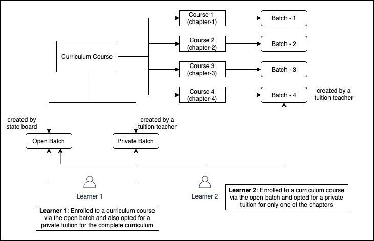
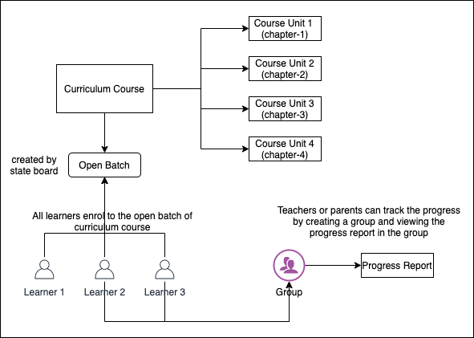
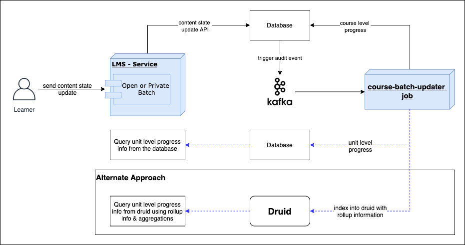

 **Introduction** In Sunbird Platform, courses can be created by grouping multiple learning resources under course units which are then grouped together to form a course. Course creators have to create courses from the ground up and progress of the course can be tracked only at a course level. This is good enough for short term and small courses which are mainly used for up-skilling courses.

However, courses linked to a curriculum (i.e. referred to as curriculum courses, which are used for online learning of a curriculum like K12 or any degree) run for a longer duration, requires tracking at a more granular level and leverage existing curriculum training resources in the course. In this context, we need to enhance the courses platform with following additional capabilities:

* Jump start creation of a course using existing resources like textbooks

* Linkable, trackable and reusable course units so that multiple curriculum courses can reuse them (for example, in K12 curriculum courses, same course units can be used in courses for the same subject across different boards)

* Teachers or tutors should be able to create a batch for individual course unit to impart training for a part of the curriculum course

* Monitor progress of learners at intermediate unit levels

 **Design** 
### Creation of Curriculum Courses
Course micro-service will be enhanced to create a course using an existing “collection”. The collection structure is copied into the course hierarchy and allows the course creator to further edit the course. 

*  **Hierarchy**  structure of the collection is  **copied and replicated**  in the course

*  **Resources**  in the collection are  **not copied and only linked**  to the newly created course hierarchy

There are two options for managing the curriculum courses:

|  **New contentType “CurriculumCourse“**  |  **New courseType “CurriculumCourse“**  | 
|  --- |  --- | 
| <ul><li>Introduce a new content type called “CurriculumCourse“

</li><li>Enable batch creation for this content type also, in addition to “Course” content type

</li><li>Batch creation should be made generic to enable it for any type of collections

</li></ul> | <ul><li>Define new metadata attribute for courses - “courseType”. Allowed values will be “CurriculumCourse” and “TrainingCourse” or just “Course”.

</li><li>No changes in batch management. Batches can be created only for courses.

</li></ul> | 
|  **Pros** : Backward compatibility is automatically taken care of. Existing mobile apps will not see these new type of courses as it is a new content type. |  **Pros** : Easy to enable new metadata for courses. No major code changes for batches and keeps the batches service simple (as batches are associated only with courses). | 
|  **Cons** : Creating new contentType is configurable in the platform, but it requires changes in the batches service and client apps to handle this new content type.  |  **Cons** : To support backward compatibility, we need to add custom logic in search-service: to not return courses of “CurriculumCourse” type by default. | 

### Course Units
Courses are currently composed of CourseUnit objects which have a limited visibility. They are available only within the context of the parent, i.e the course. In curriculum courses, we need these intermediate units of the course to be:

*  **Linkable** : ability to share the link of an intermediate unit with a learner and the learner can start the course consumption from the shared unit. This is already supported by the platform - details of one unit can be fetched from the platform. Clients need to understand the link pattern and fetch the required details about the unit.

*  **Reusable** : ability to link the unit of one course to another course. This can be enabled by making each unit also as a “Course” and a new courseType “CurriculumCourseUnit”. These will have the same behaviour as normal courses except that open batches are not created for them and will only have private batches.

*  **Create Batches**  for units: with each unit being a batch, mentors can create private batch for any of the curriculum course units.

*  **Trackable** : ability track learners progress at intermediate units level. This is detailed in the next section.

 **Version 1:** 

* Create only one textbook per course

* Chapters are created as course units

* Only one open batch is created for the Curriculum Course

* All learners consume the course via the open batch

* Tracking for teachers is enabled via “groups” and progress report within the group

* Requires less changes in the current implementation

* Cons:

    * Batches cannot be created for individual chapters

    * These units will need to be migrated into courses in future

    * Should take care of backward compatibility while migration

    

### Progress Computation at module level
In our platform, the  **batch**  is used to capture and compute the learner progress of a course. The batch is created for a course by a mentor. When the learners enrol to the batch, the mentor(s) has the ability to monitor the progress of the learners.

* The batch progress computation is at the course (root object of the content hierarchy) level only. The collections inside a course are ignored in progress computation and recognising as completed.

* Progress computation needs to be enhanced to fetch the progress of intermediate units for a learner. This will be done only for  **CurriculumCourses**  in the current version.

When a learner enrols to a course batch and starts consuming the content, client apps send the progress of each resource via content state update API calls. The platform uses this information to compute the progress of the learner in the course.

A course can be classified into three parts. the platform already supports progress computation and saving the data for two parts. In course hierarchy we have,

1. Leaf Nodes (Resource) - The platform receives the progress information of each resource in the course from the client via API.

1. Root Content (Course) - It is a collection content. The platform uses an async job (Samza) to compute the progress of Root Content.  **It uses resource progress update and generates an event to Kafka for refreshing the progress** .

1.  **Collections within Course (Course Units)** 

    1. The Kafka event used to refresh course progress have the below details.

    1. resource identifier and status

    1. course identifier

    1. batch identifier

    
    1. The resource is a leaf node in the Course Hierarchy. The job will be enhanced to  **identify all the course units in sub-graph of a Curriculum Course hierarchy and compute progress**  for all of them at once.

    

*****

[[category.storage-team]] 
[[category.confluence]] 
