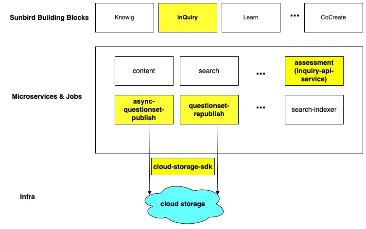

## Background
This document explains what components of Sunbird inQuiry (version:  **release-5.2.0** ) uses Cloud Storage and how to integrate new Cloud Storage.

* Above diagram shows inQuiry components (marked in yellow colour) and its connections with cloud storage.

* As of now inQuiry supports cloud storage operations with Azure, Aws, Google Storage.

* inQuiry has below flink jobs which interact with cloud storage for upload/download operation:

    *  **async-questionset-publish** 

    *  **questionset-republish** 

    
*  **inquiry-api-service**  transforms cloud related metadata (e.g: downloadUrl, appIcon, etc) but doesn't interact with cloud storage. So there is no dependency with cloud-storage-sdk module.

    * e.g: the service convert cloud specific path (absolute path) to cloud neutral path (relative path) and vice versa.

    
* In order to add support for any other cloud storage (e.g: OCI) under inQuiry components, below steps need to be followed:

1.  **async-questionset-publish & questionset-republish flink job:** 

 **Code Changes:** 

* Both jobs uses  **cloud-storage-sdk**  for cloud storage operations. So first the sdk need a code change to have support for new cloud storage provider (e.g: OCI).

|  **Job Name**  |  **inQuiry Release Version**  |  **cloud-storage-sdk Version**  |  **cloud-storage-sdk scala version**  | 
|  --- |  --- |  --- |  --- | 
| async-questionset-publish | release-5.2.0 | 1.4.3 | 2.12 | 
| questionset-republish | release-5.2.0 | 1.4.3 | 2.12 | 

* Sunbird cloud-storage-sdk is a utility which provides methods for cloud upload/download operations.

* Link to cloud-storage-sdk git repo: [https://github.com/project-sunbird/sunbird-cloud-storage-sdk/tree/scala-2.12-with-latest](https://github.com/project-sunbird/sunbird-cloud-storage-sdk/tree/scala-2.12-with-latest)

* It provides an interface [IStorageService](https://github.com/project-sunbird/sunbird-cloud-storage-sdk/blob/scala-2.12-with-latest/src/main/scala/org/sunbird/cloud/storage/IStorageService.scala) which should be implemented for new cloud storage provider.

* Once the cloud-storage-sdk new version is published in maven central, we need to update the version in jobs-core module [https://github.com/Sunbird-inQuiry/data-pipeline/blob/58d52be036712eff2e90a3842a1885d36d4473a7/jobs-core/pom.xml#L84](https://github.com/Sunbird-inQuiry/data-pipeline/blob/58d52be036712eff2e90a3842a1885d36d4473a7/jobs-core/pom.xml#L84)

* If required, Make Code Changes to [CloudStorageUtil](https://github.com/project-sunbird/knowledge-platform-jobs/blob/release-5.2.0/jobs-core/src/main/scala/org/sunbird/job/util/CloudStorageUtil.scala)

 **Configuration Changes:** 

* Override value for below variables under private devops repo (file path:  **ansible/inventory/<env_name>/Knowledge-Platform/secrets.yml** ) for new storage account:

|  **Variable Name**  |  **Description**  |  **Example Value**  | 
|  --- |  --- |  --- | 
| cloud_service_provider | storage provider name | azure | 
| cloud_public_storage_accountname | unique key to identify the storage account | sunbirddevbbpublic | 
| cloud_public_storage_secret | secret key to access the storage account. | NA | 
| cloud_public_storage_endpoint | end point of cloud storage account.  | ““ | 
| cloud_storage_content_bucketname | bucket/container name where data will be stored/ read from. | sunbird-content-dev | 
| cloudstorage_replace_absolute_path | this flag is used to enable disable cloud agnostic data feature. | false | 
| cloudstorage_relative_path_prefix | this variable will have string value which will replace cloud storage base path & bucket name | CLOUD_STORAGE_BASE_PATH | 
| cloudstorage.metadata.list | this variable will have list of metadata which has cloud storage url | \["appIcon","posterImage","artifactUrl","downloadUrl","variants","previewUrl","pdfUrl"] | 
| cloudstorage_base_path | this variable will have either CNAME or base url of cloud storage account | "https://sunbirddevbbpublic.blob.core.windows.net" | 
| valid_cloudstorage_base_urls | this variable will have list of urls which should be replaced by CLOUD_STORAGE_BASE_PATH string if cloud agnostic feature is enabled. | \["https://sunbirddevbbpublic.blob.core.windows.net"] | 

* Configuration File Reference:

    [https://github.com/Sunbird-inQuiry/data-pipeline/blob/58d52be036712eff2e90a3842a1885d36d4473a7/kubernetes/helm_charts/datapipeline_jobs/values.j2#L140](https://github.com/Sunbird-inQuiry/data-pipeline/blob/58d52be036712eff2e90a3842a1885d36d4473a7/kubernetes/helm_charts/datapipeline_jobs/values.j2#L140)

    [https://github.com/Sunbird-inQuiry/data-pipeline/blob/58d52be036712eff2e90a3842a1885d36d4473a7/kubernetes/helm_charts/datapipeline_jobs/values.j2#L148](https://github.com/Sunbird-inQuiry/data-pipeline/blob/58d52be036712eff2e90a3842a1885d36d4473a7/kubernetes/helm_charts/datapipeline_jobs/values.j2#L148)

 **Deployment:** 

* Build & Deploy both Job

 **Testing:** 

* Test Question/QuestionSet Publish Workflow.

    * Question/QuestionSet should be published successfully.

    * metadata having cloud storage file reference should be accessible.

    * e.g: downloadUrl pointing to a file, should be downloadable.

    

    

 **2. inquiry-api-service:** 

* The Service need only configuration change to maintain relative path in database while write operation and return the absolute path for cloud related metadata while read operation.

* e.g: 

    * If appIcon has been given as absolute url ([https://sunbirddevbbpublic.blob.core.windows.net/sunbird-content-staging/questionset/do_213687607599996928135/artifact/download-1.thumb.jpg)](https://sunbirddevbbpublic.blob.core.windows.net/sunbird-content-staging/questionset/do_213687607599996928135/artifact/download-1.thumb.jpg)) in Question/QuestionSet Create API, the service should store it as relative path (CLOUD_STORAGE_BASE_PATH/questionset/do_213687607599996928135/artifact/download-1.thumb.jpg) and the read api should return back the absolute url.

    * In above example, base url of storage account & bucket name got replaced with a string value " **CLOUD_STORAGE_BASE_PATH** " configured in  **cloudstorage_relative_path_prefix**  variable.

    

 **Config Changes:** 

* Override value for below variables under private devops repo (file path:  **ansible/inventory/<env_name>/Core/secrets.yml** ) for new storage account: 

cloud_storage_content_bucketnamecloudstorage_replace_absolute_pathcloudstorage_relative_path_prefixcloudstorage_base_pathvalid_cloudstorage_base_urls

       Configuration File Reference:

[https://github.com/project-sunbird/sunbird-devops/blob/391343efc67403beceed15c437d7de8f55053527/ansible/roles/stack-sunbird/templates/assessment-service_application.conf#L424](https://github.com/project-sunbird/sunbird-devops/blob/391343efc67403beceed15c437d7de8f55053527/ansible/roles/stack-sunbird/templates/assessment-service_application.conf#L424)

 **Deployment:** 

* After Configuration Change, Deploy the  **assessment**  service.

 **Testing:** 

* Test Question Create & Read API with some metadata having cloud path (e.g: appIcon)

 **Note:** 

*  **cloudstorage_relative_path_prefix**  variable should have same value across the infra for all inQuiry components and Knowlg content service, search-indxer flink job.

*****

[[category.storage-team]] 
[[category.confluence]] 
