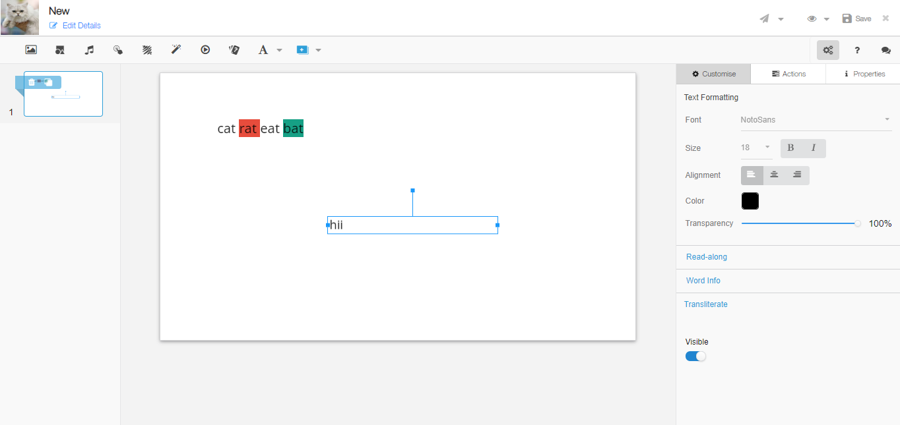
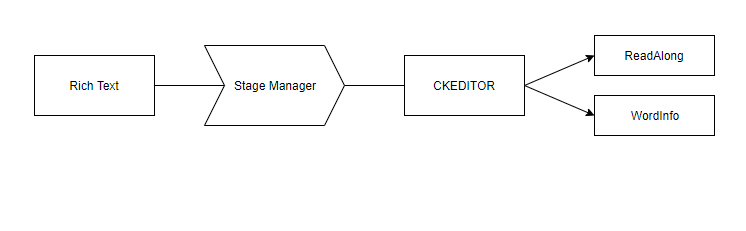
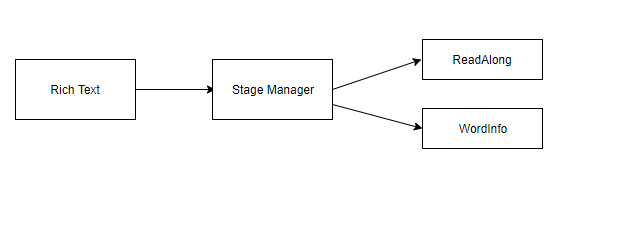

 **Introduction:** This wiki page explains the design and implementation of Read-along and Word-info to add in richtext while creating new rich text and existing richtext.

 **Background:** 

Currently users are only allowed to add readalong and wordinfo with plain text, after adding text into the editor and click on readalong then open readalong popup where user can select audio from select audio menu.

 **Problem Statement:** 

Currently user can add/edit/delete readalong in only plain text.Add readalong/wordinfo in rich text to add readalong and wordinfo in rich text.

## Solution 1 - Using CKEDITOR to load readalong plugin.
 **Challenges:** 

A user create rich text and added readalong on richtext paragraph and try to add it into the content editor then ckeditor  is override current changed object and reset the readalong/wordinfo of object before add into the content editor.

Pros:

1. Due to add readalong in richtext header menu easy to used, no need to first add richtext then add readalong feature.
1. Avoid the twice operation on same text (create then add).
1. Whenever using ckeditor in content editor by default readalong property will be available.

Cons:

1. Every time open richtext editor when user want to edit readalong.
1. After creating richtext user want to add readalong then need to first open rich text editor then click on readalong icon to add.

## Solution 2 - Using Staging manager to load Readalong plugin.
 **Challenges: ** Add rich text into the content editor and get current object from editor and apply readalong on that

Pros:

1. Readalong is separate from the rich text editor so after creating richtext easy to add readalong.
1. No need to open richtext editor for add readalong.

Cons:

1. User need to first add rich text then add readalong.

 **Conclusion:** 

1. Create a readalong icon in richtext editor menu to open readalong popup.
1. Add Read Along  in sidebar setting.
1. Add edit and delete button in Read along button.
1. Render the added Read along in rich text.

*****

[[category.storage-team]] 
[[category.confluence]] 
