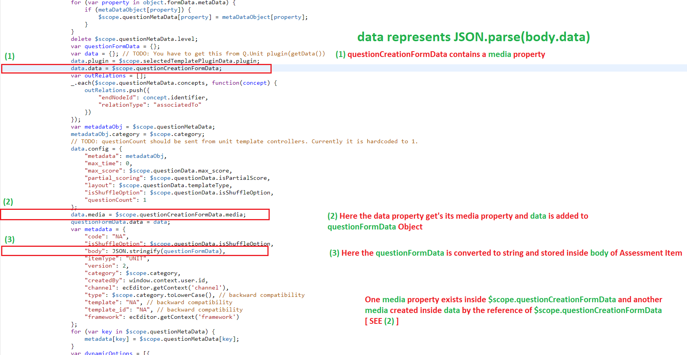
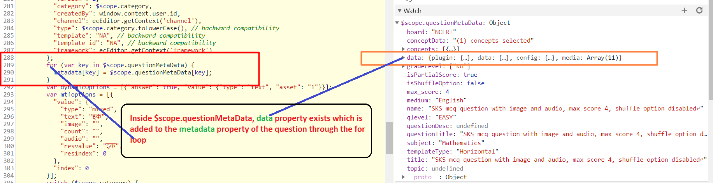
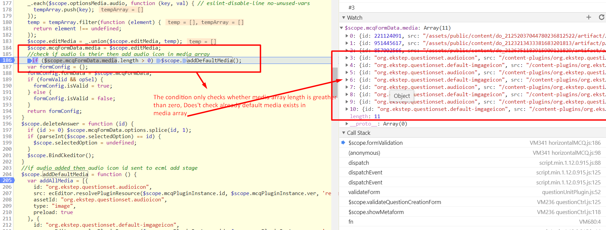

* [Introduction ](#introduction )
  * [1. QuestionSet](#1. questionset)
    * [1.1 Redundant Properties inside questionSet](#1.1-redundant-properties-inside-questionset)
    * [1.2 Katex Library being added to ECML alway](#1.2-katex-library-being-added-to-ecml-alway)
  * [2. v2 Questions ](#2.-v2-questions )
    * [2.1 Redundant media property](#2.1-redundant-media-property)
    * [2.5 For MCQ the default media is getting added multiple times ](#2.5-for-mcq-the-default-media-is-getting-added-multiple-times )


# Introduction 
We have already covered the existing structural issues in another [DOCUMENT](https://project-sunbird.atlassian.net/wiki/spaces/DPT/pages/794558518), This document gives the details of Reasons for each issue


## 1. QuestionSet

### 1.1 Redundant Properties inside questionSet


```
data 
org.ekstep.question
```
The org.ekstep.question is generated by data property inside toECML function of  questionSet editor plugin.js,  Before returning result inside toECML  the data property should be made as empty string as the questionSet only requires config data in the renderer side.


### 1.2 Katex Library being added to ECML alway
The katex library a renderer dependency of org.ekstep.questionunit library and questionunit is a dependency of all the questionunit plugins ( org.ekstep.questionunit.\[mtf, ftb, sequence, reorder, sequence] ), Hence it is always added into the ECML of questionSet.


## 2. v2 Questions 

### 2.1 Redundant media property
The below screenshot shows the code of org.ekstep.question/editor/question-ctrl.js to understand the code that produced the structure





2.2 New properties getting added after edit and save of questionThe Four new properties which is getting added into metadata Assessment Item are 

conceptData

topicData

data

questionTitle

 **Explanation for  conceptData**  ** and topicData** 


The below code exists inside $scope.formIsValid function which resides in org.ekstep.question-1.0/editor/question-ctrl.js.


```
if ($scope.questionMetaData.concepts) {
	$scope.questionMetaData.conceptData = "(" + $scope.questionData.concepts.length + ") concepts selected";
}
if ($scope.questionMetaData.topic) {
	$scope.questionMetaData.topicData = "(" + $scope.questionData.topic.length + ") topics selected";
}
```
As you can if there is already a concepts or topic exists inside the metadata of the question,  It adds conceptData and topicData properties, Hence  it adds  only while edit and save not while creation.


 **Explanation for questionTitle** 

The below code exists inside file org.ekstep.question-1.0/editor/question-ctrl.js, function $scope.showQuestionForm 


```
$scope.questionData.questionTitle = questionData.title;
```
$scope.showQuestionForm  only invoked when questionData Object contains values inside it, Upon creating question the questionData is empty, Hence questionTitle property never get's added to $scope.quesitonData


```
 if (!ecEditor._.isEmpty(questionData)) {
                $scope.showQuestionForm(questionData);
```


 **Explanation for data** 

Refer 2.3 For the details

2.3 Recursive Structure of QuestionThe Below Screenshot exists inside $scope.saveMetaData function of file org.ekstep.question-1.0/editor/question-ctrl.js




Why the data property only getting added while edit and save, The below code is inside $scope.showQuestionForm function of file org.ekstep.question-1.0/editor/question-ctrl.js, 

We have already know $scope.showQuestionForm only will be invoked during edit ( Refer  **Explanation for questionTitle ** Issue description )


```
var questionData1 = typeof questionData.body == "string" ? JSON.parse(questionData.body) : questionData.body;
$scope.questionData = questionData1;
```
2.4 For MCQ and FTB questions ( Assessment ) the plugin media is getting added inside v2 questions mediaThis requires discussion, Currently this is the behavior, 


### 2.5 For MCQ the default media is getting added multiple times 
The below screenshot is inside $scope.formValidation function of /org.ekstep.questionunit.mcq-1.1/editor/controllers/mcq-controller.js




*****

[[category.storage-team]] 
[[category.confluence]] 
