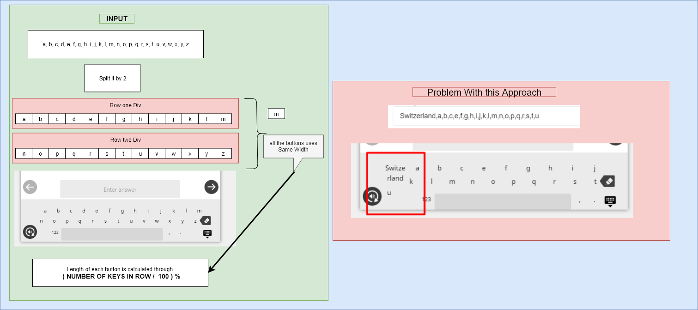
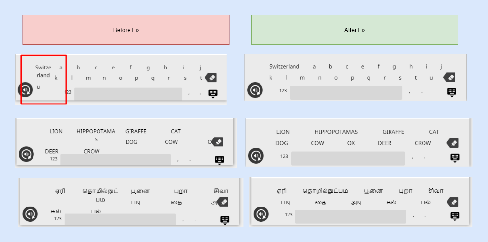

# Background
   The keyboard plugin supports custom keys ( buttons  ) by entering keys through in input box each separated out through comma.

[Jira ticket](https://project-sunbird.atlassian.net/browse/SB-7813)


Click here see keyboard to current implementation


# Problem Statement


## Statement: 1
In the current keyboard layout implementation, All the keys fixed to the same width. The disadvantage of it is when applying a fixed width for a key which has many characters in it, The key wraps inside the fixed width. Because of that the keyboard layout breaks.




# Key Design Issues
1. Splitting or counting a character linguistically.2. Fixed width for all keys in keyboard breaks the layout.


# Solutions
The solution for design Issue -1 

Using  **grapheme-splitter**  Library to Count the number ( Reference Link for more test cases [https://runkit.com/shivashanmugam/5c3413183adcf800145d7b41](https://runkit.com/shivashanmugam/5c3413183adcf800145d7b41) )


```js
Telugu
"సింహం అడవి రాజు" character length 9
"పసిఫిక్ సముద్రం ప్రపంచంలోనే అతిపెద్ద సముద్రం" character length 27

Tamil
"சிங்கம் காட்டில் அரசன்"  character length 14
"பசிபிக் கடல் உலகிலேயே மிகப் பெரிய கடல் ஆகும்" character length 30

Hindi
"जंगल का राजा शेर है" character length 13


```


### Limitations on the solution
Grapheme Splitter does not handle all the test cases,  For some inputs, it is not determining the character length correctly. Also there was no docs about it's test coverage for a  specific language.


```js
Case 1 
"प्र"
Expected value of character length 1
Actual value through grapheme splitter is 2

Case 2
க்ஷௌ
Expected value of character length 1
Actual value through grapheme splitter is 2
```

### Challenges Involved in implementing the solution ( Grapheme Splitter )
If the User allowed to enter 26 keys with each containing 1 linguistic character count we face two main challenges.

 **Challenge 1**  **maxlength**  property of the input box cannot be static,

It needs to dynamic based on user input to input-box. Currently the max length is set as 51. ( 26 character + 25 Comma )

 **Challenge 2** In the keyboard layout two rows don't have enough space.

I have added screenshot of one of the worst case input scenario of Tamil Language.


Each Key is a single character in the below example. ( In Javascript the total length is 51, Excluding spaces )


```js
கொ, கோ, கௌ, சோ, சௌ, பொ, போ, பௌ, ணொ, ணோ, ணௌ, தொ, தோ, தௌ, நொ, நோ, நௌ, லொ, லோ, லௌ, றொ, யொ, யோ, யௌ, மொ, மோ
```
Rendering of the above input in keyboard


## Solution for design Issue 2
Using Flex-box CSS feature enables dynamic width for each keys.

Changes in Keyboard row div container


```css
display : flex;
flex-wrap : wrap;
```


Changes in each keys ( buttons )


```css
flex-grow : 1;
min-width: 7%;
```



*****

[[category.storage-team]] 
[[category.confluence]] 
