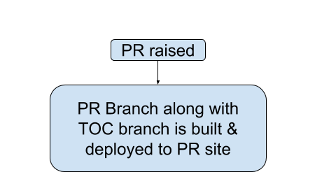

* Whenever there is any pr request on any of the version branch, this build will be triggered.
* that particular pr changes will be built and it will be deployed to pr site
* Site generation process
    * Pull pr code
    * pull theme code
    * merge code as per the Jekyll
    * generate html
    * merge TOC branch
    * deploy
    * post comment on github with modified pages link

    

Related Jira Issues - [SB-5591 System JIRA](https:///browse/SB-5591)

*****

[[category.storage-team]] 
[[category.confluence]] 
