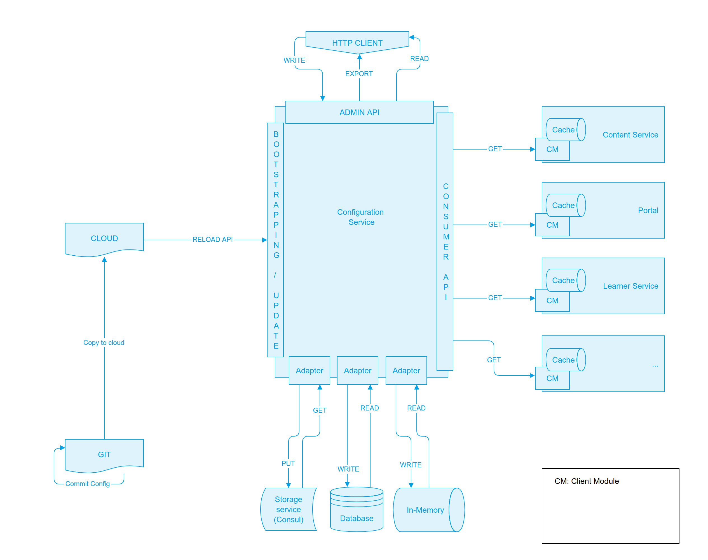

| 1.10 | 
| [SB-3303 System JIRA](https:///browse/SB-3303) | 
| YellowREVIEWED | 
| 

 | 
| Lead designer | 
| Lead developer | 
| Lead tester | 
|  --- | 
|  --- | 
|  --- | 
|  --- | 
|  --- | 
|  --- | 
|  --- | 
| 1.10 | 
| [SB-3303 System JIRA](https:///browse/SB-3303) | 
| YellowREVIEWED | 
| 

 | 
| Lead designer | 
| Lead developer | 
| Lead tester | 


## Background
Managing configurations is an important concern in any solution deployment involving several services. Solution deployment involves working with configurations for multiple environments (prod, staging, dev etc.). A solution deployment for a particular environment requires installation and integration of various services each with their custom configurations. A change in configuration may require a rebuild and/or redeploy of a service. Rebuild is required if any configuration parameter is hard-coded and is not available for modification via an environment variable.

As Sunbird solution evolves and its adopters increase there is a need to address the problem of managing configurations for various services. To solve this problem, a central configuration service is proposed which can be used to update configuration of any service on the fly without requiring a service redeploy.


Solution OverviewThere should be a Client module which is attached to the intended consumer service(s). This client module shall talk to configuration service and fetch the required configuration. 

The configuration service should be able to connect with different services to retrieve (and update) configurations. These services / utilities may be: KV store service, Database, Environment variable, Properties file etc. Depending on the consumer need it should be able to fetch the required configuration from the given service / utility. 

This configuration service should also support fallback among connected services / utilities. In case the required configuration is not available with a particular connected service / utility, the client module should be able to query next in line service / utility to retrieve the required configuration. The depth of fallback should not be limited to one so that the module may keep looking through all defined services / utilities for the particular configuration.

The configuration service should also support fetching of the required configuration from multiple connected services in parallel and resolve the fetched values based on hierarchy.


## Structure

### Hierarchy


Config Server maintains configuration information per service basis for given environment. The configuration data can be stored in a hierarchical or tree like structure. Such nested data can be accessed using a dot notation. Here a full path, starting from the root node, should be passed to access a child node. 

Application configuration is expected to consist of various groups. Please note this is a mere illustration but no restriction on the expected configuration.


* Tenant configuration (Application feature customisation related e.g. allowed content types)
* And other types of custom configurations

An application may operate in single or multiple tenant mode (based on its requirements). The application is responsible for defining, interpreting and using such tenant related configuration based on the given tenant being served by the application.

There may be other custom configurations that an application may define and use during its normal operation. However, Config Service is agnostic about such sets of configuration and stores the entire configuration as a blob within its data store. Config Service provides an API to retrieve entire configuration or specified part of it.


### Format
Initial version of Config Server shall only support JSON and HOCON format. However, it shall be designed to be easily extendable to support multiple additional other formats (YAML, Key-Value, XML) at both API and DB layer in future (if required). The configuration format is application specific and can vary from one to another. The structure of the configuration file is proposed as below. Here we may use includes feature of HOCON to keep the configurations modular and maintainable.


```
{
   "_instance": {
      "var-one": "valueA",
      "var-two": "valueB",
      "portal": {
		  "sunbird_explore_button_visibility":"false",
		  "sunbird_enable_signup":"true",
      },
      "learner": {
          "var-one": "value learner-one",
          "var-two": "value learner-two",
          "var-three": "value learner-three"
      },
      "_tenant": {
      	  "<tenant_slug>": {
      	      "var-one":"value-ap-A",
	          "var-two":"value-ap-B",
      	      "portal": {
                  "sunbird_extcont_whitelisted_domains":"youtube.com,youtu.be",
      	      }
              "_organisation": {
	      	      "<organisation_id>": {
		      	      "var-one": "value-org1-A",
		      	   }
	      	  }
      	  }
      }
    },
    "_meta": {
    	"var-one": {
    		"max-level": "@tenant"
    	}
   }
}
```


### Validation
The configuration service may validate the format of the given data. It is prudent that instance admin also validates the configuration before sending for storage.


## Access
The client module should be able to connect to configuration service which in turn should connect to one or more service to store / read the required configuration for the connected consumer service.


### File
Through configuration service the consumer service should be able read configurations from a config file in the supported format. Here the configurations may be maintained as separate files for separate modules / sections.


### Database
The configuration service should also be able to connect to a supported database directly. This connection should allow the configuration service to access or store the required configuration. Here the particular module may decide to use database to store configuration as a blob.


### Network
The configuration service should be able to connect to the data store service through available REST APIs to access or store the required configuration. 


## Operations

### Performance
Fetching configuration from a service over network can have some latency compared to if the data is available in memory. So, it is recommended for consumer services to store frequently used configurations in a local cache (as detailed below). This will reduce the number of network calls which in turn support the better performance by the consumer service. It may not be necessary to fetch the latest configuration data as soon as the cache expires. Instead, upon first request after cache expiry, the latest configuration may be fetched from the relevant source.


### Caching


Each service enhanced to use Config Service shall support caching of received configuration information. Such an enhanced service shall support invalidation of cached information after a configurable interval (config.server.cache.ttl) so as to refresh latest information from Config Service at regular intervals. The enhanced service shall support a mechanism to clear its cache to force refresh information from Config Server. This mechanism to invalidate the cache may be primarily based on the TTL. 

It is also proposed that there is a default TTL defined at code level. Each configuration may have the TTL data defined by them while storing the configuration data. The client module, on receiving such configuration, should update the TTL for the particular configuration and refresh accordingly. The structure should be:


```
{
    meta: {
        ttl: 30
    },
    data: {
       // configuration data
    }
}
```


### Substitution
The client module should support parameter substitution ("foo" : ${bar}, "foo" : Hello ${who}).

It should also support substituting environment variables (logdir=${HOME}/logs).


### Notifications
ServiceFor faster propagation of configuration changes, each application can be registered to receive notifications from Config Service in case of a relevant configuration update. This is not a must have requirement right now as the solution supports polling mechanism and can be taken up later where a 3PP service (e.g. Amazon SNS) or a new Notification Service can be built. Such a Notification Service shall be designed to support multiple notification protocols (HTTP, Message Queue, Email etc.). An application can subscribe to receive notifications based on its choice of protocol.

CallbackThe client module can be used to provide callbacks to the attached consumer service when there is a change in configuration. The module may receive change in configuration through webhooks with registered with configuration service.


### Security
Config Server shall support option for compressed (config.server.compress.option) and encrypted (config.server.encrypt.option) storage of configuration. Configuration service should also support 2-way encryption of data before storing to the data store. A consumer with a need to encrypt a particular configuration before storing, should be able use the capability from configuration service rather than implementing on its own. Effectively configuration service should accept a flag from consumer specifying the encryption need and accordingly encrypt the required configuration before sending to data store. Similarly while retrieving such configuration, Configuration service should automatically de-crypt the data before sending back to the consumer.


### Support for consumer service instances
Configuration service should be able to support separate configurations for differant instances of the same consumer service. To make it happen seamlessly, it should be able to recognise the service and its instance automatically and should maintain which configuration is applicable to the particular consumer service instance.


### Unavailability of configuration
In a situation where the configuration service is unavailable, the client module attached to the consumer service should attempt to resolve the required configuration from available fallback services (database, properties file, Environment variable etc). In case the required configuration cannot be fethced from any of the allowed sources, the client module should return the appropriate error response. The consumer service should understand this error response and act accordingly. It is suggested that the consumer service do not go ahead with a code level default and instead respond with a logical error 


### Deployment
BootstrappingInitial / default configurations can be defined in HOCON format and made available with the code. Or these may be available through environment variables / external file hosted on cloud or a separate GIT repository. During bootstrapping, the configuration service should read a system configuration available through an environment variable and understand the source of rest of the configurations. It should then read from the specified location, parse and store with the attached storage.

Add / UpdateTo add / update a configuration, a system admin would update the respective HOCON file (base config file) hosted on cloud or a GIT repository. These changes should be periodically picked up by a scheduled job which then triggers the utility / module to read the configuration changes, parse and store with the attached storage.


By using a GIT repository here, the system can ensure all the configuration changes are  **versioned** .

Admin APIConfiguration service should expose secured APIs accessible to admin users for making changes to the configuration. The admin access to Config Service is via API Gateway.

Following enhancements can be planned in the future:


* GUI for update of configuration
* Defining roles and access restrictions for configuration updates

Integrity of configuration dataThe changes made using admin APIs should also reflect in the base config file to maintain integrity of configuration data. In case the base configuration file is maintained at a GIT repository, it is suggested to send a PR with the changes. In case the base configuration file is maintained as a regular file on cloud (or any other accessible storage), a patch file should be written to the same storage space. This PR / patch file should be merged manually by admin to ensure there is a scrutiny to the changes being made.




## Guidelines

### What is In
The following aspects must be considered while deciding on what kind of data / settings can be stored by the proposed configuration service:

 **Backup Policy** : The backup policy for the data storage and for the configuration service storage may differ. This should be an important consideration while deciding to use configuration service for a particular use case.

 **Security Policy** : The security policy for the configuration service / data storage may also differ from the core data storage and associated micro-services.

 **Access control** : The data access path for core data and the ACL layer on it may differ with those for configuration data.


## Implementation tools

### Consul
It is recommended to use consul over a custom solution as it provides a feature rich Key-Value store having the following key features:


*  **Transaction support**  - It supports both read and write transactions. This allows multiple keys to be updated or read as an atomic transation.
*  **Blocking queries / Edge-Triggered Requests**  - The Consul API supports blocking queries, allowing edge triggered updates. Clients use this to get notified immediately of any changes. Tools like consul-template allow configuration files to be rendered in real-time to third-party sources when any configuration changes are made. 
*  **Watches**  - Watches use blocking queries to monitor for any configuration or health status updates and invoke user specified scripts to handle changes. This makes it easy to build reactive infrastructure.
*  **Distributed Locks and Semaphores**  - The key/value store supports distributed locks and semaphores. This makes it easier for applications to perform leader election or manage access to shared resources.


## Issues in JIRA
[ System JIRA](https:///browse/)


## API
Configuration service over network provides APIs to manage application configurations.


### Create config
PUT - /config/v1/refresh

 **Request Object structure** 


```
"request": {
  "path": String, //Mandatory. The path to the configuration file on the configured cloud storage.
}
```
 **Response Object structure** 


```
"responseCode": "OK",

"result": {

}
```

### Get config by params
POST - /config/v1/read

 **Request Object structure ** 


```
"request": {
  "keys": \[String],   // Mandatory


```
 **Result Object structure** 


```

```


*****

[[category.storage-team]] 
[[category.confluence]] 
