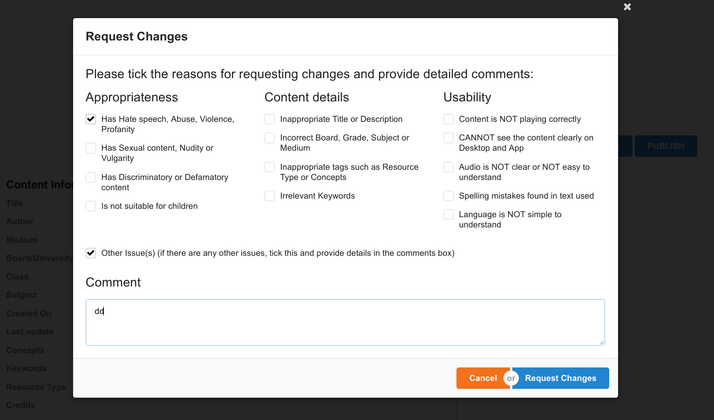

 **Background:** Make Content Review Checklist is not configurable in the portal.

 **Problem Statement:** 

Content Review Checklist is not configurable in the portal.

 **Proposed Solution:** 

It has to be made configurable.

Following are the different levels of configuration to be supported:

1.  Instance level
1.  Channel level

In case if there is a configuration at Channel level, it overrides Instance level configuration. Configuration is not mandatory.

Different configuration can be defined differently for the following content types:

1.  Course
1.  Textbook
1.  Resource and Collection

so we will keep the checklist data in FORM-API for both channel and instance level.

Use the create/update form API with the following API request

 **Sample API request for Request Changes with configuration:** 

{

  "request": {

    "type": "content",

    "action": "requestforchanges",

    "subType": "resource",

    "data": {

      "templateName": "defaultTemplate",

      "action": "requestforchanges",

      "fields": \[

        {

          "title": "Please tick the reasons for requesting changes and provide detailed comments:",

          "otherReason": "Other Issue(s) (if there are any other issues, tick this and provide details in the comments box)",

          "contents": \[

            {

              "name": "Appropriateness",

              "checkList": \[

                "Has Hate speech, Abuse, Violence, Profanity",

                "Has Sexual content, Nudity or Vulgarity",

                "Has Discriminatory or Defamatory content",

                "Is not suitable for children"

              ]

            },

            {

              "name": "Content details",

              "checkList": \[

                "Inappropriate Title or Description",

                "Incorrect Board, Grade, Subject or Medium",

                "Inappropriate tags such as Resource Type or Concepts",

                "Irrelevant Keywords"

              ]

            },

            {

              "name": "Usability",

              "checkList": \[

                "Content is NOT playing correctly",

                "CANNOT see the content clearly on Desktop and App",

                "Audio is NOT clear or NOT easy to understand",

                "Spelling mistakes found in text used",

                "Language is NOT simple to understand"

              ]

            }

          ]

        }

      ]

    }

  }

}

 **Sample API request for Publish option with configuration:** 

{

  "request": {

    "type": "content",

    "action": "publish",

    "subType": "resource",

    "data": {

      "templateName": "defaultTemplate",

      "action": "publish",

      "fields": \[

        {

          "title": "Please confirm that ALL the following items are verified (by ticking the check-boxes) before you can publish:",

          "contents": \[

            {

              "name": "Appropriateness",

              "checkList": \[

                "No Hate speech, Abuse, Violence, Profanity",

                "No Sexual content, Nudity or Vulgarity",

                "No Discrimination or Defamation",

                "Is suitable for children"

              ]

            },

            {

              "name": "Content details",

              "checkList": \[

                "Appropriate Title, Description",

                "Correct Board, Grade, Subject, Medium",

                "Appropriate tags such as Resource Type, Concepts",

                "Relevant Keywords"

              ]

            },

            {

              "name": "Usability",

              "checkList": \[

                "Content plays correctly",

                "Can see the content clearly on Desktop and App",

                "Audio (if any) is clear and easy to understand",

                "No Spelling mistakes in the text",

                "Language is simple to understand"

              ]

            }

          ]

        }

      ]

    }

  }

}

so in the above two request body we can configure the checklist on content

level by changing the subType. for ex: resource,textbook etc.

 **for Request Changes following is the UI behaviour:** 

Request Changes:

      1.If checklist is not configured in form API, it will display 'Please detail the required changes in the comments' with a comment box below. On filling the comment box it will enable the request changes button.

      2.If checklist is configured in form API, it will display the configured checklist with a comment box. Here you need to check at least 1 checkbox and write comments to enable the request changes button

      3.If API throws an error, a default error message(Something went wrong, Please try again later.) from the portal will be displayed.

 **for Publish Changes following is the UI behaviour:** 

Publish:

1.  If checklist is not configured in form API, it will only display 'Are you sure you want to publish?'. Here publish button should be enabled from default.
1. If checklist is configured in form API, it will display the configured checklist. Here you need to check all the check boxes to enable the publish button.
1. If API throws an error, a default error message(Something went wrong, Please try again later.) from the portal will be displayed.

 **Limitation:** 

if in FORM-API other Reason is not defined Other Issue(s) checklist will not show.

*****

[[category.storage-team]] 
[[category.confluence]] 
