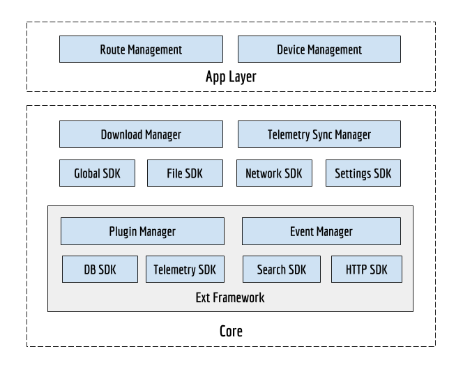

 **Introduction** The container for the OpenRAP 2.0 has been developed on top of ext-framework. The additions on top of ext-framework are:


1. SDK's like Global, Settings & Download Manager
1. While the ext-framework has been designed to add plugins within a single application, the use case of OpenRAP 2.0 is that each application is a plugin within OpenRAP. Therefore OpenRAP container has been built on top of ext-framework to support this capability

Following is the high level component diagram of OpenRAP 2.0




 **SDK** Following are SDK's built into the container.

 **Global** 
```js
/*
 * Plugin to register with the container on initialization.
 * pluginConfig = {
 *	pluginVer: String,
 *	apiToken: String,
 *	apiBaseURL: String,
 *	apiTokenRefreshFn: Function
 * }
 */
register = function(String pluginId, Object pluginConfig){};

/*
 * Get the plugin configuration.
 * @param pluginId String
 * @return pluginConfig
 */
get = function(String pluginId): pluginConfig {}
```
 **Telemetry SDK** 
```js
/* 
 * API to register a plugin and it's corresponding sync url to dispatch telemetry to.
 * config = {batchSize: 200, syncInterval: 30}
 * @param pluginId String
 * @param syncURL String - The server url to sync the telemetry to.
 * @param config Object - Telemetry sync configuration
 */
register = function(String pluginId, String syncURL, Object config){};

/* 
 * Get the telemetry SDK instance. This can be injectable when the plugin uses typescript
 * @param pluginId String
 * @return Object TelemetrySDK
 */
getInstance = function(String pluginId) : TelemetrySDK {};

/* 
 * API to log/store a telemetry event
 * @param event String
 */
send = function(String event) : Promise {};

/* 
 * API to log/store an array of telemetry events
 * @param events String[]
 */
send = function(String[] events) : Promise {};

/* 
 * API to receive a batch of telemetry events in zip stream
 * @param batchEvent String
 */
sendBatch = function(String batchEvent) : Promise {};

/* 
 * API to receive a batch of telemetry events in zip stream
 * @param events byte[] - Zip stream of the events
 */
sendBatch = function(byte[] events) : Promise {};

/* 
 * API to list the telemetry packets
 * @param status String - Get the packets based on the status
 * @return TelemetryPacket Document[]
 */
list = function(String status?) : TelemetryPacket[] {};

/* 
 * API to get the telemetry data for a given packet.
 * @param packetId String
 * @return TelemetryPacket Document
 */
get = function(String packetId): TelemetryPacket {};
 
/* 
 * API to force sync. This would create packets to be synced
 */
sync = function() : Promise {};

/* 
 * API to get the status of events/batches for a given plugin id
 * @return Object - The status of the telemetry for ex: {events: 3456, batches: 20}
 */
getStatus = function() : Promise {};
```
Usage example


```js
// Example to use telemetry SDK
telemetrySDK = TelemetrySDK.getInstance(this.manifest.id);

telemetrySDK.send({...});
telemetrySDK.send([{...}]);

telemetrySDK.sync();
```
 **File SDK** 
```js
getInstance = function(String pluginId) : FileSDK {};

mkdir = function(String path) : Promise {};

copy = function(String source, String dest) : Promise {};

mv = function(String from, String to) : Promise {};

rm = function(String file) : Promise {};

rmdir = function(String path) : Promise {};

zip = function(String path, String fileName) : Promise {};

unzip = function(String fileName, String path) : Promise {};

getAbsPath = function(String path) : String {};

watch = function(String[] paths, callback){};

```
 **Network SDK** 
```js
isNetworkAvailable = function() : boolean {};

// EVENTS
// Following are the events fired within the SDK
network:available
network:disconnected
```
Usage


```js
EventManager.on('network:available', function() {
	// Do something.
	// May be sync telemetry.
	// Fetch content updates
	// Resume content downloads
	// etc
});
```
 **Http SDK** 
```js
getInstance = function(String pluginId) : HttpSDK {};

get = function(String url, Object options) : Promise {};

post = function(String url, Object data, Object options) : Promise {};

patch = function(String url, Object data, Object options) : Promise {};

delete = function(String url, Object options) : Promise {};

head = function(String url, Object options) : Promise {};
```
 **Download Manager** Following are the APIs for the download manager. The workflow of download manager is detailed out in the next few sections.


```js
/* Method to get the instance of the download manager */
getInstance = function(String pluginId) : DownloadManager {};

/* 
 * Method to queue the download of a file
 * @param file - The file to download
 * @param path - Path to download the file
 * @return downloadId - The download id reference
 */
download = function(String file, String path) : String {};

/* 
 * Method to queue the download of a file
 * @param file - The file to download
 * @param path - Path to download the file
 * @return downloadId - The download id reference
 */
download = function(String[] files, String folder) : String {};

/* 
 * Method to get the status of the download
 * @param downloadId String
 * @return Download object 
 */
get = function(String downloadId) : DownloadObject {};

/* 
 * Method to pause the download
 * @param downloadId String
 */
pause = function(String downloadId) : Promise {};

/* 
 * Method to cancel the download
 * @param downloadId String
 */
cancel = function(String downloadId) : Promise {};

/* 
 * Method to pause all the downloads for the given plugin
 * @param downloadId String
 */
pauseAll = function() : Promise {};

/* 
 * Method to cancel all the downloads for the given plugin
 * @param downloadId String
 */
cancelAll = function() : Promise {};

/* 
 * Method to list the download queue based on the status
 * @param status String - The status of the download - Submitted, Complete, InProgress, Failed. Blank option will return all status
 * @return Array - Array of download objects
 */
list = function(String status): DownloadObject[] {};

DownloadObject = {
	id: String, // Download id
	status: String, // Submitted, InProgress, Complete, Failed.
	createdOn: Date,
	updatedOn: Date,
  	stats: {
  		totalFiles: Number, // Total files to download
		downloadedFiles: Number, // Total files downloaded so far
  		totalSize: Number, // Total number of bytes to download
  		downloadedSize: Number, // Total number of bytes downloaded so far
  	},
  	files: [{ // Status of each file within the given download
  		file: String, // File that is downloaded
  		source: String, // source from where it is downloaded
  		path: String, // Relative path where the file is downloaded to
  		size: Integer, // Total file size in bytes
  		downloaded: Integer // Downloaded until now
  	}]
}

// EVENTS
// Following are the events fired within the SDK
"<plugin>:download:complete"
EventManager.dispatch("sunbirded:download:complete", {
	id: String, // Download Id
	files: [{
		file: String, // File that is downloaded
		source: String, // source from where it is downloaded
		path: String, // Relative path where the file is downloaded to
		size: Integer // file size in bytes
	}]
});
```
 **Settings SDK** 
```js
/* 
 * Method to get the instance of the settings sdk
 */
getInstance = function(String pluginId) : SettingsSDK {};

/* 
 * Method to put the setting
 * @param key String - The key for the config/setting
 * @param value Object - The value of the setting
 */
put: function(String key, Object value) : Promise {};

/* 
 * Method to get the setting
 * @param key String - The key for the config/setting
 * @return value Object
 */
get: function(String key) : Promise {};
```
Open Questions:


* Does encryption needs to be part of container or plugin


 **Database Schema**  **plugin_registry** 
```js
{
	document: {
		"_id": String, // Plugin Id
		"config": {} // Plugin config
	},
	index: []
}
```
 **settings** 
```js
{
	document: {
		"_id": String, // Setting id
		"value": Object // Setting value
	},
	index: []
}
```
 **telemetry** A document database is created for each plugin telemetry storage -  **<plugin_id>_telemetry** 


```js
{
	document: {
		"_id": String, // mid of the event
		"event": {} // event
	},
	index: []
}
```
 **telemetry_packets** 
```js
{
	document: {
		"_id": String, // packet id
		"pluginId": String, // Plugin id the packet belongs to
		"status": String, // status of the packet. Synced/NotSynced
		"statusMsg": String, // Associated message to the status
		"createdOn": Date, // Date of packet creation
		"updatedOn": Date, // Date when the document is updated
		"size": Number, // Size of the events in the packet
		"events": [] // events
	},
	index: [pluginId, status, updatedOn]
}
```
 **download_queue** 
```js
{
	document: {
		"_id": String, // Download Id
		"pluginId": String, // Plugin id the download object belongs to
		status: String, // Submitted, InProgress, Complete, Failed.
		statusMsg: String, // Associated message to the status
		createdOn: Date,
		updatedOn: Date,
  		stats: {
  			totalFiles: Number, // Total files to download
			downloadedFiles: Number, // Total files downloaded so far
  			totalSize: Number, // Total number of bytes to download
  			downloadedSize: Number, // Total number of bytes downloaded so far
  		},
  		files: [{ // Status of each file within the given download
  			file: String, // File that is downloaded
  			source: String, // source from where it is downloaded
  			path: String, // Relative path where the file is downloaded to
  			size: Integer, // Total file size in bytes
  			downloaded: Integer // Downloaded until now
  		}]
	},
	index: [pluginId, status, updatedOn]
}
```
 **Folder Structure** Following is the folder structure of the container when it is installed on a dekstop/raspberrypi device/server


```
<app_base_dir>
	/logs
	|----/container.log
	|----/crash.log
	/<plugin_id>/
	|----/files/ // Folder where the files are either download/imported
	|--------/file1.ar // Sample file
	|----/ecars/ // Folder where the ecar files are stored
	|--------/do_1234.ecar // Ecar file
	|----/logs/ // Plugin logs
	|--------/application.log
	|--------/crash.log
	|----/content/
	|--------/<do_xxxxxx>/ // Path where the ecar files are extracted and served via http during play
	|----/telemetry_archived/
	|--------/<packet_id>.json // Archived telemetry files that are either exported or synced.
```
 **Download Manager** 

Below explains the process of downloading content when a user request for it, the steps are 


1. Download Manager is initialised with config and will be ready to take the request
1. When a user request for the download Sunbird Ed Plugin forward request to download Queue
1. If download manager is available it will download the content and once it is download
1.  It will raise an event and plugin will listen to that event
1. With event data it will extract the ECAR and index the content in content database


At low level the download manager works as


1. When it starts downloading it creates  **<filename>.sud**  and  **<filename>.<n>.partial(s)**  files, <filename>.sud file contains the meta data about file.
1. If internet is disconnected or system got shut down  then it will pause the download
1. When the internet is connected again or system restarted it will read the file  **.sud **  and continue the download from where it left
1. When the file is download completed then it combines all the partials and creates final ECAR file.

For more details you can refer [su-downloader3](https://www.npmjs.com/package/su-downloader3)


 **Telemetry Sync** 

 **Telemetry Events** <To be done>


 **Logging** <To be done>


*****

[[category.storage-team]] 
[[category.confluence]] 
