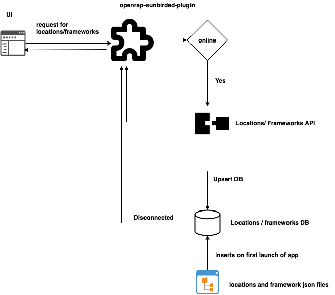

## Context
The current desktop application is generic for all states - and a user has to spend time filtering through a set of boards, mediums, classes, and subjects every time they land on the app to get content that is relevant for them to solve this problem we will ask the user to input the framework preference and location so that we can show the relevant content to the user. The user location is required to pull the reports of usage of the app by location level.





## Schema


Users
```js
{
  "id": String
  "name": String // “guest” for first user and unique and lower case
  "formattedName":  String // user entered name
  "framework": {
    "board": String,
    "medium": Array<string>,
    "gradeLevel": Array<string>
  }
  index: [“name”]
}
```


### Locations

```
{
 "id": String,
 "type": String, 
 "code": String,
 "name": String,
 "data": Array
index: [name]
}
```


location information will be stored in settings DB since each device belongs one location and it will be added to the device registry spec when it is available below is the storage structure of the location data for a device


```js
{
  id: String
  doc: {
    "state": Object, 
    "city": Object
  }
}
```


## User SDK


```js
	getInstance = function(String pluginId) : UserSDK {};
	
	create(user: IUser) {

	}

	read = function(name?: String = “guest”) : Promise<IUser>{

	}


```

## Telemetry Events


LOG event for locations API

LOG event for user register API

ERROR events on locations or user save 

IMPRESSION event for content preference page load

IMPRESSION event for location onboarding page load

INTERACT event for framework submit button click

INTERACT event for location submit button click


## 

Design review comments
We will store the locations and frameworks data in the database and always refer from it, not from the file system we will introduce the reset button. if anything is corrupted in DB to reset the app


*****

[[category.storage-team]] 
[[category.confluence]] 
