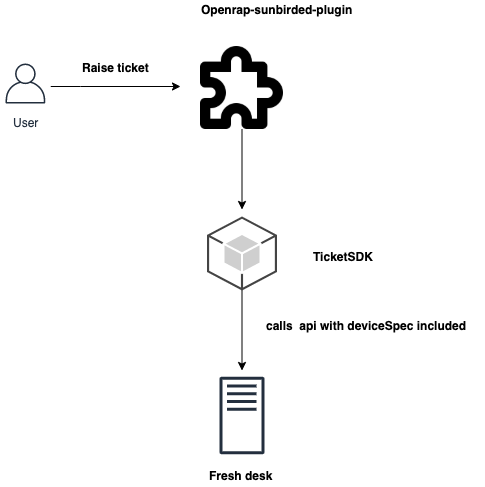
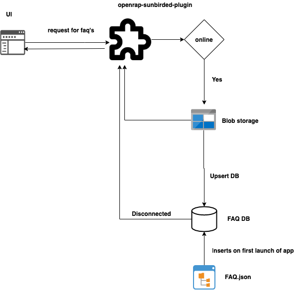

## 

Background 
Owing to the difficulty of supporting pure offline machines at scale through a support desk, the goal is to improve the desktop app setup and recovery mechanisms so that they are self-manageable. The first step in this direction is to provide support mechanisms for intermittently connected devices that use the desktop app. 


Design problem - Raise a support ticket


User can raise a support ticket if they won't get a resolution for the queries from FAQ or videos displayed to them as part of this they will raise a fresh desk ticket with the following data here we are assuming that user should be online to raise a support ticket and below is the ticket format





we will be using the [Node Freshdesk SDK](https://www.npmjs.com/package/freshdesk-api) to create the ticket below is the example 


```
const freshdesk = new Freshdesk('https://yourdomain.freshdesk.com', 'yourApiKey')
freshdesk.createTicket({
	name: 'test ticket',
    email: 'test@test.com',
    subject: 'test sub',
    description: 'test description',
    status: 2,
    priority: 2,
    attachments: [
    	fs.createReadStream('/deviceSpec.json')
    ]
}, function (err, data) {
    console.log(err || data)
})
```


### Device Spec


```
{
"id": “4d6ff1bcda8f681b0c931e4c11adb66ac8bade25329da17925c846264c8c104b”,
"platform": "Darwin",
"distro": "Mac OS X",
"osVersion": "10.14.2",
"arch": "x64",
"totalMemory": 8589934592,
"availableMemory": 6182776832,
"cores": 4,
"cpuManufacturer": "Intel®",
"cpuBrand": "Core™ i5-7360U",
"totalHarddisk": 250685575168,
"availableHarddisk": 113083383808,
"hasBattery": true,
"cpuSpeed": "2.30",
"cpuLoad": 45.18,
“avgCPULoad: 12.12,
"systemTime": 1571985802602,
"displayResolution": "2560*1600",
"servicePack": "Service Pack 1",
"appVersion": "1.0.0",
"appId": "prod.sunbird.desktop"
"networkInfo": [ { iface: 'lo0',
    ifaceName: 'lo0',
    ip4: '127.94.0.1',
    ip6: '::1',
    mac: '',
    internal: true,
    operstate: 'down',
    type: 'wired',
    duplex: 'full',
    mtu: 16384,
    speed: -1,
    carrierChanges: 0 },
  { iface: 'en0',
    ifaceName: 'en0',
    ip4: '172.16.0.109',
    ip6: 'fe80::10a7:58bd:a467:b7d3',
    mac: '38:f9:d3:6d:62:14',
    internal: false,
    operstate: 'up',
    type: 'wireless',
    duplex: 'full',
    mtu: 1500,
    speed: 213.18,
    carrierChanges: 0 },
  { iface: 'awdl0',
    ifaceName: 'awdl0',
    ip4: '',
    ip6: 'fe80::301c:30ff:fe5e:feb5',
    mac: '32:1c:30:5e:fe:b5',
    internal: false,
    operstate: 'up',
    type: 'wireless',
    duplex: 'full',
    mtu: 1484,
    speed: 10,
    carrierChanges: 0 },
  { iface: 'utun0',
    ifaceName: 'utun0',
    ip4: '',
    ip6: 'fe80::e183:d9b2:7535:cb5a',
    mac: '',
    internal: false,
    operstate: 'down',
    type: 'wired',
    duplex: 'full',
    mtu: 2000,
    speed: -1,
    carrierChanges: 0 } ]
}


```


Telemetry Events


LOG Event for sync

ERROR Event for sync fail

API access event for raise ticket API call

INTERACT event for raise ticket button click

INTERACT event for submit issue button click

AssumptionsUser can raise the ticket only when they are connected to the internet


Design problem - FAQ 


We will be using the common consumption UI FAQ component and how we can manage and store the FAQ data model and access explained below





## Schema


```js
{
id: String,
lang: String,
data:  Object
index: [lang]
}
```


Telemetry Events

LOG events for faq API access

IMPRESSION event for help page load

INTERACT event video click with cdata video id and type

INTERACT event help menu button click

INTERACT event question click with the question as cdata

INTERACT event help answer yes or no  with the question as cdata

RESPONSE event for No step with cdata as the value entered

INTERACT event for report issue button click

INTERACT event for submit issue button  with extra  with body


## Design review comments


*****

[[category.storage-team]] 
[[category.confluence]] 
