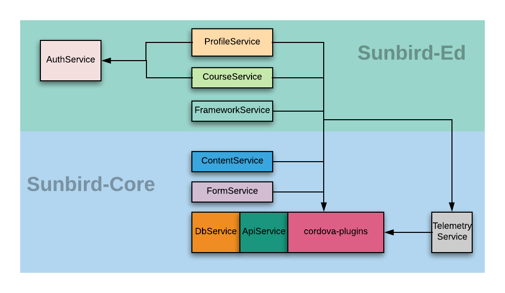
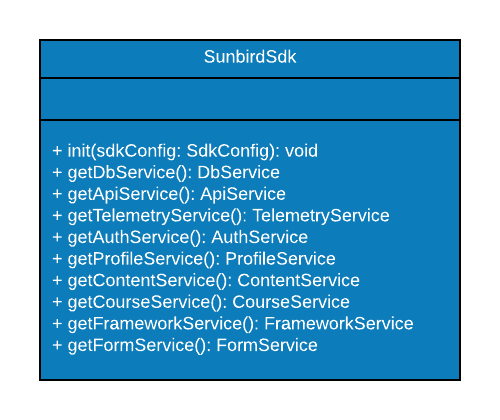
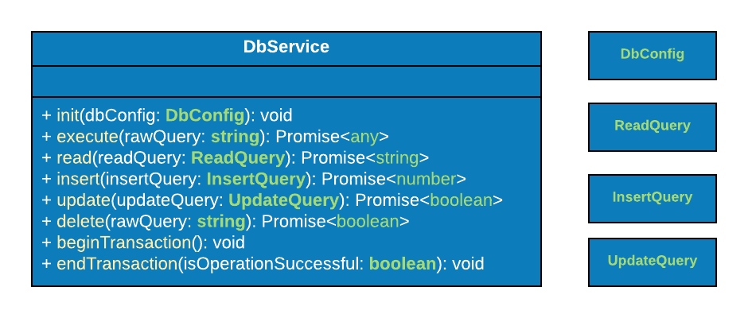

Sunbird Mobile Sdk serves as the single module for all the business logic of sunbird mobile application. It's primary functionality is designed to satisfy the business needs of the SunbirdEd mobile app; but this library can easily integrated with any other adopter of the sunbird.

The sdk is built using a layered architecture which is described in the following diagram - 

All the services are exposed through the SunbirdSdk class. SunbirdSdk should be initialised (with calling init()) at the very beginning of the app launch; whenever the app receives the cordova platform ready event.   

 **DbService** This provides an interface to perform CRUD operation in SQlite database. It uses a custom cordova plugin which provides the native interfaces for mobile devices.

 **sunbird-plugin-db:**  A custom cordova plugin which uses the native sdk to provide CRUD operation in sqlite database.

 **ApiService** 

 **AuthService** 

 **ProfileService** 

*****

[[category.storage-team]] 
[[category.confluence]] 
