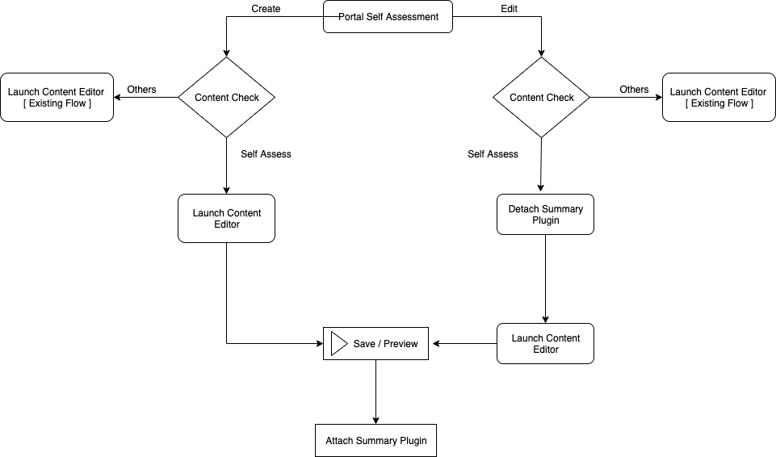
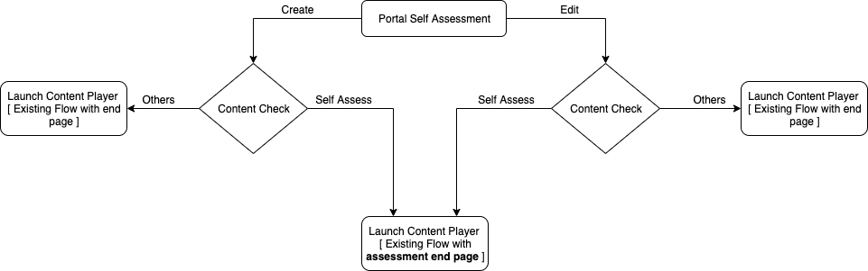

 **Introduction:** This document is an approach not from content framework to solve the creation of self-assessment from the user’s workspace 

 **Background:** Jira issue:  [https://project-sunbird.atlassian.net/browse/SB-17128](https://project-sunbird.atlassian.net/browse/SB-17128)

 **Problem Statement:** Currently, an Assessment is created as a two-step process and most of the activities are done in the back end. Content is created with type as "Resource" which is reviewed and published and later the content type is changed to "Self-Assess” and made available to the user. Instead, the whole creation and publishing process should happen from the portal 

 **Solution 1:** Handling on editor side(adding summary slide into content)

Whenever the content editor will create content as self-assessment content, we will extend the ECML with a new stage block which contains the summary plugin.

If content editor edits the same content we will hide the stage from the content editor and after saving we will add the stage again.



Stage ECML sample


```xml
<stage w="100" x="0" h="100" y="0" id="3a52e8ee-349c-49de-b5da-a6a47b268218">
        <config>
            <![CDATA[{"opacity":100,"strokeWidth":1,"stroke":"rgba(255, 255, 255, 0)","autoplay":false,"visible":true,"color":"#FFFFFF","genieControls":false,"instructions":""}]] >
        </config>
        <param name="previous" value="59e8bd17-86ad-4043-b340-18c9d9862a5c"></param>
        <org.ekstep.summary rotate="0" z-index="0" w="77.45" x="4.61" h="125.53" y="-29.38" id="45ecdc54-ce1d-48cd-a5a4-808c03ee12e2">
            <config>
                <![CDATA[{"opacity":100,"strokeWidth":1,"stroke":"rgba(255, 255, 255, 0)","autoplay":false,"visible":true}]] >
            </config>
        </org.ekstep.summary>
        <manifest>
            <media assetId="summaryImage"></media>
        </manifest>
  </stage>
```
 **Pros:** 


* Easy to implement. A simple change on the content creation side(editor).


* Any summary plugin fixes will reflect on the new/edit contents immediately. (without user concern)


 **Cons:** 


* Any fixes of the summary plugin require plugin publish & will work only for the contents creating after plugin publish. Older contents need to edit & republish to get fixes of the summary plugin.


* This is the core plugin changes(Stage plugin), any issues will have a huge impact on other contents as well.


* If the user explicitly adding this plugin to the last stage, then he will see 2 stages with the summary plugin. Which he doesn’t have any info why it is showing twice.


* We should know how many contents created with this plugin(using telemetry). So that any update of the plugin can be updated to all the contents.


* Any fixes of the content require course republish as well. Also, the user has to update the course to get the latest changes to the course(self-assess content).


 **Solution 2:** Handling on consumption side as an end-page plugin(merging summary plugin & end page)we can club the summary and end page plugin which will behave as an assessment end page plugin. Based on the config received by the player we will switch the end page. 



 **Pros:** 


* We do not need to change content editor code for a new content type, just a plugin change will suffice this requirement. 


* Existing content will work as it is \[ if content-type is a resource, not self assess ] just that while editing it will show one last slide as the summary plugin


* Any addition in the future on the assessment parameter will get handled by the assessment end-page plugin.  


* Any fixes of the self-assess content don’t require course/content republish. It will work for all old & new contents in the updated/new version of the app(which has summary plugin fixes)


 **Cons** : 


* For old content migration, we will have to remove the summary plugin from existing content \[ Migration task size will be a function of total content ] 


* Any fixes of the summary plugin will be available only in the updated version of the app. Because the summary plugin is the core plugin of the content-player. 


We can look for a hardcode push option to push summary plugin changes directly without app updates.


 **Note:** 

Existing contents have to fix(remove the last slide). Else edit/copy of any existing will be having duplicate slides of the summary plugin. 

Solution: Manually fix the content body(because of limited contents <10) or write patch script on the editor to handle these contents.


*****

[[category.storage-team]] 
[[category.confluence]] 
