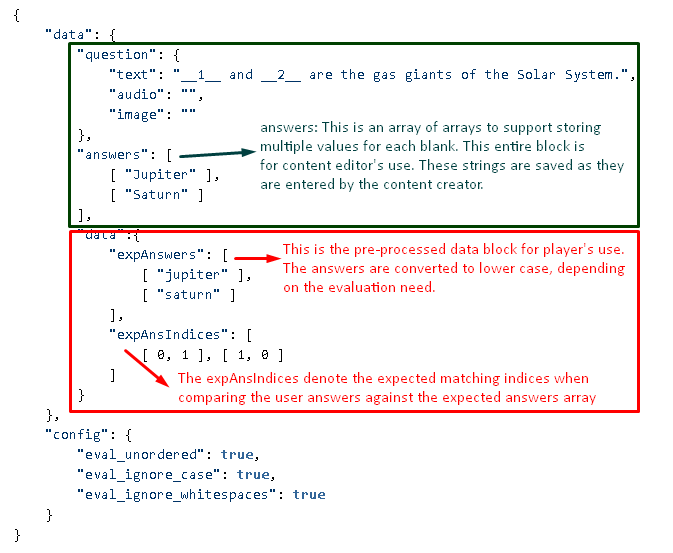

## Data Model

### Example 1

```js
{
    "data": {
        "question": {
            "text": "Complete the sequence: 21, 23, __1__, __2__, 29",
            "audio": "",
            "image": ""
        },
        "answers": [
            [ "25" ],
            [ "27" ]
        ],
        "data":{
            "expAnswers": [
                [ "25" ],
                [ "27" ]
            ],
            "expAnsIndices": [ 
                [ 0, 1 ]
            ]
        }
    },
    "config": {
        "eval_unordered": false,
        "eval_ignore_case": true,
        "eval_ignore_whitespaces": true
    }
}
```

### Example 2

```js
{
    "data": {
        "question": {
            "text": "__1__ and __2__ are the gas giants of the Solar System.",
            "audio": "",
            "image": ""
        },
        "answers": [
            [ "Jupiter" ],
            [ "Saturn" ]
        ],
        "data":{
            "expAnswers": [
                [ "jupiter" ],
                [ "saturn" ]
            ],
            "expAnsIndices": [ 
                [ 0, 1 ], [ 1, 0 ]
            ]
        }
    },
    "config": {
        "eval_unordered": true,
        "eval_ignore_case": true,
        "eval_ignore_whitespaces": true
    }
}
```

### Example 3

```js
{
    "data": {
        "question": {
            "text": "Name any two south Indian states: __1__, __2__",
            "audio": "",
            "image": ""
        },
        "answers": [
            [ "Tamil Nadu", "TN", "Tamil Nad" ],
            [ "Andhra Pradesh", "AP", "Andra", "Andrapradesh" ],
            [ "Kerala", "Kerela", "KL" ],
            [ "Telungana", "Telangana", "TS" ],
            [ "Karnataka", "KA" ]
        ],
        "data":{
            "expAnswers": [
                [ "tamilnadu", "tn", "tamilnad" ],
                [ "andhrapradesh", "ap", "andra", "andrapradesh" ],
                [ "kerala", "kerela", "kl" ],
                [ "telungana", "telangana", "ts" ],
                [ "karnataka", "ks" ]
            ],
            "expAnsIndices": [ 
                [ 0, 1 ], [ 0, 2 ], [ 1, 2 ], [ 0, 3 ], [ 1, 3 ], [ 2, 3 ], [ 0, 4 ], [ 1, 4 ], [ 2, 4 ], [ 3, 4 ]
            ]
        }
    },
    "config": {
        "eval_unordered": true,
        "eval_ignore_case": true,
        "eval_ignore_whitespaces": true
    }
}
```

### Example 4

```js
{
    "data": {
        "question": {
            "text": "__1__ is a gas giant in the Solar system. __2__ is its moon.",
            "audio": "",
            "image": ""
        },
        "answers": [
            [ "Jupiter" ],
            [ "Io", "Europa", "Ganymede", "Callisto" ],
            [ "Saturn" ],
            [ "Mimas", "Enceladus", "Tethys", "Dione", "Rhea", "Titan", "Iapetus" ]
        ],
        "data":{
            "expAnswers": [
                [ "jupiter" ],
                [ "io", "europa", "ganymede", "callisto" ],
                [ "saturn" ],
                [ "mimas", "enceladus", "tethys", "dione", "rhea", "titan", "iapetus" ]
            ],
            "expAnsIndices": [ 
                [ 0, 1 ], [ 2, 3 ]
            ]
        }
    },
    "config": {
        "eval_unordered": false,
        "eval_ignore_case": true,
        "eval_ignore_whitespaces": true
    }
}
```

### Evaluation logic

### Pseudo Code (Err.. Actual test code!)

```js
function evaluate(answers) {
    // preprocess user answers - remove embedded white spaces, and convert to lower case, based on the config
    answers = _.map(answers, function (a) {
        var ans = a;
        if (qData.config.eval_ignore_whitespaces)
            ans = ans.trim().replace(/\s/g, '');
        if (qData.config.eval_ignore_case)
            ans = ans.toLowerCase();
        return ans;
    });

    // get user answer indices. (this is the index in the expAnswers array in which a match is found, 
    // -1 if no match found)
    var userAnsIndices = _.map(answers, function (answer) {
        return _.findIndex(qData.data.data.expAnswers, function (expAns) {
            return _.contains(expAns, answer);
        });
    });

    // Sort the userAnsIndices array elements in case if unordered evaluation
    if (qData.config.eval_unordered)
        userAnsIndices = _.sortBy(userAnsIndices, function (u) { return u });

    // if the userAnsIndices are found in the expAnsIndices, then the question is sovled!
    var isSolved = _.some(qData.data.data.expAnsIndices, function (expAns) {
        return _.isEqual(expAns, userAnsIndices);
    });
    var score = isSolved ? userAnsIndices.length : 0;
	// compute partial score, if partial scoring is enabled in config
    if (!isSolved && qData.config.partial_score) {
        var scoreMap = _.map(userAnsIndices, function (u, i) {
            return _.some(qData.data.data.expAnsIndices, function (expAns) {
                return qData.config.eval_unordered ? _.contains(expAns, u) : (expAns[i] == u);
            }) ? 1 : 0;
        });
        score = _.reduce(scoreMap, function (memo, num) { return memo + num; }, 0);
    }
    console.log('Solved', isSolved);
    console.log('Score', score / userAnsIndices.length);
}


```
Test code location: [https://github.com/ramj-funtoot/groupeval](https://github.com/ramj-funtoot/groupeval)

no100%hidemiddle800px

[Run the REPL](https://ftb-groupeval.ramjayaraman.repl.run/)


*****

[[category.storage-team]] 
[[category.confluence]] 
