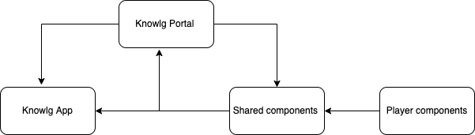

# Introduction
This wiki explains the design and implementation of pdf players for mobile devices.. 

[KN-17 System JIRA](https:///browse/KN-17)

## Background:
 As of now we are experiencing content players player as part of the sunbirded mobile app , to make our building block independent and to test mobile specific features we need mobile build to test with minimal capabilities. 

## Problem Statement:
how to verify resolution and alignments of content players in mobile devices. 

## Key design problems:

* How to launch the content player in new ionic app

* how to generate APK ?

* How can we push content player changes to APK ?

* How to play(online & offline) the content in mobile  ?

* how to pull the latest changes of the content(content versions)

* How to verify the telemetry events  

* How to distribute APK to tester 

## Solution1:

Design: 

.png)
## Solution:

* We are using the ionic framework to render the player and its[link](https://ionicframework.com/docs/intro/cli).

* using ionic version of 6.1.9 and node js version is 14 onwards

* We can have players like pdf ,video and epub and we can implement different components each.

* In the players list component we can have the list of the players

* In the content list component we can have hardcoded list contents as of now , based on player selected in player list component

* We can have new version of apk to get latest changes.

* The player component will load the player with selected content from the list.

* The player component will be integrated with respected players and the pdf player will be integrated in the pdf player component and follow the[steps](https://github.com/project-sunbird/sunbird-pdf-player#pdf-player-library-for-sunbird-platform).

* We can have an apk link in the microsite so that it will be accessible to testers and adopters.

 **Pros:** 
* Its easy to implement 

* we can have different components for different players 

 **Cons:** 
* We are supporting only landscape mode , not supporting portrait mode

* As of now we are rendering a contents list from hardcoded data.

    

## Solution2:

## design:

## Solution:

* We are using the ionic framework to render the player and its[link](https://ionicframework.com/docs/intro/cli).

* using ionic version of 6.1.9 and node js version is 14 onwards

* We can have one landing component , it has the explore button

* After clicking on explore button , opening the [knowledge portal](https://dev.knowlg.sunbird.org/) application in mobile app using in app browser [plug](https://ionicframework.com/docs/native/in-app-browser/#angular) in provided by ionic framework.

 **Pros:** 
* Its easy to implement 

* We can explore all the content players like pdf, epub and video

* Faster the development process.

* Any fixes or changes in portal will impact easily in mobile app.  

 **Cons:** 
* The knowledge portal is not responsive so it will impact the same here.

* Knowledge portal also has the editors link so those we need handle in mobile view.

* If portal application is down , then mobile app also will not work.

## Solution3: 
We can use existing [sunbird mobile application](https://github.com/Sunbird-Ed/SunbirdEd-mobile-app) as the one more approach 

 **Pros:** 
* Its easy to implement 

* We can easily change players version and test our changes 

* Faster the development process.

 **Cons:** 
* have some predefined forms in mobile app and on boarding configuration, those forms configurations are not there in our building block.

* if we want use existing mobile app as it is we need have/follow these[ installations steps](http://docs.sunbird.org/latest/developer-docs/mobile-app-installation/).

* If we use existing mobile app as it is, so any changes in [configurations](http://docs.sunbird.org/latest/developer-docs/mobile-app-installation/mobile_app_forms/index.html) or api’s , will through error if we not onboard those new changes.

* if we want use latest versions of the mobile app ,  then we to make related changes in that version in our building block(configuration , api’s).

* If we don’t want some of other modules , then cleaning up of existing code is very difficult. 

* The app size will be more as we use existing mobile application because it has lot of modules.

## Solution4: 

* We need to use existing knowlg portal application 

* In this application we need create 3 modules to it. and which are portal related one module, mobile related changes in one module , and the common changes are into common/shared module.

* For portal related changes into portal module and along with shared module when we build portal related changes only comes. 

* Similarly , for mobile related changes into mobile module and along with shared module when we build mobile  related changes only comes.

* The shared module having changes which are shared between portal and mobile application.

* References links [https://devdactic.com/ionic-multi-app-shared-library/](https://devdactic.com/ionic-multi-app-shared-library/)

## design:

*****

[[category.storage-team]] 
[[category.confluence]] 
