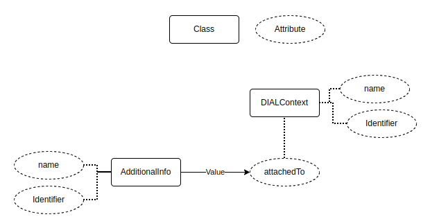
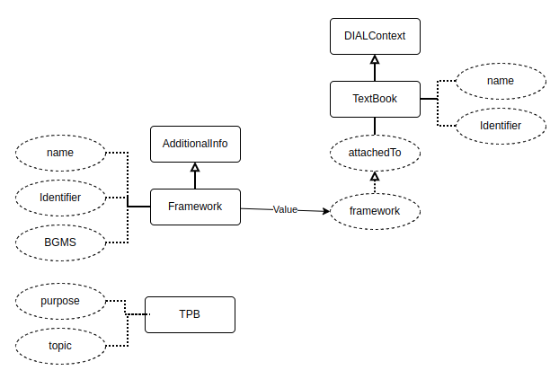
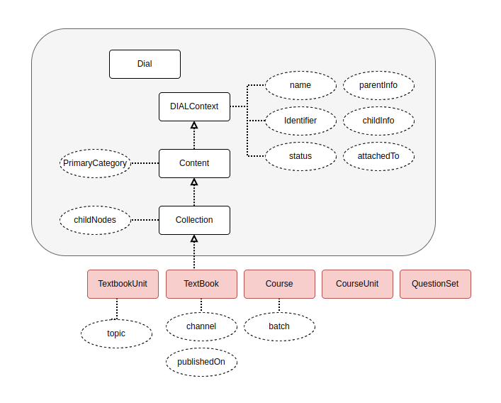

  * [Introduction](#introduction)
  * [Background](#background)
  * [Problem Statement](#problem-statement)
  * [Key design problems](#key-design-problems)
  * [Solution 1](#solution-1)
    * [Content-publish job Config](#content-publish-job-config)
    * [Flink job](#flink-job)
    * [Kafka topic](#kafka-topic)
    * [Kafka event](#kafka-event)
    * [Sample curl to read root and unit metadata](#sample-curl-to-read-root-and-unit-metadata)
  * [Solution 2](#solution-2)
  * [Pros & Cons](#pros-&-cons)
  * [Reference Links](#reference-links)

## Introduction
This document describes how to update the DIAL code context in content-service.


## Background
At present, the dial-service is not storing any information/context about the DIAL code linked to what(ex Textbook, Textbook unit, etc). So if we want to get the DIAL code context information we should always use the content-search API to get the DIAL code linked content details.

If we want to extend the use-case to Bazaar, using DIAL code scan if they want to get the context(like BGMS etc) information to show the relevant contents which adopters having is not possible at the moment.

Discussion: [https://github.com/sunbird-specs/DIAL-specs/discussions/2](https://github.com/sunbird-specs/DIAL-specs/discussions/2)


## Problem Statement
After successful linking the DIAL code, update the context information to the DIAL code to which it is linked using update DIAL code API.


## Key design problems
How to update the context information to DIAL code to which it is linked?

How to decouple the content-service from DIAL code context?


As part of solution, JSON-LD vocabulary for dialcode context (Example: https://raw.githubusercontent.com/vinukumar-vs/json-ld/dial/schema/schema.jsonld) will be defined by sunbird. Any adopter can extend the base schema.jsonld to extend and define their own dialcode context schema vocabulary. (Example for Sunbird-ed:  ttps://raw.githubusercontent.com/vinukumar-vs/json-ld/dial/schema/sbed/schema.jsonld)


## Solution 1
Push the event to kafka after successful publishing the content/collection and process the kafka event by flink job.

Note: Only for the LIVE content, context will be updating. For the DRAFT content, context will not be updating. 
### Content-publish job Config
Default value will be set as false in content-publish job config


```json
dialcode.context.update.enabled = true
kafka.topics.dialcode.context.update = "{{env}}.dialcode.context.job.request"
```

### Flink job
Name of the flink job - update-dialcode-context


### Kafka topic

```json
kafka {
  input.topic = "{{env}}.dialcode.context.job.request"
  groupId = "{{env}}-dialcode-group"
}
```

### Kafka event

```json
{
  "eid": "BE_JOB_REQUEST",
  "ets": 1648720639981,
  "mid": "LP.1648720639981.d6b1d8c8-7a4a-483a-b83a-b752bede648c",
  "actor": {
    "id": "DIAL code context update Job",
    "type": "System"
  },
  "context": {
    "pdata": {
      "ver": "1.0",
      "id": "org.sunbird.platform"
    },
    "channel": "01269878797503692810",
    "env": "dev"
  },
  "object": {
    "ver": "1.0",
    "id": "<DIAL_CODE>"
  },
  "edata": {
    "action": "dialcode-context-update",
    "iteration": 1,
    "dialcode": "<DIAL_CODE>",
    "identifier": "<do_id>", // to which DIAL code is linked. It may be root or unit. If it's unit then root do_id will be fetched in flink job. 
    "traceId": "2342345345"
  }
}
```
DIAL code context configDIAL service will be having Sunbird(sb) & Sunbird-Ed(sbed) JSON-LD schema.jsonld & context.json files.


The schema & context objects are added for Sunbird & Sunbird-Ed in the below reference links

[Sunbird](https://github.com/vinukumar-vs/json-ld/tree/dial/schema/sb) => sb/schema.jsonld & sb/context.json

[Sunbrid-Ed](https://github.com/vinukumar-vs/json-ld/tree/dial/schema/sbed) => sbed/schema.json & sbed.context.json



The content service will be generating the request based on the mapping object configured for content-service.

The reference to JSON-LD schema is based on @type & attribute names defined in the service configuration should be the same as defined in json-ld schema file.

 **Key points:** 
* To map DIAL service JSON-LD schema properties to mapping object configured for content-service we follow below format


```
"primary_category": {
    "jsonldContextAttribute": "ContentMetadataPropety"
}
```

    * every @type of JSON-LD should be having respective object with the name same as primaryCategory name.


    * The reference primaryCategory object(“primary_category")  defined in the mapping object attributes/key should be same as JSON-LD schema attributes


    * The value string of each attribute will be used as reference key to read from metadata response of the collection/content.

    


    
* The content-service mapping object key names should be same as primaryCategory name(with sluggified to lowercase string). ex: Digital Textbook => digital_textbook.

    example:


|  **PrimaryCategory**  |  **Maping Object attribute**  | 
|  --- |  --- | 
| Digital Textbook | digital_textbook | 
| Course | course | 


* The mapping object with the attribute starts with “@” will be ignored by content-service. Will be added as is with key & value. This is used to define @type property(of JSON-LD) for the specific object.

    example:


```
"digital_textbook": {
   "@type": "sbed:TextBook"
}
```


* “$ref” attribute is used to refer to internal objects as reference.  If “$ref” is used without attribute then all the attributed of the refernce object will be atted at the respective root level. If 

    ”$ref” is assiged to a specific attribute, then the attribute will be carried with reference object as a value.

    example:


|  **Mapping object configured for content-service**  |  **Expected output generated by content-service**  | 
|  --- |  --- | 
| “$defs”: {     “collection”: {          “identifier”: “intentifier”,         “name”: “name”     } }, “digital_textbook”: {      “@type”: “sbed:TextBook”     “$ref”: “#/$defs/collection” } | “digital_textbook” : {      “@type”: “sbed:TextBook”,       “identifier”: “intentifier”,       “name”: “name” } | 
| “$defs”: {     “framework”: {          “identifier”:  “framework”,         “borad”:  “board”,         “class”: “gradeLevel”     } }, “digital_textbook”: {      “@type”: “sbed:TextBook”,     “framework”: { “$ref”:  “#/$defs/framework” } } | “digital_textbook”: {      “@type”:  “sbed:TextBook”,     “framework”: {          “identifier”:  “K-12”,         “borad”:  “NCERT”,         “class”:  “Class 5”     } } | 


Sample DIAL code context


```
{
  "@context": {
      "scheme": "http://schema.org",
      "sb": "https://raw.githubusercontent.com/vinukumar-vs/json-ld/dial/schema/sb/schema.jsonld#",
      "sbed": "https://raw.githubusercontent.com/vinukumar-vs/json-ld/dial/schema/sbed/schema.jsonld#",
      "dialcode": {
        "@id": "sb:DIALcode#DIAL",
        "@type": "sb:DIALcode"
      },
      "context": {
        "@id": "sb:DIALContext#TextbookUnit",
        "@type": "sb:DIALContext"
      },
      "childInfo": {
        "@id": "sb:isChildOf#TextbookUnit",
        "@type": "sb:isChildOf"
      },
      "parentInfo": {
        "@id": "sb:parentInfo#Textbook",
        "@type": "sbed:parentInfo"
      },
      "framework": "sbed:framework",
    
      "identifier": "sb:identifier",
      "name": "schema:name",
      "board": "sbed:board",
      "medium": "sbed:medium",
      "gradeLevel": "sbed:gradeLevel",
      "subject": "sbed:subject"
  },
 
 
  "dialcode": {
    "@id": "https://sunbird.org/DIAL/SV83F5",
    "@type": "sb:DIALcode",
    "identifier": "SV83F5",
    "batchCode": "1334",
    "name": "xyz",
    "status": "Live",
    "context": {
      "@id": "https://dev.sunbirded.org/content/do_2345",
      "@type": "sbed:TextBookUnit",
      "name": "Chapter name",
      "parentInfo": {
        "@id": "https://dev.sunbirded.org/collection/do_1234",
        "@type": "sbed:TextBook",
        "identifier": "do_1234",
        "name": "Textbook Name",
        "framework": {
          "@type": "sbed:Framework",          
          "board": "CBSE",
          "medium": "English",
          "gradeLevel": "Class 1",
          "subject": "Maths"
        }
      }
    }
   }
}
```

### Sample curl to read root and unit metadata

```
curl --location --request POST 'https://dev.sunbirded.org/api/content/v1/search' \
--header 'Content-Type: application/json' \
--data-raw '{
    "request": {
        "filters": {
            "visibility": ["Default","Parent"],
            "dialcodes":["0117CH01"]
        },
        "mode": "Collection",
        "fields": ["identifier","name","primaryCategory"]
    }
}'
```


dialcode-context-updater flink job will read the context information to be updated into a DIAL context using the  **contextMapping.json** file part of the flink job **:** 


```
{
    "$defs": {
        "content": {
            "@type": "sb-ed:Content",
            "identifier": "identifier",
            "name": "name",
            "status": "status",
            "channel": "channel",
            "publishedOn": "publishedOn",
            "primaryCategory": "primaryCategory"
        },
        "collection": {
            "@type": "sb-ed:Collection",
            "identifier": "identifier",
            "name": "name",
            "status": "status",
            "channel": "channel",
            "publishedOn": "publishedOn",
            "primaryCategory": "primaryCategory"
        },
        "collectionUnit": {
            "@type": "sb-ed:CollectionUnit",
            "identifier": "identifier",
            "name": "name"
        },
        "framework": {
            "@type": "sb-ed:Framework",
            "identifier": "framework",
            "board": "board",
            "medium": "medium",
            "class": "gradeLevel",
            "subject": "subject",
            "topic": "topic",
            "learningOutcome": "learningOutcome",
            "purpose": "purpose"
        }
    },
    "digital_textbook": {
        "@type": "sb-ed:TextBook",
        "$ref": "#/$defs/collection",
        "framework" : { "$ref" : "#/$defs/framework" }
    },
    "textbook_unit": {
        "@type": "sb-ed:TextBookUnit",
        "$ref": "#/$defs/collectionUnit",
        "parentInfo": {"$ref": "#/digital_textbook"}
    },
    "course": {
        "@type": "sb-ed:Course",
        "$ref": "#/$defs/collection",
        "framework": "#/$defs/framework"
    },
    "course_unit": {
        "@type": "sb-ed:CourseUnit",
        "$ref": "#/$defs/collectionUnit",
        "parentInfo": {"$ref": "#/course" }
    }
} 
```


fields in the contextMapping.json file will be of the format, 


```
"JSONLD_Property_Name" : "Sunbird_Content_Schema_Property_Name"
```

## Solution 2
After the successful linking the DIAL code call the update DIAL code API from content-service to update the DIAL code context.

Use the [DIAL code context config](https://project-sunbird.atlassian.net/wiki/spaces/SBDES/pages/3139141633/Update+the+DIAL+code+context+in+content-service#DIAL-code-context-config).


## Pros & Cons


|  |  **Pros**  |  **Cons**  | 
|  --- |  --- |  --- | 
| Solution 1 | <ul><li>It will happen asynchronously. It will not block the thread.

</li><li>There are no code changes are required in content-service when updating the DIAL code context.

</li><li>Adopter can write the update DIAL code context logic in this flink job or can have their own flink job and process the kafka event.

</li><li>It’s a scalable solution.

</li></ul> | <ul><li>New flink job needs to implement.

</li></ul> | 
| Solution 2 | <ul><li>Implementation will be fast because code will be implemented within the existing link DIAL code block.

</li></ul> | <ul><li>Adopter needs to do the code changes in content-service for DIAL code context update when it requires.

</li><li>There will be tight dependency on the content-service code which may not used by any adopter.

</li><li>Adopters may not be knowing the code change until they are not going through the complete code.

</li><li>It’s not a scalable solution.

</li></ul> | 


## Reference Links

* [[Dialcode context|Dialcode-context]]


* [[How to define the schema and context for a DIAL?|How-to-define-the-schema-and-context-for-a-DIAL-]]


*****

[[category.storage-team]] 
[[category.confluence]] 
