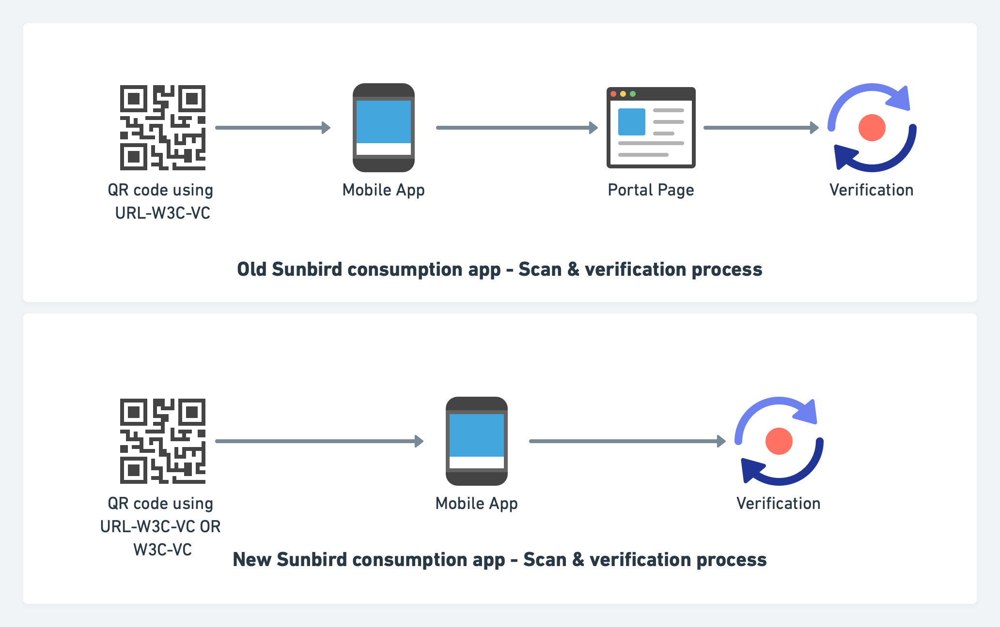

## Introduction:
Sunbird Lern BB is migrating to use Sunbird RC for generating & issuing e-credentials in its use cases (e.g.: course completion certificate). When a printable version of the certificate (PDF or SVG) is generated by Sunbird RC, the QR code in the PDF/SVG contains the certificate JSON data encoded in it. This is different from the current implementation in Sunbird Lern which encodes a URL in the QR code.  

Sunbird Ed consumption app has implementation to verify the certificates by scanning the QR codes on the certificate PDF/SVG file. However, the consumption app assumes that the QR code is always a URL and redirects the user to that URL. And currently, some of the Sunbird adopters have millions of active installs of this version of Sunbird consumption app.

When new certificates are generated with QR codes that do not contain a URL, this version of Sunbird mobile app will not be able to parse it and throws an error. This wiki provides the details of current Sunbird RC implementation and proposed changes to QR code generation & verification so that backward compatibility issues are addressed.


## Problem statement:
The current Sunbird consumption app QR code scanner assumes that the scanned QR code is always a URL and it redirects to that path for further processing. But, in the case of Sunbird RC, the QR code gives a JSON object (W3C VC). So, the consumption app defines it as an invalid QR code.

So, we should have a QR code from Sunbird RC in the printable credential object which works with the existing consumption apps.

The below table explains the details about the QR code from existing implementation and from Sunbird RC.


|  **Context**  |  **Format**  |  **Details**  | 
|  --- |  --- |  --- | 
| Existing Sunbird Lern | URL | A URL with unique identifier will be used to scan and verify. Below is the example.
```bash
https://dev.sunbirded.org/certs/8e57723e-4541-11eb-b378-0242ac130002
```
 | 
| Sunbird RC | W3C VC object (JSON) | The W3C VC object is used for the QR Code. Below is the example.
```json
{
  "@context": [
    "https://www.w3.org/2018/credentials/v1",
    "https://gist.githubusercontent.com/dileepbapat/eb932596a70f75016411cc871113a789/raw/498e5af1d94784f114b32c1ab827f951a8a24def/skill"
  ],
  "type": [
    "VerifiableCredential"
  ],
  "issuanceDate": "2021-08-27T10:57:57.237Z",
  "credentialSubject": {
    "type": "Person",
    "name": "Sunbird Learner",
    "trainedOn": "Sunbird RC Certificate Module"
  },
  "issuer": "did:web:sunbirdrc.dev/vc/skill",
  "proof": {
    "type": "Ed25519Signature2018",
    "created": "2022-02-17T16:56:51Z",
    "verificationMethod": "did:india",
    "proofPurpose": "assertionMethod",
    "jws": "eyJhbGciOiJFZERTQSIsImI2NCI6ZmFsc2UsImNyaXQiOlsiYjY0Il19..NJOK8YrkkucvYFwcf_P6-0CIg3Lbhu5GnAtPwbjkuSLRlhwFKGk8oHkZszs7RxwCcz1DG-hCIispLvDx_0aSCA"
  }
}
```
 | 


## Design:
To make the Sunbird RC QR codes compatible with the existing version of Sunbird consumption app, the QR code generated by Sunbird RC should also be a URL. The proposed solution is to enable a provision in Sunbird RC to generate the QR code in URL format along with the W3C-VC data.

Sunbird RC - QR Code generation:Enhance the implementation in Sunbird RC to take QR code type as input while generating the PDF/SVG of the certificate. The following QR code types shall be supported by Sunbird RC:


1. URL: Standard format to generate a QR code


1. W3C-VC: Default value (the current format generated by Sunbird RC)


1. URL-W3C-VC: new format to support backward compatibility of Sunbird consumption app


For the URL-W3C-VC type, QR code will have the following data:

 **<BaseURL>/certs/<id>?t=<QR_Code_Type>&data=<encoded W3C VC object>** 

Below is the example data of the QR code in this format:


```
https://dev.sunbirded.org/certs/8e57723e-4541-11eb-b378-0242ac130002?t=URL-W3C-VC&data=eyJAY29udGV4dCI6WyJodHRwczovL3d3dy53My5vcmcvMjAxOC9jcmVkZW50aWFscy92MSIsImh0dHBzOi8vZ2lzdC5naXRodWJ1c2VyY29udGVudC5jb20vZGlsZWVwYmFwYXQvZWI5MzI1OTZhNzBmNzUwMTY0MTFjYzg3MTExM2E3ODkvcmF3LzQ5OGU1YWYxZDk0Nzg0ZjExNGIzMmMxYWI4MjdmOTUxYThhMjRkZWYvc2tpbGwiXSwidHlwZSI6WyJWZXJpZmlhYmxlQ3JlZGVudGlhbCJdLCJpc3N1YW5jZURhdGUiOiIyMDIxLTA4LTI3VDEwOjU3OjU3LjIzN1oiLCJjcmVkZW50aWFsU3ViamVjdCI6eyJ0eXBlIjoiUGVyc29uIiwibmFtZSI6IlN1bmJpcmQgTGVhcm5lciIsInRyYWluZWRPbiI6IlN1bmJpcmQgUkMgQ2VydGlmaWNhdGUgTW9kdWxlIn0sImlzc3VlciI6ImRpZDp3ZWI6c3VuYmlyZHJjLmRldi92Yy9za2lsbCIsInByb29mIjp7InR5cGUiOiJFZDI1NTE5U2lnbmF0dXJlMjAxOCIsImNyZWF0ZWQiOiIyMDIyLTAyLTE3VDE2OjU2OjUxWiIsInZlcmlmaWNhdGlvbk1ldGhvZCI6ImRpZDppbmRpYSIsInByb29mUHVycG9zZSI6ImFzc2VydGlvbk1ldGhvZCIsImp3cyI6ImV5SmhiR2NpT2lKRlpFUlRRU0lzSW1JMk5DSTZabUZzYzJVc0ltTnlhWFFpT2xzaVlqWTBJbDE5Li5OSk9LOFlya2t1Y3ZZRndjZl9QNi0wQ0lnM0xiaHU1R25BdFB3YmprdVNMUmxod0ZLR2s4b0hrWnN6czdSeHdDY3oxREctaENJaXNwTHZEeF8wYVNDQSJ9fQ==
```
 _Sunbird Lern will use the QR code type “URL-W3C-VC“ to generate the QR codes for certificates generated for Lern use cases._ 

Sunbird RC - Verification:The Sunbird verification workflow will be enhanced to support the new QR code format(s) from Sunbird RC.

Old Sunbird Consumption App:Current Sunbird consumption app supports QR codes in URL format and redirects the user to the URL encoded in the QR code. This behaviour will ensure that the QR codes generated by Sunbird RC in “URL-W3C-VC“ format will also continue to work on these version of mobile apps. The App will open a browser and redirect user to the URL encoded in the QR code.  

SunbirdEd will have a web page that will do the following:


* read the data from URL query parameter & verify the certificate signature and data


* if the complete data is not transferred in the URL, the web page shall ask the user to scan the QR code again (similar to [https://verify.cowin.gov.in/](https://verify.cowin.gov.in/) )


* optionally, show a message to users (redirected from older version of Sunbird app) asking them upgrade to latest version of the app.


New Sunbird Consumption App:Sunbird consumption app will implement the following verification behaviour in the latest release:


* if the QR code is in “URL-W3C-VC“ format, the app parses the QR code to get certificate data from the URL query parameter and does verification of the certificate signature & data within the app itself (there will be no redirection to a portal web page).


* if the QR code is in “W3C-VC“ format, the app validates the certificate signature & data encoded in the QR code. This is to ensure that the Sunbird consumption app is compliant with both types of QR codes supported by Sunbird RC.


* else, if the QR code contains any other URL, the app shall redirect the user to the specified URL.





## Conclusion:
<TODO>


*****

[[category.storage-team]] 
[[category.confluence]] 
