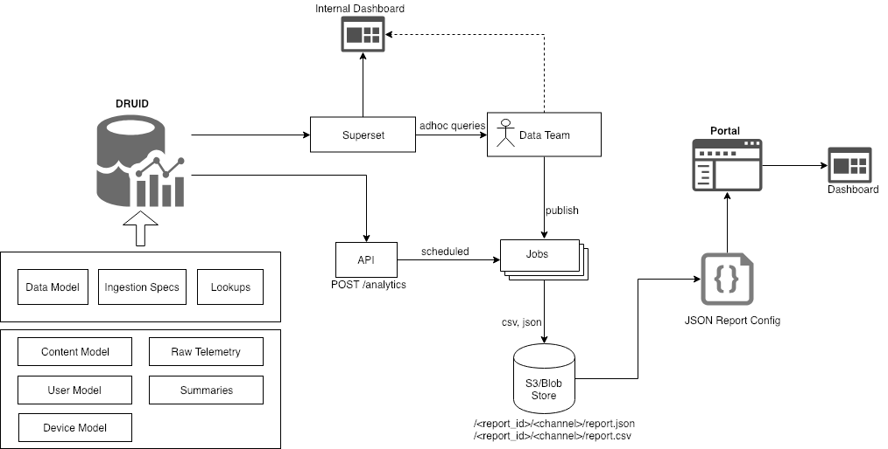
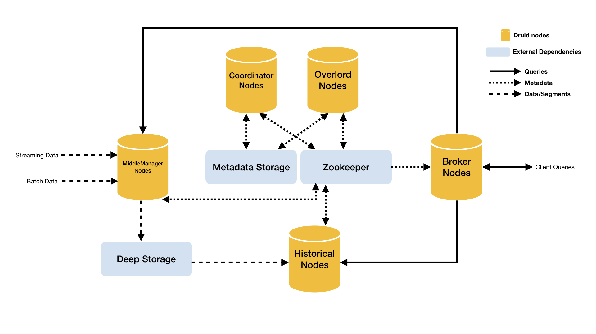

## Introduction
This wiki details the architecture of enabling reporting framework to operate at scale. It discusses the high level design problems to be solved and introduces the proposed architecture for the same. 


### Key Design Problems
TBA


## Reporting Architecture



## Druid Architecture



## Druid Data Model

### Raw Telemetry


|  | Dimension in Druid | Field in Telemetry | Description | Data Type | 
|  --- |  --- |  --- |  --- |  --- | 
| 1 | ets | ets | Event timestamp | Long | 
| 2 | eid | eid | Event Id | String | 
| 3 | syncts | syncts | Sync Timestamp | Long | 
| 4 | @timstamp | @timstamp | Sync Timestamp in String | String | 
| 5 | actor_id | actor.id | Actor Id of the event | String | 
| 6 | actor_type | actor.type | Type of the actor | String | 
| 7 | context_channel | context.channel | Channel Id | String | 
| 8 | context_pdata_id | context.pdata.id | Producer Id | String | 
| 9 | context_pdata_pid | context.pdata.pid | Producer Process Id | String | 
| 10 | context_pdata_ver | context.pdata.ver | Producer version number | String | 
| 11 | context_env | context.env | Context Environment | String | 
| 12 | context_sid | context.sid | Session Id | String | 
| 13 | context_did | context.did | Device Id | String | 
| 14 | context_cdata_type | context.cdata.type | Correlation Data Type | Array\[String] | 
| 15 | context_cdata_id | context.cdata.id | Correlation Data Id | Array\[String] | 
| 16 | context_rollup_l1 | context.rollup.l1 | Context level 1 rollup | String | 
| 17 | context_rollup_l2 | context.rollup.l2 | Context level 2 rollup | String | 
| 18 | context_rollup_l3 | context.rollup.l3 | Context level 3 rollup | String | 
| 19 | context_rollup_l4 | context.rollup.l4 | Context level 4 rollup | String | 
| 20 | object_id | object.id | Content Id | String | 
| 21 | object_type | object.type | Content Type | String | 
| 22 | object_version | object.ver | Content Version | String | 
| 23 | object_rollup_l1 | object.rollup.l1 | Content level 1 rollup | String | 
| 24 | object_rollup_l2 | object.rollup.l2 | Content level 2 rollup | String | 
| 25 | object_rollup_l3 | object.rollup.l3 | Content level 3 rollup | String | 
| 26 | object_rollup_l4 | object.rollup.l4 | Content level 4 rollup | String | 
| 27 | tags | tags | Tags | Array\[String] | 
| 28 | edata_type | edata.type | Event type | String | 
| 29 | edata_subtype | edata.subtype | Event subtype | String | 
| 30 | edata_mode | edata.mode | START event Mode of start | String | 
| 31 | edata_pageid | edata.pageid | Unique pageid | String | 
| 32 | edata_uri | edata.uri | IMPRESSION event Relative URI of the content | String | 
| 33 | edata_id | edata.id | Event data Id | String | 
| 34 | edata_duration | edata.duration | Duration of the event | Double | 
| 35 | edata_index | edata.index | ASSESS event Index of the question within a content | Integer | 
| 36 | edata_pass | edata.pass | ASSESS event Field to identify pass or fail for assessments | String | 
| 37 | edata_score | edata.score | ASSESS event Assessment score | Double | 
| 38 | edata_resvalues | edata.resvalues | ASSESS event Assessment results | Array\[Object] | 
| 39 | edata_item_id | edata.item.id | ASSESS event Assessment item id | String | 
| 40 | edata_item_title | edata.item.title | ASSESS event Assessment item title | String | 
| 41 | edata_item_maxscore | edata.item.maxscore | ASSESS event Assessment item max score | Double | 
| 42 | edata_target_id | edata.target.id | ASSESS event Assessment item target id | String | 
| 43 | edata_target_type | edata.target.type | ASSESS event Assessment item target type | String | 
| 44 | edata_rating | edata.rating | FEEDBACK event Ratings | Integer | 
| 45 | edata_comments | edata.comments | FEEDBACK event Comments | String | 
| 46 | edata_dir | edata.dir | SHARE event direction | String | 
| 47 | edata_items_id | edata.items.id | SHARE event shared item ids | Array\[String] | 
| 48 | edata_items_type | edata.items.type | SHARE item types | Array\[String] | 
| 49 | edata_items_origin_id | edata.items.origin.id | SHARE event source id | Array\[String] | 
| 50 | edata_items_origin_type | edata.items.origin.type | SHARE event source type | Array\[String] | 
| 51 | edata_items_to_id | edata.items.to.id | SHARE event destination id | Array\[String] | 
| 52 | edata_items_to_type | edata.items.to.type | SHARE event destination type | Array\[String] | 
| 53 | edata_state | edata.state | AUDIT event current state | String | 
| 54 | edata_prevstate | edata.prevstate | AUDIT event previous state | String | 
| 55 | edata_size | edata.size | SEARCH event result size | Integer | 
| 56 | edata_filters_dialcodes | edata.filters.dialcodes | SEARCH event List of dialcodes | Array\[String] | 
| 57 | edata_topn_identifier | edata.topn.identifier | SEARCH event topn results | Array\[String] | 
| 58 | edata_visits_objid | edata.visits.objid | IMPRESSION event unique id for object visited | Array\[String] | 
| 59 | edata_visits_objtype | edata.visits.objtype | IMPRESSION event type of object visited | Array\[String] | 
| 60 | edata_visits_objver | edata.visits.objver | IMPRESSION event version of object visited | Array\[String] | 
| 61 | edata_visits_index | edata.visits.index | IMPRESSION event index of object within list | Array\[Integer] | 
| 62 | device_loc_state | devicedata.state | State location information for the device | String | 
| 63 | device_loc_state_code | devicedata.statecode | State ISO code information for the device | String | 
| 64 | device_loc_iso_state_code | devicedata.iso3166statecode | State ISO-3166 code information for the device | String | 
| 65 | device_loc_city | devicedata.city | City location information for the device | String | 
| 66 | device_loc_country_code | devicedata.countrycode | Country ISO code information for the device | String | 
| 67 | device_loc_country | devicedata.country | Country location information for the device | String | 
| 68 | device_os | devicedata.os | Device OS name | String | 
| 69 | device_make | devicedata.make | Device make and model | String | 
| 70 | device_id | devicedata.id | Physical device id if available from OS | String | 
| 71 | device_mem | devicedata.mem | Total memory in mb | Integer | 
| 72 | device_idisk | devicedata.idisk | Total interanl disk | Integer | 
| 73 | device_edisk | devicedata.edisk | Total external disk | Integer | 
| 74 | device_scrn | devicedata.scrn | Screen size in inches | Integer | 
| 75 | device_camera | devicedata.camera | Primary & secondary camera spec | String | 
| 76 | device_cpu | devicedata.cpu | Processor name | String | 
| 77 | device_sims | devicedata.sims | Number of sim cards | Integer | 
| 78 | device_uaspec_agent | devicedata.uaspec.agent | User agent of the browser | String | 
| 79 | device_uaspec_ver | devicedata.uaspec.ver | User agent version of the browser | String | 
| 80 | device_uaspec_system | devicedata.uaspec.system | User agent system identification of the browser | String | 
| 81 | device_uaspec_platform | devicedata.uaspec.platform | User agent client platform of the browser | String | 
| 82 | device_uaspec_raw | devicedata.uaspec.raw | Raw user agent of the browser | String | 
| 83 | device_first_access | devicedata.firstaccess | First access of the device | Long (Epoch) | 
| 84 | content_name | contentdata.name | Name of the content | String | 
| 85 | content_object_type | contentdata.objecttype | Type of the content | String | 
| 86 | content_type | contentdata.contenttype | Type of the resource | String | 
| 87 | content_media_type | contentdata.mediatype | Type of the media of the resource | String | 
| 88 | content_language | contentdata.language | List of languages in the content | Array\[String] | 
| 89 | content_medium | contentdata.medium | Language medium of the board | Array\[String] | 
| 90 | content_mimetype | contentdata.mimetype | Mimetype of the resource in the content | String | 
| 91 | content_framework | contentdata.framework |  | String | 
| 92 | content_board | contentdata.board | Board of affiliation | String | 
| 93 | content_status | contentdata.status | Status of the content - Draft, Published etc. | String | 
| 94 | content_version | contentdata.pkgversion | Version of the content | Double | 
| 95 | content_last_submitted_on | contentdata.lastsubmittedon | Last submitted date of the content | Long (Epoch) | 
| 96 | content_last_published_on | contentdata.lastpublishedon | Last submitted date of the content | Long (Epoch) | 
| 97 | content_last_updated_on | contentdata.lastupdatedon | Last updated date of the content | Long (Epoch) | 
| 98 | user_grade_list | userdata.gradelist | List of grades taught | Array\[String] | 
| 99 | user_language_list | userdata.languagelist | List of languages known | Array\[String] | 
| 100 | user_subject_list | userdata.subjectlist | List of subjects taught | Array\[String] | 
| 101 | user_type | userdata.type | Type of user | String | 
| 102 | user_loc_state | userdata.state | State info of the user | String | 
| 103 | user_loc_district | userdata.district | District info of the user | String | 
| 104 | user_loc_block | userdata.block | Block info of the user | String | 
| 105 | dialcode_channel | dialcodedata.channel | Channel for which dialcode is generated | String | 
| 106 | dialcode_batchcode | dialcodedata.batchcode | Batch for which dialcode belongs to | String | 
| 107 | dialcode_publisher | dialcodedata.publisher | Publisher of the dialcode | String | 
| 108 | dialcode_generated_on | dialcodedata.generatedon | Dialcode generated on | Long (Epoch) | 
| 109 | dialcode_published_on | dialcodedata.publishedon | Dialcode published on | Long (Epoch) | 
| 110 | dialcode_status | dialcodedata.status | Status of the dialcode | String | 
| 111 | dialcode_object_type | dialcodedata.objecttype | Object type - DialCode as a value | String | 


### Summary Events


|  | Dimension in Druid | Field in Summary event | Description | Data Type | 
|  --- |  --- |  --- |  --- |  --- | 
| 1 | ets | ets | Event timestamp | Long | 
| 2 | eid | eid | Event Id | String | 
| 3 | ver | ver | Version | String | 
| 4 | syncts | syncts | Sync timestamp | Long | 
| 5 | uid | uid | User Id | String | 
| 6 | context_date_range_from | context.date_range.from | Start Date for the summary | Long (Epoch) | 
| 7 | context_date_range_to | context.date_range.to | End Date for the summary | Long (Epoch) | 
| 8 | context_rollup_l1 | context.rollup.l1 | Context level1 rollup | String | 
| 9 | context_rollup_l2 | context.rollup.l2 | Context level2 rollup | String | 
| 10 | context_rollup_l3 | context.rollup.l3 | Context level3 rollup | String | 
| 11 | context_rollup_l4 | context.rollup.l4 | Context level4 rollup | String | 
| 12 | dimension_channel | dimensions.channel | Channel Id as dimension from raw telemetry | String | 
| 13 | dimensions_did | dimensions.did | Device Id as dimension from raw telemetry | String | 
| 14 | dimensions_pdata_id | dimensions.pdata.id | Producer Id as dimension from raw telemetry | String | 
| 15 | dimensions_pdata_pid | dimensions.pdata.pid | Producer Process Id as dimension from raw telemetry | String | 
| 16 | dimensions_pdata_ver | dimensions.pdata.ver | Producer Process Ver as dimension from raw telemetry | String | 
| 17 | dimensions_sid | dimensions.sid | Session Id as dimension | String | 
| 18 | dimensions_type | dimensions.type | Type of summary | String | 
| 19 | dimensions_mode | dimensions.mode | Mode of action in the session | String | 
| 20 | object_id | object.id | Content Id | String | 
| 21 | object_type | object.type | Content Type | String | 
| 22 | object_version | object.ver | Content version | String | 
| 23 | object_rollup_l1 | object.rollup.l1 | Object level1 rollup | String | 
| 24 | object_rollup_l2 | object.rollup.l2 | Object level2 rollup | String | 
| 25 | object_rollup_l3 | object.rollup.l3 | Object level3 rollup | String | 
| 26 | object_rollup_l4 | object.rollup.l4 | Object level4 rollup | String | 
| 27 | tags | tags | Tags attached to a summary event | Array\[[[String|String]]] | 
| 28 | edata_time_spent | edata.eks.time_spent | Time spent in the session excluding idle time | Double | 
| 29 | edata_time_difference | edata.eks.time_diff | Total time in a session including idle time | Double | 
| 30 | edata_interaction_count | edata.eks.interact_events_count | Total count of interact events in a session | Long | 
| 31 | edata_env_summary_env | edata.eks.env_summary.env | High level env within the app(content, domain, resources, community) | Array\[String] | 
| 32 | edata_env_summary_count | edata.eks.env_summary.count | Count of times the environment has been visited | Array\[Integer] | 
| 33 | edata_env_summary_time_spent | edata.eks.env_summary.time_spent | Time spent per env | Array\[Double] | 
| 34 | edata_page_summary_id | edata.eks.page_summary.id | Page id | Array\[String] | 
| 35 | edata_page_summary_type | edata.eks.page_summary.type | Type of page e.g. view/edit | Array\[String] | 
| 36 | edata_page_summary_env | edata.eks.page_summary.env | Env of page | Array\[String] | 
| 37 | edata_page_summary_visit_count | edata.eks.page_summary.visit_count | Number of times each page was visited | Array\[Integer] | 
| 38 | edata_page_summary_time_spent | edata.eks.page_summary.time_spent | Time taken per page | Array\[Double] | 
| 39 | edata_item_responses_item_id | edata.eks.item_responses.itemId | Question Id passed in the ASSESS event | Array\[String] | 
| 40 | edata_item_responses_time_spent | edata.eks.item_responses.timeSpent | Time spent in seconds from ASSESS event | Array\[Double] | 
| 41 | edata_item_responses_pass | edata.eks.item_responses.pass | Pass response for a question from ASSESS event | Array\[String] | 
| 42 | edata_item_responses_score | edata.eks.item_responses.score | Score from ASSESS event | Array\[[[Integer|Integer]]] | 
| 43 | edata_item_responses_max_score | edata.eks.item_responses.maxScore | Max Score from ASSESS event | Array\[[[Integer|Integer]]] | 
| 44 | edata_item_responses_timestamp | edata.eks.item_responses.time_stamp | Timestamp for each response from ASSESS event | Array\[Long (Epoch)] | 
| 45 | device_loc_state | devicedata.state | State location information for the device | String | 
| 46 | device_loc_state_code | devicedata.statecode | State ISO code information for the device | String | 
| 47 | device_loc_iso_state_code | devicedata.iso3166statecode | State ISO-3166 code information for the device | String | 
| 48 | device_loc_city | devicedata.city | City location information for the device | String | 
| 49 | device_loc_country_code | devicedata.countrycode | Country ISO code information for the device | String | 
| 50 | device_loc_country | devicedata.country | Country location information for the device | String | 
| 51 | device_os | devicedata.os | Device OS name | String | 
| 52 | device_make | devicedata.make | Device make and model | String | 
| 53 | device_id | devicedata.id | Physical device id if available from OS | String | 
| 54 | device_mem | devicedata.mem | Total memory in mb | Integer | 
| 55 | device_idisk | devicedata.idisk | Total interanl disk | Integer | 
| 56 | device_edisk | devicedata.edisk | Total external disk | Integer | 
| 57 | device_scrn | devicedata.scrn | Screen size in inches | Integer | 
| 58 | device_camera | devicedata.camera | Primary & secondary camera spec | String | 
| 59 | device_cpu | devicedata.cpu | Processor name | String | 
| 60 | device_sims | devicedata.sims | Number of sim cards | Integer | 
| 61 | device_uaspec_agent | devicedata.uaspec.agent | User agent of the browser | String | 
| 62 | device_uaspec_ver | devicedata.uaspec.ver | User agent version of the browser | String | 
| 63 | device_uaspec_system | devicedata.uaspec.system | User agent system identification of the browser | String | 
| 64 | device_uaspec_platform | devicedata.uaspec.platform | User agent client platform of the browser | String | 
| 65 | device_uaspec_raw | devicedata.uaspec.raw | Raw user agent of the browser | String | 
| 66 | device_first_access | devicedata.firstaccess | First access of the device | Long (Epoch) | 
| 67 | content_name | contentdata.name | Name of the content | String | 
| 68 | content_object_type | contentdata.objecttype | Type of the content | String | 
| 69 | content_type | contentdata.contenttype | Type of the resource | String | 
| 70 | content_media_type | contentdata.mediatype | Type of media of the content | String | 
| 71 | content_language | contentdata.language | List of languages | Array\[String] | 
| 72 | content_medium | contentdata.medium | Language medium of the board | String | 
| 73 | content_mimetype | contentdata.mimetype | Mimetype of the content | String | 
| 74 | content_framework | contentdata.framework |  | String | 
| 75 | content_board | contentdata.board | Board of affiliation | String | 
| 76 | content_status | contentdata.status | Status of the content - Draft, Published etc. | String | 
| 77 | content_version | contentdata.pkgversion | Version of the content | Double | 
| 78 | content_last_submitted_on | contentdata.lastsubmittedon | Last submitted date of the content | Long (Epoch) | 
| 79 | content_last_published_on | contentdata.lastpublishedon | Last published date of the content | Long (Epoch) | 
| 80 | content_last_updated_on | contentdata.lastupdatedon | Last updated date of the content | Long (Epoch) | 
| 81 | user_grade_list | userdata.gradelist | List of grades taught | Array\[String] | 
| 82 | user_language_list | userdata.languagelist | List of languages known | Array\[String] | 
| 83 | user_subject_list | userdata.subjectlist | List of subjects taught | Array\[String] | 
| 84 | user_type | userdata.type | Type of the user | String | 
| 85 | user_loc_state | userdata.state | State info of the user | String | 
| 86 | user_loc_district | userdata.district | District info of the user | String | 
| 87 | user_loc_block | userdata.block | Block info of the user | String | 

AggregatesGranularity → DAY


| Druid field name | Druid source field | Aggregate Type | 
|  --- |  --- |  --- | 
| total_interactions | interaction_count | SUM | 
| total_time_spent | time_spent | SUM | 
| total_sessions | mid | COUNT | 
|  |  |  | 


## Report JSON Spec

### JSON Schema

```js
[{
    id: String, // Required. Report ID.
    label: String, // Required. Report Label (will be shown up as menu)
    title: String, // Optional. Report title. Defaults to report label
    description: String, // Optional. Report description. HTML text can be included as description
    dataSource: String, // Required. Location of the data source to show the report. Can be an expression. For ex: /<report_id>/{{channel}}/report.json
    charts: [{ // Optional
 		datasets: [{
			data: Array[Number], // Required if `dataExpr` is not provided. Array of Number. Data points to show in the chart
			dataExpr: String, // Required if `data` is not provided. Expression pointing to the data in dataSource. For ex: {{data.noOfDownloads}}
			label: String // Required. Label to display on the chart
		}],
		labels: Array[String], // Required if `labelsExpr` is not provided. Labels to show on the x-axis
		labelsExpr: String, // Required if `labels` is not provided. Expression pointing to the data in dataSource. For ex: {{data.Date}}
		chartType: String, // Optional. Defaults to line. Available types - line, bar, radar, pie, polarArea & doughnut
		colors: [""], // Optional. Color to show for each dataset. Defaults to ["#024F9D"].
		options: { // Optional. options for display. Full set of options look at https://valor-software.com/ng2-charts/
			responsive: Boolean, // Defaults to true
			...
		}, 
		legend: Boolean // Optional. Whether to show the legend below/above the chart. Defaults to true and position to top.
    }],
    table: { // Optional
        "columns": Array[String], // Required if `columnsExpr` is not provided. Columns to show.
        "values": Array[Array[String]] , // Required if `valuesExpr` is not provided. Column data.
        "columnsExpr": String, // Required if `columns` is not provided. Expression pointing to the data in dataSource. For ex: {{keys}}
        "valuesExpr": String // Required if `values` is not provided. Expression pointing to the data in dataSource. For ex: {{tableData}}
    },
    downloadUrl: String // Location to download the data as CSV
}]] ]></ac:plain-text-body></ac:structured-macro><p>Following is a example schema to show the general usage report </p><ac:structured-macro ac:name="code" ac:schema-version="1" ac:macro-id="6c7996fe-6742-46dd-9f4e-91a3234d7381"><ac:parameter ac:name="language">js</ac:parameter><ac:plain-text-body><![CDATA[{
    id: "usage",
    label: "Diksha Usage Report",
    title: "Diksha Usage Report",
    description: "The report provides a quick summary of the data analysed by the analytics team to track progess of Diksha across states. This report will be used to consolidate insights using various metrics on which Diksha is currently being mapped and will be shared on a weekly basis. The first section of the report will provide a snapshot of the overall health of the Diksha App. This will be followed by individual state sections that provide state-wise status of Diksha",
    dataSource: "/usage/$state/report.json",
    charts: [
        {
        	datasets: [{
        		dataExpr: "data.Number_of_downloads",
        		label: "# of downloads"
        	}],
        	labelsExpr: "data.Date",
            chartType: "line"
        },
        {
        	datasets: [{
        		dataExpr: "data.Number_of_succesful_scans",
        		label: "# of successful scans"
        	}],
        	labelsExpr: "data.Date",
            chartType: "bar"
        }
    ],
    table: {
        "columnsExpr": "key",
        "valuesExpr": "tableData"
    },
    downloadUrl: "<report_id>/$state/report.csv"
}
```


*****

[[category.storage-team]] 
[[category.confluence]] 
