* [Migration Steps](#migration-steps)
  * [Migrate the Sunbird -ED Library](#migrate-the-sunbird--ed-library)
  * [Update to Angular Material v15](#update-to-angular-material-v15)
    * [What has changes?](#what-has-changes?)
  * [Update to MDC-based components](#update-to-mdc-based-components)
    * [TODO(mdc-migration)](#todo(mdc-migration))
    * [Key changes](#key-changes)
    * [Manually fixing the style changes](#manually-fixing-the-style-changes)
* [Reference Link](#reference-link)
The purpose of this document is to provide a comprehensive guide for migrating the ED portal from Angular v14 to v15. It outlines the step-by-step process of migrating the portal and highlights the challenges encountered during the migration. This guide aims to assist adopters in successfully migrating their Angular v14 portal to v15 and provides insights into overcoming common migration hurdles.


# Migration Steps
 **Assess Compatibility** : Before starting the migration process, assess the compatibility of third-party dependencies, ED- libraries, and Angular-related packages with Angular v15. 


## Migrate the Sunbird -ED Library
Update the Sunbird Education (ED) related libraries to be compatible with Angular version 15. This update is essential to ensure compatibility with the latest Angular features and improvements. Below is the list of libraries owned by ED that require updating:


1. [Sunbird ED portal](https://github.com/Sunbird-Ed/SunbirdEd-portal/tree/release-7.0.0)


1. [@project-sunbird/common-consumption](https://github.com/Sunbird-Ed/SunbirdEd-consumption-ngcomponents/tree/release-7.0.0_v13_bmgs)


1. [@project-sunbird/common-form-elements-full](https://github.com/Sunbird-Ed/SunbirdEd-forms/tree/release-6.0.0_v14)


1. [@project-sunbird/sb-content-section](https://github.com/Sunbird-Ed/sb-content-module/tree/release-7.0.0)


1. [@project-sunbird/sb-dashlet](https://github.com/Sunbird-Ed/sb-dashlets/tree/V14_Migration)


1. [@project-sunbird/sb-notification](https://github.com/Sunbird-Ed/sb-notification/tree/release-6.0.0_v14)


1. [@project-sunbird/chatbot-client](https://github.com/project-sunbird/sunbird-bot-client/tree/release-6.0.0_v13)


1. [sb-svg2pdf-v13](https://github.com/Sunbird-Ed/sb-svg2pdf/tree/release-6.0.0_v13)


1. [@project-sunbird/web-extensions](https://github.com/project-sunbird/sunbird-ext-framework/tree/release-6.0.0/web-extensions/sunbird-web-extensions-app)


1. [@project-sunbird/discussions-ui](https://github.com/Sunbird-Lern/discussions-UI/tree/release-5.3.0_v14)


1. [@project-sunbird/sb-themes](https://github.com/Sunbird-Ed/sb-themes/tree/8.0.0)


 **Update Angular CLI** Ensure that the Angular CLI is updated to the latest compatible with Angular v15. Use npm to update Angular CLI globally:


```
npm install -g @angular/cli@15
```


 **Update Angular Core Packages** Update Angular core packages to their latest versions compatible with Angular v15. Use the Angular CLI to update Angular core packages


```
ng update @angular/core@15 @angular/cli@15
```
Post  Portal-Angular Update Logs
```
princekumar ~/projects/SunbirdEd-portal/src/app/client [8.0.0_V15] $ ng update @angular/core@15 @angular/cli@15
The installed Angular CLI version is outdated.
Installing a temporary Angular CLI versioned 15.2.10 to perform the update.
✔ Packages successfully installed.
Using package manager: yarn
Collecting installed dependencies...
Found 117 dependencies.
Fetching dependency metadata from registry...
                  Package "ngx-bootstrap" has an incompatible peer dependency to "@angular/animations" (requires "^13.0.0" (extended), would install "15.2.10").
                  Package "@project-sunbird/common-consumption" has an incompatible peer dependency to "@angular/common" (requires "13.3.12" (extended), would install "15.2.10").
                  Package "@project-sunbird/common-consumption" has an incompatible peer dependency to "@angular/core" (requires "13.3.12" (extended), would install "15.2.10").
                  Package "common-form-elements-v9" has an incompatible peer dependency to "@angular/forms" (requires "^9.1.13" (extended), would install "15.2.10").
✖ Migration failed: Incompatible peer dependencies found.
Peer dependency warnings when installing dependencies means that those dependencies might not work correctly together.
You can use the '--force' option to ignore incompatible peer dependencies and instead address these warnings later.
  See "/private/var/folders/jn/gl6l07_x49s3qn1ky0975ncw0000gp/T/ng-nEeQRK/angular-errors.log" for further details.

princekumar ~/projects/SunbirdEd-portal/src/app/client [8.0.0_V15] $ ng update @angular/core@15 @angular/cli@15 --force
The installed Angular CLI version is outdated.
Installing a temporary Angular CLI versioned 15.2.10 to perform the update.
✔ Packages successfully installed.
Using package manager: yarn
Collecting installed dependencies...
Found 117 dependencies.
Fetching dependency metadata from registry...
                  Package "ngx-bootstrap" has an incompatible peer dependency to "@angular/animations" (requires "^13.0.0" (extended), would install "15.2.10").
                  Package "@project-sunbird/common-consumption" has an incompatible peer dependency to "@angular/common" (requires "13.3.12" (extended), would install "15.2.10").
                  Package "@project-sunbird/common-consumption" has an incompatible peer dependency to "@angular/core" (requires "13.3.12" (extended), would install "15.2.10").
                  Package "common-form-elements-v9" has an incompatible peer dependency to "@angular/forms" (requires "^9.1.13" (extended), would install "15.2.10").
    Updating package.json with dependency @angular/language-service @ "15.2.10" (was "14.3.0")...
    Updating package.json with dependency typescript @ "4.9.5" (was "4.6.4")...
    Updating package.json with dependency @angular-devkit/build-angular @ "15.2.10" (was "14.2.10")...
    Updating package.json with dependency @angular/animations @ "15.2.10" (was "14.3.0")...
    Updating package.json with dependency @angular/cli @ "15.2.10" (was "14.2.10")...
    Updating package.json with dependency @angular/common @ "15.2.10" (was "14.3.0")...
    Updating package.json with dependency @angular/compiler @ "15.2.10" (was "14.3.0")...
    Updating package.json with dependency @angular/compiler-cli @ "15.2.10" (was "14.3.0")...
    Updating package.json with dependency @angular/core @ "15.2.10" (was "14.3.0")...
    Updating package.json with dependency @angular/forms @ "15.2.10" (was "14.3.0")...
    Updating package.json with dependency @angular/localize @ "15.2.10" (was "14.3.0")...
    Updating package.json with dependency @angular/platform-browser @ "15.2.10" (was "14.3.0")...
    Updating package.json with dependency @angular/platform-browser-dynamic @ "15.2.10" (was "14.3.0")...
    Updating package.json with dependency @angular/router @ "15.2.10" (was "14.3.0")...
UPDATE package.json (9827 bytes)
✔ Packages successfully installed.
** Executing migrations of package '@angular/cli' **

❯ Remove Browserslist configuration files that matches the Angular CLI default configuration.
  Migration completed (No changes made).

❯ Remove exported `@angular/platform-server` `renderModule` method.
  The `renderModule` method is now exported by the Angular CLI.
  Migration completed (No changes made).

❯ Remove no longer needed require calls in Karma builder main file.
  Migration completed (No changes made).

❯ Update TypeScript compiler `target` and set `useDefineForClassFields`.
  These changes are for IDE purposes as TypeScript compiler options `target` and `useDefineForClassFields` are set to `ES2022` and `false` respectively by the Angular CLI.
  To control ECMA version and features use the Browerslist configuration.
UPDATE tsconfig.json (2403 bytes)
  Migration completed (1 file modified).

❯ Remove options from 'angular.json' that are no longer supported by the official builders.
  Migration completed (No changes made).

** Executing migrations of package '@angular/core' **

❯ In Angular version 15, the deprecated `relativeLinkResolution` config parameter of the Router is removed.
  This migration removes all `relativeLinkResolution` fields from the Router config objects.
UPDATE src/app/app.routing.ts (3447 bytes)
  Migration completed (1 file modified).

❯ Since Angular v15, the `RouterLink` contains the logic of the `RouterLinkWithHref` directive.
  This migration replaces all `RouterLinkWithHref` references with `RouterLink`.
  Migration completed (No changes made).


```

## Update to Angular Material v15
As we are using material in portal. so update Angular Material to Angular v15 in the portal. Angular Material is a critical component of the portal's user interface.

Many of the components in Angular Material v15 have been refactored to be based on Angular Material Design Components (MDC) for the Web. The refactored components offer improved accessibility and adherence to the Material Design spec.


### What has changes?
The new components have different internal DOM and CSS styles. Since the MDC-based components are not API-compatible with the previous versions, you will need to update your code to use the new components. We follow two steps as mentioned on the [Migrating to MDC-based Angular Material Components](https://material.angular.io/guide/mdc-migration).

Angular Material includes a schematic to help migrate applications to use the new MDC-based components. To get started, upgrade your application to Angular Material 15.


```
ng update @angular/material@15
```
Post  Portal-Angular-Material Update Logs
```
princekumar ~/projects/SunbirdEd-portal/src/app/client [8.0.0_V15] $ ng update @angular/material@15
Using package manager: yarn
Collecting installed dependencies...
Found 117 dependencies.
Fetching dependency metadata from registry...
                  Package "@project-sunbird/sunbird-collection-editor" has an incompatible peer dependency to "@angular/cdk" (requires "11.2.13", would install "15.2.9").
                  Package "@angular/material-moment-adapter" has a missing peer dependency of "moment" @ "^2.18.1".
✖ Migration failed: Incompatible peer dependencies found.
Peer dependency warnings when installing dependencies means that those dependencies might not work correctly together.
You can use the '--force' option to ignore incompatible peer dependencies and instead address these warnings later.
  See "/private/var/folders/jn/gl6l07_x49s3qn1ky0975ncw0000gp/T/ng-h4EM1Z/angular-errors.log" for further details.

princekumar ~/projects/SunbirdEd-portal/src/app/client [8.0.0_V15] $ ng update @angular/material@15 --force
Using package manager: yarn
Collecting installed dependencies...
Found 117 dependencies.
Fetching dependency metadata from registry...
                  Package "@project-sunbird/sunbird-collection-editor" has an incompatible peer dependency to "@angular/cdk" (requires "11.2.13", would install "15.2.9").
                  Package "@angular/material-moment-adapter" has a missing peer dependency of "moment" @ "^2.18.1".
    Updating package.json with dependency @angular/cdk @ "15.2.9" (was "14.2.7")...
    Updating package.json with dependency @angular/material @ "15.2.9" (was "14.2.7")...
    Updating package.json with dependency @angular/material-moment-adapter @ "15.2.9" (was "14.2.7")...
UPDATE package.json (9827 bytes)
✔ Packages successfully installed.
** Executing migrations of package '@angular/cdk' **

❯ Updates the Angular CDK to v15.
    
      ✓  Updated Angular CDK to version 15
    
  Migration completed (No changes made).

** Executing migrations of package '@angular/material' **

❯ Updates the Angular Material to v15.
    
      ✓  Updated Angular Material to version 15
    
UPDATE src/app/modules/shared/shared.module.ts (7394 bytes)
UPDATE src/app/modules/dashboard/dashboard.module.ts (3488 bytes)
UPDATE src/app/modules/program-dashboard/program-dashboard.module.ts (3664 bytes)
UPDATE src/app/modules/workspace/workspace.module.ts (3479 bytes)
UPDATE src/app/plugins/profile/profile.module.ts (3070 bytes)
UPDATE src/app/modules/shared/modules/material/material.module.ts (2164 bytes)
UPDATE src/app/modules/dashboard/components/data-chart/data-chart.component.ts (16813 bytes)
UPDATE src/app/modules/report/report.module.ts (1530 bytes)
UPDATE src/app/plugins/location/components/location-selection/location-selection.component.ts (8526 bytes)
UPDATE src/app/modules/learn/batch.module.ts (1246 bytes)
UPDATE src/app/modules/groups/components/create-edit-group/create-edit-group.component.ts (7495 bytes)
UPDATE src/app/modules/shared-feature/components/profile-framework-popup/profile-framework-popup.component.ts (19777 bytes)
UPDATE src/app/modules/dashboard/components/filter/filter.component.ts (12169 bytes)
UPDATE src/app/modules/groups/components/popup/popup.component.ts (3309 bytes)
UPDATE src/app/plugins/profile/components/update-contact-details/update-contact-details.component.ts (9006 bytes)
UPDATE src/app/plugins/profile/components/delete-account/delete-account.component.ts (6039 bytes)
UPDATE src/app/modules/shared-feature/components/tnc-popup/terms-conditions-popup.component.ts (4183 bytes)
UPDATE src/app/plugins/profile/components/account-recovery-info/account-recovery-info.component.ts (6534 bytes)
UPDATE src/app/modules/public/module/guest-profile/components/delete-account/anonymous-delete-account.component.ts (5431 bytes)
UPDATE src/app/modules/badging/badging.module.ts (840 bytes)
UPDATE src/app/modules/report/components/all-evidence/all-evidence.component.ts (1836 bytes)
UPDATE src/assets/styles/global.scss (30534 bytes)
UPDATE src/app/modules/shared/components/modal-wrapper/modal-wrapper.component.ts (2804 bytes)
UPDATE src/app/modules/program-dashboard/shared/sb-bignumber/sb-bignumber.component.ts (2021 bytes)
UPDATE src/app/modules/program-dashboard/shared/sb-chart/sb-chart.component.ts (4686 bytes)
UPDATE src/app/modules/shared-feature/components/year-of-birth/year-of-birth.component.ts (1663 bytes)
  Migration completed (26 files modified).
```
As part of this update, a schematic will run to automatically move your application to use the “legacy” imports containing the old component implementations. This provides a quick path to getting your application running on v15 with minimal manual changes. After the update, it should look like this:

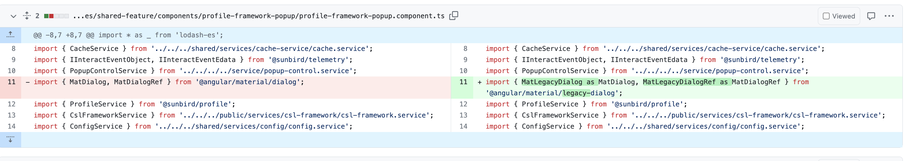During the execution of the portal build in version 15, an error was encountered related to the sb-themes library. The error occurred due to the presence of the tilde (~) symbol in the import statement. To resolve this issue, the tilde symbol was removed from the import statement, and the package was republished with the latest version 8.0.0.

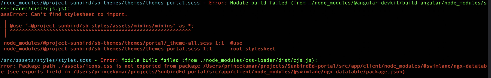We then commit the changes and push to the remote repository. Everything should work as before, nothing changes.


## Update to MDC-based components
Then we schedule to update to MDC-based components. This is a manual process that involves updating your application to use the new component implementations.

First, we run the migration command to switch from the legacy component implementations to the new MDC-based ones.


```
ng generate @angular/material:mdc-migration
```


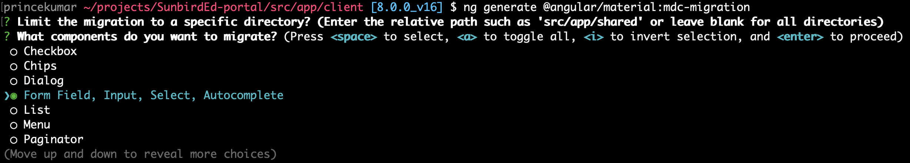Upon running the command, you will be prompted to select which components you would like to migrate. 

Form Field, Input, Select, AutoComplete

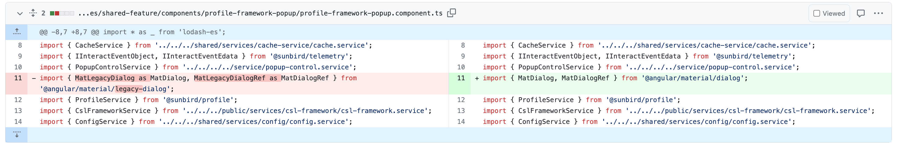Post MDC update the material import changed


### TODO(mdc-migration)
command updates your styles and templates to the new implementations as much as it can automatically.


```
ng generate @angular/material:mdc-migration
```
Changes that are deprecated and require modification will have the prefix /\* TODO(mdc-migration):. Our job will be to fix them all, one by one.


```
/* TODO(mdc-migration):
```
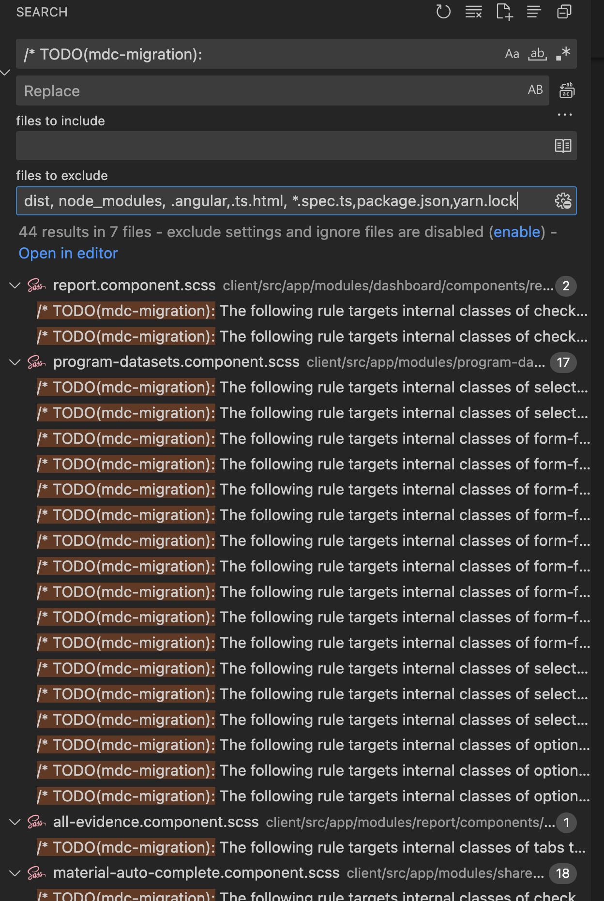
### Key changes
Post Migration script we have encountered significant UI breakage that is affecting the user experience

Portal UI breakage Screenshots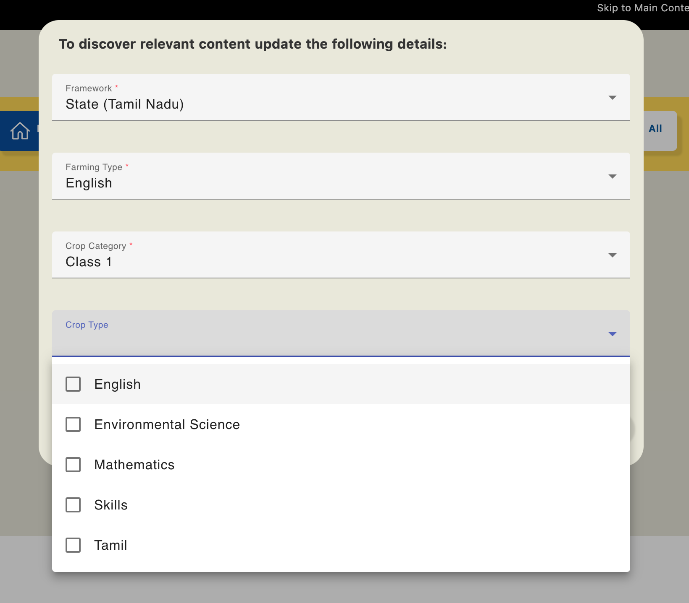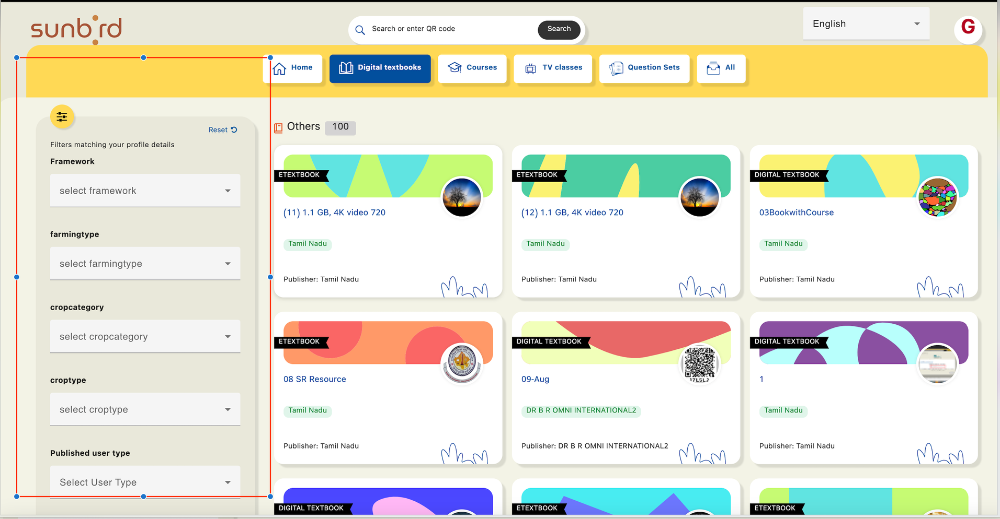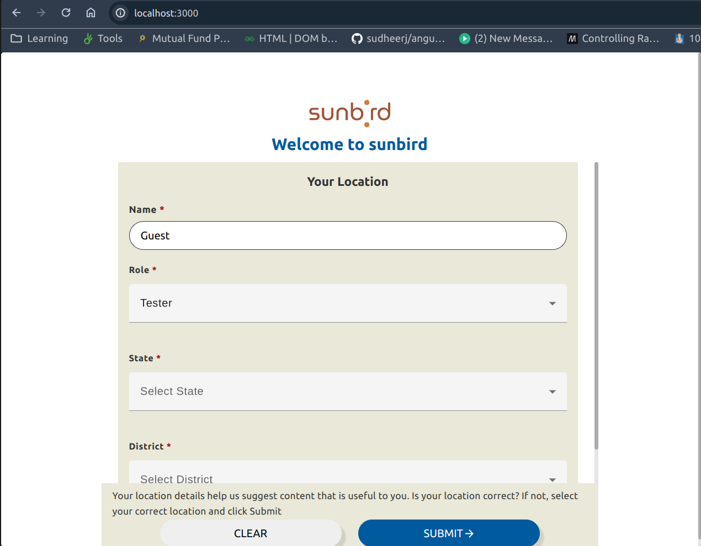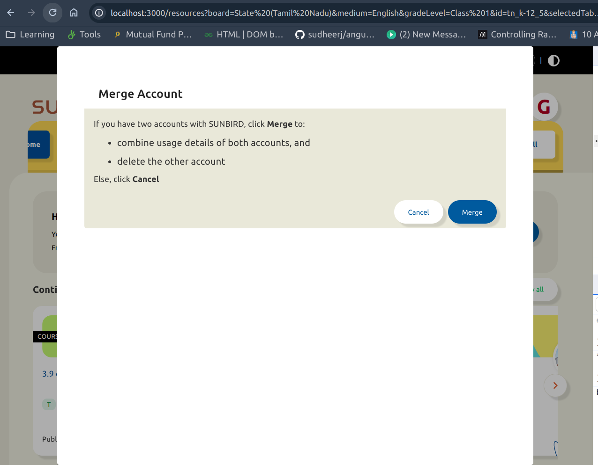
* Dimensions are now different. Everything is now bigger, from height, width to paddings, margins, and animation durations.


    * For textbox heights, we need to revert back to the magical 67px that exists in the previous version. The width of the elements remains unchanged.


    * For paddings, horizontal paddings are now 16px instead of 8px like it used to be.


    * Animation durations of the labels are now faster, 150ms by default. We need to change it back to 400ms.


    


### Manually fixing the style changes
The main changes we’ll need to fix will mostly be style changes. After running the migrations, most places where we use the mat-form-field component will be broken, as we heavily customize using CSS selector to meet our needs, e.g .mat-select now become .mat-mdc-select.

For instance, I had to make several changes such as:

ℹ️ Update mat-dialog-container now become .mat-mdc-dialog-container selector:

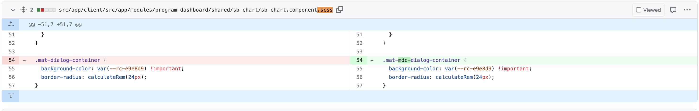Manual changes required for TODO comment

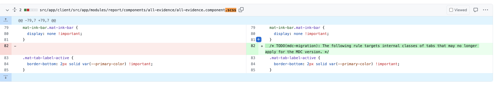ℹ️ Update mat-dialog-content now become .mat-mdc-dialog-content selector:

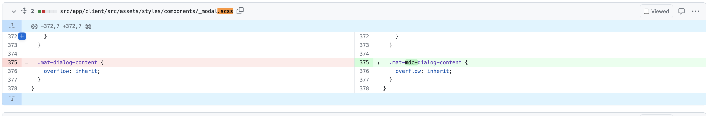
# Reference Link
Jira Ticket : [ED-3611 System Jira](https:///browse/ED-3611)

 Angular MIgration Guide: [https://update.angular.io/?l=3&v=14.0-15.0](https://update.angular.io/?l=3&v=14.0-15.0)


*****

[[category.storage-team]] 
[[category.confluence]] 
