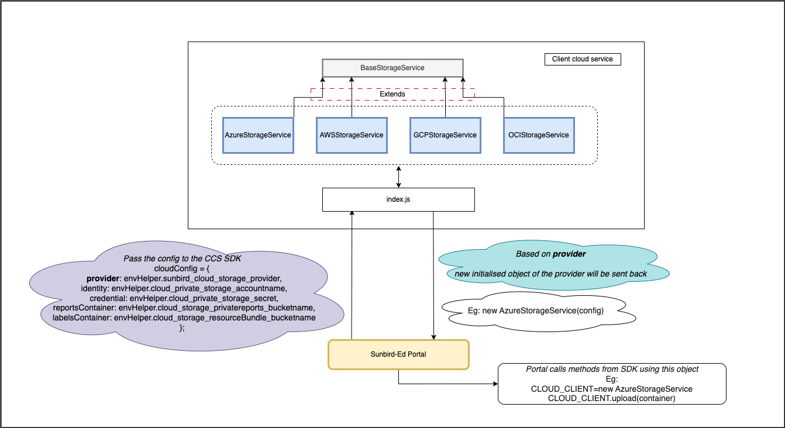

To make Sunbird-Ed cloud agnostic, we are proposing the following changes to be made in  **portal** and the  **client cloud service**  package.

 **Problem Statement:**  


* Existing [CCS(Client Cloud Services)](https://github.com/Sunbird-Ed/client-cloud-services) is expecting SDK initialisation configuration object from consumer aka Sunbird ED Portal 


 **Proposal / Design:**  


* Enhancing CCS npm package to accept minimal configuration from consumer 


 **Solution:**  


1.  _Portal changes: _ 


* Make the environment variable names of the configuration for the cloud service providers in the portal generic 


    * Eg 


```
let cloudConfig = {
  provider: envHelper.sunbird_cloud_storage_provider,
  identity: envHelper.cloud_private_storage_accountname,
  credential: envHelper.cloud_private_storage_secret,
  reportsContainer: envHelper.cloud_storage_privatereports_bucketname,
  labelsContainer: envHelper.cloud_storage_resourceBundle_bucketname,
  region: envHelper.cloud_private_storage_region,
  projectId: envHelper.cloud_private_storage_project,
  endpoint:envHelper.cloud_private_storage_endpoint
};
```


    
* Pass the cloud service provider name and config to the client-cloud-service sdk 


* Move the conditional configuration initialization from the portal to client-cloud-service sdk 


    * so that portal will have minimal code for initialising and get the instance of cloud service provider


```
let cloudClient = cloudService.init(cloudConfig);
exports.CLOUD_CLIENT = cloudClient;
```


    

 


1.  _Client-cloud-services SDK changes: _ 


* Initialise the CSP class based on the  **provider**  value in the configuration and return the instance to the portal


```
export function init(config) {
  switch (config.provider) {
    case 'azure':
      return new AzureStorageService.AzureStorageService(config)
      break;
    case 'aws':
      return new AWSStorageService.AWSStorageService(config)
      break;
    case 'gcloud':
      return new GCPStorageService.GCPStorageService(config)
      break;
    case 'oci':
      return new OCIStorageService.OCIStorageService(config)
      break;
    default:
      throw new Error(`Client Cloud Service - ${config.provider} provider is not supported`);
  }
}

```


 

 **Expected Outcome:**  


* Sunbird ED Portal or any consumer of CCS npm package should be able to send minimal configuration to npm package 


* CCS npm package should initialise Cloud Provider based on minimal configuration provided by consumer 


 **Note: If any building blocks want to use any methods apart from whatever is existing in** [ **CCS(Client Cloud Services)** ](https://github.com/Sunbird-Ed/client-cloud-services) **, please contribute it** 


*****

[[category.storage-team]] 
[[category.confluence]] 
