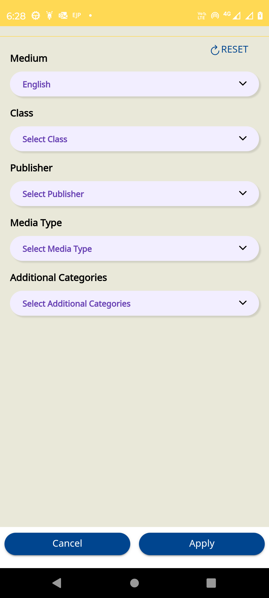

## User Type Selection Screen Form Configuration
As per release-7.0.0, Adopter can remove, add and edit the user types in below form config without changing code.

Sample:: adopter_update_userTypes {{host}}/api/data/v1/form/create
```
{
    "request": {
        "type": "config",
        "subType": "userType_v2",
        "action": "get",
        "component": "app",
        "rootOrgId": "{{adopter_channel}}",
        "framework": "{{adopter_framework}}",
        "data": {
            "templateName": "userType_v2",
            "action": "get",
            "fields": [
                {
                    "code": "teacher",
                    "name": "Teacher",
                    "formConfig": {
                        "request": {
                            "type": "profileConfig",
                            "subType": "default",
                            "action": "get"
                        },
                        "url": "/api/data/v1/form"
                    },
                    "translations": "{\"en\":\"Teacher\",\"as\":\"শিক্ষক\",\"bn\":\"শিক্ষক\",\"gu\":\"શિક્ષક\",\"hi\":\"शिक्षक\",\"kn\":\"ಶಿಕ್ಷಕ/ಕಿ\",\"mr\":\"शिक्षक\",\"or\":\"ଶିକ୍ଷକ\",\"pa\":\"ਅਧਿਆਪਕ\",\"ta\":\"ஆசிரியர்\",\"te\":\"ఉపాధ్యాయుడు\",\"ur\":\"استاد\"}",
                    "image": "ic_teacher.svg",
                    "ambiguousFilters": [
                        "teacher",
                        "instructor"
                    ],
                    "searchFilter": [
                        "Teacher",
                        "Instructor"
                    ],
                    "attributes": {
                        "mandatory": [
                            "board",
                            "medium",
                            "gradeLevel"
                        ],
                        "optional": [
                            "subject"
                        ]
                    }
                },
                {
                    "code": "student",
                    "name": "Student",
                    "formConfig": {
                        "request": {
                            "type": "profileConfig",
                            "subType": "default",
                            "action": "get"
                        },
                        "url": "/api/data/v1/form"
                    },
                    "translations": "{\"en\":\"Student\",\"as\":\"শিক্ষাৰ্থী\",\"bn\":\"ছাত্র\",\"gu\":\"વિદ્યાર્થી\",\"hi\":\"विद्यार्थी\",\"kn\":\"ವಿದ್ಯಾರ್ಥಿ\",\"mr\":\"विद्यार्थी\",\"or\":\"ଛାତ୍ର ଛାତ୍ରୀ\",\"pa\":\"ਵਿਦਿਆਰਥੀ\",\"ta\":\"மாணவர்\",\"te\":\"విద్యార్థి\",\"ur\":\"طالب علم\"}",
                    "image": "ic_student.svg",
                    "ambiguousFilters": [
                        "learner",
                        "student"
                    ],
                    "searchFilter": [
                        "Student",
                        "Learner"
                    ],
                    "attributes": {
                        "mandatory": [
                            "board",
                            "medium",
                            "gradeLevel"
                        ],
                        "optional": [
                            "subject"
                        ]
                    }
                },
                {
                    "code": "administrator",
                    "name": "HT & Officials",
                    "formConfig": {
                        "request": {
                            "type": "profileConfig",
                            "subType": "admin",
                            "action": "get"
                        },
                        "url": "/api/data/v1/form"
                    },
                    "translations": "{\"en\":\"HT & Officials\",\"as\":\"বিদ্যালয়ৰ মুৰব্বী বা বিষয়াসকল\",\"bn\":\"বিদ্যালয়ের প্রধান বা কর্মকর্তা\",\"gu\":\"શાળાના વડા અથવા અધિકારીઓ\",\"hi\":\"स्कूल प्रमुख या अधिकारी\",\"kn\":\"ಶಾಲಾ ಮುಖ್ಯಸ್ಥರು ಅಥವಾ ಅಧಿಕಾರಿಗಳು\",\"mr\":\"शाळा प्रमुख किंवा अधिकारी\",\"or\":\"ସ୍କୁଲ ମୁଖ୍ୟ ଓ ଅଧିକାରୀ\",\"pa\":\"ਸਕੂਲ ਮੁਖੀ ਜਾਂ ਅਧਿਕਾਰੀ\",\"ta\":\"தலைமை ஆசிரியர் & அதிகாரிகள்\",\"te\":\"స్కూల్ హెడ్ లేదా అధికారులు\",\"ur\":\"اسکول سربراہ یا عہدیدار\"}",
                    "image": "ic_admin.svg",
                    "ambiguousFilters": [],
                    "searchFilter": [
                        "administrator"
                    ],
                    "attributes": {
                        "mandatory": [
                            "board"
                        ],
                        "optional": []
                    }
                },
                {
                    "code": "parent",
                    "name": "Parent",
                    "formConfig": {
                        "request": {
                            "type": "profileConfig",
                            "subType": "default",
                            "action": "get"
                        },
                        "url": "/api/data/v1/form"
                    },
                    "translations": "{\"en\":\"Parent\",\"as\":\"পিতৃ-মাতৃ\",\"bn\":\"অভিভাবক\",\"gu\":\"માતાપિતા\",\"hi\":\"अभिभावक\",\"kn\":\"ಪೋಷಕ\",\"mr\":\"पालक \",\"or\":\"ପିତାମାତା\",\"pa\":\"ਮਾਤਾ ਪਿਤਾ\",\"ta\":\"பெற்றோர்\",\"te\":\"తల్లిదండ్రులు\",\"ur\":\"والدین\"}",
                    "image": "ic_parent.svg",
                    "ambiguousFilters": [],
                    "searchFilter": [],
                    "attributes": {
                        "mandatory": [
                            "board",
                            "medium",
                            "gradeLevel"
                        ],
                        "optional": [
                            "subject"
                        ]
                    }
                }
            ]
        }
    }
}
```

## Framework Selection Screen Form Configuration for Sunbird ED (BMGS) Reference


As per the release-7.0.0, the framework selection screen is a form configuration-based approach

By default, the framework selection screen will dynamically display all the categories retrieved from CSL (framework read API call).

Users are required to create a form configuration using the Form Create (user__update__framework)_O. This configuration allows users to implement various customizations such as setting fields as mandatory, modifying labels, and enabling/disabling specific fields according to their requirements.

The form is structured with the following conventions:


*  **board**  is treated as framework-category1 code,


*  **medium**  is treated as framework-category2 code,


*  **gradeLevel**  is treated as framework-category3 code, and


*  **subject**  is treated as framework-category4 code.


Adopters intending to utilize this form for their infrastructure can follow these guidelines:


* Replace the existing framework-category codes with their own categories, as needed.


* Customize the labels and placeholders according to their specific usage requirements.   


Contents metadata are like  _“se_boards”, “se_mediums”, “se_gradeLevels”_   so We are using "alterNativeCode": "se_boards" for getting contents. 

user_update_framework {{host}}/api/data/v1/form/create
```
{
    "request": {
        "type": "config",
        "subType": "frameworkcategories",
        "action": "get",
        "component": "app",
        "framework": "{{adopter_framework}}",
        "rootOrgId": "{{adopter_channel}}",
        "data": {
            "templateName": "frameworkCategories",
            "action": "get",
            "fields": [
                {
                    "code": "board",
                    "label": "{\"en\":\"Board\",\"as\":\"ব'ৰ্ড\",\"bn\":\"পর্ষদ\",\"gu\":\"બોર્ડ\",\"hi\":\"बोर्ड\",\"kn\":\"ಮಂಡಳಿ\",\"mr\":\"बोर्ड\",\"or\":\"ବୋର୍ଡ\",\"pa\":\"ਬੋਰਡ\",\"ta\":\"வாரியம்\",\"te\":\"బోర్డు\",\"ur\":\"بورڈ\"}",
                    "identifier": "fwCategory1",
                    "index": 0,
                    "placeHolder": "Select board",
                    "required": true,
                    "alterNativeCode": "se_boards"
                },
                {
                    "code": "medium",
                    "label": "{\"en\":\"Medium\",\"as\":\"মাধ্যম\",\"bn\":\"মাধ্যাম\",\"gu\":\"માધ્યમ\",\"hi\":\"माध्यम\",\"kn\":\"ಮಾಧ್ಯಮ\",\"mr\":\"माध्यम\",\"or\":\"ମାଧ୍ୟମ\",\"pa\":\"ਮਾਧਿਅਮ\",\"ta\":\"மீடியம்\",\"te\":\"మాధ్యమం\",\"ur\":\"میڈیم\"}",
                    "identifier": "fwCategory2",
                    "index": 1,
                    "placeHolder": "Select medium",
                    "required": true,
                    "alterNativeCode": "se_mediums"
                },
                {
                    "code": "gradeLevel",
                    "label": "{\"en\":\"Class\",\"as\":\"শ্ৰেণী\",\"bn\":\"শ্রেনী\",\"gu\":\"વર્ગ\",\"hi\":\"कक्षा\",\"kn\":\"ತರಗತಿ\",\"mr\":\"इयत्ता\",\"or\":\"ଶ୍ରେଣୀ\",\"pa\":\"ਜਮਾਤ\",\"ta\":\"வகுப்பு\",\"te\":\"క్లాసు\",\"ur\":\"کلاس\"}",
                    "identifier": "fwCategory3",
                    "index": 2,
                    "placeHolder": "Select gradeLevel",
                    "required": false,
                    "alterNativeCode": "se_gradeLevels"
                },
                {
                    "code": "subject",
                    "label": "{\"en\":\"Subject\",\"as\":\"বিষয়\",\"bn\":\"বিষয়\",\"gu\":\"વિષય\",\"hi\":\"विषय\",\"kn\":\"ವಿಷಯ\",\"mr\":\"विषय\",\"or\":\"ବିଷୟ\",\"pa\":\"ਵਿਸ਼ਾ\",\"ta\":\"பாடம்\",\"te\":\"పాఠ్యాంశము\",\"ur\":\"مضامین\"}",
                    "placeHolder": "Select Subject",
                    "identifier": "fwCategory4",
                    "index": 3,
                    "required": false,
                    "alterNativeCode": "se_subjects",
                    "multiple": true
                }
            ]
        }
    }
}
```

## Filter for Request More Content form configuration


This form provides the dynamic filter of more content request. Users can create their own form configuration to change the “code”, “placeHolder” and “categoryCode” based on the framework and channel.

Sample dynamicForm_contentRequest {{host}}/api/data/v1/form/create
```
{
    "request": {
        "type": "dynamicform",
        "subtype": "contentrequest",
        "action": "submit",
        "component": "app",
        "framework": "{{adopter_framework}}",
        "rootOrgId": "{{adopter_channel}}",
        "data": {
            "templateName": "contentrequest",
            "action": "get",
            "fields": [
                {
                    "code": "board",
                    "type": "select",
                    "templateOptions": {
                        "placeHolder": "Select Board",
                        "multiple": false,
                        "dataSrc": {
                            "marker": "ACTIVE_CHANNEL.SUGGESTED_FRAMEWORK_LIST.MAPPED_TO_FRAMEWORKCATEGORIES",
                            "params": {
                                "relevantTerms": [
                                    "CBSE"
                                ]
                            }
                        }
                    },
                    "validations": [
                        {
                            "type": "required"
                        }
                    ]
                },
                {
                    "code": "medium",
                    "type": "nested_select",
                    "context": "board",
                    "default": null,
                    "templateOptions": {
                        "placeHolder": "Select Medium",
                        "multiple": false,
                        "dataSrc": {
                            "marker": "FRAMEWORK_CATEGORY_TERMS",
                            "params": {
                                "categoryCode": "medium"
                            }
                        }
                    },
                    "validations": [
                        {
                            "type": "required"
                        }
                    ]
                },
                {
                    "code": "grade",
                    "type": "nested_select",
                    "context": "medium",
                    "templateOptions": {
                        "placeHolder": "Select Grade",
                        "multiple": false,
                        "dataSrc": {
                            "marker": "FRAMEWORK_CATEGORY_TERMS",
                            "params": {
                                "categoryCode": "gradeLevel"
                            }
                        }
                    },
                    "validations": [
                        {
                            "type": "required"
                        }
                    ]
                },
                {
                    "code": "subject",
                    "type": "nested_select",
                    "context": "grade",
                    "templateOptions": {
                        "placeHolder": "Select Subject",
                        "multiple": false,
                        "dataSrc": {
                            "marker": "FRAMEWORK_CATEGORY_TERMS",
                            "params": {
                                "categoryCode": "subject"
                            }
                        }
                    },
                    "children": {
                        "other": [
                            {
                                "code": "other",
                                "type": "input",
                                "templateOptions": {
                                    "placeHolder": "Specify Subject"
                                },
                                "validations": [
                                    {
                                        "type": "required"
                                    }
                                ]
                            }
                        ]
                    },
                    "validations": [
                        {
                            "type": "required"
                        }
                    ]
                },
                {
                    "code": "primaryCategory",
                    "type": "select",
                    "templateOptions": {
                        "placeHolder": "Select Content Type",
                        "multiple": false,
                        "options": [
                            {
                                "value": "Digital Textbook",
                                "label": "Digital Textbook"
                            },
                            {
                                "value": "Course",
                                "label": "Course"
                            },
                            {
                                "value": "TV Lesson",
                                "label": "TV Lesson"
                            },
                            {
                                "value": "Explanation Content",
                                "label": "Explanation content"
                            },
                            {
                                "value": "Practice Question Set",
                                "label": "Practice Questions"
                            }
                        ]
                    },
                    "validations": [
                        {
                            "type": "required"
                        }
                    ]
                }
            ]
        }
    }
}
```

## Search Filter form configuration


This form provides the search filter for content search. Users can create their own form configuration to change the “code”, “translation” and “name” based on the framework and channel.

In cases where Sunbird ED utilizes categories like se_boards, se_mediums, se_gradeLevel, and se_subjects, adopters should map these to their target framework-category codes accordingly. For instance, se_boards can be mapped to the target framework-category1 code, se_mediums to framework-category2, se_gradeLevel to target framework-category3 code, and se_subjects to target framework-category4 code so on.. (e.g., se_ + frameworkCategory1 + 's').

Sample search_filter {{host}}/api/data/v1/form/create
```
{
    "request": {
        "type": "config",
        "subType": "search",
        "action": "filter_v3",
        "component": "app",
        "framework": "{{adopter_framework}}",
        "rootOrgId": "{{adopter_channel}}",
        "data": {
            "templateName": "search_facet_filter",
            "action": "get",
             "fields": [
                    {
                        "code": "se_boards",
                        "translations": "{\"en\":\"Board/Syllabus\",\"as\":\"ব'ৰ্ড\",\"bn\":\"পর্ষদ\",\"gu\":\"બોર્ડ\",\"hi\":\"बोर्ड\",\"kn\":\"ಮಂಡಳಿ\",\"mr\":\"बोर्ड\",\"or\":\"ବୋର୍ଡ\",\"pa\":\"ਬੋਰਡ\",\"ta\":\"வாரியம்\",\"te\":\"బోర్డు\",\"ur\":\"بورڈ\"}",
                        "values": [],
                        "name": "Board/Syllabus",
                        "index": 1
                    },
                    {
                        "code": "se_gradeLevels",
                        "translations": "{\"en\":\"Class\",\"as\":\"শ্ৰেণী\",\"bn\":\"শ্রেনী\",\"gu\":\"વર્ગ\",\"hi\":\"कक्षा\",\"kn\":\"ತರಗತಿ\",\"mr\":\"इयत्ता\",\"or\":\"ଶ୍ରେଣୀ\",\"pa\":\"ਜਮਾਤ\",\"ta\":\"வகுப்பு\",\"te\":\"క్లాసు\",\"ur\":\"کلاس\"}",
                        "values": [],
                        "name": "Class",
                        "index": 2
                    },
                    {
                        "code": "subject",
                        "translations": "{\"en\":\"Subject\",\"as\":\"বিষয়\",\"bn\":\"বিষয়\",\"gu\":\"વિષય\",\"hi\":\"विषय\",\"kn\":\"ವಿಷಯ\",\"mr\":\"विषय\",\"or\":\"ବିଷୟ\",\"pa\":\"ਵਿਸ਼ਾ\",\"ta\":\"பாடம்\",\"te\":\"పాఠ్యాంశము\",\"ur\":\"مضامین\"}",
                        "values": [],
                        "name": "Subject",
                        "index": 3
                    },
                    {
                        "code": "se_mediums",
                        "translations": "{\"en\":\"Medium\",\"as\":\"মাধ্যম\",\"bn\":\"মাধ্যাম\",\"gu\":\"માધ્યમ\",\"hi\":\"माध्यम\",\"kn\":\"ಮಾಧ್ಯಮ\",\"mr\":\"माध्यम\",\"or\":\"ମାଧ୍ୟମ\",\"pa\":\"ਮਾਧਿਅਮ\",\"ta\":\"மீடியம்\",\"te\":\"మాధ్యమం\",\"ur\":\"میڈیم\"}",
                        "values": [],
                        "name": "Medium",
                        "index": 4
                    },
                    {
                        "code": "primaryCategory",
                        "translations": "{\"en\":\"Content Type\"}",
                        "values": [],
                        "name": "Resource Type",
                        "index": 5
                    },
                    {
                        "code": "channel",
                        "translations": "{\"en\":\"Publisher\",\"as\":\"প্ৰকাশক\",\"bn\":\"প্রকাশক\",\"gu\":\"પ્રકાશક\",\"hi\":\"प्रकाशक\",\"kn\":\"ಪ್ರಕಾಶಕರು\",\"mr\":\"प्रकाशक\",\"or\":\"ପ୍ରକାଶକ\",\"pa\":\"ਪ੍ਰਕਾਸ਼ਕ\",\"ta\":\"வெளியீட்டாளர்\",\"te\":\"ప్రచురణకర్త\",\"ur\":\"ناشر\"}",
                        "values": [],
                        "name": "Publisher",
                        "index": 6
                    },
                    {
                        "code": "mimeType",
                        "translations": "{\"en\":\"Media Type\",\"as\":\"মাধ্যমৰ ধৰণ\",\"bn\":\"মিডিয়ার ধরণ\",\"gu\":\"મીડિયાનો પ્રકાર\",\"hi\":\"मीडिया प्रकार\",\"kn\":\"ಮಾಧ್ಯಮದ ವಿಧ\",\"mr\":\"माध्यम प्रकार\",\"or\":\"ମିଡ଼ିଆ ପ୍ରକାର\",\"pa\":\"ਮੀਡੀਆ ਦੀ ਕਿਸਮ\",\"ta\":\"ஊடக வகை\",\"te\":\"మీడియా రకం\",\"ur\":\"میڈیا کی قسم\"}",
                        "values": [],
                        "name": "Publisher",
                        "index": 7
                    },
                    {
                        "code": "audience",
                        "translations": "{\"en\":\"Meant for\"}",
                        "values": [],
                        "name": "Meant For",
                        "index": 8
                    },
                    {
                        "code": "additionalCategories",
                        "translations": "{\"en\":\"Additional Categories\"}",
                        "values": [],
                        "name": "Additional Categories",
                        "index": 9
                    }
                ]
        }
    }
}
```

## Facet Filters form configuration




This form provides the global filter. Users can create their own form configuration to change the “code”, “placeholder” and “name” based on the framework and channel.

In cases where Sunbird ED utilizes categories like se_boards, se_mediums, se_gradeLevel, and se_subjects, adopters should map these to their target framework-category codes accordingly. For instance, se_boards can be mapped to the target framework-category1 code, se_mediums to framework-category2, se_gradeLevel to target framework-category3 code, and se_subjects to target framework-category4 code so on.. (e.g., se_ + frameworkCategory1 + 's').

Sample default_filter {{host}}/api/data/v1/form/create
```
{
    "request": {
        "type": "filterconfig",
        "subType": "default",
        "action": "get",
        "component": "app",
        "framework": "{{adopter_framework}}",
        "rootOrgId": "{{adopter_channel}}",
        "data": {
            "templateName": "filterConfig",
            "action": "get",
            "fields": [
                {
                    "code": "se_mediums",
                    "type": "dropdown",
                    "name": "{\"en\":\"Medium\",\"as\":\"মাধ্যম\",\"bn\":\"মাধ্যাম\",\"gu\":\"માધ્યમ\",\"hi\":\"माध्यम\",\"kn\":\"ಮಾಧ್ಯಮ\",\"mr\":\"माध्यम\",\"or\":\"ମାଧ୍ୟମ\",\"pa\":\"ਮਾਧਿਅਮ\",\"ta\":\"மீடியம்\",\"te\":\"మాధ్యమం\",\"ur\":\"میڈیم\"}",
                    "placeholder": "Select Medium",
                    "multiple": true,
                    "index": 1
                },
                {
                    "code": "se_gradeLevels",
                    "type": "dropdown",
                    "name": "{\"en\":\"Class\",\"as\":\"শ্ৰেণী\",\"bn\":\"শ্রেনী\",\"gu\":\"વર્ગ\",\"hi\":\"कक्षा\",\"kn\":\"ತರಗತಿ\",\"mr\":\"इयत्ता\",\"or\":\"ଶ୍ରେଣୀ\",\"pa\":\"ਜਮਾਤ\",\"ta\":\"வகுப்பு\",\"te\":\"క్లాసు\",\"ur\":\"کلاس\"}",
                    "placeholder": "Select Class",
                    "multiple": true,
                    "index": 2
                },
                {
                    "code": "subject",
                    "type": "dropdown",
                    "name": "{\"en\":\"Subject\",\"as\":\"বিষয়\",\"bn\":\"বিষয়\",\"gu\":\"વિષય\",\"hi\":\"विषय\",\"kn\":\"ವಿಷಯ\",\"mr\":\"विषय\",\"or\":\"ବିଷୟ\",\"pa\":\"ਵਿਸ਼ਾ\",\"ta\":\"பாடம்\",\"te\":\"పాఠ్యాంశము\",\"ur\":\"مضامین\"}",
                    "placeholder": "Select Subject",
                    "multiple": true,
                    "index": 3
                },
                {
                    "code": "channel",
                    "type": "dropdown",
                    "name": "{\"en\":\"Publisher\",\"as\":\"প্ৰকাশক\",\"bn\":\"প্রকাশক\",\"gu\":\"પ્રકાશક\",\"hi\":\"प्रकाशक\",\"kn\":\"ಪ್ರಕಾಶಕರು\",\"mr\":\"प्रकाशक\",\"or\":\"ପ୍ରକାଶକ\",\"pa\":\"ਪ੍ਰਕਾਸ਼ਕ\",\"ta\":\"வெளியீட்டாளர்\",\"te\":\"ప్రచురణకర్త\",\"ur\":\"ناشر\"}",
                    "placeholder": "Select Publisher",
                    "multiple": true,
                    "index": 4
                },
                {
                    "code": "mimeType",
                    "type": "dropdown",
                    "name": "Media Type",
                    "placeholder": "Select Media Type",
                    "multiple": true,
                    "index": 5
                },
                {
                    "code": "primaryCategory",
                    "type": "dropdown",
                    "name": "{\"en\":\"Content Type\"}",
                    "placeholder": "Select Content Type",
                    "multiple": true,
                    "index": 6
                },
                {
                    "code": "audience",
                    "type": "dropdown",
                    "name": "{\"en\":\"Meant for\"}",
                    "placeholder": "Select Meant For",
                    "multiple": true,
                    "index": 7
                },
                {
                    "code": "additionalCategories",
                    "type": "dropdown",
                    "name": "{\"en\":\"Additional Categories\"}",
                    "placeholder": "Select Additional Categories",
                    "multiple": true,
                    "index": 8
                }
            ]
        }
    }
}
```

## Support form configuration in help section
When users face any issue (like content play, course enrolled, update, login etc) they can send report to the app community for getting help, so they can send the report with framework categories and basic user details for easy to understand.

This form provides the framework category and basic user information for report any issue in help section.

Users can create their own form configuration to change the “code”, “context” and “categoryCode” based on the framework and channel.

Sample support_form {{host}}/api/data/v1/form/create
```
{
    "request": {
            "type": "dynamicform",
            "subtype": "support_v2",
            "action": "get",
            "component": "app",
            "framework": "{{adopter_framework}}",
            "rootOrgId": "{{adopter_channel}}",
            "data": {
                "templateName": "support_v2",
                "action": "get",
                "fields": [
                    {
                        "code": "category",
                        "type": "nested_select",
                        "templateOptions": {
                            "placeHolder": "Select Category",
                            "multiple": false,
                            "hidden": false,
                            "options": [
                                {
                                    "value": "content",
                                    "label": "Content"
                                },
                                {
                                    "value": "loginRegistration",
                                    "label": "Login/Registration"
                                },
                                {
                                    "value": "teacherTraining",
                                    "label": "Teacher Training"
                                },
                                {
                                    "value": "otherissues",
                                    "label": "Other Issues",
                                    "dataSrc": {
                                        "action": "telemetry"
                                    }
                                }
                            ]
                        },
                        "validations": [
                            {
                                "type": "required"
                            }
                        ],
                        "children": {
                            "otherissues": [
                                {
                                    "code": "details",
                                    "type": "textarea",
                                    "context": null,
                                    "templateOptions": {
                                        "label": "Tell us more",
                                        "placeHolder": "Enter Details"
                                    },
                                    "validations": [
                                        {
                                            "type": "maxLength",
                                            "value": 1000
                                        }
                                    ]
                                }
                            ]
                        }
                    },
                    {
                        "code": "subcategory",
                        "context": "category",
                        "type": "nested_select",
                        "children": {
                            "contentquality": [
                                {
                                    "code": "board",
                                    "type": "select",
                                    "templateOptions": {
                                        "placeHolder": "Select Board",
                                        "multiple": false,
                                        "dataSrc": {
                                            "marker": "ACTIVE_CHANNEL.SUGGESTED_FRAMEWORK_LIST.MAPPED_TO_FRAMEWORKCATEGORIES"
                                        }
                                    },
                                    "validations": [
                                        {
                                            "type": "required"
                                        }
                                    ]
                                },
                                {
                                    "code": "farmingtype",
                                    "type": "nested_select",
                                    "context": "board",
                                    "default": null,
                                    "templateOptions": {
                                        "placeHolder": "Select Farmingtype",
                                        "multiple": false,
                                        "dataSrc": {
                                            "marker": "FRAMEWORK_CATEGORY_TERMS",
                                            "params": {
                                                "categoryCode": "farmingtype"
                                            }
                                        }
                                    },
                                    "validations": [
                                        {
                                            "type": "required"
                                        }
                                    ]
                                },
                                {
                                    "code": "cropcategory",
                                    "type": "nested_select",
                                    "context": "farmingtype",
                                    "templateOptions": {
                                        "placeHolder": "Select Cropcategory",
                                        "multiple": false,
                                        "dataSrc": {
                                            "marker": "FRAMEWORK_CATEGORY_TERMS",
                                            "params": {
                                                "categoryCode": "cropcategory"
                                            }
                                        }
                                    },
                                    "validations": [
                                        {
                                            "type": "required"
                                        }
                                    ]
                                },
                                {
                                    "code": "croptype",
                                    "type": "nested_select",
                                    "context": "cropcategory",
                                    "templateOptions": {
                                        "placeHolder": "Select Croptype",
                                        "multiple": false,
                                        "dataSrc": {
                                            "marker": "FRAMEWORK_CATEGORY_TERMS",
                                            "params": {
                                                "categoryCode": "croptype"
                                            }
                                        }
                                    },
                                    "validations": [
                                        {
                                            "type": "required"
                                        }
                                    ]
                                },
                                {
                                    "code": "cropname",
                                    "type": "nested_select",
                                    "context": "croptype",
                                    "templateOptions": {
                                        "placeHolder": "Select Cropname",
                                        "multiple": false,
                                        "dataSrc": {
                                            "marker": "FRAMEWORK_CATEGORY_TERMS",
                                            "params": {
                                                "categoryCode": "cropname"
                                            }
                                        }
                                    },
                                    "validations": [
                                        {
                                            "type": "required"
                                        }
                                    ]
                                },
                                {
                                    "code": "contentname",
                                    "type": "input",
                                    "context": null,
                                    "templateOptions": {
                                        "placeHolder": "Enter Content Name"
                                    },
                                    "validations": [
                                        {
                                            "type": "required"
                                        }
                                    ]
                                },
                                {
                                    "code": "details",
                                    "type": "textarea",
                                    "context": null,
                                    "templateOptions": {
                                        "label": "Tell us more",
                                        "placeHolder": "Enter Details"
                                    },
                                    "validations": [
                                        {
                                            "type": "maxLength",
                                            "value": 1000
                                        }
                                    ]
                                }
                            ],
                            "contentnotplaying": [
                                {
                                    "code": "board",
                                    "type": "select",
                                    "templateOptions": {
                                        "placeHolder": "Select Board",
                                        "multiple": false,
                                        "dataSrc": {
                                            "marker": "ACTIVE_CHANNEL.SUGGESTED_FRAMEWORK_LIST.MAPPED_TO_FRAMEWORKCATEGORIES"
                                        }
                                    },
                                    "validations": [
                                        {
                                            "type": "required"
                                        }
                                    ]
                                },
                                {
                                    "code": "farmingtype",
                                    "type": "nested_select",
                                    "context": "board",
                                    "default": null,
                                    "templateOptions": {
                                        "placeHolder": "Select Farmingtype",
                                        "multiple": false,
                                        "dataSrc": {
                                            "marker": "FRAMEWORK_CATEGORY_TERMS",
                                            "params": {
                                                "categoryCode": "farmingtype"
                                            }
                                        }
                                    },
                                    "validations": [
                                        {
                                            "type": "required"
                                        }
                                    ]
                                },
                                {
                                    "code": "cropcategory",
                                    "type": "nested_select",
                                    "context": "farmingtype",
                                    "templateOptions": {
                                        "placeHolder": "Select Cropcategory",
                                        "multiple": false,
                                        "dataSrc": {
                                            "marker": "FRAMEWORK_CATEGORY_TERMS",
                                            "params": {
                                                "categoryCode": "cropcategory"
                                            }
                                        }
                                    },
                                    "validations": [
                                        {
                                            "type": "required"
                                        }
                                    ]
                                },
                                {
                                    "code": "croptype",
                                    "type": "nested_select",
                                    "context": "cropcategory",
                                    "templateOptions": {
                                        "placeHolder": "Select Croptype",
                                        "multiple": false,
                                        "dataSrc": {
                                            "marker": "FRAMEWORK_CATEGORY_TERMS",
                                            "params": {
                                                "categoryCode": "croptype"
                                            }
                                        }
                                    },
                                    "validations": [
                                        {
                                            "type": "required"
                                        }
                                    ]
                                },
                                {
                                    "code": "cropname",
                                    "type": "nested_select",
                                    "context": "croptype",
                                    "templateOptions": {
                                        "placeHolder": "Select Cropname",
                                        "multiple": false,
                                        "dataSrc": {
                                            "marker": "FRAMEWORK_CATEGORY_TERMS",
                                            "params": {
                                                "categoryCode": "cropname"
                                            }
                                        }
                                    },
                                    "validations": [
                                        {
                                            "type": "required"
                                        }
                                    ]
                                },
                                {
                                    "code": "contentname",
                                    "type": "input",
                                    "context": null,
                                    "templateOptions": {
                                        "placeHolder": "Enter Content Name"
                                    },
                                    "validations": [
                                        {
                                            "type": "required"
                                        }
                                    ]
                                },
                                {
                                    "code": "details",
                                    "type": "textarea",
                                    "context": null,
                                    "templateOptions": {
                                        "label": "Tell us more",
                                        "placeHolder": "Enter Details"
                                    },
                                    "validations": [
                                        {
                                            "type": "maxLength",
                                            "value": 1000
                                        }
                                    ]
                                }
                            ],
                            "contentavailability": [
                                {
                                    "code": "board",
                                    "type": "select",
                                    "templateOptions": {
                                        "placeHolder": "Select Board",
                                        "multiple": false,
                                        "dataSrc": {
                                            "marker": "ACTIVE_CHANNEL.SUGGESTED_FRAMEWORK_LIST.MAPPED_TO_FRAMEWORKCATEGORIES",
                                            "params": {
                                                "relevantTerms": [
                                                    "CBSE"
                                                ]
                                            }
                                        }
                                    },
                                    "validations": [
                                        {
                                            "type": "required"
                                        }
                                    ]
                                },
                                {
                                    "code": "farmingtype",
                                    "type": "nested_select",
                                    "context": "board",
                                    "default": null,
                                    "templateOptions": {
                                        "placeHolder": "Select Farmingtype",
                                        "multiple": false,
                                        "dataSrc": {
                                            "marker": "FRAMEWORK_CATEGORY_TERMS",
                                            "params": {
                                                "categoryCode": "farmingtype"
                                            }
                                        }
                                    },
                                    "validations": [
                                        {
                                            "type": "required"
                                        }
                                    ]
                                },
                                {
                                    "code": "cropcategory",
                                    "type": "nested_select",
                                    "context": "farmingtype",
                                    "templateOptions": {
                                        "placeHolder": "Select Cropcategory",
                                        "multiple": false,
                                        "dataSrc": {
                                            "marker": "FRAMEWORK_CATEGORY_TERMS",
                                            "params": {
                                                "categoryCode": "cropcategory"
                                            }
                                        }
                                    },
                                    "validations": [
                                        {
                                            "type": "required"
                                        }
                                    ]
                                },
                                {
                                    "code": "croptype",
                                    "type": "nested_select",
                                    "context": "cropcategory",
                                    "templateOptions": {
                                        "placeHolder": "Select Croptype",
                                        "multiple": false,
                                        "dataSrc": {
                                            "marker": "FRAMEWORK_CATEGORY_TERMS",
                                            "params": {
                                                "categoryCode": "croptype"
                                            }
                                        }
                                    },
                                    "validations": [
                                        {
                                            "type": "required"
                                        }
                                    ]
                                },
                                {
                                    "code": "cropname",
                                    "type": "nested_select",
                                    "context": "croptype",
                                    "templateOptions": {
                                        "placeHolder": "Select Cropname",
                                        "multiple": false,
                                        "dataSrc": {
                                            "marker": "FRAMEWORK_CATEGORY_TERMS",
                                            "params": {
                                                "categoryCode": "cropname"
                                            }
                                        }
                                    },
                                    "validations": [
                                        {
                                            "type": "required"
                                        }
                                    ]
                                },
                                {
                                    "code": "contenttype",
                                    "type": "select",
                                    "templateOptions": {
                                        "placeHolder": "Select Content Type",
                                        "multiple": false,
                                        "options": [
                                            {
                                                "value": "digitextbbok",
                                                "label": "Digital Textbook"
                                            },
                                            {
                                                "value": "course",
                                                "label": "Course"
                                            },
                                            {
                                                "value": "tvlesson",
                                                "label": "TV Lesson"
                                            },
                                            {
                                                "value": "explaincontent",
                                                "label": "Explanation content"
                                            },
                                            {
                                                "value": "practiceques",
                                                "label": "Practice Questions"
                                            },
                                            {
                                                "value": "quiz",
                                                "label": "Quiz"
                                            }
                                        ]
                                    },
                                    "validations": [
                                        {
                                            "type": "required"
                                        }
                                    ]
                                },
                                {
                                    "code": "details",
                                    "type": "textarea",
                                    "context": null,
                                    "templateOptions": {
                                        "label": "Tell us more",
                                        "placeHolder": "Enter Details"
                                    },
                                    "validations": [
                                        {
                                            "type": "maxLength",
                                            "value": 1000
                                        }
                                    ]
                                },
                                {
                                    "code": "notify",
                                    "type": "checkbox",
                                    "templateOptions": {
                                        "label": "Notify me on availability"
                                    }
                                }
                            ],
                            "contentotherissues": [
                                {
                                    "code": "board",
                                    "type": "select",
                                    "templateOptions": {
                                        "placeHolder": "Select Board",
                                        "multiple": false,
                                        "dataSrc": {
                                            "marker": "ACTIVE_CHANNEL.SUGGESTED_FRAMEWORK_LIST.MAPPED_TO_FRAMEWORKCATEGORIES"
                                        }
                                    },
                                    "validations": [
                                        {
                                            "type": "required"
                                        }
                                    ]
                                },
                                {
                                    "code": "farmingtype",
                                    "type": "nested_select",
                                    "context": "board",
                                    "default": null,
                                    "templateOptions": {
                                        "placeHolder": "Select Farmingtype",
                                        "multiple": false,
                                        "dataSrc": {
                                            "marker": "FRAMEWORK_CATEGORY_TERMS",
                                            "params": {
                                                "categoryCode": "farmingtype"
                                            }
                                        }
                                    },
                                    "validations": [
                                        {
                                            "type": "required"
                                        }
                                    ]
                                },
                                {
                                    "code": "cropcategory",
                                    "type": "nested_select",
                                    "context": "farmingtype",
                                    "templateOptions": {
                                        "placeHolder": "Select Cropcategory",
                                        "multiple": false,
                                        "dataSrc": {
                                            "marker": "FRAMEWORK_CATEGORY_TERMS",
                                            "params": {
                                                "categoryCode": "cropcategory"
                                            }
                                        }
                                    },
                                    "validations": [
                                        {
                                            "type": "required"
                                        }
                                    ]
                                },
                                {
                                    "code": "croptype",
                                    "type": "nested_select",
                                    "context": "cropcategory",
                                    "templateOptions": {
                                        "placeHolder": "Select Croptype",
                                        "multiple": false,
                                        "dataSrc": {
                                            "marker": "FRAMEWORK_CATEGORY_TERMS",
                                            "params": {
                                                "categoryCode": "croptype"
                                            }
                                        }
                                    },
                                    "validations": [
                                        {
                                            "type": "required"
                                        }
                                    ]
                                },
                                {
                                    "code": "cropname",
                                    "type": "nested_select",
                                    "context": "croptype",
                                    "templateOptions": {
                                        "placeHolder": "Select Cropname",
                                        "multiple": false,
                                        "dataSrc": {
                                            "marker": "FRAMEWORK_CATEGORY_TERMS",
                                            "params": {
                                                "categoryCode": "cropname"
                                            }
                                        }
                                    },
                                    "validations": [
                                        {
                                            "type": "required"
                                        }
                                    ]
                                },
                                {
                                    "code": "contentname",
                                    "type": "input",
                                    "context": null,
                                    "templateOptions": {
                                        "placeHolder": "Enter Content Name"
                                    },
                                    "validations": [
                                        {
                                            "type": "required"
                                        }
                                    ]
                                },
                                {
                                    "code": "details",
                                    "type": "textarea",
                                    "context": null,
                                    "templateOptions": {
                                        "label": "Tell us more",
                                        "placeHolder": "Enter Details"
                                    },
                                    "validations": [
                                        {
                                            "type": "maxLength",
                                            "value": 1000
                                        }
                                    ]
                                }
                            ],
                            "otpissue": [
                                {
                                    "code": "details",
                                    "type": "textarea",
                                    "context": null,
                                    "templateOptions": {
                                        "label": "Tell us more",
                                        "placeHolder": "Enter Details"
                                    },
                                    "validations": [
                                        {
                                            "type": "maxLength",
                                            "value": 1000
                                        }
                                    ]
                                }
                            ],
                            "profilevalidation": [
                                {
                                    "code": "details",
                                    "type": "textarea",
                                    "context": null,
                                    "templateOptions": {
                                        "label": "Tell us more",
                                        "placeHolder": "Enter Details"
                                    },
                                    "validations": [
                                        {
                                            "type": "maxLength",
                                            "value": 1000
                                        }
                                    ]
                                }
                            ],
                            "profiledetails": [
                                {
                                    "code": "details",
                                    "type": "textarea",
                                    "context": null,
                                    "templateOptions": {
                                        "label": "Tell us more",
                                        "placeHolder": "Enter Details"
                                    },
                                    "validations": [
                                        {
                                            "type": "maxLength",
                                            "value": 1000
                                        }
                                    ]
                                }
                            ],
                            "certificate": [
                                {
                                    "code": "details",
                                    "type": "textarea",
                                    "context": null,
                                    "templateOptions": {
                                        "label": "Tell us more",
                                        "placeHolder": "Enter Details"
                                    },
                                    "validations": [
                                        {
                                            "type": "maxLength",
                                            "value": 1000
                                        }
                                    ]
                                }
                            ],
                            "teacherid": [
                                {
                                    "code": "details",
                                    "type": "textarea",
                                    "context": null,
                                    "templateOptions": {
                                        "label": "Tell us more",
                                        "placeHolder": "Enter Details"
                                    },
                                    "validations": [
                                        {
                                            "type": "maxLength",
                                            "value": 1000
                                        }
                                    ]
                                }
                            ],
                            "profileotherissues": [
                                {
                                    "code": "details",
                                    "type": "textarea",
                                    "context": null,
                                    "templateOptions": {
                                        "label": "Tell us more",
                                        "placeHolder": "Enter Details"
                                    },
                                    "validations": [
                                        {
                                            "type": "maxLength",
                                            "value": 1000
                                        }
                                    ]
                                }
                            ],
                            "teacherotherissues": [
                                {
                                    "code": "details",
                                    "type": "textarea",
                                    "context": null,
                                    "templateOptions": {
                                        "label": "Tell us more",
                                        "placeHolder": "Enter Details"
                                    },
                                    "validations": [
                                        {
                                            "type": "maxLength",
                                            "value": 1000
                                        }
                                    ]
                                }
                            ]
                        },
                        "templateOptions": {
                            "placeHolder": "Select Subcategory",
                            "multiple": false,
                            "hidden": false,
                            "options": {
                                "loginRegistration": [
                                    {
                                        "value": "otpissue",
                                        "label": "OTP Issue",
                                        "dataSrc": {
                                            "action": "telemetry"
                                        }
                                    },
                                    {
                                        "value": "profilevalidation",
                                        "label": "Profile validation/No green tick on my profile",
                                        "dataSrc": {
                                            "action": "contactBoard"
                                        }
                                    },
                                    {
                                        "value": "profiledetails",
                                        "label": "Profile details incorrect",
                                        "dataSrc": {
                                            "action": "contactBoard"
                                        }
                                    },
                                    {
                                        "value": "certificate",
                                        "label": "Certificate related",
                                        "dataSrc": {
                                            "action": "contactBoard"
                                        }
                                    },
                                    {
                                        "value": "teacherid",
                                        "label": "Teacher id",
                                        "dataSrc": {
                                            "action": "contactBoard"
                                        }
                                    },
                                    {
                                        "value": "profileotherissues",
                                        "label": "Other issues",
                                        "dataSrc": {
                                            "action": "contactBoard"
                                        }
                                    }
                                ],
                                "content": [
                                    {
                                        "value": "contentquality",
                                        "label": "Content Quality",
                                        "dataSrc": {
                                            "action": "telemetry"
                                        }
                                    },
                                    {
                                        "value": "contentnotplaying",
                                        "label": "Content not playing/downloading",
                                        "dataSrc": {
                                            "action": "telemetry"
                                        }
                                    },
                                    {
                                        "value": "contentavailability",
                                        "label": "Content availability",
                                        "dataSrc": {
                                            "action": "telemetry"
                                        }
                                    },
                                    {
                                        "value": "contentotherissues",
                                        "label": "Other Issues",
                                        "dataSrc": {
                                            "action": "telemetry"
                                        }
                                    }
                                ],
                                "teacherTraining": [
                                    {
                                        "value": "profilevalidation",
                                        "label": "Profile validation/No green tick on my profile",
                                        "dataSrc": {
                                            "action": "contactBoard"
                                        }
                                    },
                                    {
                                        "value": "profiledetails",
                                        "label": "Profile details incorrect",
                                        "dataSrc": {
                                            "action": "contactBoard"
                                        }
                                    },
                                    {
                                        "value": "certificate",
                                        "label": "Certificate related",
                                        "dataSrc": {
                                            "action": "contactBoard"
                                        }
                                    },
                                    {
                                        "value": "teacherotherissues",
                                        "label": "Other issues",
                                        "dataSrc": {
                                            "action": "contactBoard"
                                        }
                                    }
                                ]
                            }
                        }
                    }
                ]
            }
        }
      }
```


*****

[[category.storage-team]] 
[[category.confluence]] 
