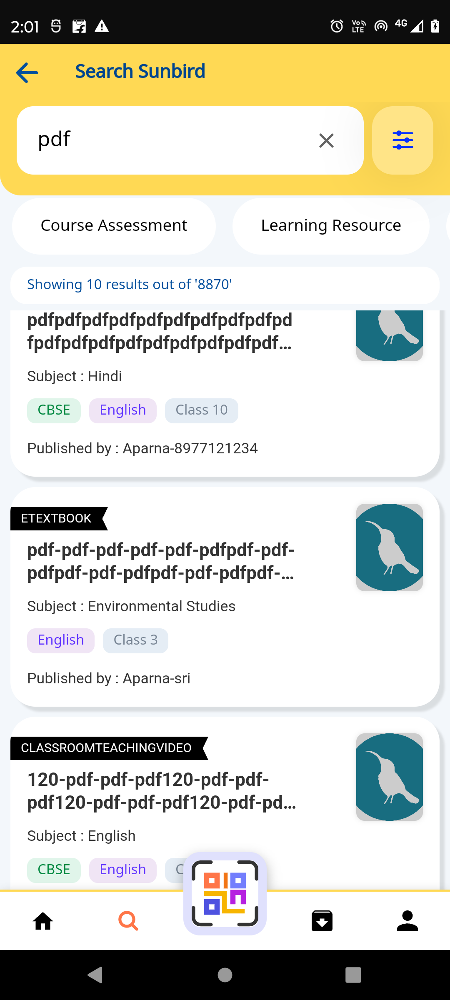

## Introduction:

* [Background](https://project-sunbird.atlassian.net/wiki/spaces/SUN/pages/3346432022/Content+Details#Background%3A)

* [Existing workflow](https://project-sunbird.atlassian.net/wiki/spaces/SUN/pages/3346432022/Content+Details#Existing-workflow%3A)

* [Problem Statement](https://project-sunbird.atlassian.net/wiki/spaces/SUN/pages/3346432022/Content+Details#Problem-Statement-%3A)

* [Design](https://project-sunbird.atlassian.net/wiki/spaces/SUN/pages/3346432022/Content+Details#Design-%3A)

## Background:
We are getting contentData with BMGS and se_boards, se_mediums, se_gradeLevels, se_subjects from server response and We are using this BMGS and se_boards, se_mediums, se_gradeLevels, se_subjects to display content BMGS in  **About**  section and also display inside content card.

## Existing workflow:
The below screenshots of the contentData for harcoded BMGS and se_boards, se_mediums, se_gradeLevels, se_subjects. 

 **Problem Statement :** 
* What is the new content data Api response instead of using BMGS and se_boards, se_mediums, se_gradeLevels, se_subjects?

* How to remove hardcoded BMGS and how make it dynamic to support multiple frameworks?

 **Design :** 
1. We can remove all BMGS related hardcoded and labels from content details.

1. Use new content response with category1, category2, category3 and category4 instead of BMGS.

1. Pass the new content API data to common-consumption to solve the content card BMGS.

*****

[[category.storage-team]] 
[[category.confluence]] 
