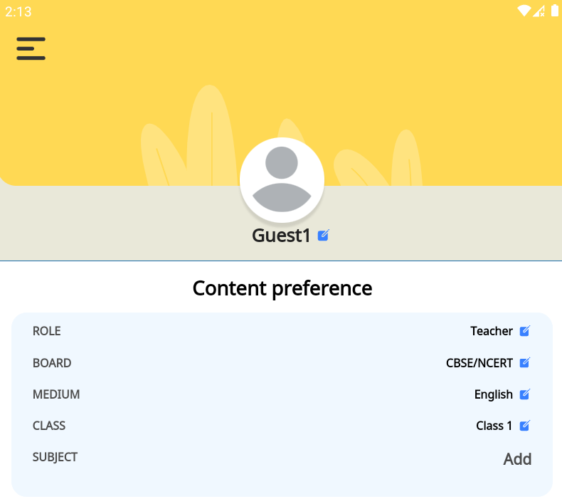
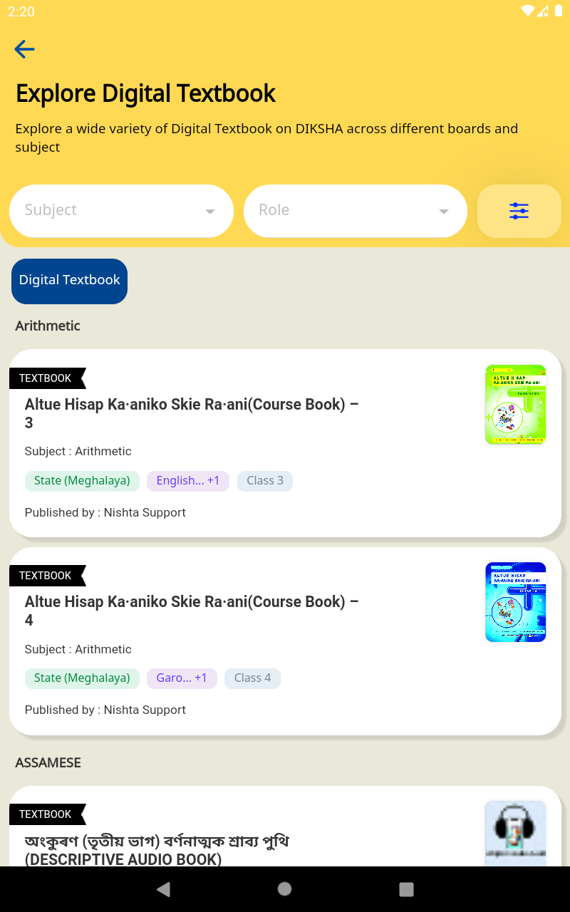
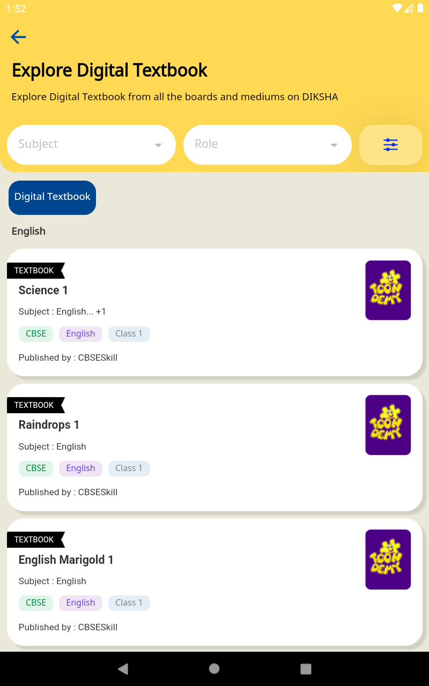

## Background:
In the present scenario, the framework category metadata for content and profile is stored in 4 columns of the profile and content table. 

The current table columns(SQL lite DB) of profile and content are as follows

 **Profile Table:** uid, handle, avatar, age, gender, standard, language, day, month, is_group_user, created_at, **board, medium, grade_value, subject** , profile_image, profile_type, grade, syllabus, source, value

Sample:

|  **uid**  |  **gender**  |  **language**  |  **…**  |  **board**  |  **medium**  |  **grade_level**  |  **subject**  | 
|  --- |  --- |  --- |  --- |  --- |  --- |  --- |  --- | 
| xxxx-xxxx-x.. | M | Hindi | … | cbse | english | class1 | mathematics | 

The following screenshot contains the use case where the filter is used.

 **Content Table:** identifier, server_data, local_data, mime_type, path, search_index, visibility, server_last_updated_on, local_last_updated_on, ref_count, content_state, content_type, , audience, size_on_device, pragma,  **board, medium, gradeLevel, subject,**  manifest_version, dialcodes, child_nodes, primary_category

Sample:

|  **identifier**  |  **server_data**  |  **local_data**  |  **…**  |  **board**  |  **medium**  |  **gradeLevel**  |  **subject**  | 
|  --- |  --- |  --- |  --- |  --- |  --- |  --- |  --- | 
| xxxx-xxxx-x.. | { …. } | { … } | … | cbse | english | class1 | mathematics | 

Framework properties for profile & content also stored in the respective table.

These properties are used to filter contents or profiles from the database and framework properties are hardcoded based on educational framework. The following screenshot contains the use case where filter is used.

##  Problem Statement :
This database design is only valid where the framework will only have 4 categories and it will not scale for categories having more than 4 categories.

 **Design - 1:** 

To support n number of categories a new column will be created where all categories will be stored in a stringified JSON format and which categories  will be stored will be decided based upon the form configured or else it will fall back to the framework categories.

|  **categories**  | 
|  --- | 
| "{\"board\":\[\"cbse\"],\"medium\":\[\"english\"],\"gradeLevel\":\[\"class 1\"],\"subject\":\[\"mathematics"]}" | 

All the filter queries will happen from categories column.

On the explore page, the page response filtered by BMGS is stored in the DB for offline use cases. So while showing the online and offline data (filtered by BMGS ), the contents are merged and shown. If content is not downloaded then the specific content app icon will be greyed out and other content which are downloaded will show as it for consumption.

 **Usecases** 

*  **Fresh app installation** 

All categories will be directly stored in the “ **categories** “ column.

*  **Update app** 

All BMGS attributes will be populated and converted into stringified JSON and inserted in the “ **categories** “ column and the BMGS column will be deleted or we can delete it in the next few releases.

 **Pros:** 

* Response time will be the same as before.

 **Design - 2:** Create 2 new tables “profile_new“ and “content_new“ with no BMGS attribute and a new  **“categories”** column. 

All new content and profiles will be stored in the new table and while fetching profiles and content, responses will be merged from the old and new table.

 **Pros:** 

* No database upgradation required

 **Cons:** 

* Response time will be longer as we are fetching data from 2 different tables.

 **Design - 3:** During app initialization, make an API call to get all the master categories and based on that create tables. If there is any change in master data then on the fly during the operation alter the table , create columns, and use it.

 **Cons:** 

App initialization will be slow.

*****

[[category.storage-team]] 
[[category.confluence]] 
