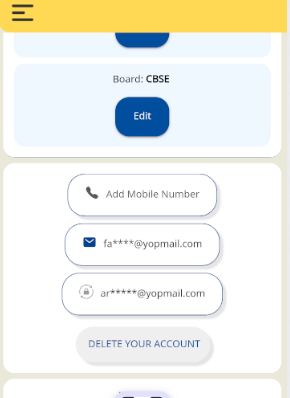

## Introduction:

* [Background](https://project-sunbird.atlassian.net/wiki/spaces/SUN/pages/3340107781/Delete+User+Account#Background%3A)

* [Problem Statement](https://project-sunbird.atlassian.net/wiki/spaces/SUN/pages/3340107781/Delete+User+Account#Problem-Statement-%3A)

* [Design](https://project-sunbird.atlassian.net/wiki/spaces/SUN/pages/3340107781/Delete+User+Account#Design-%3A)

## Background:
Google Play’s data deletion badge and Data deletion area within the Data safety section give users a new set of transparency and controls over their user data while providing developers a way to showcase how they treat user data responsibly the app allows users to create an account from within the app, then it must also allow users to request for their account to be deleted.

 **Problem Statement :** 
1. In our system, we currently maintain user data across eight distinct database tables associated with user accounts. Our challenge is to develop an efficient process for cleaning up these tables within our local database and ensuring that user preferences are securely managed after an account deactivation event.

|  **no**  |  **table_name**  |  **module**  | 
|  --- |  --- |  --- | 
| 1. | profile | Profile | 
| 2. | content_marker  | content | 
| 3 | content_access | content | 
| 4. | learner_assessments  | assessment summary | 
| 5. | learner_content_summary  | content summary | 
| 6. | feedback  | content feedback | 
| 7. | search_history  | search | 
| 8. | group_profile | group profile | 
| 9. | users | users | 
| 10. | player_data | player data | 
| 11. | no_sql | user profile details | 

* To address this, we need to identify and implement the appropriate API to handle the removal of a user's profile details from our server effectively. This API should ensure the complete and secure erasure of user-related data. After deleting the account, does the user create a new account using the same mobile number/Email address? If yes, then the “already registered” message should not come.

* Furthermore, when a user chooses to delete their account, we must clarify whether they have the option to create a new account using the same mobile number or email address. If this option exists, we must ensure that the system does not display an "already registered" message in such cases.

* Finally, it is crucial to determine whether, upon reactivation or re-registration, the user should be presented with their previous data, such as enrolled courses, groups, and other relevant information, or if the account should be treated as a fresh start with no historical data retained. This decision will impact the user experience and system functionality, making it a critical consideration in our solution.

 **Design :** Screenshot:

 **Adding a "Delete Your Account" Feature** 

 **Step 1: Placement on the Profile Page** 

We propose adding a "Delete Your Account" button on the profile page, positioned right after the "Add Recovery ID” button. This feature will be accessible exclusively to logged-in users, ensuring the safety and intentionality of account deletion.

 **Step 2: Account Deletion Information Page** 

Upon clicking the "Delete Your Account" button, users will be automatically redirected to a dedicated information page that provides comprehensive details about the account deletion process. This page will outline the consequences, steps, and considerations involved in deleting their account.

 **Step 3: OTP Confirmation for Security** 

To enhance security and confirm the user's intent, a one-time password (OTP) confirmation step will be introduced. After users have reviewed the account deletion information, they will be prompted to enter a confirmation OTP.

 **Step 4: API Request for Account Deletion** 

Once the OTP is successfully confirmed, the system will trigger an API request to delete the user's account from the server. This request will include the user's unique identification (ID) to ensure the correct account is deleted.

 **Step 5: Local Mobile Data Cleanup** 

On the mobile side, the system will utilize the user's ID to systematically clean up local data. This includes:

* Removing user-specific entries from the local database, one by one, ensuring data integrity.

* Clearing user-related preferences and settings, providing a clean slate for future users.

* Automatically switching the account to a "guest user" mode, provides a seamless transition for users who wish to continue using the app with limited functionality or explore it as a guest.

 **Tables:** 

1. Profile table

| _id | uid | handle | profile_type | source | 
|  --- |  --- |  --- |  --- |  --- | 
| 1 | 7f3ec253-1a3b-4e55-b4c7-90470f65996c | Guest1	 | teacher | local | 

After login, we save the uid in the profile table in order to use it for course consumption, assessment, and feedback instead of API calls.

Profile table in the local database is useful in reducing API calls, improving application performance by storing user profile data locally, enabling offline access, and facilitating faster data retrieval compared to network calls. It also allows for data caching, ensuring users can access up-to-date information. 

Clearing the table when a user account is deleted is to prevent orphaned records in the local database.

1. content_marker

| _id | uid | identifier | epoch_timestamp | marker | 
|  --- |  --- |  --- |  --- |  --- | 
| 1 | b0457983-732a-4da4-a6d5-81b18dd18f93 | do_2133258882237562881860 | 1696305990732 | 1 | 

In the content marker table, the presence of the "uid"  is for tracking whether a user has consumed content or not. This is typically represented by a "marker" column, where a value of 0 indicates non-consumption and 1 indicates consumption. When a user account is deleted, the row containing the user's "uid" is removed from the table, ensuring that no lingering consumption data remains for that user. 

This practice maintains data accuracy and helps efficiently manage content consumption tracking.

3. content_access

| _id | uid | identifier | epoch_timestamp | status | content | learner | 
|  --- |  --- |  --- |  --- |  --- |  --- |  --- | 
| 1 | b0457983-732a-4da4-a6d5-81b18dd18f93 | do_2133258882237562881860 | 1696305990732 | 1 | course | NULL | 

In the content access table, the "uid"  is for managing access to content. Each row in this table typically corresponds to a user's interaction with specific content. When a user account is deleted, the row containing the user's "uid" is also removed from the table. This ensures that access records are accurately maintained, and it helps prevent orphaned data. 

Having the "uid" associated with content access allows for efficient tracking and management of user interactions with content.

1.  learner_assessments 

| _id | uid | content_id | qid | correct | max_score | time_spent | res | timestamp | 
|  --- |  --- |  --- |  --- |  --- |  --- |  --- |  --- |  --- | 
| 1 | bfee12c7-85d0-4dde-a0df-2404cbcb281c | do_2136774467981148161450 | 0 | 1 | 1 | 6 |  | 1696430419420 | 

In the learner_assessments table, the inclusion of the "uid" is for tracking and recording user performance in assessments. Each row in this table represents a user's assessment results. 

When a user account is deleted, it is essential to remove the corresponding row containing the user's "uid" to maintain data accuracy and integrity. This practice ensures that assessment records are up-to-date and relevant, preventing any lingering or obsolete data. 

The "uid" association with assessments allows for effective assessment tracking and management.

1. learner_content_summary 

| _id | uid | content_id | avg_ts | sessions | total_ts | last_updated_on | 
|  --- |  --- |  --- |  --- |  --- |  --- |  --- | 
| 1 | bfee12c7-85d0-4dde-a0df-2404cbcb281c | do_2129930254155284481385 | 37.756 | 1 | 37.756 | 1696430237679 | 

In the learner_content_summary table, the "uid"  is for monitoring and recording user interactions with content, including consumption frequency. Each row in this table typically represents a user's summary of content consumption. 

When a user account is deleted, it's important to delete the corresponding row containing the user's "uid" to maintain accurate and relevant data. This ensures that content consumption records remain up-to-date and prevents the persistence of outdated information. 

Associating the "uid" with content summaries facilitates effective tracking and management of user interactions with content.

1.  feedback 

| _id | identifier | uid | rating | comments | createdAt | 
|  --- |  --- |  --- |  --- |  --- |  --- | 
| 1 | do_21367744015022489612523 | bfee12c7-85d0-4dde-a0df-2404cbcb281c | 4 | CONTENT_INACCURATE,TECHNICAL_PROBLEM | 1696430324539 | 

In the feedback table, the presence of the "uid"  is to attribute feedback to users. Each row in this table typically represents feedback provided by a user. When a user account is deleted, it's necessary to remove the corresponding row containing the user's "uid". This practice ensures that feedback records remain properly associated with users and avoids retaining feedback from deleted accounts, contributing to a clean and accurate feedback database. 

Associating the "uid" with feedback entries allows for effective tracking and management of user feedback.

1. search_history

| _id | uid | query | time_stamp | namespace | 
|  --- |  --- |  --- |  --- |  --- | 
| 2 | bfee12c7-85d0-4dde-a0df-2404cbcb281c | learner assesment | 1696430052399 | LIBRARY | 

In the search_history table, the inclusion of the "uid"  is pivotal for understanding users searching for what types of content. Each row in this table typically represents a user's search query history, which is useful for recommendations and search results. 

When a user account is deleted, it's imperative to delete the corresponding row containing the user's "uid". This ensures that search history records accurately reflect active user interactions and prevents outdated or orphaned data. 

Associating the "uid" with search history entries enables effective content personalization based on user search behavior.

1. group_profile

| _id | gid | uid | epoch_timestamp | 
|  --- |  --- |  --- |  --- | 
| 1 | 1 | bfee12c7-85d0-4dde-a0df-2404cbcb281c | 1696305990732 | 

In the group_profile table, the presence of the "uid"  is for the process of adding users to groups. Each row in this table typically represents a user's membership in various groups. When a user account is deleted, it's necessary to remove the corresponding row containing the user's "uid".

1. users

| _id | uid | 
|  --- |  --- | 
| 1 | bfee12c7-85d0-4dde-a0df-2404cbcb281c | 

In the users table, we have uid for all the user-related purposes. Each row associates uid with its corresponding id. When a user account is deleted, it's necessary to remove the corresponding row containing the user's "uid".

1. player_data

| _id | user_id | parent_identifier | identifier | player_config | 
|  --- |  --- |  --- |  --- |  --- | 
| 1 | bfee12c7-85d0-4dde-a0df-2404cbcb281c | do_21332216324189388811 | do_21332216324189388811 | {"actions":\[{"play":0},{"pause":0},{"play":0},{"seeked":13.642959},{"ended":21.730861}],"volume":\[],"playBackSpeeds":\[],"totalDuration":22.48,"currentDuration":0,"transcripts":\[]} | 

For the player-data table, we need uid to track the player data. So, When a user account is deleted, it's necessary to remove the corresponding row containing the user's "user_id".

1. no_sql

| _id | key | value | 
|  --- |  --- |  --- | 
| 25 | userProfileDetails-bfee12c7-85d0-4dde-a0df-2404cbcb281c | {"maskedPhone":null,"tcStatus":null,"channel":"tn","profileUserTypes":\[{"type":"teacher"}],"updatedDate":"2023-10-04 10:45:34:782+0000","managedBy":null,"flagsValue":4,"id":"bfee12c7-85d0-4dde-a0df-2404cbcb281c","tncAcceptedVersion":"v13"} | 

For no_sql table, we have userId being used as a value as part of the user profile details. So, When a user account is deleted, it's necessary to remove the corresponding row containing the user's "userId".

*****

[[category.storage-team]] 
[[category.confluence]] 
