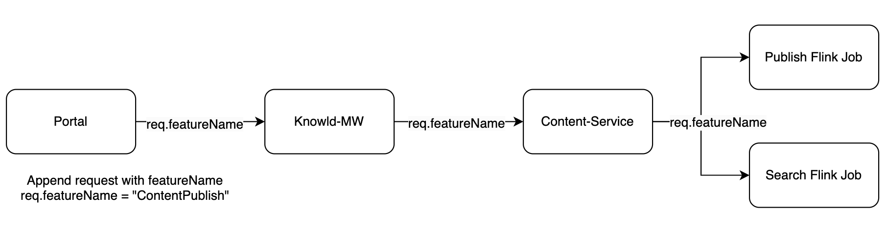

Background:

This document the details about how to trace/debug using the Feature name. 


This functionality was implemented in the older releases of Sunbird itself. Below document have the details of what are the feature names and how it can be used for funnels to analyse the usage of the feature.

[[Feature traceability telemetry generation from various components|Feature-traceability-telemetry-generation-from-various-components]]


Jira Epic: [ED-3616 System Jira](https:///browse/ED-3616)


As a enhancement to the existing functionality, Portal backend (first entry for any API as a proxy server) will append the f”eature name” to the API request itself, so that any other downstream server can stamp the same if the logs as defined in the above ticket.

The featureName should be added in cdata of telemetry log event. 


```
cdata: {
    type: 'Feature'
    id: 'FEATURE_ID' // captures the unique name of the feature.
}
```
Please refer below wiki for log format. All the services should log in the similar format for ease of understanding and accessibility.

Always add feature name in the “[EntryLog](https://project-sunbird.atlassian.net/wiki/spaces/DEB/pages/1872396449/Entry+Exit+Logs)” of the service request. Which is the confirmation of the request is received by the service.

[[Log Format|Log-Format]]


Refer the below wiki for “EntryLog” format

[[Entry & Exit Logs|Entry-&-Exit-Logs]]


### Sample request with Feature name
{{TBU}}


### Sample log with Feature name

```
{
    "actor": { 
        "id": "469dc732-04f3-42d9-9a85-30957a797acc", 
        "type": "User" 
    },
    "eid": "LOG",
    "ets": 1518460198146,
    "ver": "3.0",
    "context": {
        "channel": "agriculture",
        "did": "28e360bd344343bad47fb42f70a125f5",
        "sid": "lkXDCItQWP35a8PzsIrN7ed642-aXsAC",
        "env": "dev.sunbird.portal",
        "pdata": {
            "id": "dev.sunbird.portal",
            "pid": "",
            "ver": "8.0.0"
        },
        "cdata": [
            {
                "id": "ContentPublish",
                "type": "Feature"
            }
        ]
    },
    "edata": {
        "level": "TRACE",
        "message": "ENTRY LOG: 6106780a-1f1c-4102-8d05-9967221f66c5",
        "params": 
        [   
            {"url": "/content/content/v1/publish/do_11390114187033804812"},
            {"type": "POST"}
        ],
        "requestid": "6106780a-1f1c-4102-8d05-9967221f66c5",
        "type": "system"
    } 
}
```


*****

[[category.storage-team]] 
[[category.confluence]] 
