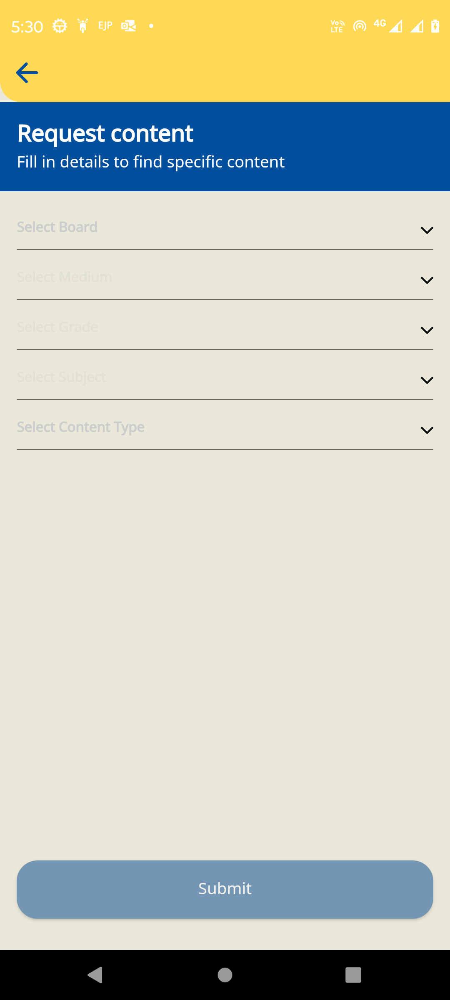

  * [Introduction: ](#introduction:-)
  * [Form: Framework_update_config](#form:-framework_update_config)

## Introduction: 
This documentation guides on implementing new frameworks within the Sunbird education platform, By following this documentation, users will gain an understanding of key configurations and form configurations necessary for introducing a new framework with new categories in their infrastructure.

 **User Type selection for Onboarding:**  Utilize the SUPPORTED_USER_TYPES  form configuration for user type selection during the onboarding process.

 **Framework selection for Onboarding:**  Utilize the FRAMEWORK_CONFIG  form configuration for framework selection during the onboarding process.

 **Framework selection for Onboarding:**  Utilize the FRAMEWORK_CONFIG  form configuration for framework selection during the onboarding process.

 **Search Filter :**  configure the SEARCH_FILTER  form configuration for find the specific content.

 **Facet Filter :**  configure the FACET_FILTERS  form configuration for the All Tab.

 **Filter for request more content :**  configure the DYNAMIC_FORM_CONFIG  form configuration for getting more contents in library and .

 **Support on reported issue in help section :**  configure the DYNAMIC_FORM_CONFIG form configuration for getting framework categories and basic user details of reported issue .

[Form: UserType__update](https://project-sunbird.atlassian.net/wiki/spaces/SUN/pages/3448635399/Config+changes+as+per+the+BMGS+Hardcoded+Removal#User-Type-Selection-Screen-Form-Configuration)This form is configure for user type selection screen, allowing users to customize it according to their requirements for new domain.

Screenshot:: User Type selection screenForm API ref link: [User Type selection screen form configuration](https://project-sunbird.atlassian.net/wiki/spaces/SUN/pages/3448635399/Config+changes+as+per+the+BMGS+Hardcoded+Removal#User-Type-Selection-Screen-Form-Configuration)

## [Form: Framework_update_config](https://project-sunbird.atlassian.net/wiki/spaces/SUN/pages/3448635399/Config+changes+as+per+the+BMGS+Hardcoded+Removal#Framework-Selection-Screen-Form-Configuration-for-Sunbird-ED-(BMGS)-Reference)
This form is utilized to configure the user framework selection screen, allowing users to customize it according to their requirements. When introducing a new framework, users must configure this form using the rootOrgId and framework-based inputs.

Screenshot:: Framework selection screenForm API ref link : [Framework Selection Form Configuration](https://project-sunbird.atlassian.net/wiki/spaces/SUN/pages/3448635399/Config+changes+as+per+the+BMGS+Hardcoded+Removal#Framework-Selection-Screen-Form-Configuration-for-Sunbird-ED-(BMGS)-Reference)

[Form: Search_filter Config](https://project-sunbird.atlassian.net/wiki/spaces/SUN/pages/3448635399/Config+changes+as+per+the+BMGS+Hardcoded+Removal#Search-Filter)This form provides the search filter for content search. Users can create their own form configuration to change the “code”, “translation” and “name” based on the framework and channel.

Screenshot:: Search filter screen

Form API ref link: [Search Filter form configuration](https://project-sunbird.atlassian.net/wiki/spaces/SUN/pages/3448635399/Config+changes+as+per+the+BMGS+Hardcoded+Removal#Search-Filter-form-configuration)

[Form: Default_Facet_Filters_update_config](https://project-sunbird.atlassian.net/wiki/spaces/SUN/pages/3448635399/Config+changes+as+per+the+BMGS+Hardcoded+Removal#Facet-Filters-form-configuration)This form provides the global filter. Users can create their own form configuration to change the “code”, “placeholder” and “name” based on the framework and channel.

Screenshot:: Default facet filter screenForm API ref link: [Default facet filters form configuration](https://project-sunbird.atlassian.net/wiki/spaces/SUN/pages/3448635399/Config+changes+as+per+the+BMGS+Hardcoded+Removal#Facet-Filters-form-configuration)

[Form: Filter selection for request more content form configuration](https://project-sunbird.atlassian.net/wiki/spaces/SUN/pages/3448635399/Config+changes+as+per+the+BMGS+Hardcoded+Removal#Filter-for-Request-More-Content-form-configuration)This form provides the dynamic filter of more content request. Users can create their own form configuration to change the “code”, “placeHolder” and “categoryCode” based on the framework and channel.

Screenshot:: Request more content filter selection screenForm API ref link: [Filter selection form configuration](https://project-sunbird.atlassian.net/wiki/spaces/SUN/pages/3448635399/Config+changes+as+per+the+BMGS+Hardcoded+Removal#Filter-for-Request-More-Content-form-configuration)

[Form: Add framework categories for support form configuration in help section](https://project-sunbird.atlassian.net/wiki/spaces/SUN/pages/3448635399/Config+changes+as+per+the+BMGS+Hardcoded+Removal#Support-form-configuration-in-help-section)This form provides the framework category and basic user information for report any issue in help section

Form API ref link: [Support form configuration](https://project-sunbird.atlassian.net/wiki/spaces/SUN/pages/3448635399/Config+changes+as+per+the+BMGS+Hardcoded+Removal#Support-form-configuration-in-help-section)

*****

[[category.storage-team]] 
[[category.confluence]] 
