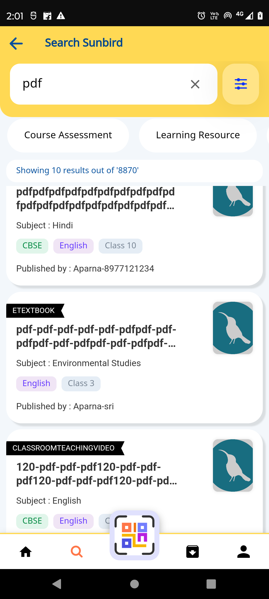
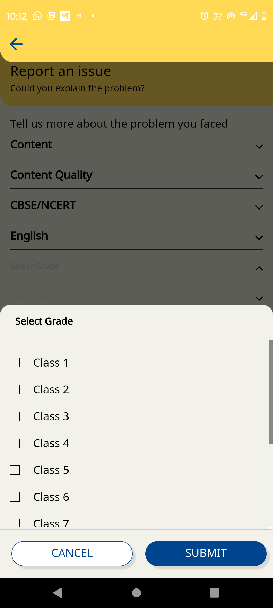

 **Introduction:** 
* [Background](https://project-sunbird.atlassian.net/wiki/spaces/SUN/pages/3348889606/Overview+of+remove+hardcoded+BMGS+in+Mobile+app#Background%3A)


* [Existing Workflow](https://project-sunbird.atlassian.net/wiki/spaces/SUN/pages/3348889606/Overview+of+remove+hardcoded+BMGS+in+Mobile+app#Existing-workflow%3A)


* [From config response](https://project-sunbird.atlassian.net/wiki/spaces/SUN/pages/3348889606/Overview+of+remove+hardcoded+BMGS+in+Mobile+app#Form-config-%3A)


* [Problem statement](https://project-sunbird.atlassian.net/wiki/spaces/SUN/pages/3348889606/Overview+of+remove+hardcoded+BMGS+in+Mobile+app#Problem-Statement-%3A)


* [Design](https://project-sunbird.atlassian.net/wiki/spaces/SUN/pages/3348889606/Overview+of+remove+hardcoded+BMGS+in+Mobile+app#Design-%3A)


## Background:
Currently, Sunbird mobile app uses hard-coded BMGS for onboarding, create new profile, update profile, search filters, content data etc.

We can use or any adopter can use this application for different organisations like hospital, we have to remove the hardcode of BMGS and make it dynamic then the app will support multiple frameworks.


## Existing workflow:
 **Here are some screenshots of the Harcoded BMGS :-** 


* Screenshot-1: Onboarding BMG  


* Screenshot-2: Edit user


* Screenshot-3: Search filters


* Screenshot-4: Content data





* Screenshot-5: Help section


 **Form-config :** The new form-config supports multiple frameworks and every framework should have a unique id and code. All categories will store inside  **options**  as array elements.we can access any  **frameworkCode**  using category code("code": "category1",). So user can switch easily one framework to other frameworks.


```
response={
  fields: [
    {
      id: 'framework-id-1',
      code: 'framework-id-1',
      name: 'board',
      options: [
        {
          "code": "category1",
          "label": "{\"en\":\"Board\"}",
          "placeHolder": "{\"en\":\"Selected Board\"}",
          "frameworkCode": "board",
          "supportedUserTypes": [
            "teacher",
            "student",
            "administrator",
            "parent",
            "other"
          ]
        },
        {
          "code": "category2",
          "label": "{\"en\":\"Medium\"}",
          "placeHolder": "{\"en\":\"Selected Medium\"}",
          "frameworkCode": "medium",
          "supportedUserTypes": [
            "teacher",
            "student",
            "parent",
            "other"
          ]
        },
        {
          "code": "category3",
          "label": "{\"en\":\"Class\"}",
          "placeHolder": "{\"en\":\"Selected Class\"}",
          "frameworkCode": "gradeLevel",
          "supportedUserTypes": [
            "teacher",
            "student",
            "parent",
            "other"
          ]
        }
      ]
    },
    {
      id: 'framework-id-2',
      code: 'framework-id-2',
      name: 'Organization',
      options: [
        {
          "code": "category1",
          "label": "{\"en\":\"Organisation\"}",
          "placeHolder": "{\"en\":\"Selected Organisation\"}",
          "frameworkCode": "organisation",
          "supportedUserTypes": [
            "other"
          ]
        },
        {
          "code": "category2",
          "label": "{\"en\":\"Category\"}",
          "placeHolder": "{\"en\":\"Selected Category\"}",
          "frameworkCode": "category",
          "supportedUserTypes": [
            "other"
          ]
        },
        {
          "code": "category3",
          "label": "{\"en\":\"TYpe\"}",
          "placeHolder": "{\"en\":\"Selected Type\"}",
          "frameworkCode": "type",
          "supportedUserTypes": [
            "other"
          ]
        }
      ]
    }
  ]
}
```
 **Problem Statement :** 
1. How adopter can change the Frameworks.


1. What is the new API request for getFrameworkDetails to get all categories for multiple frameworks.


1. If a user changes the framework on the profile edit page, should the BMGS label be changed?


1. The profile should be update with any framework categories.


1. If we migrate DB then existing users will get error.


1. How many filter properties should display in filter page for multiple frameworks?


1. If user select some categories from framework-1 and some categories from framework-2 then should display all contents or what?


1. What is the new content data Api response instead of using BMGS and se_boards, se_mediums, se_gradeLevels, se_subjects?(We have to create a new content with category1, category2, It depends on portal).


 **Design :** 
1.  **Onboarding :** a) Remove BMGS hardcoded and use category1 for board, category2 for medium and category3 for grade in HTML and TS file.                                                                                                                           b. we have to use proper methods and variables name for board, medium and grade(onMediumChange, mediumControl, mediumList ) 

c. Update framework API’s request with category\[i] instead of BMGS. 


1.  **Create Profile:** a) Remove BMGS hardcoded and use category1 for board, category2 for medium and category3 for grade in HTML and TS file to create a profile in mobile.

b). Remove all the BMGS code from SDK and client service and replace to category1, category2, category3 and category4


1.  **Update Profile:**   a) Remove BMGS from update profile API request and use  **category keys**  to make it dynamic.                                                                                                                                                                                       b) Update  those categories into system setting against userProfileConfig


1.  **Guest Edit Profile / Edit logged In profile:**   a) Remove BMGS hardcoded and use category1 for board, category2 for medium and category3 for grade in HTML and TS file to create a profile in mobile.

b). we have to use proper methods and variables name for board, medium and grade(onMediumChange, mediumControl, mediumList ) 


1.  **Help Section (faq-report-issue.page.ts) :**  a) Remove BMGS hardcoded and use category1 for board, category2 for medium and category3 for grade in HTML and TS file to create a profile in mobile.

b). Update framework API’s request with category\[i].


1.  **Search:** a) Remove BMGS hardcoded and use category1 for board, category2 for medium and category3 for grade in HTML and TS file to create a profile in mobile.


      b)  Search Api’s is using BMGS as Api’s request for searching, filtering and sorting. so removed BMGS and use category1 for board, category2 for medium, category3 for gradeLevel and category4 for subject

      c) Remove BMGS from  **get content handler**  and  **search content handler in SDK.** Change BMGS to            category1-4 for content properties in  **client service.** 


*****

[[category.storage-team]] 
[[category.confluence]] 
